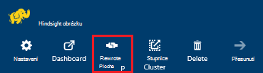
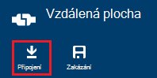
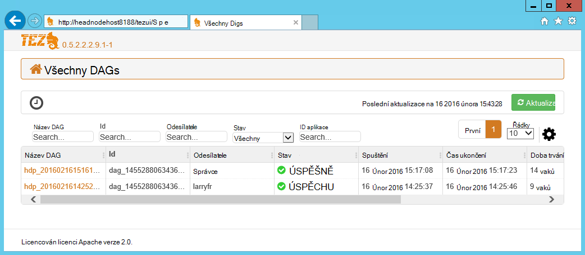
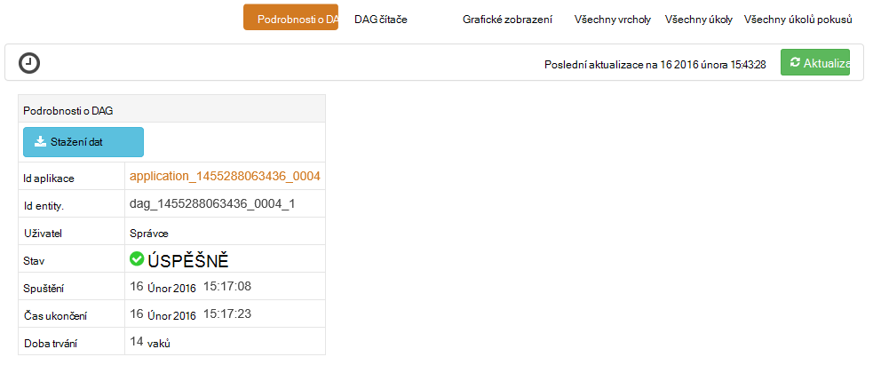
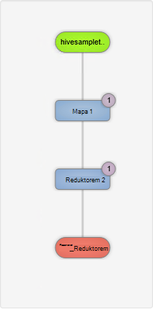
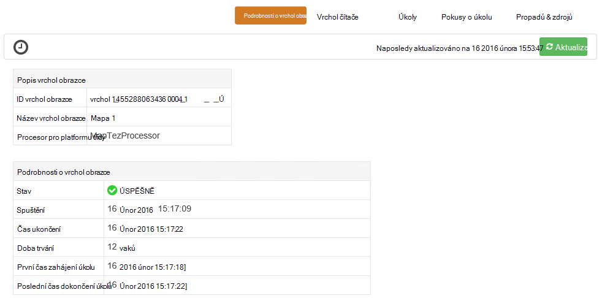
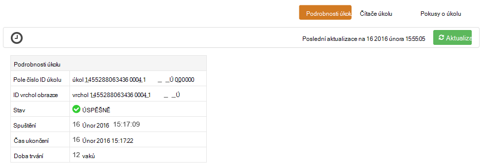

<properties
pageTitle="Uživatelské rozhraní Tez pomocí HDInsight serveru s Windows | Azure"
description="Naučte se používat uživatelské rozhraní Tez ladění Tez úlohy na serveru s Windows HDInsight HDInsight."
services="hdinsight"
documentationCenter=""
authors="Blackmist"
manager="jhubbard"
editor="cgronlun"/>

<tags
ms.service="hdinsight"
ms.devlang="na"
ms.topic="article"
ms.tgt_pltfrm="na"
ms.workload="big-data"
ms.date="10/04/2016"
ms.author="larryfr"/>

# Ladění Tez úlohy na serveru s Windows HDInsight pomocí Tez uživatelského rozhraní

Uživatelské rozhraní Tez je webovou stránku, která mohou sloužit k pochopení a ladění úlohy, které používají Tez jako modul spuštění na serveru s Windows HDInsight clusterů. Uživatelské rozhraní Tez umožňuje vizualizovat jako graf připojeného položek, procházejte všechny požadované položky a načíst Statistika a informace o protokolování.

> [AZURE.NOTE] Informace v tomto dokumentu jsou specifické pro clusterů serveru s Windows HDInsight. Informace o zobrazení a ladění Tez na základě Linux HDInsight zobrazení [použití Ambari ladění Tez úlohy na HDInsight](hdinsight-debug-ambari-tez-view.md).

## Zjistit předpoklady pro

* Shluk serveru s Windows HDInsight. Postup pro vytvoření nového obrázku najdete v článku [Začínáme s používáním HDInsight serveru s Windows](hdinsight-hadoop-tutorial-get-started-windows.md).

    > [AZURE.IMPORTANT] Uživatelské rozhraní Tez je dostupný pouze na serveru s Windows HDInsight clusterů vytvořené po 8 únor 2016.

* Klient serveru s Windows vzdálené plochy.

## Principy Tez

Tez je extensible rámec pro zpracování dat v Hadoop poskytující rychlosti větší než tradiční MapReduce zpracování. Pro serveru s Windows HDInsight clusterů je nepovinné modul, který můžete zapnout pro podregistru pomocí následujícího příkazu jako součást podregistru dotazu:

    set hive.execution.engine=tez;

Při práci se odešle ke Tez, vytvoří směrovány Acyklické grafu (DAG) popisující pořadí provádění akcí vyžadované projektu. Jednotlivé akce se označují jako vrcholy a spusťte část celkové projektu. Skutečné provádění práce označená vrcholu se nazývá úkolu a může být rozvržena více uzlů v clusteru.

### Principy Tez uživatelského rozhraní

Uživatelské rozhraní Tez je že na webovou stránku poskytuje informace o procesů, které používáte, nebo jste dříve spustili pomocí Tez. Umožňuje zobrazit DAG generovaných Tez, jak je distribuovaná pomocí clusterů čítače například paměti používané úkoly a vrcholy a informace o chybě. Můžou nabízet užitečné informace v následujících situacích:

* Sledování dlouho probíhajících procesy, zobrazení průběhu mapy a zmenšení úkoly.

* Analýza historických dat z hlediska úspěšném nebo neúspěšném procesy se dozvíte, jak lze zlepšit zpracování nebo proč se nezdařila.

## Generovat DAG

Uživatelské rozhraní Tez bude obsahovat pouze data, pokud projektu, který používá modul Tez právě probíhá nebo byl spuštěn v minulosti. Jednoduché dotazy podregistru obvykle lze přeložit bez použití Tez, ale složitější dotazy, které se filtrování, seskupování, řazení, spojení atd., obvykle potřebují Tez.

Spustit dotaz podregistru, který bude proveden pomocí Tez pomocí následujících kroků.

1. Ve webovém prohlížeči přejděte na https://CLUSTERNAME.azurehdinsight.net, kde __NÁZEV_CLUSTERU__ je název svůj cluster HDInsight.

2. V nabídce v horní části stránky vyberte __Podregistru Editor__. Zobrazí se stránka s dotaz v následujícím příkladu.

        Select * from hivesampletable

    Vymazání dotaz a nahradit je následující.

        set hive.execution.engine=tez;
        select market, state, country from hivesampletable where deviceplatform='Android' group by market, country, state;

3. Klikněte na tlačítko __Odeslat__ . Části __Relaci úloh__ v dolní části na stránce se zobrazí stav dotazu. Až stavem změní __dokončili__, klikněte na odkaz __Zobrazit podrobnosti__ a zobrazte výsledky. __Výstup projektu__ by měl být stejný následujícím způsobem:
        
        en-GB   Hessen      Germany
        en-GB   Kingston    Jamaica
        en-GB   Nairobi Area    Kenya

## Použití Tez uživatelského rozhraní

> [AZURE.NOTE] Uživatelské rozhraní Tez neexistuje pouze z počítače hlavy uzlů, je nutné použít ke vzdálené ploše pro připojení k hlavy uzlů.

1. Z [Azure portál](https://portal.azure.com)vyberte svůj cluster HDInsight. V horní části zásuvné HDInsight vyberte ikonu __Vzdálená plocha__ . Zobrazí se vzdálené plochy zásuvné

    

2. Z zásuvné vzdálené plochy vyberte __Připojit__ se připojit k hlavy clusteru. Po zobrazení výzvy umožňuje clusteru Vzdálená plocha uživatelské jméno a heslo ověřování připojení.

    

    > [AZURE.NOTE] Pokud jste připojení ke vzdálené ploše nepovolili, zadejte uživatelské jméno, heslo a datum vypršení platnosti a potom zaškrtněte políčko __Povolit__ povolit vzdálená plocha. Jakmile ho je povolená, umožňuje předchozích kroků nedá připojit.

3. Po připojení, spusťte aplikaci Internet Explorer na vzdálené ploše, vyberte ikonu ozubeného kola v pravé horní části prohlížeče a vyberte __Nastavení zobrazení kompatibility__.

4. V dolní části __Zobrazení nastavení kompatibility__zrušte zaškrtnutí políčka pro __zobrazení intranetu kompatibilní zobrazení__ a __použití sadu Microsoft compatibility seznamy__a potom vyberte __Zavřít__.

5. V Internet Exploreru přejděte na http://headnodehost:8188/tezui / #/. Zobrazí se v uživatelském rozhraní Tez

    

    Při načtení Tez uživatelského rozhraní, zobrazí se seznam DAGs, které jsou aktuálně spuštěných nebo byly spustili na clusteru. Výchozí zobrazení obsahuje Dag název, Id, odesílatele, stav, čas zahájení, koncový čas, dobu trvání, ID aplikace a fronty. Další sloupce lze přidat pomocí ikony ozubeného kola v pravé části stránky.

    Pokud máte jenom jednu položku, budou pro dotaz, který jste spustili v předchozí části. Pokud máte více položek, můžete hledat zadáním kritérií vyhledávání v polích nad DAGs a potom stiskněte klávesu __Enter__.

4. Vyberte __Název Dag__ nejnovějšího záznamu DAG. Zobrazí se informace o DAG i možnost stáhnout zip JSON soubory, které obsahují informace o DAG.

    

5. Nad __DAG podrobnosti__ je několik odkazů, které můžete použít k zobrazení informací o DAG.

    * __DAG čítače__ zobrazí statistických informací pro tento DAG.
    
    * __Grafické zobrazení__ nabízí grafické znázornění tento DAG.
    
    * __Všechny vrcholy__ seznam vrcholů v tomto DAG.
    
    * __Všechny úkoly__ zobrazí seznam úkolů na všechny vrcholy v tomto DAG.
    
    * __Všechny TaskAttempts__ zobrazuje informace o pokusů o spuštění úkoly pro tento DAG.
    
    > [AZURE.NOTE] Pokud posuňte zobrazení sloupců vrcholy, úkoly a TaskAttempts Všimněte si, že jsou odkazy zobrazit __čítače__ a __Zobrazit nebo stáhnout protokoly__ pro každý řádek.

    Pokud došlo k chybě pomocí úlohy, podrobnosti DAG zobrazí stav NEÚSPĚŠNÝ, spolu s odkazy na informace o nezdařeném uložení úkolu. Diagnostické informace se zobrazí pod DAG podrobnosti.

7. Vyberte __grafické zobrazení__. Zobrazí se grafické znázornění DAG. Umístěte ukazatel myši každý vrchol v zobrazení tak, aby informace o.

    

8. Po kliknutí na vrcholu načte __Vrchol podrobnosti__ pro danou položku. Klikněte na vrchol obrazce __Map 1__ a zobrazte podrobnosti pro tuto položku. Vyberte __Potvrdit__ potvrďte navigace.

    

9. Poznámka: teď mají odkazy v horní části stránky, které se vztahují k vrcholy a úkoly.

    > [AZURE.NOTE] Na této stránce můžete taky dospět tak, že přejdete zpět na __DAG podrobnosti__, výběrem __Vrchol podrobnosti__a klepnutím na vrchol obrazce __Map 1__ .

    * __Vrchol čítače__ zobrazuje informace výpočtového pro tento vrchol obrazce.
    
    * __Úkoly__ se zobrazí úkoly pro tento vrchol obrazce.
    
    * __Pokusí úkolu__ zobrazuje informace o pokusů o spuštění úlohy pro tento vrchol obrazce.
    
    * __Zdroje propadů__ slouží k zobrazení zdrojů dat a propadů pro tento vrchol obrazce.

    > [AZURE.NOTE] Jako s do předchozí nabídky se můžete posunout zobrazení sloupců pro úkoly, pokusy o úkolu, zdroje a Sinks__ zobrazíte odkazy na další informace pro každou položku.

10. Vyberte __úkoly__a potom vyberte položku s názvem __00_000000__. Tím zobrazíte __Podrobnosti úkolu__ pro daný úkol. Pomocí této obrazovky můžete zobrazit __Čítače úkolu__ a __Pokusy o úkolu__.

    

## Další kroky

Teď, když jste se naučili jak můžete pomocí zobrazení Tez, další informace o [Používání podregistru na HDInsight](hdinsight-use-hive.md).

Podrobné technické informace o Tez naleznete na [stránce Tez na Hortonworks](http://hortonworks.com/hadoop/tez/).
