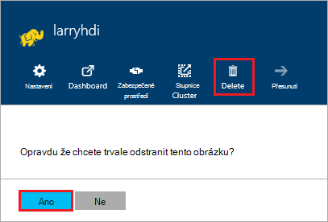

<properties
pageTitle="Jak odstranit HDInsight clusteru | Azure"
description="Informace o různých způsobech HDInsight obrázku můžete odstranit."
services="hdinsight"
documentationCenter=""
authors="Blackmist"
manager="jhubbard"
editor="cgronlun"/>

<tags
ms.service="hdinsight"
ms.devlang="na"
ms.topic="article"
ms.tgt_pltfrm="na"
ms.workload="big-data"
ms.date="10/28/2016"
ms.author="larryfr"/>

#Jak odstranit HDInsight obrázku

HDInsight clusteru fakturace spuštění po clusteru se vytvoří a zastavíte clusteru odstraněna a je poměrně za minutu, takže byste měli vždy odstranit svůj cluster, když se už používá. V tomto dokumentu se dozvíte, jak odstranit clusteru pomocí portálu Azure Azure PowerShell a rozhraní příkazového řádku Azure.

> [AZURE.IMPORTANT] Odstranění obrázku HDInsight neodstraní úložišti Azure účty přidružené clusteru. Umožňuje zachovat a opakované použití všech dat uložených v clusteru.

##Azure portálu

1. Přihlášení k [portálu Azure](https://portal.azure.com) a vyberte svůj cluster HDInsight. Pokud svůj cluster HDInsight není připnuté na řídicí panel, můžete vyhledávat ho podle názvu pomocí vyhledávacího pole (ikony lupy) na pravé straně na navigačním panelu.

    

2. Když zásuvné otevře clusteru, klikněte na ikonu __Odstranit__ . Po zobrazení výzvy vyberte __Ano__ clusteru.

    

##Azure Powershellu

Příkazovém řádku prostředí PowerShell můžete odstranit clusteru tento příkaz:

    Remove-AzureRmHDInsightCluster -ClusterName CLUSTERNAME

__NÁZEV_CLUSTERU__ nahraďte názvem svůj cluster HDInsight.

##Azure rozhraní příkazového řádku

Na řádku odstranění clusteru pomocí následující:

    azure hdinsight cluster delete CLUSTERNAME
    
__NÁZEV_CLUSTERU__ nahraďte názvem svůj cluster HDInsight.
