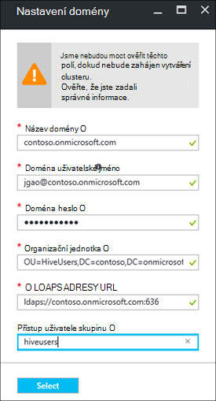

<properties
    pageTitle="Konfigurace doméně HDInsight clusterů | Microsoft Azure"
    description="Zjistěte, jak se dají vytvořit a nakonfigurovat doméně HDInsight clusterů"
    services="hdinsight"
    documentationCenter=""
    authors="saurinsh"
    manager="jhubbard"
    editor="cgronlun"
    tags=""/>

<tags
    ms.service="hdinsight"
    ms.devlang="na"
    ms.topic="article"
    ms.tgt_pltfrm="na"
    ms.workload="big-data"
    ms.date="10/26/2016"
    ms.author="saurinsh"/>

# Konfigurace doméně HDInsight clusterů (verze Preview)

Zjistěte, jak nastavit clusteru služby Azure Hdinsightu pomocí služby Azure Active Directory (Azure AD) a [Apache škálu](http://hortonworks.com/apache/ranger/) využít silné ověřování a zásady řízení (RBAC) propracovaných přístupu na základě rolí.  HDInsight doméně je možné konfigurovat pouze na základě Linux clusterů. Další informace najdete v tématu [clusterů Představte doméně HDInsight](hdinsight-domain-joined-introduction.md).

Tento článek je určený první kurz řady:

- Vytvoření připojení k Azure AD (přes funkci Azure Directory Domain Services) clusteru HDInsight s Apache škálu povolené.
- Vytvoření a používání zásad podregistru prostřednictvím Apache škálu a povolit uživatelům (například data vědeckých) připojení k podregistru nástroje na základě ODBC, třeba Excel, Tableau atd. Microsoft pracuje na přidání další úloh, třeba HBase Spark a bouře, k doméně Hdinsightu brzy bude k dispozici.

Příklad konečný topologie vypadá takto:

Azure AD aktuálně podporuje pouze klasické virtuálních sítí (VNets) a na základě Linux HDInsight clusterů podporuje pouze správce prostředků Azure na základě VNets, a proto HDInsight Azure AD integrace vyžaduje dva VNets a prozkoumávání mezi nimi. Porovnání informací mezi modely dva nasazení, najdete v článku [Správce prostředků Azure porovnání klasické nasazení: princip modelů nasazení a stav zdroje](../resource-manager-deployment-model.md). Dva VNets musí být ve stejné oblasti jako Azure AD DS.

Názvy Azure služeb musí být jedinečné. Tyto názvy se používají v tomto kurzu. Contoso je fiktivní název. Když procházíte kurzu, je nutné nahradit *contoso* s jiným názvem. 
    
**Názvy:**

|Vlastnost|Hodnota|
|--------|-----|
| Azure AD VNet|contosoaadvnet|
| Azure AD virtuálního počítače (OM)|contosoaadadmin. Tento OM se používá ke konfiguraci organizační jednotku a Převrátit zóny DNS.|
| Azure AD adresáře|contosoaaddirectory|
| Azure AD název domény|Contoso (contoso.onmicrosoft.com)|
| HDInsight VNet|contosohdivnet|
| Pole Skupina zdroje HDInsight VNet|contosohdirg|
| HDInsight obrázku|contosohdicluster|

Tento kurz obsahuje kroky pro konfiguraci HDInsight clusteru doméně. Každý oddíl obsahuje odkazy na další články s dalšími informacemi pozadí.

## Předpoklady:

- Seznamte se s [Azure AD Domain Services](https://azure.microsoft.com/services/active-directory-ds/) struktury [ceny](https://azure.microsoft.com/pricing/details/active-directory-ds/) .
- Ujistěte se, že vaše předplatné je povolené tento veřejné (verze Preview). Můžete to udělat tak, že e-mailu pro hdipreview@microsoft.com pomocí svého ID předplatného.
- Certifikát SSL, který je podepsáno podpisový autority pro vaši doménu. Konfigurace zabezpečeného LDAP vyžaduje certifikát. Není možné použít podepsaného certifikáty.

## Postupy

1. Vytvořte Azure klasické VNet Azure AD.  
2. Vytváření a konfigurace Azure AD a Azure AD DS.
3. Přidejte OM klasické VNet pro vytváření organizačních jednotek. 
4. Vytvořte organizační jednotku pro službu Azure AD DS.
5. Vytvoření HDInsight VNet v režimu správy Azure zdroje.
6. Instalační program zóny DNS Převrátit služby Azure AD DS.
6. VNets mezi dvěma účastníky přístupů.
7. Vytvoření clusteru HDInsight.

> [AZURE.NOTE] Tento kurz se předpokládá, že nemusíte Azure AD. Pokud nemáte, můžete vynechat část v kroku 2.
    
## Vytvoření Azure klasické VNet

V této části vytvoříte klasické VNet pomocí portálu Azure. V části Další povolíte Azure AD DS Azure AD v klasické VNet. Další informace o následující postup a jinými způsoby vytváření VNet najdete v tématu [vytvoření virtuální sítě (klasické) pomocí portálu Azure](../virtual-network/virtual-networks-create-vnet-classic-portal.md).

**Vytvoření klasické VNet**

1. Přihlaste se k [portálu Azure](https://portal.azure.com). 
2. Klikněte na **Nový** > **sítě** > **virtuální sítě**.
3. V seznamu **Vyberte model nasazení**vyberte **klasické**a potom klikněte na **vytvořit**.
4. Zadejte nebo vyberte následující hodnoty:

    - **Název**: contosoaadvnet
    - **Adresní prostor**: 10.1.0.0/16
    - **Podsítě název**: Podsíť1
    - **Rozsah adres podsítí**: 10.1.0.0/24
    - **Předplatné**: (vyberte předplatné použít k vytvoření tento VNet.)
    - **ResourceGroup**:
    - **Umístění**: (vyberte oblast pro svůj cluster HDInsight.)

        > [AZURE.IMPORTANT] Musíte zvolit umístění, které podporuje Azure AD DS. Další informace najdete v tématu [dostupnost podle regionů produktů](https://azure.microsoft.com/en-us/regions/services/). 
        >
        > Klasický VNet a VNet skupina zdroje musí být ve stejné oblasti jako Azure AD DS.

5. Kliknutím na **vytvořit** vytvoříte VNet.

## Vytváření a konfigurace Azure AD DS pro Azure AD

V této části udělejte toto:

1. Vytvoření Azure AD.
2. Vytvoření Azure AD uživatelů. Tito uživatelé jsou uživatelé domény. Použití první uživatele pro nakonfigurování Azure AD clusteru HDInsight.  Dva uživatelé jsou volitelné pro účely tohoto návodu. Se používají v [Konfigurace podregistru zásad pro doméně HDInsight clusterů](hdinsight-domain-joined-run-hive.md) při konfiguraci zásady Apache škálu.
3. Vytvoření skupiny Administrators Datacentrum AAD a přidejte Azure AD uživatele do skupiny. Pomocí tohoto uživatele vytvořit organizační jednotku.
4. Povolení služby Azure AD Domain (Azure AD DS) pro Azure AD.
7. Nakonfigurujte LDAPS Azure AD. Adresáři přístup protokol LDAP (Lightweight) slouží ke čtení a zápis Azure AD.

Pokud chcete použít existující Azure AD, můžete přejít kroky 1 a 2.

**Vytvoření Azure AD**

1. Z [Azure klasické portál](https://manage.windowsazure.com), klikněte na **Nový** > **Aplikace služby** > **Služby Active Directory** > **adresáře** > **Vytvořit vlastní**. 
3. Zadejte nebo vyberte následující hodnoty:

    - **Název**: contosoaaddirectory
    - **Název domény**: contoso.  Tento název musí být jedinečné.
    - **Směrové číslo země**: Vyberte zemi nebo oblasti.
4. Klikněte na **dokončení**.

**Vytvoření Azure Active Directory**

1. Z [Azure klasické portál](https://manage.windowsazure.com), klikněte na **Služby Active Directory** -> **contosoaaddirectory**. 
3. Klikněte na **uživatele** z nabídky nejvyšší.
4. Klikněte na **Přidat uživatele**.
4. Zadejte **Uživatelské jméno**a klikněte na tlačítko **Další**. 
5. Konfigurace profilu uživatele; V **roli**vyberte **Globální správce**; a klikněte na tlačítko **Další**.  Role globálního správce je potřeba k vytvoření organizačních jednotek.
6. Klikněte na **vytvořit** získat dočasné heslo.
7. Zkopírujte heslo a klikněte na **Dokončit**. Dál v tomto kurzu použijete tento uživatel globální správce přihlásit k správce OM pro vytvoření organizační jednotku a konfiguraci obráceném DNS.

Použijte stejný postup vytvoření dva další uživatelé s role **uživatele** , hiveuser1 a hiveuser2. Tito uživatelé se použije v [Konfigurace podregistru zásad pro clusterů doméně HDInsight](hdinsight-domain-joined-run-hive.md).

**Vytvoření skupiny správců AAD řadiče domény a přidání Azure Active Directory**

1. Z [Azure klasické portál](https://manage.windowsazure.com), klikněte na **Služby Active Directory** > **contosoaaddirectory**. 
3. Horní v nabídce klikněte na **skupiny** .
4. Klikněte na tlačítko **Přidat skupinu** nebo **Přidat skupinu**.
5. Zadejte nebo vyberte následující hodnoty:

    - **Název**: AAD Datacentrum správci.  Neměňte název skupiny.
    - **Typ skupiny**: zabezpečení.
6. Klikněte na **dokončení**.
7. Klikněte na **Správci Datacentrum AAD** otevřete skupinu.
8. Klikněte na **Přidat členy**.
9. Vyberte první uživatel, který jste vytvořili v předchozím kroku a klikněte na **Dokončit**.
10. Opakujte stejný postup vytvoření jiné skupiny s názvem **HiveUsers**a přidejte dva uživatelé podregistru do skupiny.

Další informace najdete v tématu [Azure AD Domain Services (verze Preview) – vytvoření skupiny "AAD Datacentrum Administrators"](../active-directory-domain-services/active-directory-ds-getting-started.md).

**Chcete-li povolit Azure AD DS pro Azure AD**

1. Z [Azure klasické portál](https://manage.windowsazure.com), klikněte na **Služby Active Directory** > **contosoaaddirectory**. 
3. Horní v nabídce klikněte na **Konfigurovat** .
4. Posuňte se dolů na **Domain Services**a nastavte následující hodnoty:

    - **Povolení domain services pro tento adresář**: Ano.
    - **Služby DNS pro doménu služby**: zobrazí výchozí název DNS Azure adresáře. Například contoso.onmicrosoft.com.
    - **Připojení služeb domény tento virtuální sítě**: Vyberte klasické virtuální sítě jste dříve vytvořili, tedy **contosoaadvnet**.
    
6. Klepněte na tlačítko **Uložit** v dolní části stránky. Zobrazí se **na zjištění stavu úkolů …** vedle **Povolit domain services pro tento adresář**.  
7. Počkejte, dokud **na zjištění stavu úkolů …** zmizí, a získá **IP adresu** vyplněné. Bude získat vyplněné dvou IP adres. Toto jsou IP adresy zřízení službami domény řadiče domény. Každý IP adresa se projeví po zřizování a je připraven odpovídající řadiče domény. Poznamenejte si dvou IP adresy. Budete je později potřebovat.

Další informace najdete v tématu [Azure AD Domain Services (verze Preview) – povolení Domain Azure AD Services](../active-directory-domain-services/active-directory-ds-getting-started-enableaadds.md).

**Pokud chcete synchronizovat hesla**

Pokud používáte vlastní doménu, musíte synchronizujte heslo. V tématu [Povolení synchronizace hesel ke službám domain Azure AD pro jen cloudu Azure AD adresáře](../active-directory-domain-services/active-directory-ds-getting-started-password-sync.md).

**Konfigurace LDAPS pro Azure AD**

1. Získejte certifikát SSL, který je podepsáno podpisový autority pro vaši doménu. Není možné použít podepsaného certifikáty. Pokud se nedaří organizační certifikát SSL, přejděte prosím kontaktujte hdipreview@microsoft.com výjimku.
1. Z [Azure klasické portál](https://manage.windowsazure.com), klikněte na **Služby Active Directory** > **contosoaaddirectory**. 
3. Horní v nabídce klikněte na **Konfigurovat** .
4. Přejděte k **doméně služby**.
5. Klikněte na **Konfigurovat certifikát**.
6. Postupujte podle pokynů zadejte soubor certifikátu a heslo. Zobrazí se **na zjištění stavu úkolů …** vedle **Povolit domain services pro tento adresář**.  
7. Počkejte, dokud **na zjištění stavu úkolů …** zmizí, a máte vyplněné **Zabezpečené certifikátu LDAP** .  To může trvat až zabere nejméně 10 minut.
 
>[AZURE.NOTE] Pokud některé úlohy na pozadí je spuštěn na Azure AD DS, chyba se může zobrazit při odesílání certifikát – <i>tam je operaci provádí u tohoto klienta. Zkuste znovu později</i>.  V případě, že dojde k této chybě, zkuste to znovu za určitou dobu. Druhá IP řadiče domény může trvat až 3 hodin zřídit.

Další informace najdete v tématu [Konfigurace zabezpečeného LDAP (LDAPS) pro doménu služby Azure AD domény spravuje](../active-directory-domain-services/active-directory-ds-admin-guide-configure-secure-ldap.md).

## Konfigurace organizační jednotku a zpětného DNS

V této části přidat virtuální počítač Azure AD VNet a nainstalujte nástroje pro správu na tento OM, abyste mohli nakonfigurovat organizační jednotku a Převrátit DNS. DNS dopředného je potřebný pro ověřování protokolem Kerberos.

**Vytvoření virtuálního počítače do virtuálního sítě**

1. Z [Azure klasické portál](https://manage.windowsazure.com), klikněte na **Nový** > **Výpočet** > **virtuálního počítače** > **Z Galerie**.
3. Vyberte obrázek a klikněte na tlačítko **Další**.  Pokud nevíte, který z nich budete používat, vyberte výchozí **Windows serveru 2012 R2 Datacentra**.
4. Zadejte nebo vyberte následující hodnoty:

    - Název počítače virtuální: **contosoaadadmin**
    - Vrstvy: **základní**
    - Nové uživatelské jméno: (Zadejte uživatelské jméno)
    - Heslo: (Heslo)
    
    Poznámka: uživatelské jméno a heslo, je místní správce.
    
5. Klikněte na tlačítko **Další**
6. V **Oblasti/virtuální sítě**vyberte nový virtuální sítě, který jste vytvořili v posledním kroku (contosoaadvnet) a klikněte na tlačítko **Další**.
7. Klikněte na **dokončení**.

**K RDP bude v angličtině**

1. Z [Azure klasické portál](https://manage.windowsazure.com), klikněte na **virtuálních počítačích** > **contosoaadadmin**.
3. Klikněte na **řídicí panel** v nabídce začátek.
4. Klikněte na **Připojit** v dolní části stránky.
5. Postupujte podle pokynů a připojit pomocí místní správce uživatelské jméno a heslo.

**Pokud chcete připojit ke domain Azure AD OM**

1. Z RDP relace klikněte na tlačítko **Start**a potom klikněte na **Správce serveru**.
2. Klikněte v nabídce nalevo na **Místní Server** .
3. V pracovní skupině klikněte na **pracovní skupina**.
4. Klikněte na **změnit**.
5. Klikněte na **doménu**, zadejte **contoso.onmicrosoft.com**a potom klikněte na **OK**.
6. Zadejte přihlašovací údaje uživatele pro doménu a pak klikněte na **OK**.
7. Klikněte na **OK**.
8. Klikněte na **OK** souhlas s restartováním počítače.
9. Klikněte na tlačítko **Zavřít**.
10. Klikněte na **Restartovat**.

Další informace najdete v tématu [připojení virtuálního počítače v systému Windows Server spravovaných doménu](../active-directory-domain-services/active-directory-ds-admin-guide-join-windows-vm.md).

**Instalace nástroje pro správu služby Active Directory a nástroje DNS**

1. RDP do **contosoaadadmin** pomocí Azure AD uživatelského účtu.
2. Klikněte na tlačítko **Start**a potom klikněte na **Správce serveru**.
3. Klikněte na **řídicí panel** v levé nabídce.
4. Klikněte na **Spravovat**a potom klikněte na **Přidat role a funkce**.
5. Klikněte na tlačítko **Další**.
6. Vyberte **instalace na základě rolí nebo založeného na funkcích**a klikněte na tlačítko **Další**.
7. Vyberte aktuální virtuálního počítače z fondu serveru a klikněte na tlačítko **Další**.
8. Klikněte na tlačítko **Další** přejděte role.
9. Rozbalte **Nástroje pro správu vzdálený Server**rozbalte **Nástroje pro správu rolí**, vybrat **služby AD DS a nástroje AD LDS** a **Nástroje serveru DNS**a klikněte na tlačítko **Další**. 
10. Klikněte na tlačítko **Další**
10. Klikněte na **instalovat**.

Další informace najdete v tématu [Nástroje pro správu služby Active Directory nainstalovat na počítač virtuální](../active-directory-domain-services/active-directory-ds-admin-guide-administer-domain.md#task-2---install-active-directory-administration-tools-on-the-virtual-machine).

**Konfigurace obráceném DNS**

1. RDP contosoaadadmin pomocí Azure AD uživatelského účtu.
2. Klikněte na tlačítko **Start**, klikněte na **Nástroje pro správu**a potom klikněte na **DNS**. 
3. Klikněte na **Ne** , přeskočte přidání ContosoAADAdmin.
4. Vyberte **jiný počítač**, zadejte IP adresu prvního serveru DNS, která odrážejí dříve konfigurované a potom klikněte na **OK**.  Zobrazí se, že Datacentrum/DNS se přidá do levé.
3. Rozbalte Datacentrum/DNS server, klikněte pravým tlačítkem **Zóny zpětného vyhledávání**a pak klikněte na **Nové zóny**. Otevře se Průvodce vytvořením zóny.
4. Klikněte na tlačítko **Další**.
5. Vyberte **primární zóny**a klikněte na tlačítko **Další**.
6. Výběr textu **do všech serverů DNS na řadiče domény v této domény**a klikněte na tlačítko **Další**.
6. Vyberte **Zónu vyhledávání Převrátit IPv4**a klikněte na tlačítko **Další**.
7. Do pole **ID sítě**zadejte předponu pro oblast HDInsight VNET sítě a klikněte na tlačítko **Další**. V následující části vytvoříte HDInsight VNet.
8. Klikněte na tlačítko **Další**.
9. Klikněte na tlačítko **Další**.
10. Klikněte na **Dokončit**.

Organizační jednotku, které můžete vytvářet další se použije při vytváření clusteru HDInsight. Uživatelé systému Hadoop a účet počítače se umístí do Nepropojených.

**Vytvoření organizační jednotce (OU) na spravované domain Azure AD Domain Services**

1. RDP do **contosoaadadmin** pomocí účtu domény, který je ve skupině **Správců Datacentrum AAD** .
2. Klikněte na tlačítko **Start**, klikněte na **Nástroje pro správu**a potom klikněte na **Centrum pro správu služby Active Directory**.
5. Klikněte na název domény v levém podokně. Například contoso.
6. Klikněte na **Nový** pod názvem domény v podokně **úloh** a potom klikněte na **Organizační jednotku**.
7. Zadejte název, třeba **HDInsightOU**a potom klikněte na **OK**. 

Další informace najdete v tématu [Vytvoření organizační jednotce (OU) v doméně služby Azure AD domény spravuje](../active-directory-domain-services/active-directory-ds-admin-guide-create-ou.md).

## Vytvoření VNet správce prostředků pro HDInsight obrázku

V této části vytvoříte VNet správce prostředků Azure, použitý u obrázku HDInsight. Další informace o vytváření Azure VNET použít jiné metody najdete v článku [vytvoření virtuální sítě](../virtual-network/virtual-networks-create-vnet-arm-pportal.md)

Po vytvoření VNet, nakonfigurujete VNet správce prostředků použít stejné servery DNS pro Azure AD VNet. Pokud jste postupovali podle kroků v tomto kurzu Vytvoření klasické VNet a Azure AD, jsou servery DNS 10.1.0.4 a 10.1.0.5.

**Vytvoření VNet správce prostředků**

1. Přihlaste se k [portálu Azure](https://portal.azure.com).
2. Klikněte na **Nový**, **sítě**a potom **virtuální sítě**. 
3. V seznamu **Vyberte model nasazení**vyberte **Správce prostředků**a pak klikněte na **vytvořit**.
4. Zadejte nebo vyberte následující hodnoty:

    - **Název**: contosohdivnet
    - **Adresní prostor**: 10.2.0.0/16. Zkontrolujte, že rozsah adres nemůže překrývat s rozsah IP adres klasické VNet.
    - **Podsítě název**: Podsíť1
    - **Rozsah adres podsítí**: 10.2.0.0/24
    - **Předplatné**: (vyberte předplatné Azure.)
    - **Pole Skupina zdroje**: contosohdirg
    - **Umístění**: (vybrat stejném umístění jako Azure AD VNet, tedy contosoaadvnet.)

5. Klikněte na **vytvořit**.

**Konfigurace DNS pro VNet správce prostředků**

1. Z [Azure portál](https://portal.azure.com), klikněte na **Další služby** -> **virtuální sítě**. Ujistěte se, na tlačítko **virtuální sítě (klasické)**.
2. Klikněte na tlačítko **contosohdivnet**.
4. Klikněte na položku **serverů DNS** na levé straně nové zásuvné.
6. Klikněte na tlačítko **vlastní**a zadejte tyto hodnoty:

    - 10.1.0.4
    - 10.1.0.5

    Tyto adresy IP serverů DNS musí odpovídat na servery DNS v Azure AD VNet (klasické VNet).
7. Klikněte na **Uložit**.

## Druhé strany Azure AD VNet a HDInsight VNet

**Na druhé strany dva VNet**

1. Přihlaste se k [portálu Azure](https://portal.azure.com).
2. V nabídce nalevo klikněte na **Další služby** .
3. Klikněte na **virtuálních sítí**. Neklikejte na **virtuální sítě (klasické)**.
4. Klikněte na tlačítko **contosohdivnet**.  Toto je HDInsight VNet.
5. Klikněte na **Peerings** v nabídce nalevo zásuvné.
6. Horní v nabídce klikněte na **Přidat** . Otevře se zásuvné **Přidat prozkoumávání** .
7. Na zásuvné **Přidat prozkoumávání** nastavení nebo vyberte tyto hodnoty:

    - **Název**: ContosoAADHDIVNetPeering
    - **Virtuální sítě nasazení modelu**: klasické
    - **Předplatné**: vyberte název svého předplatného pro vnet klasické (Azure AD).
    - **Virtuální sítě**: contosoaadvnet.
    - **Povolit přístup virtuální sítě**: (kontrola)
    - **Povolit přesměrování přenosy**: (kontrola). Nechte zaškrtnuté dvě zaškrtávací políčka.

8. Klikněte na **OK**.

## Vytvoření HDInsight obrázku

V této části vytvoříte na základě Linux Hadoop cluster v Azure portál nebo [Šablona správce prostředků Azure](../resource-group-template-deploy.md)HDInsight. Jiné způsoby vytvoření obrázku a vysvětlení nastavení, v tématu [Vytvoření HDInsight clusterů](hdinsight-hadoop-provision-linux-clusters.md). Další informace o použití Správce prostředků šablony k vytvoření Hadoop clusterů v Hdinsightu najdete v článku [Vytvoření Hadoop clusterů HDInsight pomocí Správce prostředků šablon](hdinsight-hadoop-create-windows-clusters-arm-templates.md)

**Vytvoření clusteru doméně HDInsight pomocí portálu Azure**

1. Přihlaste se k [portálu Azure](https://portal.azure.com).
2. Klikněte na **Nový** **Intelligence + technologie pro analýzu**a potom **HDInsight**.
3. Z zásuvné **clusteru nové HDInsight** zadejte nebo vyberte následující hodnoty:

    - **Shluk název**: Zadejte nový název clusteru clusteru doméně HDInsight.
    - **Předplatné**: Vyberte předplatné Azure použít k vytvoření tomto obrázku.
    - **Konfigurace clusteru**:

        - **Typ obrázku**: Hadoop. Doméně HDInsight momentálně pouze podporovaných na Hadoop clusterů.
        - **Operační systém**: Linux.  Doméně HDInsight je podporována pouze na základě Linux HDInsight clusterů.
        - **Verze**: Hadoop 2.7.3 (HDI 3,5). Doméně HDInsight je podporována pouze na verze obrázku HDInsight 3.5.
        - **Typ obrázku**: PREMIUM

        Klikněte na **Vybrat** k uložení změn.

    - **Pověření**: Konfigurace přihlašovacích údajů pro uživatele obrázku i SSH uživatele.
    - **Zdroje dat**: vytvoření nového účtu úložiště nebo použijte existujícího účtu úložiště jako výchozí účet úložiště pro clusteru HDInsight. Umístění musí být stejné jako dva VNets.  Umístění je také umístění obrázku HDInsight.
    - **Ocenění**: Vyberte počtu uzlů pracovníka clusteru.
    - **Rozšířené možnosti konfigurace**: 

        - **Připojení ke domény a Vnet/podsítě**: 

            - **Nastavení domény**: 

                - **Název domény**: contoso.onmicrosoft.com
                - **Doména uživatelské jméno**: Zadejte uživatelské jméno domény. Tuto doménu musíte mít následující oprávnění: připojení počítače k doméně a jejich v organizační jednotce jste nakonfigurovali dříve; Vytvoření objekty služby v rámci organizace, které jste nakonfigurovali dříve; Vytvoření obráceném položky DNS. Tohoto uživatele domény se stát správcem této doméně HDInsight obrázku.
                - **Doména heslo**: heslo uživatele domény.
                - **Organizační jednotka**: zadejte rozlišující název vazby OU dříve nakonfigurovali. Příklad: OU = HDInsightOU, Datacentrum = contoso, Datacentrum = onmicrosoft, Datacentrum = modelu com
                - **Adresa URL LDAPS**: ldaps://contoso.onmicrosoft.com:636
                - **Skupiny uživatelů přístup**: Určete, jejichž uživatelé chcete synchronizovat s clusteru skupiny zabezpečení. Například HiveUsers.

                Klikněte na **Vybrat** k uložení změn.

                
            - **Virtuální sítě**: contosohdivnet
            - **Podsítě**: Podsíť1

            Klikněte na **Vybrat** k uložení změn.       
        Klikněte na **Vybrat** k uložení změn.
    - **Pole Skupina zdroje**: Vyberte skupina zdroje pro HDInsight VNet (contosohdirg).

4. Klikněte na **vytvořit**.  

Další možností pro vytváření doméně HDInsight clusteru je šablona řízení zdrojů Azure. Následující postup vám ukáže, jak:

**Vytvoření clusteru doméně HDInsight pomocí šablony řízení zdrojů**

1. Klikněte na následující obrázek otevřete šablonu správce na portálu Azure. Správce prostředků šablony se nachází v kontejneru veřejné objektů blob. 

    

2. Z zásuvné **Parametry** zadejte tyto hodnoty:

    - **Předplatné**: (vyberte předplatné Azure).
    - **Pole Skupina zdroje**: klikněte na **použít existující**, a zadejte stejné skupiny prostředků jste pracovali.  Například contosohdirg. 
    - **Umístění**: Zadejte umístění skupina zdroje.
    - **Shluk název**: Zadejte název Hadoop obrázku, který chcete vytvořit. Například contosohdicluster.
    - **Typ obrázku**: Vyberte typ obrázku.  Výchozí hodnota je **hadoop**.
    - **Umístění**: Vyberte umístění pro clusteru.  Výchozí úložiště účet používá na stejné místo.
    - **Počet clusteru pracovní**: Vyberte počet pracovníka uzlů.
    - **Shluk přihlašovací jméno a heslo**: výchozí přihlašovací jméno je **Správce**.
    - **SSH uživatelské jméno a heslo**: výchozí uživatelské jméno je **sshuser**.  Můžete ji přejmenovat. 
    - **Id virtuální sítě**: /subscriptions/&lt;SubscriptionID > /resourceGroups/&lt;ResourceGroupName > /providers/Microsoft.Network/virtualNetworks/&lt;VNetName >
    - **Virtuální podsítě**: /subscriptions/&lt;SubscriptionID > /resourceGroups/&lt;ResourceGroupName > /providers/Microsoft.Network/virtualNetworks/&lt;VNetName >/podsítí/Podsíť1
    - **Název domény**: contoso.onmicrosoft.com
    - **Organizační jednotka DN**: OU = HDInsightOU, Datacentrum = contoso, Datacentrum = onmicrosoft, Datacentrum = modelu com
    - **Clusteru uživatelé skupiny D Ns**: "\"CN = HiveUsers, OU = AADDC uživatelé Datacentrum =<DomainName>, Datacentrum = onmicrosoft, Datacentrum = com\""
    - **LDAPUrls**: ["ldaps://contoso.onmicrosoft.com:636"]
    - **DomainAdminUserName**: (zadejte uživatelské jméno správce domény)
    - **Skupině**: (zadejte heslo správce domény)
    - **Můžu souhlasíte s podmínkami a ujednáními výše uvedených**: (kontrola)
    - **Kód PIN pro řídicí panel**: (kontrola)

6. Klikněte na **koupit**. Zobrazí se nová dlaždice s názvem **nasazení šablony nasazení**. Vytvoření clusteru trvá o asi 20 minut. Po vytvoření clusteru kliknete zásuvné obrázku na portálu a otevřete ho.

Po dokončení kurzu, můžete odstranit clusteru. S HDInsight data uložena v úložišti Azure, takže bezpečně odstraněním clusteru nepoužívá v. Můžete taky účtovány HDInsight clusteru, i když není použití. Protože poplatky za clusteru se opakovaně pokoušeli více než poplatky za úložiště, má smysl economic odstranit clusterů, pokud nejsou ve použití. Postup odstranění clusteru naleznete v tématu [Správa Hadoop clusterů HDInsight pomocí portálu Azure](hdinsight-administer-use-management-portal.md#delete-clusters).

## Další kroky

- Konfigurace zásad podregistru a zpracování dotazů podregistru, najdete v článku [Konfigurace podregistru zásad pro clusterů doméně HDInsight](hdinsight-domain-joined-run-hive.md).
- Systém podregistru dotazů pomocí SSH v doméně HDInsight clusterů, najdete v článku [Použití SSH s Hadoop Linux založené na HDInsight z Linux, Unix nebo OS X](hdinsight-hadoop-linux-use-ssh-unix.md#connect-to-a-domain-joined-hdinsight-cluster).
