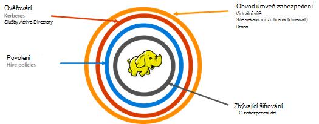

<properties
    pageTitle="Zabezpečené HDInsight přehled | Microsoft Azure"
    description="Informace..."
    services="hdinsight"
    documentationCenter=""
    authors="saurinsh"
    manager="jhubbard"
    editor="cgronlun"
    tags="azure-portal"/>

<tags
    ms.service="hdinsight"
    ms.devlang="na"
    ms.topic="hero-article"
    ms.tgt_pltfrm="na"
    ms.workload="big-data"
    ms.date="10/24/2016"
    ms.author="saurinsh"/>

# Představte doméně HDInsight clusterů (verze Preview)

Azure HDInsight dokud dnes podporované jenom jednoho uživatele místního správce. Toto fungovalo ideální pro menší týmy aplikace nebo oddělení. Jako Hadoop na základě pracovního vytížení získaných další oblíbenosti v odvětví enterprise, je nutné testu s podnikovými jako služby active directory na základě ověřování, podporu více uživatelů a řízení přístupu na základě rolí stal stále důležité. Použití doméně HDInsight clusterů, můžete vytvořit clusteru služby HDInsight připojen k doméně služby Active Directory, nakonfigurovat seznam zaměstnanci v organizaci, kteří může ověřovat pomocí služby Azure Active Directory pro přihlášení k obrázku HDInsight. Všem mimo organizaci přihlaste nebo přístup clusteru HDInsight. Řízení přístupu na základě rolí podregistru cenného papíru pomocí [Apache škálu](http://hortonworks.com/apache/ranger/), tedy omezení přístupu k datům na pouze velmi podobným způsobem podle potřeby můžete nakonfigurovat správce organizace. Nakonec správce auditování můžete využít datové zaměstnanci a všechny změny provedené zásady řízení přístupu, tedy dosáhnout vysokého stupně zásady správného řízení podnikových zdrojů.

[AZURE.NOTE]> Nové funkce popsané v této verzi preview jsou k dispozici pouze na základě Linux HDInsight clusterů pracovní zátěž podregistru. Další úloh, HBase Spark, bouře a Kafka, bude k dispozici v budoucích verzích. 

## Výhody

Pole organizace zabezpečení obsahuje čtyři velký pilíře – obvod zabezpečení, ověřování, povolení a šifrování.

.

### Obvod zabezpečení

Zabezpečení obvod v HDInsight dosáhnete prostřednictvím virtuální sítí a služba brány. Podnikový správce dnes, můžete vytvořit HDInsight obrázku uvnitř virtuální sítě a omezit přístup k virtuální sítě pomocí sítě skupin zabezpečení (pravidla příchozí nebo odchozí brány firewall). Pouze IP adresu podle brány firewall pro příchozí pravidla budou moct komunikovat s HDInsight clusteru, tedy poskytující obvod zabezpečení. Další úroveň zabezpečení obvod dosáhnete pomocí služby brány. Brána je služby, který slouží jako první řádek obrana pro všechny příchozí žádosti o clusteru HDInsight. Žádost přijme, ho ověřuje a teprve potom umožňuje žádost předat na jiné uzly v clusteru, tedy poskytující obvod zabezpečení a další název a datový uzlů v clusteru.

### Ověřování

Pomocí této verzi preview veřejné správce organizace zřízení cluster doméně HDInsight v [virtuální sítě](https://azure.microsoft.com/services/virtual-network/). Uzly clusteru HDInsight bude připojen k domény spravuje podniku. To je dosáhnout pomocí služby [Azure Active Directory Domain](https://technet.microsoft.com/library/cc770946.aspx)Services. Všechny uzlů v clusteru připojeni k doméně, která spravuje podniku. V tomto nastavení zaměstnance podniku můžete přihlásit ke uzlech pomocí svých přihlašovacích údajů domény. Lze také použít své přihlašovací údaje doménu ověřovat pomocí dalších schválených koncové body například odstínem Ambari zobrazení, ODBC, JDBC, prostředí PowerShell a REST API chcete provést interakci s clusteru. Správce musí celé publikum nemůže ovládat omezení počtu uživatelů interakce s clusteru prostřednictvím těchto koncové body.

### Povolení

Doporučený postup následovaný většina organizací se, že některé zaměstnance má přístup pro všechny zdroje organizace. Podobně této verzi správce můžete definovat zásady řízení přístupu na základě rolí prostředků clusteru. Například správce můžete nakonfigurovat [Apache škálu](http://hortonworks.com/apache/ranger/) můžete nastavit zásady řízení přístupu pro podregistru. Tato funkce zaručuje, po které bude mít přístup k jenom zaměstnanci dat, jaký budou muset být úspěšný při své práce. SSH přístup ke clusteru je také omezit jenom na správce.

### Sestavy auditování

Spolu s ochrany prostředky clusteru HDInsight před neoprávněným uživatelům a zabezpečení data, je nutné sledovat přístup neoprávněným nebo Nezáměrný zdrojů auditování všechny přístupu k prostředkům obrázku a data. Pomocí této verzi preview Správce zobrazení a HDInsight clusteru zdrojů a dat zprávu všem přístup. Správce může zobrazit a nahlaste všechny změny se zásady řízení přístupu udělat i v koncové body Apache škálu podporované. Shluk doméně HDInsight pomocí známém uživatelském rozhraní škálu Apache vyhledá protokolů auditování. Na back-end používá škálu [Apache Solr]( http://hortonworks.com/apache/solr/) pro ukládání a hledání protokoly.

### Šifrování

Ochrana dat je důležité pro schůzky organizační zabezpečení a dodržování předpisů požadavky a spolu s omezení přístupu k datům z neautorizované zaměstnanců, ho by měl taky zabezpečit jeho zašifrováním. Úložiště dat pro clusterů, Azure úložiště objektů Blob a jezera ukládání dat Azure HDInsight domovské stránce podpory serverovou průhledné [šifrování data](../storage/storage-service-encryption.md) na ostatních. Zabezpečené HDInsight clusterů Bezproblémová fungovat s Tento šifrování na straně serveru dat na ostatní funkce.

## Další kroky

- Konfigurace doméně HDInsight clusteru, najdete v článku [Konfigurace doméně HDInsight clusterů](hdinsight-domain-joined-configure.md).
- Správa clusterů doméně Hdinsightu najdete v článku [Správa doméně HDInsight clusterů](hdinsight-domain-joined-manage.md).
- Konfigurace zásad podregistru a zpracování dotazů podregistru, najdete v článku [Konfigurace podregistru zásad pro clusterů doméně HDInsight](hdinsight-domain-joined-run-hive.md).
- Systém podregistru dotazů pomocí SSH v doméně HDInsight clusterů, najdete v článku [Použití SSH s Hadoop Linux založené na HDInsight z Linux, Unix nebo OS X](hdinsight-hadoop-linux-use-ssh-unix.md#connect-to-a-domain-joined-hdinsight-cluster).