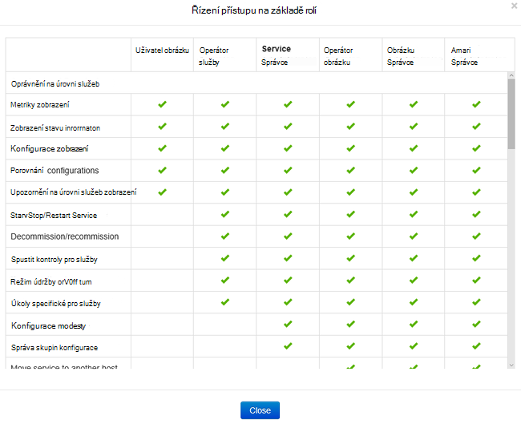
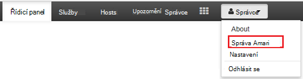
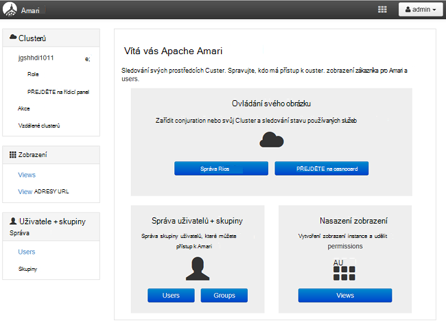
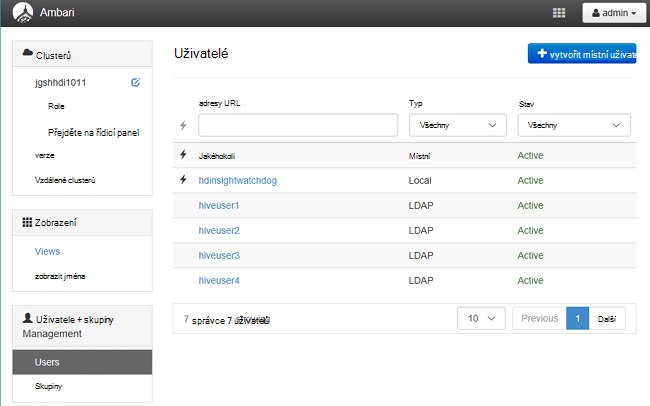
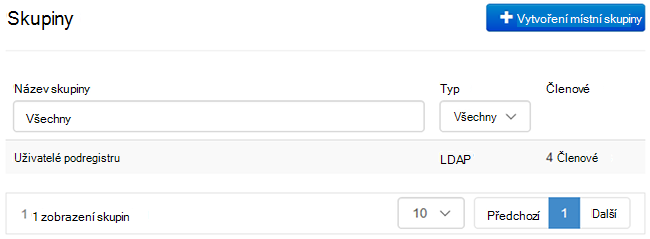
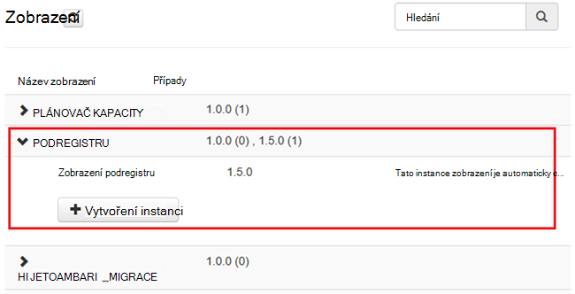
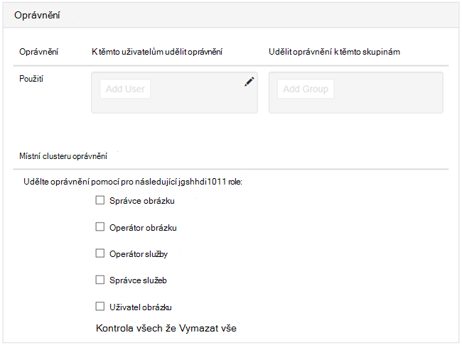

<properties
    pageTitle="Správa doméně HDInsight clusterů | Microsoft Azure"
    description="Naučte se spravovat doméně HDInsight clusterů"
    services="hdinsight"
    documentationCenter=""
    authors="saurinsh"
    manager="jhubbard"
    editor="cgronlun"
    tags=""/>

<tags
    ms.service="hdinsight"
    ms.devlang="na"
    ms.topic="article"
    ms.tgt_pltfrm="na"
    ms.workload="big-data"
    ms.date="10/25/2016"
    ms.author="saurinsh"/>

# Správa doméně HDInsight clusterů (verze Preview)

Zjistěte, uživatelů a rolí v doméně HDInsight a jak mají ovládat doméně clusterů HDInsight.

## Uživatelé doméně HDInsight clusterů

HDInsight obrázku, který není doméně má dvou uživatelských účtů vytvořených při vytváření obrázku:

- **Ambari správce**: Tento účet je označovaná taky jako *Hadoop uživatelem* nebo *HTTP*. Tento účet lze použít k přihlášení k Ambari v https://&lt;Název_clusteru >. azurehdinsight.net. Jej lze také ke spouštění dotazů v zobrazeních Ambari, spusťte úloh přes externí nástroje (tedy prostředí PowerShell Templeton, Visual Studio) a ověření s ovladač ODBC podregistru a nástrojích BI (tedy Excel, PowerBI nebo Tableau).

- **Uživatel SSH**: Tento účet se dá používat se SSH a sudo příkazy. Má kořenové oprávněními, abyste mohli Linux VMs.

HDInsight clusteru doméně má tři noví uživatelé kromě Ambari správce a uživatele SSH.

- **Škálu správce**: Tento účet je místního účtu správce Apache škálu. Není domény uživatele služby active directory. Tento účet lze nastavit zásady a ostatní uživatelé správci nebo delegovaní správci (tak, že tyto uživatele můžete spravovat zásady). Ve výchozím nastavení *Správce* je uživatelské jméno a heslo, je stejné jako heslo správce Ambari. Na stránce nastavení v škálu je možné aktualizovat heslo.

- **Shluk správce domény**: Tento účet je uživatele služby active directory domain označené jako správce clusteru Hadoop včetně Ambari a škálu. Je nutné zadat přihlašovací údaje tomuto uživateli během vytváření clusteru. Tento uživatel má následující oprávnění:

    - Připojení počítače k doméně a, že je umístíte do OU zadané při vytváření obrázku.
    - Vytvoření objekty služby v rámci OU zadané při vytváření obrázku. 
    - Vytvoření obráceném položky DNS.

    Poznámka: Další AD uživatelé mít taky zajištěný tato oprávnění. 

    Existuje několik koncové body v rámci obrázku (například Templeton), které nejsou spravuje škálu a proto nejsou zabezpečené. Tyto koncové body jsou uzamčen pro všechny uživatele kromě clusteru správce domény. 

- **Běžná**: během vytváření clusteru, můžete zadat více skupin active directory. Uživatelé v těchto skupinách budou synchronizované s škálu a Ambari. Tito uživatelé jsou uživatelé domény a bude mít přístup k pouze škálu Správa přístupových práv koncové body (například Hiveserver2). Zásady RBAC a auditování bude být k dispozici tyto uživatele.

## Role doméně HDInsight clusterů

Doméně HDInsight mají následující role:

- Správce obrázku
- Operátor obrázku
- Správce služeb
- Operátor služby
- Uživatel obrázku

**Chcete-li zobrazit oprávnění tyto role**

1. Otevřete Ambari správy uživatelského rozhraní.  V tématu [otevření Ambari správy uživatelského rozhraní](#open-the-ambari-management-ui).
2. V nabídce nalevo klikněte na položku **role**.
3. Kliknutím modré otazník najdete v článku oprávnění:

    

## Otevřete Ambari správy uživatelského rozhraní

1. Přihlaste se k [portálu Azure](https://portal.azure.com).
2. V zásuvné otevřete svůj cluster HDInsight. V tématu [clusterů seznam a zobrazit](hdinsight-administer-use-management-portal.md#list-and-show-clusters).
3. **Řídicí panel** v nabídce klikněte na horní otevřete Ambari.
4. Přihlaste se k Ambari clusteru správce domény uživatelským jménem a heslem.
5. Klikněte na rozevírací nabídku **Správce** v pravém horním rohu a potom klikněte na **Spravovat Ambari**.

    

    Uživatelské rozhraní vypadá takto:

    

## Seznam uživatelů domény synchronizují z Active Directory

1. Otevřete Ambari správy uživatelského rozhraní.  V tématu [otevření Ambari správy uživatelského rozhraní](#open-the-ambari-management-ui).
2. V nabídce nalevo klikněte na **uživatele**. Zobrazí všem uživatelům synchronizovat ze služby Active Directory do obrázku HDInsight.

    

## Seznam skupin domény synchronizují z Active Directory

1. Otevřete Ambari správy uživatelského rozhraní.  V tématu [otevření Ambari správy uživatelského rozhraní](#open-the-ambari-management-ui).
2. V nabídce nalevo klikněte na **skupiny**. Zobrazí všechny skupiny synchronizovat ze služby Active Directory do obrázku HDInsight.

    

## Nakonfigurovat oprávnění podregistru zobrazení

1. Otevřete Ambari správy uživatelského rozhraní.  V tématu [otevření Ambari správy uživatelského rozhraní](#open-the-ambari-management-ui).
2. V nabídce nalevo klikněte na **zobrazení**.
3. Klikněte na Zobrazit podrobnosti **PODREGISTRU** .

    

4. Klikněte na odkaz **Zobrazit podregistru** konfigurace podregistru zobrazení.
5. Přejděte dolů do části **oprávnění** .

    

6. Klikněte na **Přidat uživatele** nebo **Skupiny přidat**a zadejte uživatele nebo skupiny, které můžete použít podregistru zobrazení. 

## Konfigurace pro role uživatele

 Seznam role a oprávnění naleznete v tématu [clusterů role doméně HDInsight](#roles-of-domain---joined-hdinsight-clusters).

1. Otevřete Ambari správy uživatelského rozhraní.  V tématu [otevření Ambari správy uživatelského rozhraní](#open-the-ambari-management-ui).
2. V nabídce nalevo klikněte na položku **role**.
3. Klikněte na **Přidat uživatele** nebo **Skupiny přidat** přiřadit různé role uživatelé a skupiny.
 
## Další kroky

- Konfigurace doméně HDInsight clusteru, najdete v článku [Konfigurace doméně HDInsight clusterů](hdinsight-domain-joined-configure.md).
- Konfigurace zásad podregistru a zpracování dotazů podregistru, najdete v článku [Konfigurace podregistru zásad pro clusterů doméně HDInsight](hdinsight-domain-joined-run-hive.md).
- Systém podregistru dotazů pomocí SSH v doméně HDInsight clusterů, najdete v článku [Použití SSH s Hadoop Linux založené na HDInsight z Linux, Unix nebo OS X](hdinsight-hadoop-linux-use-ssh-unix.md#connect-to-a-domain-joined-hdinsight-cluster).
