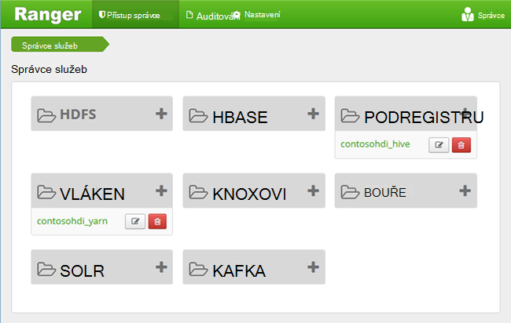
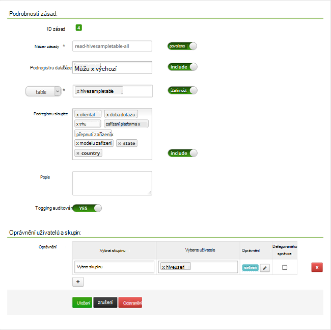

<properties
    pageTitle="Konfigurace zásad podregistru v doméně HDInsight | Microsoft Azure"
    description="Přečtěte si …"
    services="hdinsight"
    documentationCenter=""
    authors="saurinsh"
    manager="jhubbard"
    editor="cgronlun"
    tags="azure-portal"/>

<tags
    ms.service="hdinsight"
    ms.devlang="na"
    ms.topic="hero-article"
    ms.tgt_pltfrm="na"
    ms.workload="big-data"
    ms.date="10/25/2016"
    ms.author="saurinsh"/>

# Konfigurace zásad podregistru v doméně HDInsight (verze Preview)

Informace o nastavení zásad Apache škálu pro podregistru. V tomto článku vytvoříte dva zásady škálu omezit přístup k hivesampletable. Hivesampletable získáváte clusterů HDInsight. Po konfiguraci zásady pomocí Excelu a ODBC ovladače se připojujete k tabulkám podregistru v HDInsight.

## Zjistit předpoklady pro

- Shluk doméně HDInsight. V tématu [Konfigurace doméně HDInsight clusterů](hdinsight-domain-joined-configure.md).
- Pracoviště se Office 2016, Office 2013 Professional Plus, Office 365 Pro Plus, samostatný Excel 2013 nebo Office 2010 Professional Plus.

## Připojení k Apache škálu správy uživatelského rozhraní

**Připojení k škálu správy uživatelského rozhraní**

1. Z prohlížeče se připojte k škálu Admin UI. Adresa URL je https://&lt;Název_clusteru >.azurehdinsight.net/Ranger/. 

    >[AZURE.NOTE] Škálu používá jiný pověření než Hadoop obrázku. Nechcete, aby prohlížečů pomocí přihlašovacích údajů z mezipaměti Hadoop, umožňuje nové okno inprivate prohlížeče připojení k uživatelského rozhraní škálu správce.
4. Přihlaste se pomocí obrázku správce domény uživatelské jméno a heslo:

    

    V současné době škálu jde použít pouze s vláken a podregistru.

## Vytvoření uživatelů v doméně

[Konfigurace doméně HDInsight clusterů](hdinsight-domain-joined-configure.md#create-and-configure-azure-ad-ds-for-your-azure-ad)nevytvoříte hiveruser1 a hiveuser2. Použijete dvě uživatelský účet v tomto kurzu.

## Vytvořit zásady škálu

V této části vytvoříte dva škálu zásady pro přístup k hivesampletable. Udělte oprávnění select na jinou skupinu sloupců. Jak uživatele byly vytvořeny v [clusterů konfigurace doméně HDInsight](hdinsight-domain-joined-configure.md#create-and-configure-azure-ad-ds-for-your-azure-ad).  V následující části budete testovat dvě zásady v aplikaci Excel.

**Chcete-li vytvořit zásady škálu**

1. Otevřete správce škálu uživatelského rozhraní. Najdete v článku [připojení k Apache škálu správy uživatelského rozhraní](#connect-to-apache-ranager-admin-ui).
2. Klikněte na ** &lt;Název_clusteru > _hive**, klikněte v části **podregistru**. Zobrazí se dvě předem konfigurace zásad.
3. Klikněte na tlačítko **Přidat nové zásady**a zadejte tyto hodnoty:

    - Název zásady: vše hivesampletable pro čtení
    - Podregistru databáze: výchozí
    - Tabulka: hivesampletable
    - Podregistru sloupce: *
    - Vyberte uživatele: hiveuser1
    - Oprávnění: Vyberte

    .

    >[AZURE.NOTE] Pokud uživatel domény není zadané v vyberte uživatele, počkejte chvíli škálu a synchronizuje ho se AAD.

4. Klikněte na **Přidat** do zásadu uložit.
5. Opakování poslední dva kroky k vytvoření jiného zásad s následujícími vlastnostmi:

    - Název zásady: čtení hivesampletable devicemake
    - Podregistru databáze: výchozí
    - Tabulka: hivesampletable
    - Podregistru sloupce: clientid devicemake
    - Vyberte uživatele: hiveuser2
    - Oprávnění: Vyberte

## Vytvoření zdroje dat podregistru ODBC

Pokyny najdete ve [zdroji dat vytvořit podregistru ODBC](hdinsight-connect-excel-hive-odbc-driver.md).  

    Vlastnost|Popis
    ---|---
    Název zdroje dat|Pojmenujte ke zdroji dat
    Host (hostitel)|Zadejte &lt;HDInsightClusterName >. azurehdinsight.net. Například myHDICluster.azurehdinsight.net
    Port|Použití <strong>443</strong>. (Tento port změnil z 563 k 443.)
    Databáze|Použijte <strong>výchozí</strong>.
    Typ serveru podregistru|Vyberte <strong>podregistru Server 2</strong>
    Mechanismus|Vyberte <strong>Službu Azure HDInsight</strong>
    Cesta HTTP|Nechejte pole prázdné.
    Uživatelské jméno|Zadejte hiveuser1@contoso158.onmicrosoft.com. Aktualizujte název domény, pokud se liší.
    Heslo|Zadejte heslo pro hiveuser1.
    </table>

Zkontrolujte, že před uložením zdroje dat klikněte na **Testovat** .

##Import dat do Excelu z Hdinsightu

V části poslední nakonfigurovali dvě zásady.  hiveuser1 má vyberte oprávnění na všechny sloupce a hiveuser2 oprávněními vyberte ve dvou sloupcích. V této části zosobnění dva uživatelé do Excelu mohli importovat data.

1. Otevřete nový nebo existující sešit v Excelu.
2. Na kartě **Data** klikněte na **Z jiných zdrojů dat**a potom klikněte na **Z Průvodce datovým připojením** ke spuštění **Průvodce datovým připojením**.

    ! [Průvodce otevřít datovým připojením] [img hdi simbahiveodbc.excel.dataconnection]

3. Vyberte **Zdroj dat ODBC** jako zdroje dat a klikněte na tlačítko **Další**.
4. Ze zdrojů dat ODBC vyberte název zdroje dat, který jste vytvořili v předchozím kroku a klikněte na tlačítko **Další**.
5. Zadejte znovu heslo pro cluster v průvodci a potom klikněte na **OK**. Počkejte na dialogové okno **Vybrat databázi a tabulku** otevřete. To může trvat několik sekund, než.
8. Vyberte **hivesampletable**a klikněte na tlačítko **Další**. 
8. Klikněte na **Dokončit**.
9. V dialogovém okně **Importovat Data** můžete změnit nebo zadejte dotaz. K tomu, klikněte na **Vlastnosti**. To může trvat několik sekund, než. 
10. Klikněte na kartu **definice** . Příkaz text je:

        SELECT * FROM "HIVE"."default"."hivesampletable"

    Zásady škálu, který jste definovali hiveuser1 oprávnění vyberte na stránce sloupce.  Tak tento dotaz spolupracuje přihlašovací údaje společnosti hiveuser1, ale tento dotaz není nefunguje s jeho hiveuser2 pověření.

    ! [Vlastnosti připojení] [img-hdi-simbahiveodbc-aplikace excel – connectionproperties]

11. Klikněte na **OK** zavřete dialogové okno Vlastnosti připojení.
12. Klikněte na **OK** zavřete dialogové okno **Importovat Data** .  
13. Zadejte znovu heslo pro hiveuser1 a potom klikněte na **OK**. Trvá několik sekund, než se data importují do Excelu. Když se to dělá, zobrazí se 11 sloupce dat.

Testování druhá zásada (čtení devicemake hivesampletable) vytvořené v části poslední

1. Přidání nového listu v Excelu.
2. Poslední postup importovat data.  Pouze změna, kterou vytvoříte, je použít přihlašovací údaje společnosti hiveuser2 místo hiveuser1 společnosti. Tím se nepovede, protože hiveuser2 pouze má oprávnění k zobrazení dva sloupce. Zobrazí se tato chyba:

        [Microsoft][HiveODBC] (35) Error from Hive: error code: '40000' error message: 'Error while compiling statement: FAILED: HiveAccessControlException Permission denied: user [hiveuser2] does not have [SELECT] privilege on [default/hivesampletable/clientid,country ...]'.

3. Použijte stejný postup mohli importovat data. Tentokrát použijte přihlašovací údaje společnosti hiveuser2 a taky změnit příkazu select z:

        SELECT * FROM "HIVE"."default"."hivesampletable"

    :

        SELECT clientid, devicemake FROM "HIVE"."default"."hivesampletable"

    Když se to dělá, zobrazí se dvou sloupců dat importovaných.

## Další kroky

- Konfigurace doméně HDInsight clusteru, najdete v článku [Konfigurace doméně HDInsight clusterů](hdinsight-domain-joined-configure.md).
- Správa clusterů doméně Hdinsightu najdete v článku [Správa doméně HDInsight clusterů](hdinsight-domain-joined-manage.md).
- Systém podregistru dotazů pomocí SSH v doméně HDInsight clusterů, najdete v článku [Použití SSH s Hadoop Linux založené na HDInsight z Linux, Unix nebo OS X](hdinsight-hadoop-linux-use-ssh-unix.md#connect-to-a-domain-joined-hdinsight-cluster).
- Připojení podregistru pomocí podregistru JDBC najdete v článku [připojení k podregistru na Azure Hdinsightu pomocí ovladače podregistru JDBC](hdinsight-connect-hive-jdbc-driver.md)
- Připojení k Hadoop pomocí podregistru ODBC Excelu, najdete v článku [Připojit Excel k Hadoop jednotkou Microsoft podregistru ODBC](hdinsight-connect-excel-hive-odbc-driver.md)
- Připojení aplikace Excel k Hadoop pomocí Power Query, najdete v článku [Připojit Excel k Hadoop pomocí Power Query](hdinsight-connect-excel-power-query.md)