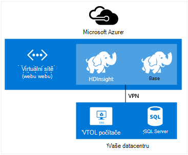

<properties
    pageTitle="Rozšíření Hdinsightu pomocí virtuální sítě | Microsoft Azure"  
    description="Naučte se používat virtuální sítě Azure HDInsight připojení k jiné cloudové zdroje nebo zdroje ve vaší datacentru"
    services="hdinsight"
    documentationCenter=""
    authors="Blackmist"
    manager="jhubbard"
    editor="cgronlun"/>

<tags
   ms.service="hdinsight"
   ms.devlang="na"
   ms.topic="article"
   ms.tgt_pltfrm="na"
   ms.workload="big-data"
   ms.date="10/21/2016"
   ms.author="larryfr"/>


#<a name="extend-hdinsight-capabilities-by-using-azure-virtual-network"></a>Rozšíření možností HDInsight pomocí virtuální sítě Azure

Azure virtuální sítě umožňuje rozšíření Hadoop řešení zahrnutí místní zdroje, jako jsou SQL serveru, zkombinování několika typů clusteru HDInsight ani vytvářet zabezpečené privátní sítě mezi zdroje v cloudu.

[AZURE.INCLUDE [upgrade-powershell](../../includes/hdinsight-use-latest-powershell-and-cli.md)]


##<a id="whatis"></a>Co je Azure virtuální sítě?

[Virtuální sítě Azure](https://azure.microsoft.com/documentation/services/virtual-network/) umožňuje vytvořit zabezpečené, trvalý síť obsahující zdroje, které potřebujete pro řešení. Virtuální sítě umožňuje:

* Připojte cloudové zdroje společně v privátní sítě (pouze cloudu).

    

    Propojení Azure služby s Azure Hdinsightu pomocí virtuální sítě umožňuje následujících situacích:

    * **Vyvolání HDInsight služeb nebo úlohy** z Azure weby nebo služby v Azure virtuálních počítačích.

    * **Přímo přenos dat** mezi HDInsight a databáze SQL Azure, SQL Server nebo jiné řešení datový úložiště virtuálního počítače se systémem.

    * **Kombinování víc servery HDInsight** do jednoho řešení. HDInsight clusterů mohou mít různé typy, které odpovídají pracovní zátěž nebo technologii clusteru optimalizovaných pro. Neexistuje žádná podporované metoda k vytvoření obrázku, který kombinuje více typů, například bouře a HBase na jednoho obrázku. Virtuální sítě připojíte více clusterů přímo vzájemně komunikovat.

* Vaše cloudové zdroje k síti místní datacentra (na webu nebo čárky webu) připojení prostřednictvím virtuální privátní sítě (VPN).

    Konfigurace webů webu umožňuje připojit více zdrojů z vaší datacentra Azure virtuální sítě pomocí hardwaru virtuální privátní sítě nebo služby Směrování a vzdáleného přístupu.

    

    Konfigurace čárky webu umožňuje připojit určitému zdroji Azure virtuální sítě pomocí softwaru VPN.

    

    Odkaz cloud a vaše datacentra pomocí virtuální sítě umožňuje podobné scénáře konfiguraci jen cloudu. Ale namísto práce se zdroji v cloudu, můžete taky spolupracovat s prostředky ve vaší datacentra.

    * **Přímo přenos dat** mezi HDInsight a svůj datacentra. Příklad používá Sqoop pro přenos dat do nebo ze serveru SQL Server nebo čtení data generovaná řádku obchodní aplikací (LOB).

    * **Vyvolání HDInsight služeb nebo úlohy** z aplikace LOB. Příklad používá rozhraní API Java HBase k ukládání a načtení dat z Hdinsightu HBase obrázku.

Další informace o funkcích, výhody a možnosti virtuální sítě najdete v článku [Přehled Azure virtuální sítě](../virtual-network/virtual-networks-overview.md).

> [AZURE.NOTE] Před zřizování HDInsight clusteru je nutné vytvořit virtuální sítě Azure. Další informace najdete v tématu [úkolů konfigurace virtuální sítě](https://azure.microsoft.com/documentation/services/virtual-network/).

## <a name="virtual-network-requirements"></a>Virtuální požadavky sítě

> [AZURE.IMPORTANT] Vytvoření obrázku HDInsight virtuální síti se systémem vyžaduje určité konfigurace virtuální sítě, které jsou popsané v této části.

###<a name="location-based-virtual-networks"></a>Na základě umístění virtuální sítě

Azure HDInsight podporuje pouze na základě umístění virtuální sítě a momentálně nefunguje virtuální sítích na základě spřažení skupiny.

###<a name="classic-or-v2-virtual-network"></a>Classic nebo v2 virtuální sítě

Serveru s Windows clusterů vyžadují klasické virtuální sítě, zatímco na základě Linux clusterů vyžadují síť virtuální správce prostředků Azure. Pokud nemáte správný typ sítě, nebude použít při vytváření clusteru.

Pokud máte zdroje, který nemusí používat obrázku, které plánujete týkající se vytváření virtuálních síti se systémem, můžete vytvořit nový virtuální sítě, které lze použít v clusteru a připojení k kompatibilní virtuální sítě. Pak můžete vytvořit clusteru ve verzi sítě, který potřebuje a ho bude moct přístupu k prostředkům ve druhé síti vzhledem k tomu, jsou spojeny přístupů. Další informace o připojení klasické tak i u nových virtuálních sítí najdete v článku [připojení klasické VNets do nového VNets](../vpn-gateway/vpn-gateway-connect-different-deployment-models-portal.md).

###<a name="custom-dns"></a>Vlastní DNS

Při vytváření virtuálních sítí, Azure poskytuje překlad výchozí Azure služeb, jako je HDInsight, které jsou instalovány v síti. Potřebujete však použít vlastní systému DNS (Domain Name) pro situace, jako je třeba křížové sítě domény překlad. Třeba při komunikaci mezi službami nachází ve dvou připojen virtuální sítě. HDInsight podporuje i výchozí Azure překlad i vlastní DNS při použití s Azure virtuální sítě.

Další informace o použití serveru DNS s Azure virtuální sítě naleznete v části __překlad pomocí serveru DNS__ dokumentu [Překladu VMs a rolí instance](../virtual-network/virtual-networks-name-resolution-for-vms-and-role-instances.md#name-resolution-using-your-own-dns-server) .

###<a name="secured-virtual-networks"></a>Zabezpečená virtuálních sítí

Služba HDInsight je služba spravovaných a vyžadují připojení k Internetu během vytváření a při spuštění. Jedná se, že Azure můžete sledovat stav obrázku, zahajte překlopení obrázku zdrojů, změna počtu uzlů v clusteru prostřednictvím měřítka operace a dalších úlohách správy.

Pokud budete potřebovat k instalaci HDInsight do zabezpečené virtuální sítě, je třeba povolit příchozí přístup přes port 443 pro následující IP adresy, které umožňují Azure ke správě clusteru HDInsight.

* 168.61.49.99
* 23.99.5.239
* 168.61.48.131
* 138.91.141.162

Povolení přístupu pro příchozí připojení z port 443 pro tyto adresy vám umožní úspěšně nainstalovat HDInsight do zabezpečené virtuální sítě.

> [AZURE.IMPORTANT] HDInsight, které nejsou podporovány omezení odchozí přenosy pouze příchozích. Při definování pravidla skupiny zabezpečení sítě podsítě obsahující HDInsight použijte jenom příchozí pravidla.

Následující příklady ukazují, jak vytvořit novou skupinu zabezpečení sítě, který umožňuje požadované adresy a platí skupiny zabezpečení pro podsítě v síti virtuální. Tento postup předpokládá, že jste již vytvořili virtuální sítě a podsítě, které chcete nainstalovat HDInsight do.

__Pomocí prostředí PowerShell Azure__

    $vnetName = "Replace with your virtual network name"
    $resourceGroupName = "Replace with the resource group the virtual network is in"
    $subnetName = "Replace with the name of the subnet that HDInsight will be installed into"
    # Get the Virtual Network object
    $vnet = Get-AzureRmVirtualNetwork `
        -Name $vnetName `
        -ResourceGroupName $resourceGroupName
    # Get the region the Virtual network is in.
    $location = $vnet.Location
    # Get the subnet object
    $subnet = $vnet.Subnets | Where-Object Name -eq $subnetName
    # Create a new Network Security Group.
    # And add exemptions for the HDInsight health and management services.
    $nsg = New-AzureRmNetworkSecurityGroup `
        -Name "hdisecure" `
        -ResourceGroupName $resourceGroupName `
        -Location $location `
        | Add-AzureRmNetworkSecurityRuleConfig `
            -name "hdirule1" `
            -Description "HDI health and management address 168.61.49.99" `
            -Protocol "*" `
            -SourcePortRange "*" `
            -DestinationPortRange "443" `
            -SourceAddressPrefix "168.61.49.99" `
            -DestinationAddressPrefix "VirtualNetwork" `
            -Access Allow `
            -Priority 300 `
            -Direction Inbound `
        | Add-AzureRmNetworkSecurityRuleConfig `
            -Name "hdirule2" `
            -Description "HDI health and management 23.99.5.239" `
            -Protocol "*" `
            -SourcePortRange "*" `
            -DestinationPortRange "443" `
            -SourceAddressPrefix "23.99.5.239" `
            -DestinationAddressPrefix "VirtualNetwork" `
            -Access Allow `
            -Priority 301 `
            -Direction Inbound `
        | Add-AzureRmNetworkSecurityRuleConfig `
            -Name "hdirule3" `
            -Description "HDI health and management 168.61.48.131" `
            -Protocol "*" `
            -SourcePortRange "*" `
            -DestinationPortRange "443" `
            -SourceAddressPrefix "168.61.48.131" `
            -DestinationAddressPrefix "VirtualNetwork" `
            -Access Allow `
            -Priority 302 `
            -Direction Inbound `
        | Add-AzureRmNetworkSecurityRuleConfig `
            -Name "hdirule4" `
            -Description "HDI health and management 138.91.141.162" `
            -Protocol "*" `
            -SourcePortRange "*" `
            -DestinationPortRange "443" `
            -SourceAddressPrefix "138.91.141.162" `
            -DestinationAddressPrefix "VirtualNetwork" `
            -Access Allow `
            -Priority 303 `
            -Direction Inbound
    # Set the changes to the security group
    Set-AzureRmNetworkSecurityGroup -NetworkSecurityGroup $nsg
    # Apply the NSG to the subnet
    Set-AzureRmVirtualNetworkSubnetConfig `
        -VirtualNetwork $vnet `
        -Name $subnetName `
        -AddressPrefix $subnet.AddressPrefix `
        -NetworkSecurityGroupId $nsg

__Použití Azure rozhraní příkazového řádku__

1. Zadejte následující příkaz Vytvořit novou skupinu zabezpečení sítě s názvem `hdisecure`. Nahraďte __RESOURCEGROUPNAME__ a __umístění__ , která obsahuje virtuální sítě Azure a umístění (oblast) vytvořený ve skupině skupina zdroje.

        azure network nsg create RESOURCEGROUPNAME hdisecure LOCATION
    
    Po vytvoření skupiny získáte informace o nové skupině. Najděte řádek podobně jako tento a uložit `/subscriptions/GUID/resourceGroups/RESOURCEGROUPNAME/providers/Microsoft.Network/networkSecurityGroups/hdisecure` informace. Použije se později.
    
        data:    Id                              : /subscriptions/GUID/resourceGroups/RESOURCEGROUPNAME/providers/Microsoft.Network/networkSecurityGroups/hdisecure

2. Použijte následující pravidla přidáte novou síť skupině zabezpečení, pomocí kterých příchozí komunikaci na port 443 služby Azure HDInsight zdraví a správy. __RESOURCEGROUPNAME__ nahraďte názvem, který obsahuje virtuální sítě Azure skupina zdroje.

        azure network nsg rule create RESOURCEGROUPNAME hdisecure hdirule1 -p "*" -o "*" -u "443" -f "168.61.49.99" -e "VirtualNetwork" -c "Allow" -y 300 -r "Inbound"
        azure network nsg rule create RESOURCEGROUPNAME hdisecure hdirule2 -p "*" -o "*" -u "443" -f "23.99.5.239" -e "VirtualNetwork" -c "Allow" -y 301 -r "Inbound"
        azure network nsg rule create RESOURCEGROUPNAME hdisecure hdirule3 -p "*" -o "*" -u "443" -f "168.61.48.131" -e "VirtualNetwork" -c "Allow" -y 302 -r "Inbound"
        azure network nsg rule create RESOURCEGROUPNAME hdisecure hdirule4 -p "*" -o "*" -u "443" -f "138.91.141.162" -e "VirtualNetwork" -c "Allow" -y 303 -r "Inbound"

3. Po vytvoření pravidla použijte následující novou skupinu zabezpečení sítě pro podsítě. __RESOURCEGROUPNAME__ nahraďte názvem, který obsahuje virtuální sítě Azure skupina zdroje. Nahraďte __VNETNAME__ a __SUBNETNAME__ název virtuální sítě Azure a podsítě, který budete používat při instalaci HDInsight.

        azure network vnet subnet set RESOURCEGROUPNAME VNETNAME SUBNETNAME -w "/subscriptions/GUID/resourceGroups/RESOURCEGROUPNAME/providers/Microsoft.Network/networkSecurityGroups/hdisecure"
    
    Po dokončení tohoto příkazu lze úspěšně HDInsight do nainstalujete zabezpečené virtuální sítě podsítě v těchto krocích použili.

> [AZURE.IMPORTANT] Pomocí výše uvedené kroky pouze otevřené přístup ke službě HDInsight zdraví a správy v Azure cloudu. To vám umožní úspěšně instalace HDInsight obrázku do podsítě, ale ve výchozím nastavení je blokován přístup k obrázku HDInsight z mimo virtuální sítě. Budete muset přidat pravidla nehledá skupiny zabezpečení sítě, pokud se chcete povolení přístupu externích uživatelů virtuální sítě.
>
> Například přístupu SSH z Internetu, musíte přidat pravidlo podobně jako tento: 
>
> * Azure Powershellu:```Add-AzureRmNetworkSecurityRuleConfig -Name "SSSH" -Description "SSH" -Protocol "*" -SourcePortRange "*" -DestinationPortRange "22" -SourceAddressPrefix "*" -DestinationAddressPrefix "VirtualNetwork" -Access Allow -Priority 304 -Direction Inbound```
> * Azure rozhraní příkazového řádku:```azure network nsg rule create RESOURCEGROUPNAME hdisecure hdirule4 -p "*" -o "*" -u "22" -f "*" -e "VirtualNetwork" -c "Allow" -y 304 -r "Inbound"```

Další informace o skupiny zabezpečení sítě najdete v článku [Přehled skupin zabezpečení sítě](../virtual-network/virtual-networks-nsg.md). Informace o řízení směrování v Azure virtuální sítě najdete v tématu [směruje definované uživatele a IP předávání](../virtual-network/virtual-networks-udr-overview.md).

##<a id="tasks"></a>Úkoly a informace

Tato část obsahuje informace o běžné úkoly a informace, které budete potřebovat při používání HDInsight s virtuální sítě.

###<a name="determine-the-fqdn"></a>Určení úplný název domény

Shluk HDInsight přiřadíte konkrétní plně kvalifikovaný název domény (FQDN) pro rozhraní virtuální sítě. Toto je adresa, použijte při připojování ke clusteru z jiných zdrojů virtuální síti se systémem. K určení úplný název domény, použijte následující adresu URL k vytvoření dotazu službu pro správu Ambari:

    https://<clustername>.azurehdinsight.net/ambari/api/v1/clusters/<clustername>.azurehdinsight.net/services/<servicename>/components/<componentname>

> [AZURE.NOTE] Další informace o použití Ambari s Hdinsightu najdete v článku [Monitor Hadoop clusterů HDInsight pomocí rozhraní API Ambari](hdinsight-monitor-use-ambari-api.md).

Zadejte název clusteru a služby a součásti výpočetnímu clusteru, například správce prostředků vláken.

> [AZURE.NOTE] Data vrácená je dokument JavaScript Object Notation (JSON), který obsahuje velké množství informací o součásti. Pokud chcete extrahovat jenom plně kvalifikovaný název domény, měli byste použít analyzátoru formátu JSON k načtení `host_components[0].HostRoles.host_name` hodnotu.

Například pro FQDN vráceným HDInsight Hadoop obrázku, můžete některou z následujících metod k načtení dat pro správce prostředků vláken:

* [Azure Powershellu](../powershell-install-configure.md)

        $ClusterDnsName = <clustername>
        $Username = <cluster admin username>
        $Password = <cluster admin password>
        $DnsSuffix = ".azurehdinsight.net"
        $ClusterFQDN = $ClusterDnsName + $DnsSuffix

        $webclient = new-object System.Net.WebClient
        $webclient.Credentials = new-object System.Net.NetworkCredential($Username, $Password)

        $Url = "https://" + $ClusterFQDN + "/ambari/api/v1/clusters/" + $ClusterFQDN + "/services/yarn/     components/resourcemanager"
        $Response = $webclient.DownloadString($Url)
        $JsonObject = $Response | ConvertFrom-Json
        $FQDN = $JsonObject.host_components[0].HostRoles.host_name
        Write-host $FQDN

* [otáčení](http://curl.haxx.se/) a [jq](http://stedolan.github.io/jq/)

        curl -G -u <username>:<password> https://<clustername>.azurehdinsight.net/ambari/api/v1/clusters/<clustername>.azurehdinsight.net/services/yarn/components/resourcemanager | jq .host_components[0].HostRoles.host_name

###<a name="connecting-to-hbase"></a>Připojení k HBase

Připojení k HBase vzdáleně pomocí rozhraní API Java, musíte zjistit adresy kvora ZooKeeper HBase obrázku a zadejte to v aplikaci.

Aby ZooKeeper kvora adresu, použijte jeden z následujících metod k vytvoření dotazu službu pro správu Ambari:

* [Azure Powershellu](../powershell-install-configure.md)

        $ClusterDnsName = <clustername>
        $Username = <cluster admin username>
        $Password = <cluster admin password>
        $DnsSuffix = ".azurehdinsight.net"
        $ClusterFQDN = $ClusterDnsName + $DnsSuffix

        $webclient = new-object System.Net.WebClient
        $webclient.Credentials = new-object System.Net.NetworkCredential($Username, $Password)

        $Url = "https://" + $ClusterFQDN + "/ambari/api/v1/clusters/" + $ClusterFQDN + "/configurations?type=hbase-site&tag=default&fields=items/properties/hbase.zookeeper.quorum"
        $Response = $webclient.DownloadString($Url)
        $JsonObject = $Response | ConvertFrom-Json
        Write-host $JsonObject.items[0].properties.'hbase.zookeeper.quorum'

* [otáčení](http://curl.haxx.se/) a [jq](http://stedolan.github.io/jq/)

        curl -G -u <username>:<password> "https://<clustername>.azurehdinsight.net/ambari/api/v1/clusters/<clustername>.azurehdinsight.net/configurations?type=hbase-site&tag=default&fields=items/properties/hbase.zookeeper.quorum" | jq .items[0].properties[]

> [AZURE.NOTE] Další informace o použití Ambari s Hdinsightu najdete v článku [Monitor Hadoop clusterů HDInsight pomocí rozhraní API Ambari](hdinsight-monitor-use-ambari-api.md).

Až budete mít kvora informace, můžete ho použijte v klientské aplikaci.

V aplikaci Java používající rozhraní API HBase, by například přidat soubor **hbase site.xml** do projektu a zadejte informace kvora v souboru následujícím způsobem:

```
<configuration>
  <property>
    <name>hbase.cluster.distributed</name>
    <value>true</value>
  </property>
  <property>
    <name>hbase.zookeeper.quorum</name>
    <value>zookeeper0.address,zookeeper1.address,zookeeper2.address</value>
  </property>
  <property>
    <name>hbase.zookeeper.property.clientPort</name>
    <value>2181</value>
  </property>
</configuration>
```

###<a name="verify-network-connectivity"></a>Ověřte připojení k síti

Některé služby, třeba SQL Server, můžete nastavit omezení příchozí připojení. To zabránit HDInsight úspěšně práce s těmito službami.

Pokud narazíte na problémy s přístupem ke službě z Hdinsightu, dokumentaci pro službu ujistěte, že jste povolili přístup k síti. Můžete taky ověřit přístup k síti vytvořením Azure virtuálního počítače ve stejné síti virtuální a ověřte, virtuálního počítače můžete připojit ke službě přes virtuální sítě pomocí klientské nástroje.

##<a id="nextsteps"></a>Další kroky

Následující příklady ukazují, jak pomocí virtuální sítě Azure HDInsight:

* [Analyzovat data snímače s bouře a HBase v HDInsight](hdinsight-storm-sensor-data-analysis.md) – ukazuje, jak nakonfigurovat bouře a HBase obrázku v síti virtuální, a taky jak vzdáleně zápis dat do HBase z bouře.

* [Poskytování Hadoop clusterů HDInsight](hdinsight-hadoop-provision-linux-clusters.md) - obsahuje informace o vytváření Hadoop clusterů, včetně informací o používání Azure virtuální sítě.

* [Použití Sqoop s Hadoop v HDInsight](hdinsight-use-sqoop-mac-linux.md) - obsahuje informace o používání Sqoop Pokud chcete přenést data se serverem SQL Server na virtuálních síti.

Další informace o Azure virtuálních sítí, najdete v článku [Přehled Azure virtuální sítě](../virtual-network/virtual-networks-overview.md).
