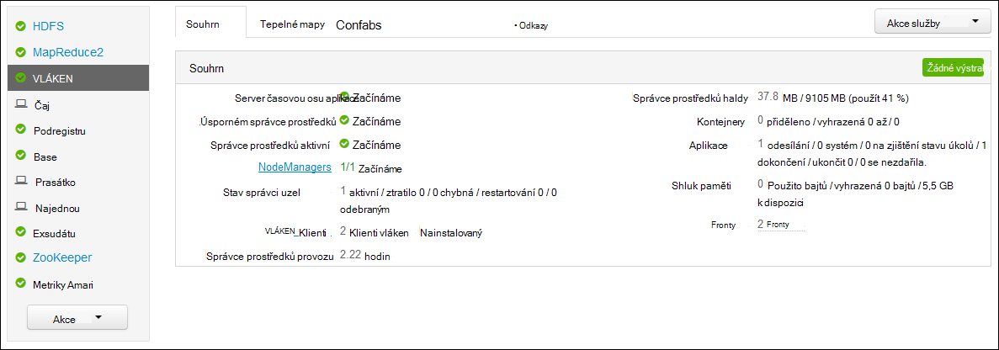
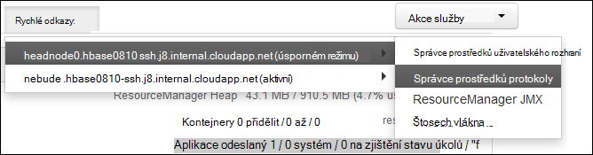

<properties
    pageTitle="Aplikace Access Hadoop vláken přihlášení na základě Linux HDInsight | Microsoft Azure"
    description="Zjistěte, jak získat přístup ke vláken protokoly aplikace založené na Linux HDInsight (Hadoop) clusteru pomocí příkazového řádku i ve webovém prohlížeči."
    services="hdinsight"
    documentationCenter=""
    tags="azure-portal"
    authors="Blackmist" 
    manager="jhubbard"
    editor="cgronlun"/>

<tags
    ms.service="hdinsight"
    ms.workload="big-data"
    ms.tgt_pltfrm="na"
    ms.devlang="na"
    ms.topic="article"
    ms.date="10/21/2016"
    ms.author="larryfr"/>

# Aplikace Access vláken přihlášení na základě Linux HDInsight 

Tento dokument vysvětluje, jak získat přístup k protokoly pro aplikace vláken (ještě jiného zdroje Vyjednávač), které dokončili clusteru Hadoop v Azure HDInsight.

> [AZURE.NOTE] Informace v tomto dokumentu jsou specifické pro clusterů na základě Linux HDInsight. Další informace o serveru s Windows clusterů najdete v článku [aplikace Access vláken přihlásí HDInsight serveru s Windows](hdinsight-hadoop-access-yarn-app-logs.md)

## Zjistit předpoklady pro

* Na základě Linux HDInsight obrázku.

* Před zpřístupněním webu ResourceManager protokoly uživatelského rozhraní, musíte [vytvořit SSH tunelem](hdinsight-linux-ambari-ssh-tunnel.md) .

## Server vláken časové osy

[Vláken časovou osu serveru](http://hadoop.apache.org/docs/r2.4.0/hadoop-yarn/hadoop-yarn-site/TimelineServer.html) obsahuje obecné informace o dokončených aplikací, jakož i aplikace framework konkrétní informace pomocí funkce dva různé rozhraní. Konkrétně:

* Ukládání a vyhledávání informací obecné aplikace na HDInsight clusterů není povolené s verzí 3.1.1.374 nebo vyšší.
* Součást aplikace framework specifické informace o serveru časovou osu není momentálně neexistuje na clusterů HDInsight.

Obecné informace o aplikacích obsahuje následující typů dat:

* ID aplikace jedinečný identifikátor aplikace
* Uživatele, který spustil aplikace
* Informace o pokusů dokončete aplikace
* Kontejnery používané jakýkoli pokus dané aplikace

## Protokoly aplikací vláken a

VLÁKEN podporuje více programovací modelů (MapReduce jeden z nich) tak, že oddělení řízení zdrojů z plánování a sledování aplikací. Důvodem je prostřednictvím globální *ResourceManager* (SV), uzel jednoho pracovníka *NodeManagers* (NMs) a za aplikace *ApplicationMasters* (AMs). Dopoledne jednotlivé aplikace vyjednávání zdroje (procesoru paměti, disku, sítě) pro spuštění aplikace se RM. Správce prostředků spolupracuje NMs udělit tyto materiály, které jsou poskytovány jako *kontejnery*. AM je zodpovědný za sledování průběhu kontejnery přiřazenou RM. Aplikace může vyžadovat mnoho kontejnery podle povahy aplikace.

Kromě toho jednotlivých aplikací může obsahovat více *aplikace pokusí o* k dokončení přítomnosti dojde k chybě nebo z důvodu ztráty komunikaci mezi dop a RM. Kontejnery jsou proto udělena konkrétní pokus o aplikace. Znamená kontejneru poskytuje kontext pro základní jednotka práci prováděnou aplikace vláken a všechny práce, která probíhá v rámci kontejneru probíhá na uzel jednoho pracovníka, na kterém byla přidělit kontejner. V tématu [Vláken koncepty] [ YARN-concepts] další kdykoliv při ruce.

Protokoly aplikace (a protokoly přidružené kontejneru) je považován za kritický v ladění problematický Hadoop aplikací. VLÁKEN poskytuje hodní rámec pro shromažďování, agregaci a ukládání protokolů aplikace s [Protokolu agregace] [ log-aggregation] funkce. Funkce agregace protokolu zajišťuje přístup k aplikaci protokoly deterministického, sloučí protokoly přes všechny kontejnery uzlu kolegy a ukládá jako jeden agregované soubor protokolu jednoho pracovníka uzel v systému souborů výchozí po ukončení aplikace. Aplikace může používat stovky nebo tisíce kontejnerů, ale protokoly pro všechny kontejnery spustit na jednoho pracovníka uzel bude vždycky agregované jednoho souboru s výsledkem jednoho souboru protokolu jednoho pracovníka uzel používané aplikací. Agregace protokolu je standardně zapnutá u HDInsight clusterů (verze 3.0 a nahoře), a agregovaná protokoly najdete ji v kontejneru výchozí svůj cluster v následujícím umístění:

    wasbs:///app-logs/<user>/logs/<applicationId>

V tomto umístění, je *uživatelské* jméno uživatele, který spustil aplikace a *applicationId* je jedinečný identifikátor aplikace jako přidělil RM. vláken

Souhrnné protokoly nejsou přímo čitelné zapsaný v [TFile][T-file], [binárním formátu] [ binary-format] indexované v kontejneru. K zobrazení tyto protokoly jako prostý text u aplikací nebo kontejnery potřebné nutné použít vláken ResourceManager protokoly nebo nástroje rozhraní příkazového řádku. 

##Nástroje vláken rozhraní příkazového řádku

Abyste mohli používat nástroje vláken rozhraní příkazového řádku, musíte nejdřív připojit k clusteru HDInsight pomocí SSH. Informace o použití SSH s HDInsight použijte jeden z následujících dokumentů:

- [Použití SSH s Hadoop Linux založené na HDInsight z Linux, Unix nebo OS X](hdinsight-hadoop-linux-use-ssh-unix.md)

- [Použití SSH s Hadoop Linux založené na HDInsight z Windows](hdinsight-hadoop-linux-use-ssh-windows.md)
    
Tyto protokoly jako prostý text zobrazíte tak, že s některým z následujících příkazů:

    yarn logs -applicationId <applicationId> -appOwner <user-who-started-the-application>
    yarn logs -applicationId <applicationId> -appOwner <user-who-started-the-application> -containerId <containerId> -nodeAddress <worker-node-address>
    
Je nutné zadat &lt;applicationId >, &lt;uživatele – kdo – Začínáme –-aplikace >, &lt;Id_kontejneru >, a a adresa uzlu ltworker > informací při spuštění tyto příkazy.

##Uživatelské rozhraní ResourceManager vláken

Uživatelské rozhraní ResourceManager vláken běží na headnode obrázku a můžete k nim získat přístup prostřednictvím webového Ambari UI; ale musíte první [vytvořit SSH tunelem](hdinsight-linux-ambari-ssh-tunnel.md) před zpřístupněním ResourceManager uživatelského rozhraní.

Po vytvoření SSH tunelem slouží k zobrazení protokolů vláken podle těchto kroků:

1. Ve webovém prohlížeči přejděte na https://CLUSTERNAME.azurehdinsight.net. NÁZEV_CLUSTERU nahraďte názvem svůj cluster HDInsight.

2. Ze seznamu služby na levé straně vyberte __vláken__.

    

3. V rozevíracím seznamu __Odkazy__ vyberte jednu z hlavy uzlů a vyberte __ResourceManager protokolu__.

    
    
    Zobrazí se seznam odkazů na vláken protokoly.

[YARN-timeline-server]:http://hadoop.apache.org/docs/r2.4.0/hadoop-yarn/hadoop-yarn-site/TimelineServer.html
[log-aggregation]:http://hortonworks.com/blog/simplifying-user-logs-management-and-access-in-yarn/
[T-file]:https://issues.apache.org/jira/secure/attachment/12396286/TFile%20Specification%2020081217.pdf
[binary-format]:https://issues.apache.org/jira/browse/HADOOP-3315
[YARN-concepts]:http://hortonworks.com/blog/apache-hadoop-yarn-concepts-and-applications/
