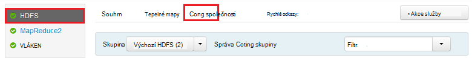
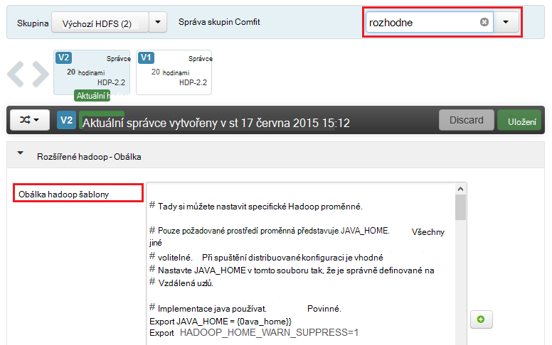
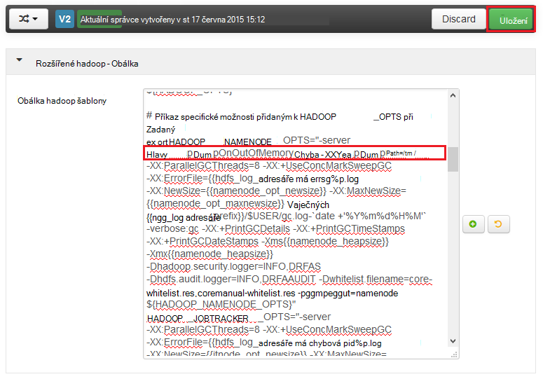
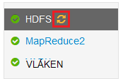
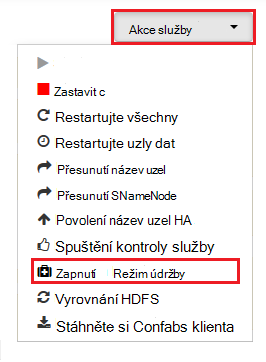
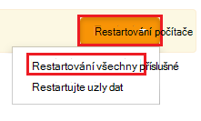

<properties
    pageTitle="Povolení haldy výpisy služby Hadoop na HDInsight | Microsoft Azure"
    description="Povolte haldy výpisy služby Hadoop od založených na Linux HDInsight clusterů ladění a analýzy."
    services="hdinsight"
    documentationCenter=""
    authors="Blackmist"
    manager="jhubbard"
    editor="cgronlun"
    tags="azure-portal"/>

<tags
    ms.service="hdinsight"
    ms.workload="big-data"
    ms.tgt_pltfrm="na"
    ms.devlang="na"
    ms.topic="article"
    ms.date="09/27/2016"
    ms.author="larryfr"/>

#Povolení haldy výpisy Hadoop služeb na základě Linux HDInsight (verze Preview)

[AZURE.INCLUDE [heapdump-selector](../../includes/hdinsight-selector-heap-dump.md)]

Vypíše haldy obsahovat snímek paměti aplikace, včetně hodnoty proměnných v době, kdy byla vytvořená výpisu. Tak, aby byly velmi užitečné pro diagnostiku problémů, ke kterým dochází při spuštění.

> [AZURE.NOTE] Informace v tomto článku platí jenom pro na základě Linux HDInsight. Informace o serveru s Windows Hdinsightu najdete v tématu [Povolení haldy výpisy pro Hadoop služby na serveru s Windows HDInsight](hdinsight-hadoop-collect-debug-heap-dumps.md)

## Služby

Můžete povolit haldy výpisy pro následující služby:

*  **hcatalog** - tempelton
*  **podregistru** - hiveserver2, metastore, derbyserver
*  **mapreduce** - jobhistoryserver
*  **vláken** - resourcemanager, nodemanager, timelineserver
*  **hdfs** - datanode, secondarynamenode, namenode

Můžete taky povolit haldy výpisy pro danou mapu a snížit procesů spustili tak, že HDInsight.

## Principy haldy Vypsání konfigurace

Vypíše haldy jsou povoleny předáním možnosti (někdy označované jako rozhodne, nebo parametry) do JVM při spuštění služby. U většiny Hadoop služeb můžete to provést změnou skriptu prostředí lze spustit službu.

Do každého skriptu je exportovat pro ** \* \_OPTS**, která obsahuje možnosti předán JVM. Například v skriptu **hadoop env.sh** řádku, který začíná `export HADOOP_NAMENODE_OPTS=` obsahuje volby pro službu NameNode.

Mapování a zmenšení procesy se mírně liší, jsou tyto podřízený proces MapReduce služby. Každé mapování nebo zmenšit probíhá v kontejneru podřízené a existují dva položky, které obsahují JVM možnosti pro tyto. Obě obsažené v **mapred site.xml**:

* **mapreduce.Admin.map.child.Java.opts**
* **mapreduce.Admin.reduce.child.Java.opts**

> [AZURE.NOTE] Doporučujeme používat Ambari upravit skripty a nastavení mapred site.xml jako Ambari zpracuje replikace změn mezi uzly clusteru. Naleznete v části [Použití Ambari](#using-ambari) pro konkrétní kroky.

###Povolení haldy výpisy

Na následující možnost umožňuje haldy výpisy dojde OutOfMemoryError:

    -XX:+HeapDumpOnOutOfMemoryError

**+** Označuje, zda je povolena tuto možnost. Výchozí hodnota je vypnutá.

> [AZURE.WARNING] Jak soubory výpisu mohou být velké haldy výpisy nejsou povoleny služby Hadoop na HDInsight. Pokud povolíte je pro odstraňování potíží, nezapomeňte zakázat po problém reprodukovat a shromáždili výpis soubory.

###Výpis umístění

Výchozí umístění souboru s výpisem je aktuální pracovní adresář. Můžete určit, kde je soubor uložený pomocí následující možnosti:

    -XX:HeapDumpPath=/path

Příklad použití `-XX:HeapDumpPath=/tmp` způsobí výpisy uložený v adresáři /tmp.

###Skriptů

Skript můžete aktivovat také dojde **OutOfMemoryError** . Například aktivaci oznámení, abyste věděli, že došlo k chybě. Toto je řízeno pomocí následující možnosti:

    -XX:OnOutOfMemoryError=/path/to/script

> [AZURE.NOTE] Protože Hadoop distributed systému, všechny skript použitý musí být umístěny ve všech uzlech, že je spuštěná služba na obrázku.
>
> Skript musí taky být v umístění, do kterého přístupný pomocí účtu služby běží jako a poskytne spustit oprávnění. Můžete například chtít ukládat skriptů v `/usr/local/bin` a používat `chmod go+rx /usr/local/bin/filename.sh` udělit pro čtení a spustit oprávnění.

##Použití Ambari

Změna konfigurace služby, pomocí následujících kroků:

1. Otevřete web Ambari uživatelského rozhraní pro svůj cluster. Adresa URL bude https://YOURCLUSTERNAME.azurehdinsight.net.

    Po zobrazení výzvy ověření k webu pomocí účtu názvu účtu HTTP (výchozí: správce) a heslo pro svůj cluster.

    > [AZURE.NOTE] Můžete být vyzváni podruhé tak, že Ambari pro uživatelské jméno a heslo. Pokud ano, stačí znovu zadejte stejný název účtu a heslo

2. Pomocí seznamu na levé straně, vyberte oblast služby, kterou chcete upravit. Například, **HDFS**. V oblasti Centrum vyberte kartu **Configs** .

    

3. Pomocí položky **filtr...** , zadejte **Možnosti**. Bude filtrovat seznam položek konfigurace pouze na ty obsahující tento text a je rychlý způsob, jak najít skriptu prostředí nebo **šablonu** , která slouží k nastavení těchto možností.

    

4. Najděte ** \* \_OPTS** záznam pro službu, kterou chcete povolit haldy výpisy pro a přidání možností chcete povolit. Na následujícím obrázku jsou přidané `-XX:+HeapDumpOnOutOfMemoryError -XX:HeapDumpPath=/tmp/` k **HADOOP\_NAMENODE\_OPTS** položky:

    

    > [AZURE.NOTE] Po povolení haldy vypíše mapování nebo zmenšit podřízený proces, můžete místo toho vyhledá pole označené **mapreduce.admin.map.child.java.opts** a **mapreduce.admin.reduce.child.java.opts**.

    Použijte tlačítka **Uložit** uložte změny. Bude moct zadejte krátký popis změny.

5. Po použití změn **Restartujte povinná** ikonu uvidí vedle jedné nebo víc služeb.

    

6. Vyberte každé služby, třeba restartování počítače a pomocí tlačítka **Akce služby** do **Režimu zapnutí na údržbu**. To zabrání oznámení generovaná z této služby, při opětovném.

    

7. Jednou jste zapnuli automatický přístup režimu údržby, použijte tlačítko **Restartujte** pro službu **Restartujte všechny řízená**

    

    > [AZURE.NOTE] položky pro tlačítko **Restartujte** může být odlišná na jiných služeb.

8. Po restartování služby pomocí tlačítka **Akce služby** do **Zapnutí vypnutí režimu údržby**. Tento Ambari obnovení sledování pro upozornění na služby.
