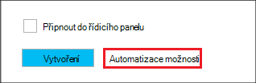

<properties
   pageTitle="Vytvoření na základě Linux Hadoop clusterů v používání šablon správce prostředků Azure HDInsight | Microsoft Azure"
    description="Naučte se vytvářet clusterů pro Azure Hdinsightu pomocí Správce prostředků Azure Azure šablon."
   services="hdinsight"
   documentationCenter=""
   tags="azure-portal"
   authors="mumian"
   manager="jhubbard"
   editor="cgronlun"/>

<tags
   ms.service="hdinsight"
   ms.devlang="na"
   ms.topic="article"
   ms.tgt_pltfrm="na"
   ms.workload="big-data"
   ms.date="09/02/2016"
   ms.author="jgao"/>

# Vytvoření na základě Linux Hadoop clusterů v používání šablon správce prostředků Azure HDInsight

[AZURE.INCLUDE [selector](../../includes/hdinsight-selector-create-clusters.md)]

Naučte se vytvářet pomocí šablon Manager(ARM) zdroje Azure HDInsight clusterů. Další informace najdete v tématu [nasazení aplikace šablonou správce prostředků Azure](../resource-group-template-deploy.md). Vytváření jiných clusteru nástrojů a funkcí, a klikněte na kartu horní části této stránky nebo si přečtěte [způsobů vytvoření obrázku](hdinsight-provision-clusters.md#cluster-creation-methods).

##Požadavky:

[AZURE.INCLUDE [delete-cluster-warning](../../includes/hdinsight-delete-cluster-warning.md)]

Než začnete pokyny v tomto článku, musíte mít takto:

- [Azure předplatného](https://azure.microsoft.com/documentation/videos/get-azure-free-trial-for-testing-hadoop-in-hdinsight/).
- Azure prostředí PowerShell nebo Azure rozhraní příkazového řádku

    [AZURE.INCLUDE [use-latest-version](../../includes/hdinsight-use-latest-powershell-and-cli.md)]

### Požadavky na řízení přístupu

[AZURE.INCLUDE [access-control](../../includes/hdinsight-access-control-requirements.md)]

## Správce prostředků šablony

Správce prostředků šablony usnadňuje vytváření HDInsight clusterů, jejich závislé prostředky (například výchozí úložiště účet) a další zdroje (například databáze SQL Azure používat Apache Sqoop) aplikace v operaci jediné, koordinovaný. V šabloně definujte zdroje, které jsou potřebné pro aplikace a zadejte parametry nasazení zadat hodnoty na jiném prostředí. Šablona se skládá z JSON a výrazy, které můžete použít k vytvoření hodnoty pro nasazení.

Správce prostředků šablony pro vytváření HDInsight obrázku a závislá účet Azure úložiště naleznete v [Dodatku A](#appx-a-arm-template). Pomocí různé platformy [VSCode](https://code.visualstudio.com/#alt-downloads) [příponu správce prostředků](https://marketplace.visualstudio.com/items?itemName=msazurermtools.azurerm-vscode-tools) nebo textovém editoru šablonu uložte do souboru na počítači. Naučíte se jak volat šabloně různými způsoby.

Další informace o šabloně správce prostředků najdete v tématu

- [Autor správce prostředků Azure šablony](../resource-group-authoring-templates.md)
- [Nasazení aplikace šablonou správce prostředků Azure](../resource-group-template-deploy.md)

Pokud chcete zjistit, schématu JSON pro některé prvky, můžete postupujte následujícím způsobem:

1. Otevřete [portál Azure](https://porta.azure.com) k vytvoření clusteru HDInsight.  V tématu [Vytvoření Linux založené clusterů v portálu Azure HDInsight](hdinsight-hadoop-create-linux-clusters-portal.md).
2. Konfigurace požadované prvky a prvky potřebujete schématu JSON.
3. Před kliknutím na **vytvořit**, klikněte na **Možnosti automatizace** , jak je vidět na následující snímek obrazovky:

    

    Na portálu vytvoří šablonu správce prostředků podle konfigurace.
## Nasazení pomocí prostředí PowerShell

Následující postup vytvoří na základě Linux HDInsight obrázku.

**Chcete-li nasadit clusteru pomocí šablony správce prostředků**

1. Uložte soubor json v [dodatku A](#appx-a-arm-template) na počítači. V části skript Powershellu název souboru je *C:\HDITutorials-ARM\hdinsight-arm-template.json*.
2. Nastavení parametrů a proměnných v případě potřeby.
3. Spusťte šablony pomocí tento skript Powershellu:

        ####################################
        # Set these variables
        ####################################
        #region - used for creating Azure service names
        $nameToken = "<Enter an Alias>" 
        $templateFile = "C:\HDITutorials-ARM\hdinsight-arm-template.json"
        #endregion

        ####################################
        # Service names and varialbes
        ####################################
        #region - service names
        $namePrefix = $nameToken.ToLower() + (Get-Date -Format "MMdd")

        $resourceGroupName = $namePrefix + "rg"
        $hdinsightClusterName = $namePrefix + "hdi"
        $defaultStorageAccountName = $namePrefix + "store"
        $defaultBlobContainerName = $hdinsightClusterName

        $location = "East US 2"

        $armDeploymentName = $namePrefix
        #endregion

        ####################################
        # Connect to Azure
        ####################################
        #region - Connect to Azure subscription
        Write-Host "`nConnecting to your Azure subscription ..." -ForegroundColor Green
        try{Get-AzureRmContext}
        catch{Login-AzureRmAccount}
        #endregion

        # Create a resource group
        New-AzureRmResourceGroup -Name $resourceGroupName -Location $Location

        # Create cluster and the dependent storage accounge
        $parameters = @{clusterName="$hdinsightClusterName"}

        New-AzureRmResourceGroupDeployment `
            -Name $armDeploymentName `
            -ResourceGroupName $resourceGroupName `
            -TemplateFile $templateFile `
            -TemplateParameterObject $parameters

        # List cluster
        Get-AzureRmHDInsightCluster -ResourceGroupName $resourceGroupName -ClusterName $hdinsightClusterName 

    Skript Powershellu pouze nakonfiguruje název obrázku. Název účtu úložiště je pevně kódovaná v šabloně. Zobrazí se výzva k zadání hesla uživatele obrázku (výchozí uživatelské jméno je *Správce*); a heslo uživatele SSH (výchozí SSH uživatelské jméno je *sshuser*).  
    
Další informace najdete v tématu [nasazení pomocí prostředí PowerShell](../resource-group-template-deploy.md#deploy-with-powershell).

## Nasazení s Azure rozhraní příkazového řádku

Následujícím příkladu je vytvořeno clusteru a jeho závislá úložiště účtu a kontejneru tak, že zavoláte správce prostředků šablony:

    azure login
    azure config mode arm
    azure group create -n hdi1229rg -l "East US"
    azure group deployment create --resource-group "hdi1229rg" --name "hdi1229" --template-file "C:\HDITutorials-ARM\hdinsight-arm-template.json"
    
Zobrazí se výzva k zadání názvu clusteru, heslo uživatele obrázku (výchozí uživatelské jméno je *Správce*) a heslo uživatele SSH (výchozí SSH uživatelské jméno je *sshuser*). Poskytovat parametry v řádku:

    azure group deployment create --resource-group "hdi1229rg" --name "hdi1229" --template-file "c:\Tutorials\HDInsightARM\create-linux-based-hadoop-cluster-in-hdinsight.json" --parameters '{\"clusterName\":{\"value\":\"hdi1229\"},\"clusterLoginPassword\":{\"value\":\"Pass@word1\"},\"sshPassword\":{\"value\":\"Pass@word1\"}}'

## Nasazení pomocí rozhraní REST API

V tématu [nasazení pomocí rozhraní REST API](../resource-group-template-deploy.md#deploy-with-the-rest-api).

## Nasazení aplikace Visual Studio

Pomocí aplikace Visual Studio můžete vytvořit projekt skupiny zdrojů a ho nasadit do Azure prostřednictvím uživatelského rozhraní. Vyberte typ zdroje, chcete-li vložit do projektu a zdroje se automaticky přidají do šablony správce prostředků. Projekt také poskytuje skript Powershellu zavést šablonu.

Úvod do používání aplikace Visual Studio se skupinami zdrojů najdete v článku [Vytvoření a nasazení Azure zdroje skupiny pomocí aplikace Visual Studio](../vs-azure-tools-resource-groups-deployment-projects-create-deploy.md).

##Další kroky
V tomto článku jste se naučili HDInsight clusteru vytvářet několika různými způsoby. Další informace naleznete v následujících článcích:

- Příklad nasazení prostředků přes klienta knihovnu .NET najdete v článku [nasazení zdrojů pomocí knihoven .NET a šablony](../virtual-machines/virtual-machines-windows-csharp-template.md).
- Příklad hloubkovou nasazení aplikace v tématu [poskytování a nasazení microservices předvídatelností v Azure](../app-service-web/app-service-deploy-complex-application-predictably.md).
- Nasazení řešení různých prostředích, najdete v článku [test prostředí v Microsoft Azure a vývoj](../solution-dev-test-environments.md).
- Další informace o v částech šablony správce prostředků Azure, najdete v článku [vytváření šablon](../resource-group-authoring-templates.md).
- Seznam funkce, které můžete použít v šabloně aplikace Správce prostředků Azure najdete v tématu [funkce šablony](../resource-group-template-functions.md).

##Správce prostředků aplikace A: šablony

Následující šablonu správce prostředků Azure vytvoří na základě Linux Hadoop obrázku s účtem závislá Azure úložiště. 

> [AZURE.NOTE] Vzorku obsahuje informace o konfiguraci podregistru metastore a Oozie metastore.  Odebrání oddílu nebo konfigurace oddílu před pomocí šablony.

    {
    "$schema": "https://schema.management.azure.com/schemas/2015-01-01/deploymentTemplate.json#",
    "contentVersion": "1.0.0.0",
    "parameters": {
        "clusterName": {
        "type": "string",
        "metadata": {
            "description": "The name of the HDInsight cluster to create."
        }
        },
        "clusterLoginUserName": {
        "type": "string",
        "defaultValue": "admin",
        "metadata": {
            "description": "These credentials can be used to submit jobs to the cluster and to log into cluster dashboards."
        }
        },
        "clusterLoginPassword": {
        "type": "securestring",
        "metadata": {
            "description": "The password must be at least 10 characters in length and must contain at least one digit, one non-alphanumeric character, and one upper or lower case letter."
        }
        },
        "sshUserName": {
        "type": "string",
        "defaultValue": "sshuser",
        "metadata": {
            "description": "These credentials can be used to remotely access the cluster."
        }
        },
        "sshPassword": {
        "type": "securestring",
        "metadata": {
            "description": "The password must be at least 10 characters in length and must contain at least one digit, one non-alphanumeric character, and one upper or lower case letter."
        }
        },
        "location": {
        "type": "string",
        "defaultValue": "East US",
        "allowedValues": [
            "East US",
            "East US 2",
            "North Central US",
            "South Central US",
            "West US",
            "North Europe",
            "West Europe",
            "East Asia",
            "Southeast Asia",
            "Japan East",
            "Japan West",
            "Australia East",
            "Australia Southeast"
        ],
        "metadata": {
            "description": "The location where all azure resources will be deployed."
        }
        },
        "clusterType": {
        "type": "string",
        "defaultValue": "hadoop",
        "allowedValues": [
            "hadoop",
            "hbase",
            "storm",
            "spark"
        ],
        "metadata": {
            "description": "The type of the HDInsight cluster to create."
        }
        },
        "clusterWorkerNodeCount": {
        "type": "int",
        "defaultValue": 2,
        "metadata": {
            "description": "The number of nodes in the HDInsight cluster."
        }
        }
    },
    "variables": {
        "defaultApiVersion": "2015-05-01-preview",
        "clusterApiVersion": "2015-03-01-preview",
        "clusterStorageAccountName": "[concat(parameters('clusterName'),'store')]"
    },
    "resources": [
        {
        "name": "[variables('clusterStorageAccountName')]",
        "type": "Microsoft.Storage/storageAccounts",
        "location": "[parameters('location')]",
        "apiVersion": "[variables('defaultApiVersion')]",
        "dependsOn": [ ],
        "tags": { },
        "properties": {
            "accountType": "Standard_LRS"
        }
        },
        {
        "name": "[parameters('clusterName')]",
        "type": "Microsoft.HDInsight/clusters",
        "location": "[parameters('location')]",
        "apiVersion": "[variables('clusterApiVersion')]",
        "dependsOn": [ "[concat('Microsoft.Storage/storageAccounts/',variables('clusterStorageAccountName'))]" ],
        "tags": {

        },
        "properties": {
            "clusterVersion": "3.4",
            "osType": "Linux",
            "tier": "standard",
            "clusterDefinition": {
            "kind": "[parameters('clusterType')]",
            "configurations": {
                "gateway": {
                "restAuthCredential.isEnabled": true,
                "restAuthCredential.username": "[parameters('clusterLoginUserName')]",
                "restAuthCredential.password": "[parameters('clusterLoginPassword')]"
                },
                "hive-site": {
                    "javax.jdo.option.ConnectionDriverName": "com.microsoft.sqlserver.jdbc.SQLServerDriver",
                    "javax.jdo.option.ConnectionURL": "jdbc:sqlserver://myadla0901dbserver.database.windows.net;database=myhive20160901;encrypt=true;trustServerCertificate=true;create=false;loginTimeout=300",
                    "javax.jdo.option.ConnectionUserName": "johndole",
                    "javax.jdo.option.ConnectionPassword": "myPassword$"
                },
                "hive-env": {
                    "hive_database": "Existing MSSQL Server database with SQL authentication",
                    "hive_database_name": "myhive20160901",
                    "hive_database_type": "mssql",
                    "hive_existing_mssql_server_database": "myhive20160901",
                    "hive_existing_mssql_server_host": "myadla0901dbserver.database.windows.net",
                    "hive_hostname": "myadla0901dbserver.database.windows.net"
                },
                "oozie-site": {
                    "oozie.service.JPAService.jdbc.driver": "com.microsoft.sqlserver.jdbc.SQLServerDriver",
                    "oozie.service.JPAService.jdbc.url": "jdbc:sqlserver://myadla0901dbserver.database.windows.net;database=myhive20160901;encrypt=true;trustServerCertificate=true;create=false;loginTimeout=300",
                    "oozie.service.JPAService.jdbc.username": "johndole",
                    "oozie.service.JPAService.jdbc.password": "myPassword$",
                    "oozie.db.schema.name": "oozie"
                },
                "oozie-env": {
                    "oozie_database": "Existing MSSQL Server database with SQL authentication",
                    "oozie_database_name": "myhive20160901",
                    "oozie_database_type": "mssql",
                    "oozie_existing_mssql_server_database": "myhive20160901",
                    "oozie_existing_mssql_server_host": "myadla0901dbserver.database.windows.net",
                    "oozie_hostname": "myadla0901dbserver.database.windows.net"
                }            
            }
            },
            "storageProfile": {
            "storageaccounts": [
                {
                "name": "[concat(variables('clusterStorageAccountName'),'.blob.core.windows.net')]",
                "isDefault": true,
                "container": "[parameters('clusterName')]",
                "key": "[listKeys(resourceId('Microsoft.Storage/storageAccounts', variables('clusterStorageAccountName')), variables('defaultApiVersion')).key1]"
                }
            ]
            },
            "computeProfile": {
            "roles": [
                {
                "name": "headnode",
                "targetInstanceCount": "2",
                "hardwareProfile": {
                    "vmSize": "Standard_D3"
                },
                "osProfile": {
                    "linuxOperatingSystemProfile": {
                    "username": "[parameters('sshUserName')]",
                    "password": "[parameters('sshPassword')]"
                    }
                }
                },
                {
                "name": "workernode",
                "targetInstanceCount": "[parameters('clusterWorkerNodeCount')]",
                "hardwareProfile": {
                    "vmSize": "Standard_D3"
                },
                "osProfile": {
                    "linuxOperatingSystemProfile": {
                    "username": "[parameters('sshUserName')]",
                    "password": "[parameters('sshPassword')]"
                    }
                }
                }
            ]
            }
        }
        }
    ],
    "outputs": {
        "cluster": {
        "type": "object",
        "value": "[reference(resourceId('Microsoft.HDInsight/clusters',parameters('clusterName')))]"
        }
    }
    }
