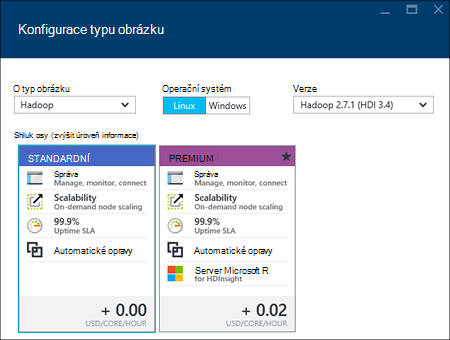

<properties
    pageTitle="Vytvoření Hadoop, HBase, bouře nebo Spark clusterů na Linux v HDInsight pomocí portálu | Microsoft Azure"
    description="Naučte se vytvářet Hadoop, HBase, bouře nebo Spark clusterů na Linux pro HDInsight pomocí webového prohlížeče a portálu Azure náhled."
    services="hdinsight"
    documentationCenter=""
    authors="nitinme"
    manager="jhubbard"
    editor="cgronlun"
    tags="azure-portal"/>

<tags
    ms.service="hdinsight"
    ms.devlang="na"
    ms.topic="article"
    ms.tgt_pltfrm="na"
    ms.workload="big-data"
    ms.date="10/05/2016"
    ms.author="nitinme"/>

#Vytvoření na základě Linux clusterů v portálu Azure HDInsight

[AZURE.INCLUDE [selector](../../includes/hdinsight-selector-create-clusters.md)]

Azure portál je nástroje pro správu webové služby a zdroje hostované v cloudu společnosti Microsoft Azure. V tomto článku se dozvíte, jak vytvořit na základě Linux HDInsight clusterů na portálu.

## Zjistit předpoklady pro

[AZURE.INCLUDE [delete-cluster-warning](../../includes/hdinsight-delete-cluster-warning.md)]

- **Azure předplatného**. Viz [získání Azure bezplatnou zkušební verzi](https://azure.microsoft.com/documentation/videos/get-azure-free-trial-for-testing-hadoop-in-hdinsight/).
- __Moderní webového prohlížeče__. Portál Azure používá HTML5 a Javascript a nemusí fungovat správně starší verze webových prohlížečů.

### Požadavky na řízení přístupu

[AZURE.INCLUDE [access-control](../../includes/hdinsight-access-control-requirements.md)]

##Vytvoření clusterů

Portál Azure zpřístupňuje většina vlastností obrázku. Pomocí Správce prostředků Azure šablony můžete skrýt spoustu podrobnosti. Další informace najdete v tématu [na základě vytvořit Linux Hadoop clusterů v používání šablon správce prostředků Azure HDInsight](hdinsight-hadoop-create-linux-clusters-arm-templates.md).

1. Přihlaste se k [portálu Azure](https://portal.azure.com).

2. Klikněte na **Nový**, klikněte na **Analýza dat**a potom klikněte na **HDInsight**.

    ![Vytvoření nového obrázku na portálu Azure] (./media/hdinsight-hadoop-create-linux-cluster-portal/HDI.CreateCluster.1.png "Vytvoření nového obrázku na portálu Azure")
3. Zadejte **Název clusteru**: Tento název musí být jedinečné.
4. Klikněte na **Výběr obrázku typ**a vyberte:

    - **Typ obrázku**: Pokud nevíte, co chcete-li zvolit, vyberte **Hadoop**. Je nejoblíbenější typ obrázku.

        > [AZURE.IMPORTANT] HDInsight clusterů mohou mít různé typy, které odpovídají pracovní zátěž nebo technologii clusteru optimalizovaných pro. Neexistuje žádná podporované metoda k vytvoření obrázku, který kombinuje více typů, například bouře a HBase na jednoho obrázku. 

    - **Operační systém**: vyberte **Linux**.
    - **Verze**: Pokud nevíte, co chcete použít na výchozí verzi. Další informace najdete v tématu [verze obrázku HDInsight](hdinsight-component-versioning.md).
    - **Shluk osy**: Azure HDInsight obsahuje nabídky cloudu velký dat ve dvou kategorií: standardní osy a Premium osy. Další informace najdete v tématu [úrovní obrázku](hdinsight-hadoop-provision-linux-clusters.md#cluster-tiers).
    
    

4. Klikněte na **předplatné** vyberte Azure předplatné, které bude sloužit k clusteru.

5. Klikněte na **Pole Skupina zdroje** , které chcete vybrat existující skupiny zdrojů, nebo klikněte na **Nový** k vytvoření nové skupiny prostředků

    > [AZURE.NOTE] Tato položka je výchozí nastavení jednu z existující skupiny zdrojů, pokud budou k dispozici.

6. Klikněte na **přihlašovací údaje** a pak zadejte heslo pro správu uživatelů. Také je nutné zadat **Jména SSH** a buď **heslo** nebo **VEŘEJNÝM klíčem**, který se použijí k ověření uživatele SSH. Použití veřejným klíčem je doporučený postup. V dolní části uložení konfigurace přihlašovacích údajů klikněte na **Výběr** .

    ![Poskytnutí clusteru pověření] (./media/hdinsight-hadoop-create-linux-cluster-portal/HDI.CreateCluster.3.png "Poskytnutí clusteru pověření")

    Další informace o použití SSH s Hdinsightu najdete v následujících článcích:

    * [Použití SSH s bázi Linux Hadoop na HDInsight z Linux, Unix nebo OS X](hdinsight-hadoop-linux-use-ssh-unix.md)
    * [Použití SSH s Hadoop Linux založené na HDInsight z Windows](hdinsight-hadoop-linux-use-ssh-windows.md)

7. Klikněte na **Zdroje dat** vyberte existujícího zdroje dat pro cluster nebo vytvořte nový účet.

    ![Zásuvné zdroje dat] (./media/hdinsight-hadoop-create-linux-cluster-portal/HDI.CreateCluster.4.png "Konfigurace zdrojů dat obsahuje")

    Nyní můžete vybrat účet Azure úložiště jako zdroj dat pro HDInsight obrázku. Principy položky na zásuvné **Zdroj dat** pomocí následující.

    - **Výběr metody**: nastavte **ze všech předplatných** povolení procházení úložiště účtů Všechna předplatná. Pokud chcete zadat **Název úložiště** a **Přístupové klávesy** existujícího účtu úložiště, nastavte **Přístupová klávesa** to.

    - **Vyberte účet úložiště / nové**: klikněte na Procházet a vyberte existující účet úložiště chcete přidružit k clusteru **Vyberte účet úložiště** . Nebo klikněte na **Nový** vytvořte nový účet úložiště. Pomocí pole, které se objeví zadejte název účtu úložiště. Zelené zaškrtnutí se zobrazí, pokud je k dispozici v poli název.

    - **Vyberte výchozí kontejner**: slouží k zadejte jméno container výchozí pro účely clusteru. Můžete zadat libovolný název, doporučujeme použít stejný název jako clusteru tak, aby si snadno zapamatujete kontejneru se používá k této konkrétní obrázku.

    - **Umístění**: zeměpisná oblast účtu úložiště je v, nebo se vytvoří v.

        > [AZURE.IMPORTANT] Výběr umístění zdroje dat výchozí také nastavit umístění obrázku HDInsight. Zdroj dat obrázku a výchozí musí být umístěné ve stejné oblasti.
        
    - **Shluk AAD Identity**: nakonfigurováním ho můžete zpřístupnit clusteru úložišti jezera dat Azure podle konfigurace AAD.

    Klikněte na Uložit nastavení zdroje dat **Vyberte** .

8. Klikněte na **Uzel ceny úrovní** k zobrazení informací o vytvořené pro tento cluster uzlů. Nastavte počtu uzlů pracovní, které potřebujete pro clusteru. Odhad nákladů clusteru zobrazí v zásuvné.

    ![Ceny zásuvné úrovní uzel] (./media/hdinsight-hadoop-create-linux-cluster-portal/HDI.CreateCluster.5.png "Určení počtu uzlů obrázku")
    
    > [AZURE.IMPORTANT] Pokud máte v plánu na víc než 32 pracovníka se při vytvoření obrázku nebo roztažením clusteru po vytvoření, je nutné vybrat velikostí hlavy uzel s 14GB paměti ram a alespoň na úrovni 8 jádra.
    >
    > Další informace o velikosti uzel a související náklady najdete v článku [ceny HDInsight](https://azure.microsoft.com/pricing/details/hdinsight/).

    Kliknutím na tlačítko Uložit uzel ceny konfigurace **Vyberte** .

9. Klikněte na **Volitelná konfigurace** vyberte verzi obrázku i konfigurovat další volitelná nastavení, například připojení **Virtuální sítě**, nastavení **Externího Metastore** pro uložení dat podregistru a Oozie, přizpůsobení clusteru k instalaci volitelných součástí pomocí skriptu akcí, nebo použití účty další úložiště s clusteru.

    * **Virtuální sítě**: Vyberte Azure virtuální sítě a podsítí, pokud chcete umístit obrázku do virtuálního sítě.  

        ![Virtuální sítě zásuvné] (./media/hdinsight-hadoop-create-linux-cluster-portal/HDI.CreateCluster.6.png "Zadejte podrobnosti virtuální sítě")

        Informace o použití HDInsight s virtuální sítě, včetně konkrétní konfigurace požadavky pro virtuální sítě najdete v článku [funkce rozšíření HDInsight pomocí virtuální sítě Azure](hdinsight-extend-hadoop-virtual-network.md).

    * Klikněte na **Externí Metastores** určit databáze SQL, který chcete použít k uložení přidružená clusteru podregistru a Oozie metadata.
    
        > [AZURE.NOTE] Konfigurace Metastore není k dispozici pro typy HBase obrázku.

        ![Vlastní metastores zásuvné] (./media/hdinsight-hadoop-create-linux-cluster-portal/HDI.CreateCluster.7.png "Externí metastores zadat")

        Pro **použití existující databáze SQL pro podregistru** metadata klikněte na **Ano**, vyberte databázi SQL a zadání uživatelského jména a hesla pro databázi. Pokud chcete **použít existující databáze SQL pro Oozie metadata**, opakujte tyto kroky. Klikněte na **Výběr** , dokud se zase na zásuvné **Volitelná konfigurace** .

        >[AZURE.NOTE] Databáze Azure SQL sloužící k metastore musí povolit připojení k další Azure služby, třeba Azure HDInsight. Na řídicím databáze Azure SQL, na pravé straně klikněte na název serveru. Toto je serveru, na kterém běží instanci systému SQL databáze. Jednou jsou na serveru zobrazení, klikněte na **Konfigurovat**a **Služby Azure**, klikněte na **Ano**a potom klikněte na **Uložit**.

        &nbsp;

        > [AZURE.IMPORTANT] Při vytváření metastore, nepoužívejte název databáze, který obsahuje typ čáry nebo spojovníky, protože to může způsobovat proces vytváření clusteru selhání.

    * **Akce skriptu** Pokud chcete použít vlastní skript k přizpůsobení clusteru, jako clusteru je vzniku. Další informace o skript akce najdete v článku [přizpůsobení HDInsight clusterů pomocí skriptu akce](hdinsight-hadoop-customize-cluster-linux.md). Na zásuvné akce skriptu zadejte podrobnosti uvedeno v snímek obrazovky.

        ![Skript akce zásuvné] (./media/hdinsight-hadoop-create-linux-cluster-portal/HDI.CreateCluster.8.png "Určení skript akce")

    * Klikněte na **Propojené účty úložiště** účty další úložiště, ke kterému chcete přidružit clusteru. V zásuvné **Azure úložiště klávesy** klikněte na **Přidat klíč úložiště**, vyberte existující účet úložiště nebo vytvořte nový účet.

        ![Další úložiště zásuvné] (./media/hdinsight-hadoop-create-linux-cluster-portal/HDI.CreateCluster.9.png "Zadejte další úložiště účty")

        Můžete taky přidat další úložiště účty po vytvoření clusteru.  V tématu [clusterů na základě přizpůsobení Linux HDInsight pomocí skriptu akce](hdinsight-hadoop-customize-cluster-linux.md).

        Dokud se zase na zásuvné **nové HDInsight obrázku** , klikněte na **Výběr** .
        
        Kromě účtu úložiště objektů Blob můžete také propojit jezera dat Azure stores. Konfigurace může být podle konfigurace AAD ze zdroje dat, které jste nakonfigurovali výchozí úložiště klienta a výchozí kontejner.

10. Na zásuvné **Nového clusteru HDInsight** zajistit, že **kód Pin pro Startboard** zaškrtnuté a klikněte na **vytvořit**. Tím vytvoříte clusteru a přidání dlaždice pro něj Startboard portálu Azure. Na ikonu výskyt znamená, že je zřizování clusteru a změní zobrazit ikonu HDInsight po zřízení.

  	| Při vytváření | Zřízení dokončení |
  	| ------------------ | --------------------- |
  	|  |  |

    > [AZURE.NOTE] Bude trvat delší dobu clusteru vytvořit, obvykle asi 15 minut. Použití dlaždice na Startboard nebo položce **oznámení** na levé straně stránky informace o vytváření obrázku.

11. Po dokončení procesu vytváření klikněte na dlaždici pro obrázku z Startboard spuštění zásuvné obrázku. Zásuvné clusteru obsahuje základní informace o obrázku jako je název, do kterých patří do skupiny zdrojů umístění operačního systému, adresa URL obrázku řídicích panelů, atd.

    ![Zásuvné obrázku] (./media/hdinsight-hadoop-create-linux-cluster-portal/HDI.Cluster.Blade.png "Vlastnosti obrázku")

    Použijte následující porozumět ikony v horní části tohoto zásuvné a v části **Základy** :

    * **Nastavení** a **Všechna nastavení**: Zobrazí zásuvné **Nastavení** pro obrázku, který umožňuje přístup k podrobné informace o konfiguraci clusteru.

    * **Řídicí panel**, **Řídicího panelu obrázku**a **adresu URL**: Toto jsou všechny možnosti přístupu k řídicím panelu obrázku, který je Web portálu spustit úlohy na clusteru.

    * **Zabezpečené prostředí**: informace potřebné pro přístup k clusteru pomocí SSH.

    * **Odstranit**: Odstraní clusteru HDInsight.

    * **Rychlý úvod** (): Zobrazí informace, které vám pomohou začít používat HDInsight.

    * **Uživatelé** (): umožňuje nastavit oprávnění pro _portálu správy_ tohoto clusteru pro jiné uživatele předplatného Azure.

        > [AZURE.IMPORTANT] Tento _pouze_ ovlivňuje přístup a oprávnění na tomto obrázku na portálu Azure a nemá žádný vliv na kdo ho může připojit k nebo odeslat úlohy clusteru HDInsight.

    * **Značky** (): značky můžete nastavit klíč/dvojice definovat vlastní taxonomie cloudovým službám. Může například vytvořit klíč s názvem __projektu__a potom použijete se společnou hodnotou pro všechny služby související s projektem konkrétní.

##Přizpůsobení clusterů

- V tématu [použití zavádění clusterů přizpůsobení HDInsight](hdinsight-hadoop-customize-cluster-bootstrap.md).
- V tématu [clusterů na základě přizpůsobení Linux HDInsight pomocí skriptu akce](hdinsight-hadoop-customize-cluster-linux.md).

##Odstranění clusteru

[AZURE.INCLUDE [delete-cluster-warning](../../includes/hdinsight-delete-cluster-warning.md)]

##Další kroky

Teď úspěšně jste vytvořili HDInsight obrázku, použijte následující postup, jak pracovat s svůj cluster:

###Hadoop clusterů

* [Použití podregistru s HDInsight](hdinsight-use-hive.md)
* [Použití Prasátko s HDInsight](hdinsight-use-pig.md)
* [Použití MapReduce s HDInsight](hdinsight-use-mapreduce.md)

###HBase clusterů

* [Začínáme s HBase na HDInsight](hdinsight-hbase-tutorial-get-started-linux.md)
* [Můžete vyvíjet aplikace Java pro HBase na HDInsight](hdinsight-hbase-build-java-maven-linux.md)

###Bouře clusterů

* [Můžete vyvíjet Java topologie pro bouře na HDInsight](hdinsight-storm-develop-java-topology.md)
* [Použití Python součástí bouře na HDInsight](hdinsight-storm-develop-python-topology.md)
* [Nasazení a sledovat topologií s bouře na HDInsight](hdinsight-storm-deploy-monitor-topology-linux.md)

###Spark clusterů

* [Vytvoření samostatného aplikace pomocí Scala](hdinsight-apache-spark-create-standalone-application.md)
* [Spuštění úlohy vzdáleně Spark clusteru pomocí Livius](hdinsight-apache-spark-livy-rest-interface.md)
* [Spark s BI: Analýza interaktivní dat pomocí Spark v HDInsight nástrojích BI](hdinsight-apache-spark-use-bi-tools.md)
* [Spark s výukové počítače: použití Spark v HDInsight odhadnout výsledků kontroly jídla](hdinsight-apache-spark-machine-learning-mllib-ipython.md)
* [Datových proudů Spark: Použití Spark v HDInsight vytvářet v reálném čase streamování aplikace](hdinsight-apache-spark-eventhub-streaming.md)
