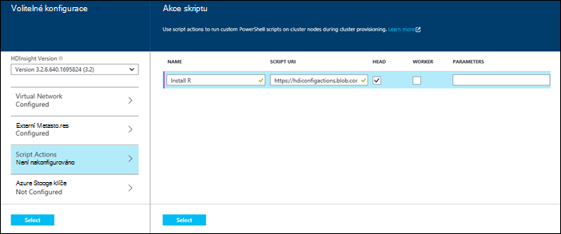
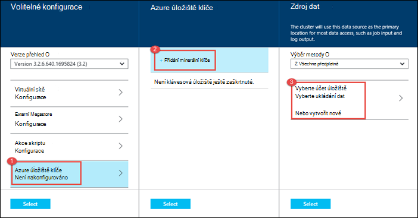

<properties
   pageTitle="Vytvoření Hadoop clusterů v HDInsight | Microsoft Azure"
    description="Naučte se vytvářet clusterů pro Azure Hdinsightu pomocí portálu Azure."
   services="hdinsight"
   documentationCenter=""
   tags="azure-portal"
   authors="mumian"
   manager="jhubbard"
   editor="cgronlun"/>

<tags
   ms.service="hdinsight"
   ms.devlang="na"
   ms.topic="article"
   ms.tgt_pltfrm="na"
   ms.workload="big-data"
   ms.date="09/02/2016"
   ms.author="jgao"/>

# Vytvoření serveru s Windows Hadoop clusterů v portálu Azure HDInsight

[AZURE.INCLUDE [selector](../../includes/hdinsight-selector-create-clusters.md)]

Naučte se vytvářet Hadoop obrázku v portálu Azure HDInsight. Microsoft [Azure portál](../azure-portal-overview.md) je centrální místo, kde můžete vytvořit a spravovat Azure zdroje. Azure portál je jednou z nástroje, které můžete použít k vytvoření clusteru Hadoop založené na Linux nebo serveru s Windows v HDInsight. Vytváření jiných clusteru nástrojů a funkcí, a klikněte na kartu horní části této stránky nebo si přečtěte [způsobů vytvoření obrázku](hdinsight-provision-clusters.md#cluster-creation-methods).

##Požadavky:

[AZURE.INCLUDE [delete-cluster-warning](../../includes/hdinsight-delete-cluster-warning.md)]

Než začnete pokyny v tomto článku, musíte mít takto:

- Předplatné Azure. Viz [získání Azure bezplatnou zkušební verzi](https://azure.microsoft.com/documentation/videos/get-azure-free-trial-for-testing-hadoop-in-hdinsight/).

### Požadavky na řízení přístupu

[AZURE.INCLUDE [access-control](../../includes/hdinsight-access-control-requirements.md)]

## Vytvoření clusterů

**K vytvoření clusteru HDInsight**

1. Přihlaste se k [portálu Azure](https://portal.azure.com).
2. Klikněte na **Nový**, klikněte na **Analýza dat**a potom klikněte na **HDInsight**.

    ![Vytvoření nového obrázku na portálu Azure] (./media/hdinsight-provision-clusters/HDI.CreateCluster.1.png "Vytvoření nového obrázku na portálu Azure")

3. Zadejte nebo vyberte následující hodnoty:

    * **Shluk název**: Zadejte název clusteru. Zelené zaškrtnutí se zobrazí vedle názvu clusteru, pokud je k dispozici v poli název.

    * **Typ obrázku**: vyberte **Hadoop**. Další možnosti inclue **HBase** **bouře**a **Spark**.

        > [AZURE.IMPORTANT] HDInsight clusterů mohou mít různé typy, které odpovídají pracovní zátěž nebo technologii clusteru optimalizovaných pro. Neexistuje žádná podporovaných metoda k vytvoření obrázku, který kombinuje více typů, například bouře a HBase jeden clusteru.

    * **Shluk operační systém**: vyberte **systému Windows**. Vytvoření základní Linux clusteru, vyberte **Linux**.
    * **Verze**: Podívejte se na [verze HDInsight](hdinsight-component-versioning.md).
    * **Předplatné**: Vyberte Azure předplatné, které bude sloužit k vytváření tomto obrázku.
    * **Pole Skupina zdroje**: vyberte stávající nebo vytvořte nové skupiny prostředků. Tato položka je výchozí nastavení jednu z existující skupiny zdrojů, pokud budou k dispozici.
    * **Pověření**: konfigurace uživatelské jméno a heslo uživatele Hadoop (HTTP uživatel). Pokud povolíte vzdálená plocha clusteru, musíte nakonfigurovat vzdálené plochy uživatele uživatelské jméno a heslo a datum vypršení platnosti účtu. **Vyberte** pod klikněte na Uložit změny.

        ![Poskytnutí clusteru pověření] (./media/hdinsight-provision-clusters/HDI.CreateCluster.3.png "Poskytnutí clusteru pověření")

    * **Zdroje dat**: Vytvořte novou nebo vybrat stávající účet Azure úložiště a použít jako výchozí systém souborů pro clusteru.

        ![Zásuvné zdroje dat] (./media/hdinsight-provision-clusters/HDI.CreateCluster.4.png "Zdroje dat poskytněte konfigurace")

        * **Výběr metody**: nastavte **ze všech předplatných** povolení procházení úložiště účtů Všechna předplatná. Pokud chcete zadat **Název úložiště** a **Přístupové klávesy** existujícího účtu úložiště, nastavte **Přístupová klávesa** to.
        * **Vyberte účet úložiště / vytvořit nové**: klikněte na Procházet a vyberte existující účet úložiště chcete přidružit k clusteru **Vyberte účet úložiště** . Nebo klikněte na **Vytvořit nový** , vytvořte nový účet úložiště. Pomocí pole, které se objeví zadejte název účtu úložiště. Zelené zaškrtnutí se zobrazí, pokud je k dispozici v poli název.
        * **Vyberte výchozí kontejner**: slouží k zadejte jméno container výchozí pro účely clusteru. Můžete zadat libovolný název, doporučujeme použít stejný název jako clusteru tak, aby si snadno zapamatujete kontejneru se používá k této konkrétní obrázku.
        * **Umístění**: zeměpisná oblast účtu úložiště je v, nebo se vytvoří v. Toto umístění určí umístění obrázku.  Clusteru a jeho výchozí úložiště účet musíte spoluvytváření vyhledat ve stejném Azure datovém centru.
    
    * **Uzel ceny úrovní**: nastavte počet uzlů pracovníka, které potřebujete pro clusteru. Odhad nákladů clusteru zobrazí v zásuvné.
  

        ![Ceny zásuvné úrovní uzel] (./media/hdinsight-provision-clusters/HDI.CreateCluster.5.png "Určení počtu uzlů obrázku")

    * **Volitelné konfigurace** vyberte verzi obrázku i konfigurovat další volitelná nastavení, například připojení **Virtuální sítě**, nastavte si **Externí Metastore** pro uložení dat pro podregistru a Oozie, pomocí skriptu akce můžete přizpůsobit clusteru k instalaci volitelných součástí nebo použijte účty další úložiště s clusteru.

    * **HDInsight verze**: Zvolte verzi, kterou chcete použít pro clusteru. Další informace najdete v tématu [verze obrázku HDInsight](hdinsight-component-versioning.md).
    * **Virtuální sítě**: Vyberte Azure virtuální sítě a podsítí, pokud chcete umístit obrázku do virtuálního sítě.  

        ![Virtuální sítě zásuvné] (./media/hdinsight-provision-clusters/HDI.CreateCluster.6.png "Zadejte podrobnosti virtuální sítě")

        Informace o použití HDInsight s virtuální sítě, včetně konkrétní konfigurace požadavků na virtuální sítě najdete v článku [rozšíření HDInsight capbilities pomocí virtuální sítě Azure](hdinsight-extend-hadoop-virtual-network.md).
  

        
    * **Externí Metastores**: Určete databázi Azure SQL k ukládání přidružená clusteru podregistru a Oozie metadata.
 
        > [AZURE.NOTE] Konfigurace Metastore není k dispozici pro typy HBase obrázku.

    ![Vlastní metastores zásuvné] (./media/hdinsight-provision-clusters/HDI.CreateCluster.7.png "Externí metastores zadat")

    Pro **použití existující databáze SQL pro podregistru** metadata klikněte na **Ano**, vyberte databázi SQL a zadání uživatelského jména a hesla pro databázi. Pokud chcete **použít existující databáze SQL pro Oozie metadata**, opakujte tyto kroky. Klikněte na **Výběr** , dokud se zase na zásuvné **Volitelná konfigurace** .

    >[AZURE.NOTE] Databáze Azure SQL sloužící k metastore musí povolit připojení k další Azure služby, třeba Azure HDInsight. Na řídicím databáze Azure SQL, na pravé straně klikněte na název serveru. Toto je serveru, na kterém běží instanci systému SQL databáze. Jednou jsou na serveru zobrazení, klikněte na **Konfigurovat**a **Služby Azure**, klikněte na **Ano**a potom klikněte na **Uložit**.

            &nbsp;

            > [AZURE.IMPORTANT] Při vytváření metastore, nepoužívejte název databáze, který obsahuje typ čáry nebo spojovníky, protože to může způsobovat proces vytváření clusteru selhání.
        
        * **Script Actions** if you want to use a custom script to customize a cluster, as the cluster is being created. For more information about script actions, see [Customize HDInsight clusters using Script Action](hdinsight-hadoop-customize-cluster.md). On the Script Actions blade provide the details as shown in the screen capture.
    

            

        * **Azure Storage Keys**: Specify additional storage accounts to associate with the cluster. In the **Azure Storage Keys** blade, click **Add a storage key**, and then select an existing storage account or create a new account.
    

            

4. Klikněte na **vytvořit**. Výběr **Připnout k Startboard** přidá na dlaždici obrázku do Startboard portálu. Ikona výskyt znamená, že se vytváří clusteru a změní zobrazit ikonu HDInsight po vytvoření.
    
    Bude trvat delší dobu clusteru vytvořit, obvykle asi 15 minut. Použití dlaždice na Startboard nebo položce **oznámení** na levé straně stránky informace o vytváření obrázku.
    

5. Po dokončení vystavením klikněte na dlaždici pro obrázku z Startboard spuštění zásuvné obrázku. Zásuvné clusteru obsahuje základní informace o obrázku jako je název, do kterých patří do skupiny zdrojů umístění operačního systému, adresa URL obrázku řídicích panelů, atd.

    ![Zásuvné obrázku] (./media/hdinsight-provision-clusters/HDI.Cluster.Blade.png "Vlastnosti obrázku")

    Použijte následující porozumět ikony v horní části tohoto zásuvné a v části **Základy** :

    * **Nastavení** a **Všechna nastavení**: Zobrazí zásuvné **Nastavení** pro obrázku, který umožňuje přístup k podrobné informace o konfiguraci clusteru.
    * **Řídicí panel**, **Řídicího panelu obrázku**a **adresu URL**: Toto jsou všechny možnosti přístupu k řídicím panelu obrázku, který je Web portálu spustit úlohy na clusteru.
    * **Vzdálená plocha**: umožňuje povolit nebo zakázat vzdálená plocha na uzlů.
    * **Měřítka obrázku**: umožňuje změnit počet zobrazených pracovníka uzly pro tento obrázku.
    * **Odstranit**: Odstraní clusteru HDInsight.
    * **Rychlý úvod** (): Zobrazí informace, které vám pomohou začít používat HDInsight.
    * **Uživatelé** (): umožňuje nastavit oprávnění pro _portálu správy_ tohoto clusteru pro jiné uživatele předplatného Azure.
    

        > [AZURE.IMPORTANT] Tento _pouze_ ovlivňuje přístup a oprávnění na tomto obrázku na portálu a nemá žádný vliv na kdo ho může připojit k nebo odeslat úlohy clusteru HDInsight.
        
    * **Značky** (): značky můžete nastavit klíč/dvojice definovat vlastní taxonomie cloudovým službám. Může například vytvořit klíč s názvem __projektu__a potom použijete se společnou hodnotou pro všechny služby související s projektem konkrétní.

##Přizpůsobení clusterů

- V tématu [použití zavádění clusterů přizpůsobení HDInsight](hdinsight-hadoop-customize-cluster-bootstrap.md).
- V tématu [clusterů na základě vlastní nastavení systému Windows HDInsight pomocí skriptu akce](hdinsight-hadoop-customize-cluster.md).

##Další kroky
V tomto článku jste se naučili HDInsight clusteru vytvářet několika různými způsoby. Další informace naleznete v následujících článcích:

* [Začínáme s Azure HDInsight](hdinsight-hadoop-linux-tutorial-get-started.md) – zjistěte, jak začít pracovat s HDInsight obrázku
* [Odeslání Hadoop úlohy programově](hdinsight-submit-hadoop-jobs-programmatically.md) – zjistěte, jak můžou programově odeslat úlohy HDInsight
* [Správa Hadoop clusterů HDInsight pomocí portálu Azure](hdinsight-administer-use-management-portal.md)

