<properties
    pageTitle="Přizpůsobení clusterů HDInsight pomocí skriptu akce | Microsoft Azure"
    description="Zjistěte, jak přidat vlastní součásti clusterů na základě Linux HDInsight pomocí skriptu akce. Skript akce jsou flám skripty, uzlech clusteru a slouží k přizpůsobení konfigurace obrázku nebo přidat další služby a nástroje jako odstín, Solr nebo R."
    services="hdinsight"
    documentationCenter=""
    authors="Blackmist"
    manager="jhubbard"
    editor="cgronlun"
    tags="azure-portal"/>

<tags
    ms.service="hdinsight"
    ms.workload="big-data"
    ms.tgt_pltfrm="na"
    ms.devlang="na"
    ms.topic="article"
    ms.date="09/06/2016"
    ms.author="larryfr"/>

# Přizpůsobení clusterů na základě Linux HDInsight pomocí skriptu akce

HDInsight poskytuje možnost konfigurace s názvem **Skript akci** , která vyvolá vlastních skriptů, které přizpůsobení clusteru. Tyto skripty lze použít při vytváření obrázku nebo už pracovního clusteru a slouží k instalaci dodatečný nebo změnit nastavení.

> [AZURE.NOTE] Možnost používání skript akce už pracovního clusteru je dostupný jenom u clusterů na základě Linux HDInsight. Informace o použití skriptem akce se systémem Windows clusterů najdete v tématu [přizpůsobení HDInsight clusterů pomocí skriptu akce (Windows)](hdinsight-hadoop-customize-cluster.md).

Akce skriptu také možné publikovat Azure Marketplace jako aplikace HDInsight. Některé příklady v tomto dokumentu zobrazit, jak nainstalovat aplikaci HDInsight pomocí příkazů skriptů akci z prostředí PowerShell a .NET SDK. Další informace o aplikacích Hdinsightu najdete v článku [Publikovat HDInsight aplikací do Azure Marketplace](hdinsight-apps-publish-applications.md). 

## Principy skript akce

Skript akce je, jednoduše flám skript, zadejte adresu URL a parametrů pro a bude ji spustil uzlech clusteru HDInsight. Následují vlastnosti a funkce skript akcí.

* Musí být uloženy na URI přístupný z clusteru HDInsight. Toto jsou možná úložišť:

    * Účet úložiště objektů blob, který je buď primární nebo další úložiště účtu Hdinsightu obrázku. Protože HDInsight udělení přístupu k oběma typy úložiště účtů během vytváření clusteru tyto umožňují pomocí skriptu není veřejné akce.
    
    * Veřejně čitelné identifikátor URI například objektů Blob Azure, GitHub, Onedrivu, Dropboxu, atd.
    
    Příklady URI skripty uložené v kontejneru objektů blob (veřejně čitelný) najdete v části [Příklad skript akce skripty](#example-script-action-scripts) .

* Lze omezit __běžet jenom určité typy uzlů__, například hlavy uzly nebo pracovníka uzlů.

    > [AZURE.NOTE] Při použití s HDInsight Premium, můžete určit, že bude použito skriptu na uzel okraje.

* Může být __zachován__ nebo __ad hoc__.

    __Trvalé__ skripty jsou skripty, které platí pro pracovní uzly a bude spuštěn automaticky na nové uzly vytvořené při změně velikosti clusteru.

    Trvalé skript může také použít změny na jiný typ uzel, například hlavního uzlu ale z hlediska funkce uchovávat skript je pouze tak, aby je určený pro nové pracovní uzly vytvořené při změně měřítka clusteru se.

    > [AZURE.IMPORTANT] Trvalé skript akce musí mít jedinečný název.

    __Ad hoc__ skripty nejsou trvalé; však můžete následně podporovat ad hoc skript trvalých skriptu nebo snížení trvalých skript ad hoc skriptu.

    > [AZURE.IMPORTANT] Akce skriptu používaný během vytváření clusteru jsou automaticky zachován.
    >
    > Skripty, které nejsou selhání trvalý, i když konkrétně označíte, že má být.

* Jsou přijatelné __parametrů__ , které slouží skriptem během provádění.

* Jsou spustili s __kořenové úrovně oprávnění__ na uzlů.

* Mohou sloužit prostřednictvím __portálu pro Azure__, __Azure Powershellu__, __Rozhraní příkazového řádku Azure__nebo __HDInsight.NET SDK__

    [AZURE.INCLUDE [upgrade-powershell](../../includes/hdinsight-use-latest-powershell-cli-and-dotnet-sdk.md)]

Aby mohli pomáhat porozumět tomu, jaký skripty byly použity pro clusteru a zjištění, že ID skripty pro podporu nebo snížení úrovně, clusteru uchovávat historii všechny skripty, které byly spustili.

> [AZURE.IMPORTANT] Nejde žádným způsobem automatické vrácení změn provedených skript akcí. Pokud potřebujete vrátit skript, musíte Principy provedené změny a ručně obrátit (nebo poskytují skript akci, která vrátí je.)

### Skript akce v proces vytváření obrázku

Akce skriptu používaný během vytváření clusteru se mírně liší od skript, který spustil akce existujícího clusteru:

* Skript je __automaticky zachován__.

* __Selhání__ v skript mohou způsobit selhání procesu vytvoření obrázku.

Následující obrázek znázorňuje při spuštění akce skriptem během s vytvářením:

![Přizpůsobení clusteru HDInsight a dílčí fáze při vytváření obrázku][img-hdi-cluster-states]

Skript je spustili, když je konfiguruje HDInsight. V této fázi skript spustil současně ve všech zadaný uzlech clusteru a spustili s oprávněními kořenové v jednotlivých uzlech.

> [AZURE.NOTE] Protože skript je spustili s oprávnění na úrovni kořenové uzlech clusteru, můžete provádět operací, jako je zastavení a spuštění služeb, včetně související Hadoop služeb. Chcete-li zrušit služby, musíte se ujistit, služba Ambari a další služby Hadoop související se do začátků před skript dokončení. Tyto služby vyžadovaných stanovit úspěšně zdraví a stav clusteru je při vytváření.

Při vytváření obrázku můžete určit více akcí skript vyvolané v pořadí, ve které jste zadali.

> [AZURE.IMPORTANT] Skript akce musí dokončit 60 minut nebo bude časový limit. Během vytváření clusteru skript spustil současně další nastavení a konfigurace procesy. Soutěže pro zdroje, jako jsou šířka pásma procesoru čas nebo síti může způsobovat skript trvat déle než vývojové prostředí.
>
> Aby byl minimalizován časové náročnosti následujícím způsobem, vyhněte se úkoly například stahování nebo kompilace aplikace ze zdroje. Místo toho předem kompilace aplikace a uložte binární úložiště objektů Blob Azure tak, aby ji můžete rychle si stahovat clusteru.

###Skript akce pracovního clusteru

Na rozdíl od skript, který spustil akce používaný během vytváření clusteru chyba instalace v skript už pracovního clusteru automaticky nezpůsobí obrázku můžete změnit na stavu selhání. Po dokončení skript clusteru měly vrátit do stavu "systém".

> [AZURE.IMPORTANT] To znamenat, že je tedy vůči skriptů, které provedete chybná kroky pracovního obrázku. Skript může například odstranit soubory potřeby tak, že clusteru konfigurace změnit tak, aby služby nezdaří, atd.
>
> Skripty akce spustit oprávnění root, abyste měli pochopit skript znamená před použitím do clusteru.

Při použití skriptu do clusteru, stav clusteru změnit __spuštěný__ na __přijaté__, pak __HDInsight konfigurace__a nakonec zpět na __systém__ pro úspěšné skriptů. Stav skript je přihlášena historie akce skriptu a to můžete použít k určení Pokud skript úspěšný nebo. Například `Get-AzureRmHDInsightScriptActionHistory` rutiny prostředí PowerShell mohou sloužit k zobrazení stavu skriptu. Vrátí informace podobná této:

    ScriptExecutionId : 635918532516474303
    StartTime         : 2/23/2016 7:40:55 PM
    EndTime           : 2/23/2016 7:41:05 PM
    Status            : Succeeded

> [AZURE.NOTE] Pokud jste změnili heslo uživatele (Správci) clusteru po vytvoření clusteru, může dojít skript, který spustil akce týkající se tohoto clusteru selhání. Pokud máte akcích trvalých skriptem této cílových pracovníka uzlů, tyto nemusí podařit, když přidáte uzly clusteru prostřednictvím změnit velikost operace.

## Příklady akci skriptu skriptů

Skript akce skripty lze z portálu Azure Azure Powershellu, rozhraní příkazového řádku Azure nebo HDInsight .NET SDK. HDInsight poskytuje skripty nainstalovat HDInsight clusterů tyto prvky:

Jméno | Skript
----- | -----
**Přidání účtu úložiště Azure** | https://hdiconfigactions.BLOB.Core.Windows.NET/linuxaddstorageaccountv01/Add-Storage-Account-v01.SH. V tématu [použít akci skriptu pracovního clusteru](#apply-a-script-action-to-a-running-cluster).
**Instalace odstín** | https://hdiconfigactions.BLOB.Core.Windows.NET/linuxhueconfigactionv02/Install-Hue-uber-v02.SH. V tématu [instalace a použití clusterů odstín na HDInsight](hdinsight-hadoop-hue-linux.md).
**Instalace R** | https://hdiconfigactions.BLOB.Core.Windows.NET/linuxrconfigactionv01/r-Installer-v01.SH. V tématu [instalace a používání R na clusterů HDInsight](hdinsight-hadoop-r-scripts-linux.md).
**Instalace Solr** | https://hdiconfigactions.BLOB.Core.Windows.NET/linuxsolrconfigactionv01/solr-Installer-v01.SH. V tématu [instalace a použití clusterů Solr na HDInsight](hdinsight-hadoop-solr-install-linux.md).
**Instalace Giraph** | https://hdiconfigactions.BLOB.Core.Windows.NET/linuxgiraphconfigactionv01/giraph-Installer-v01.SH. V tématu [instalace a použití clusterů Giraph na HDInsight](hdinsight-hadoop-giraph-install-linux.md).
| **Předem načíst podregistru knihovny** | https://hdiconfigactions.BLOB.Core.Windows.NET/linuxsetupcustomhivelibsv01/Setup-customhivelibs-v01.SH. Přečtěte si článek [Přidání podregistru knihoven na HDInsight clusterů](hdinsight-hadoop-add-hive-libraries.md) |

## Použití akce skriptem při vytváření obrázku

Tato část obsahuje příklady různé způsoby použití akce skriptu při vytváření HDInsight clusteru - z portálu Azure pomocí šablony správce prostředků Azure, pomocí rutin prostředí PowerShell a pomocí .NET SDK.

### Použití akce skriptem během vytváření clusteru z portálu Microsoft Azure

1. Zahájení vytváření clusteru, jak je uvedeno na stránce [vytvořit Hadoop clusterů HDInsight](hdinsight-provision-clusters.md#portal).

2. V části __Volitelná konfigurace__zásuvné **Skript akce** klikněte na **Přidat akci skript** k poskytování údajů o akci skriptu jak je ukázáno v následujícím příkladu:

    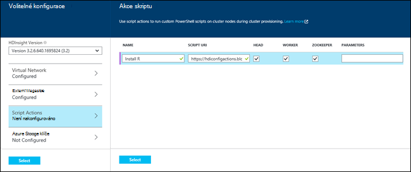

  	| Vlastnost | Hodnota |
  	| -------- | ----- |
  	| Jméno | Zadejte název akce skriptu. |
  	| Skript URI | Zadejte identifikátor URI skript, který je zavolat a přizpůsobení clusteru. |
  	| Vedoucí/kolegy | Určete uzly (**vedoucí** **pracovník**a **ZooKeeper**) na skript přizpůsobení běží. |
  	| Parametry | Zadejte parametry, v případě potřeby skriptem. |

    Stisknutím klávesy ENTER přidejte více akci skriptu pro instalaci více součástí na clusteru.

3. Klikněte na **Vybrat** uložte konfiguraci a budeme pokračovat v vytváření clusteru.

### Použití akce skript ze šablon, které správce prostředků Azure

V této části používáme šablony správce prostředků Azure HDInsight clusteru Kam zmizely taky akci skriptu nainstalovat vlastní součásti (v tomto příkladu R) na clusteru. Tato část obsahuje ukázkové šablony k vytvoření clusteru pomocí skriptu akce.

> [AZURE.NOTE] Postup v této části představují vytváření clusteru pomocí skriptu akce. Příklad vytváření clusteru ze šablony pomocí aplikace HDInsight naleznete v tématu [instalace vlastních aplikací HDInsight](hdinsight-apps-install-custom-applications.md).

#### Než začnete

* Informace o konfiguraci workstation abyste mohli spouštět rutiny prostředí Powershell Hdinsightu najdete v tématu [instalace a konfigurace prostředí PowerShell Azure](../powershell-install-configure.md).
* Návod k vytváření šablon najdete v článku [vytváření správce prostředků Azure šablony](../resource-group-authoring-templates.md).
* Pokud jste ještě nepoužívali Powershellu Azure pomocí Správce prostředků, najdete v článku [použití Azure pomocí Správce prostředků Azure](../powershell-azure-resource-manager.md).

#### Vytvoření clusterů pomocí skriptu akce

1. Zkopírujte následující šablonu na místo ve vašem počítači. Tato šablona nainstaluje Giraph headnodes i pracovní uzlů v clusteru. Můžete taky ověřit, zda šablona JSON je platný. Vložte obsah šablony do [JSONLint](http://jsonlint.com/), online nástroj ověření JSON.

            {
            "$schema": "http://schema.management.azure.com/schemas/2015-01-01/deploymentTemplate.json#",
            "contentVersion": "1.0.0.0",
            "parameters": {
                "clusterLocation": {
                    "type": "string",
                    "defaultValue": "West US",
                    "allowedValues": [ "West US" ]
                },
                "clusterName": {
                    "type": "string"
                },
                "clusterUserName": {
                    "type": "string",
                    "defaultValue": "admin"
                },
                "clusterUserPassword": {
                    "type": "securestring"
                },
                "sshUserName": {
                    "type": "string",
                    "defaultValue": "username"
                },
                "sshPassword": {
                    "type": "securestring"
                },
                "clusterStorageAccountName": {
                    "type": "string"
                },
                "clusterStorageAccountResourceGroup": {
                    "type": "string"
                },
                "clusterStorageType": {
                    "type": "string",
                    "defaultValue": "Standard_LRS",
                    "allowedValues": [
                        "Standard_LRS",
                        "Standard_GRS",
                        "Standard_ZRS"
                    ]
                },
                "clusterStorageAccountContainer": {
                    "type": "string"
                },
                "clusterHeadNodeCount": {
                    "type": "int",
                    "defaultValue": 1
                },
                "clusterWorkerNodeCount": {
                    "type": "int",
                    "defaultValue": 2
                }
            },
            "variables": {
            },
            "resources": [
                {
                    "name": "[parameters('clusterStorageAccountName')]",
                    "type": "Microsoft.Storage/storageAccounts",
                    "location": "[parameters('clusterLocation')]",
                    "apiVersion": "2015-05-01-preview",
                    "dependsOn": [ ],
                    "tags": { },
                    "properties": {
                        "accountType": "[parameters('clusterStorageType')]"
                    }
                },
                {
                    "name": "[parameters('clusterName')]",
                    "type": "Microsoft.HDInsight/clusters",
                    "location": "[parameters('clusterLocation')]",
                    "apiVersion": "2015-03-01-preview",
                    "dependsOn": [
                        "[concat('Microsoft.Storage/storageAccounts/', parameters('clusterStorageAccountName'))]"
                    ],
                    "tags": { },
                    "properties": {
                        "clusterVersion": "3.2",
                        "osType": "Linux",
                        "clusterDefinition": {
                            "kind": "hadoop",
                            "configurations": {
                                "gateway": {
                                    "restAuthCredential.isEnabled": true,
                                    "restAuthCredential.username": "[parameters('clusterUserName')]",
                                    "restAuthCredential.password": "[parameters('clusterUserPassword')]"
                                }
                            }
                        },
                        "storageProfile": {
                            "storageaccounts": [
                                {
                                    "name": "[concat(parameters('clusterStorageAccountName'),'.blob.core.windows.net')]",
                                    "isDefault": true,
                                    "container": "[parameters('clusterStorageAccountContainer')]",
                                    "key": "[listKeys(resourceId('Microsoft.Storage/storageAccounts', parameters('clusterStorageAccountName')), '2015-05-01-preview').key1]"
                                }
                            ]
                        },
                        "computeProfile": {
                            "roles": [
                                {
                                    "name": "headnode",
                                    "targetInstanceCount": "[parameters('clusterHeadNodeCount')]",
                                    "hardwareProfile": {
                                        "vmSize": "Large"
                                    },
                                    "osProfile": {
                                        "linuxOperatingSystemProfile": {
                                            "username": "[parameters('sshUserName')]",
                                            "password": "[parameters('sshPassword')]"
                                        }
                                    },
                                    "scriptActions": [
                                        {
                                            "name": "installGiraph",
                                            "uri": "https://hdiconfigactions.blob.core.windows.net/linuxgiraphconfigactionv01/giraph-installer-v01.sh",
                                            "parameters": ""
                                        }
                                    ]
                                },
                                {
                                    "name": "workernode",
                                    "targetInstanceCount": "[parameters('clusterWorkerNodeCount')]",
                                    "hardwareProfile": {
                                        "vmSize": "Large"
                                    },
                                    "osProfile": {
                                        "linuxOperatingSystemProfile": {
                                            "username": "[parameters('sshUserName')]",
                                            "password": "[parameters('sshPassword')]"
                                        }
                                    },
                                    "scriptActions": [
                                        {
                                            "name": "installR",
                                            "uri": "https://hdiconfigactions.blob.core.windows.net/linuxrconfigactionv01/r-installer-v01.sh",
                                            "parameters": ""
                                        }
                                    ]
                                }
                            ]
                        }
                    }
                }
            ],
            "outputs": {
                "cluster":{
                    "type" : "object",
                    "value" : "[reference(resourceId('Microsoft.HDInsight/clusters',parameters('clusterName')))]"
                }
            }
        }

2. Spusťte Azure PowerShell a přihlášení k účtu Azure. Po zadání přihlašovacích údajů, příkaz vrátí informace o účtu.

        Add-AzureRmAccount

        Id                             Type       ...
        --                             ----
        someone@example.com            User       ...

3. Pokud máte víc předplatných, zadejte id předplatného, které chcete použít pro nasazení.

        Select-AzureRmSubscription -SubscriptionID <YourSubscriptionId>

    > [AZURE.NOTE] Můžete použít `Get-AzureRmSubscription` zobrazte seznam všech předplatných přidruženého k vašemu účtu, které zahrnují předplatné Id pro každou z nich.

5. Pokud nemáte existující skupiny zdrojů, vytvoření nové skupiny prostředků. Zadejte název pole Skupina zdroje a umístění, které potřebujete pro řešení. Vrátí souhrn nové skupiny prostředků.

        New-AzureRmResourceGroup -Name myresourcegroup -Location "West US"

        ResourceGroupName : myresourcegroup
        Location          : westus
        ProvisioningState : Succeeded
        Tags              :
        Permissions       :
                            Actions  NotActions
                            =======  ==========
                            *
        ResourceId        : /subscriptions/######/resourceGroups/ExampleResourceGroup

6. Pokud chcete vytvořit nové nasazení skupiny zdrojů, spuštění příkazu **Nový AzureRmResourceGroupDeployment** a zadejte potřebné parametry. Parametry bude obsahovat název pro nasazení, název skupiny zdrojů a na cestu nebo adresu URL šablony, kterou jste vytvořili. Pokud vaše šablona vyžaduje všechny parametry, musí uplynout i tyto parametry. V tomto případě skript akci, kterou chcete nainstalovat R clusteru není nutné zadávat všechny parametry.

        New-AzureRmResourceGroupDeployment -Name mydeployment -ResourceGroupName myresourcegroup -TemplateFile <PathOrLinkToTemplate>

    Zobrazí se výzva k zadání hodnot pro parametry definované v šabloně.

7. Po nasazení skupina zdroje se najdete v článku Přehled nasazení.

          DeploymentName    : mydeployment
          ResourceGroupName : myresourcegroup
          ProvisioningState : Succeeded
          Timestamp         : 8/17/2015 7:00:27 PM
          Mode              : Incremental
          ...

8. Pokud nasazení nepovede, můžete tyto rutiny získat informace o k chybám.

        Get-AzureRmResourceGroupDeployment -ResourceGroupName myresourcegroup -ProvisioningState Failed

### Použití akce skriptem během vytváření clusteru z Azure PowerShell

V této části používáme rutinu [Přidat AzureRmHDInsightScriptAction](https://msdn.microsoft.com/library/mt603527.aspx) vyvolat skriptů pomocí skriptu akce můžete přizpůsobit clusteru. Než budete pokračovat, ujistěte se již nainstalovali a nakonfigurovali Azure Powershellu. Informace o konfiguraci workstation abyste mohli spouštět rutiny prostředí PowerShell Hdinsightu najdete v tématu [instalace a konfigurace prostředí PowerShell Azure](../powershell-install-configure.md).

Proveďte následující kroky:

1. Spusťte konzolu Powershellu Azure pomocí následujícího postupu přihlášení k předplatnému Azure a deklarovat některé proměnné Powershellu:

        # LOGIN TO ZURE
        Login-AzureRmAccount

        # PROVIDE VALUES FOR THESE VARIABLES
        $subscriptionId = "<SubscriptionId>"        # ID of the Azure subscription
        $clusterName = "<HDInsightClusterName>"         # HDInsight cluster name
        $storageAccountName = "<StorageAccountName>"    # Azure storage account that hosts the default container
        $storageAccountKey = "<StorageAccountKey>"      # Key for the storage account
        $containerName = $clusterName
        $location = "<MicrosoftDataCenter>"             # Location of the HDInsight cluster. It must be in the same data center as the storage account.
        $clusterNodes = <ClusterSizeInNumbers>          # The number of nodes in the HDInsight cluster.
        $resourceGroupName = "<ResourceGroupName>"      # The resource group that the HDInsight cluster will be created in

2. Zadejte hodnoty konfigurace (například uzlů v clusteru) a výchozí úložiště k použití.

        # SPECIFY THE CONFIGURATION OPTIONS
        Select-AzureRmSubscription -SubscriptionId $subscriptionId
        $config = New-AzureRmHDInsightClusterConfig
        $config.DefaultStorageAccountName="$storageAccountName.blob.core.windows.net"
        $config.DefaultStorageAccountKey=$storageAccountKey

3. Pomocí rutiny **Přidat AzureRmHDInsightScriptAction** skript spustit. Skript, který nainstaluje Giraph cluster v následujícím příkladu:

        # INVOKE THE SCRIPT USING THE SCRIPT ACTION FOR HEADNODE AND WORKERNODE
        $config = Add-AzureRmHDInsightScriptAction -Config $config -Name "Install Giraph"  -NodeType HeadNode -Uri https://hdiconfigactions.blob.core.windows.net/linuxgiraphconfigactionv01/giraph-installer-v01.sh
        $config = Add-AzureRmHDInsightScriptAction -Config $config -Name "Install Giraph"  -NodeType WorkerNode -Uri https://hdiconfigactions.blob.core.windows.net/linuxgiraphconfigactionv01/giraph-installer-v01.sh

    Rutina **AzureRmHDInsightScriptAction přidat** jen následujících parametrů:

  	| Parametr | Definice |
  	| --------- | ---------- |
  	| Konfigurace | Konfigurace objekt skript, který se přidá informace o akci. |
  	| Jméno | Název akci skriptu. |
  	| NodeType | Určuje uzel, ve kterém běží skriptem vlastního nastavení. Platné hodnoty jsou **HeadNode** (o instalaci na uzel hlavy) **WorkerNode** (Pokud chcete nainstalovat na všechny uzly dat), nebo **ZookeeperNode** (o instalaci na uzel zookeeper). |
  	| Parametry | Parametry vyžadované skript. |
  	| Identifikátor URI | Určuje identifikátor URI skript, který se spustí. |

4. Nastavení správce/HTTPS uživatele obrázku:

        $httpCreds = get-credential

    Po zobrazení výzvy zadejte "admin" jako název a zadejte heslo.

5. Nastavení přihlašovacích údajů SSH:

        $sshCreds = get-credential

    Po zobrazení výzvy zadejte SSH uživatelské jméno a heslo. Pokud chcete zajistit SSH účet pomocí certifikátu místo hesla, použijte prázdné heslo a nastavte `$sshPublicKey` obsah veřejný klíč certifikátu chcete použít. Příklad:

        $sshPublicKey = Get-Content .\path\to\public.key -Raw

4. Nakonec vytvořte obrázku:

        New-AzureRmHDInsightCluster -config $config -clustername $clusterName -DefaultStorageContainer $containerName -Location $location -ResourceGroupName $resourceGroupName -ClusterSizeInNodes $clusterNodes -HttpCredential $httpCreds -SshCredential $sshCreds -OSType Linux

    Pokud používáte veřejný klíč účtu SSH zabezpečit, je nutné zadat také `-SshPublicKey $sshPublicKey` jako parametr.

Může trvat několik minut, než bude vytvořena clusteru.

### Použití akce skript během vytváření clusteru z Hdinsightu .NET SDK

HDInsight .NET SDK poskytuje knihoven klienta, které usnadňují práci s HDInsight z aplikace .NET. Ukázka kódu najdete v článku [na základě vytvořit Linux clusterů HDInsight pomocí .NET SDK](hdinsight-hadoop-create-linux-clusters-dotnet-sdk.md#use-script-action).

## Použití akce skriptem pracovního obrázku

Tato část obsahuje příklady o různých způsobech použijete skript akce pracovního HDInsight clusteru; z portálu Azure pomocí rutin prostředí PowerShell, pomocí rozhraní příkazového řádku Azure různé platformy a pomocí .NET SDK. Trvalé skriptem akce použít v této části přidá existujícího účtu Azure úložiště pracovního obrázku. Můžete taky další akce skript, viz [Příklad skript akce skriptů](#example-script-action-scripts).

### Použití akce skript pracovního obrázku z portálu Microsoft Azure

1. Z [Azure portál](https://portal.azure.com)vyberte svůj cluster HDInsight.

2. Na obrázku zásuvné HDInsight vyberte dlaždici __Skript akce__ .

    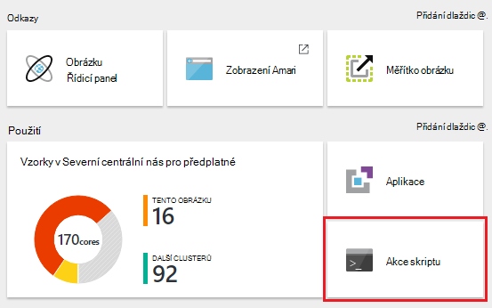

    > [AZURE.NOTE] Můžete taky vybrat __všechna nastavení__ a pak vyberte __Akce skriptu__ zásuvné nastavení.

4. V horní části zásuvné skriptem akce vyberte __Odeslat nový__.

    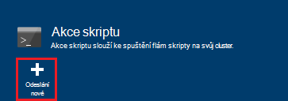

5. Z zásuvné přidat akci skript zadejte následující informace.

    * __Název__: popisný název pro účely tohoto skriptu akce. V tomto příkladu `Add Storage account`.
    * __Identifikátor URI skript__: identifikátor URI skript. V tomto příkladu`https://hdiconfigactions.blob.core.windows.net/linuxaddstorageaccountv01/add-storage-account-v01.sh`
    * __Vedoucí__ __pracovník__a __Zookeeper__: Zkontrolujte uzly, které tento skript by měl být použity pro. V tomto příkladu je zaškrtnuto políčko vedoucí pracovník a Zookeeper.
    * __Parametry__: Pokud skript přijímá parametry, zadejte je tady. V tomto příkladu zadejte název účtu úložiště a klíč účtu úložiště:

        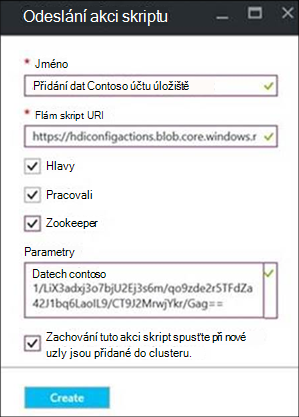

        Na snímek `contosodata` je existující účet Azure úložiště, druhý řádek je klíč účtu úložiště.
    * __Trvalé__: Pokud chcete zachovat skript tak, aby se použije se nové pracovní uzly při škálování clusteru zaškrtněte tuto položku.

6. Nakonec pomocí tlačítka __vytvořit__ skript vyrovnat clusteru.

### Použít akci skriptu pracovního clusteru z Azure PowerShell

Než budete pokračovat, ujistěte se již nainstalovali a nakonfigurovali Azure Powershellu. Informace o konfiguraci workstation abyste mohli spouštět rutiny prostředí PowerShell Hdinsightu najdete v tématu [instalace a konfigurace prostředí PowerShell Azure](../powershell-install-configure.md).

1. Spusťte konzolu Powershellu Azure pomocí následujícího postupu přihlášení k předplatnému Azure a deklarovat některé proměnné Powershellu:

        # LOGIN TO ZURE
        Login-AzureRmAccount

        # PROVIDE VALUES FOR THESE VARIABLES
        $clusterName = "<HDInsightClusterName>"         # HDInsight cluster name
        $saName = "<ScriptActionName>"                  # Name of the script action
        $saURI = "<URI to the script>"                  # The URI where the script is located
        $nodeTypes = "headnode", "workernode"
        
    > [AZURE.NOTE] Pokud používáte HDInsight Premium obrázku, můžete použít nodetype z `"edgenode"` ke spuštění skriptu na uzel okraje.

2. Zadejte následující příkaz Vyrovnat clusteru skript:

        Submit-AzureRmHDInsightScriptAction -ClusterName $clusterName -Name $saName -Uri $saURI -NodeTypes $nodeTypes -PersistOnSuccess

    Po dokončení projektu se má zobrazit informace podobně jako tento:

        OperationState  : Succeeded
        ErrorMessage    :
        Name            : Giraph
        Uri             : https://hdiconfigactions.blob.core.windows.net/linuxgiraphconfigactionv01/giraph-installer-v01.sh
        Parameters      :
        NodeTypes       : {HeadNode, WorkerNode}

### Použít akci skriptu pracovního clusteru z Azure rozhraní příkazového řádku

Než budete pokračovat, ujistěte se již nainstalovali a nakonfigurovali Azure rozhraní příkazového řádku. Další informace najdete v tématu [instalace Azure rozhraní příkazového řádku](../xplat-cli-install.md).

    [AZURE.INCLUDE [use-latest-version](../../includes/hdinsight-use-latest-cli.md)] 

1. Otevřete relaci prostředí terminálu, příkazový řádek a jiných příkazového řádku pro systém a zadejte následující příkaz přepněte do režimu správce prostředků Azure.

        azure config mode arm

2. Pomocí následujících ověření k předplatnému Azure.

        azure login

3. Zadejte následující příkaz Vyrovnat akci skriptu pracovního obrázku

        azure hdinsight script-action create <clustername> -g <resourcegroupname> -n <scriptname> -u <scriptURI> -t <nodetypes>

    Pokud vynecháte parametrů pro tento příkaz, zobrazí se výzva pro ně. Zadáte skript s `-u` přijímá parametry, můžete určit jejich použití `-p` parametr.

    Platné __nodetypes__ jsou __headnode__, __workernode__a __zookeeper__. Pokud pro více typů uzel budou platit skript, určete typy odděleni ";". Například `-n headnode;workernode`.

    Zachování skript, přidejte `--persistOnSuccess`. Můžete taky přetrvávají skript k pozdějšímu datu pomocí `azure hdinsight script-action persisted set`.
    
    Po dokončení projektu, zobrazí se výstup podobně jako tento.
    
        info:    Executing command hdinsight script-action create
        + Executing Script Action on HDInsight cluster
        data:    Operation Info
        data:    ---------------
        data:    Operation status:
        data:    Operation ID:  b707b10e-e633-45c0-baa9-8aed3d348c13
        info:    hdinsight script-action create command OK

### Použití akce skript pracovního clusteru pomocí rozhraní REST API

V tématu [Spuštění akce skriptu pracovního clusteru](https://msdn.microsoft.com/library/azure/mt668441.aspx).
### Použití akce skript pracovního clusteru HDInsight .NET SDK

Příklad použití .NET SDK skripty vyrovnat clusteru najdete v článku [https://github.com/Azure-Samples/hdinsight-dotnet-script-action](https://github.com/Azure-Samples/hdinsight-dotnet-script-action).

## Zobrazení historie, zvýšit a snížit akce skriptu

### Pomocí portálu Azure

1. Z [Azure portál](https://portal.azure.com)vyberte svůj cluster HDInsight.

2. Z obrázku zásuvné HDInsight vyberte __Nastavení__.

    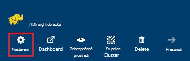

3. V nastavení zásuvné vyberte __Akce skriptu__.

    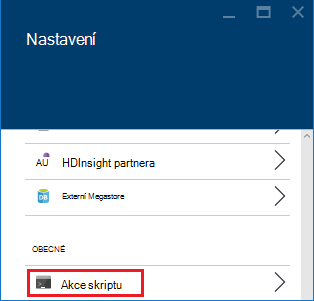

4. Seznam trvalých skripty, jakož i historii skriptů používaných clusteru, se zobrazí na zásuvné skript akce. Následující snímek uvidíte, že Solr skript byl spuštěn na tomto obrázku, ale, že jste žádné akce skript zachován.

    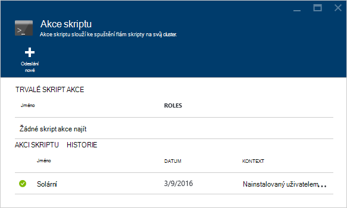

5. Výběr skript z historie se zobrazí vlastnosti zásuvné pro tento skript. V horní části zásuvné můžete znovu skript nebo zvyšení úrovně ho.

    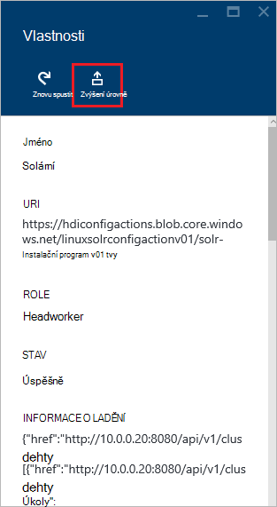

6. Můžete taky použít __...__ napravo od položky na zásuvné skript akce můžete provádět akce, jako je znovu spustit, zachovat nebo odstranit (pro trvalé akce).

    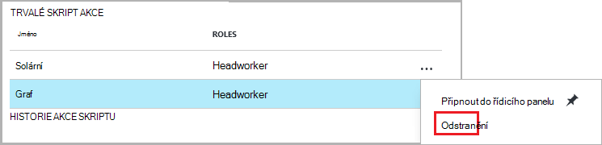

### Pomocí prostředí PowerShell Azure

| Použití takto... | Pro... |
| ----- | ----- |
| Get-AzureRmHDInsightPersistedScriptAction | Získat informace o akce trvalých skriptu |
| Get-AzureRmHDInsightScriptActionHistory | Načtení historii skriptem akce u obrázku nebo podrobností o konkrétní skriptem |
| Nastavení AzureRmHDInsightPersistedScriptAction | Zvýší úroveň ad hoc skriptem akci, kterou chcete akci trvalých skriptu |
| Odebrat AzureRmHDInsightPersistedScriptAction | Sníží akci trvalých skriptu na ad hoc akce |

> [AZURE.IMPORTANT] Použití `Remove-AzureRmHDInsightPersistedScriptAction` znamená není zpět akce provádí skript, jenom odeberete příznak trvalých tak, aby skript nebudete spustil uzlech nové pracovní přidán do clusteru.

Následující příklad skript ukazuje, jak pomocí rutin zvýšit a snížit skriptu.

    # Get a history of scripts
    Get-AzureRmHDInsightScriptActionHistory -ClusterName mycluster

    # From the list, we want to get information on a specific script
    Get-AzureRmHDInsightScriptActionHistory -ClusterName mycluster -ScriptExecutionId 635920937765978529

    # Promote this to a persisted script
    # Note: the script must have a unique name to be promoted
    # if the name is not unique, you will receive an error
    Set-AzureRmHDInsightPersistedScriptAction -ClusterName mycluster -ScriptExecutionId 635920937765978529

    # Demote the script back to ad hoc
    # Note that demotion uses the unique script name instead of
    # execution ID.
    Remove-AzureRmHDInsightPersistedScriptAction -ClusterName mycluster -Name "Install Giraph"

### Použití Azure rozhraní příkazového řádku

| Použití takto... | Pro... |
| ----- | ----- |
| `azure hdinsight script-action persisted list <clustername>` | Načtěte seznam akce trvalých skriptu |
| `azure hdinsight script-action persisted show <clustername> <scriptname>` | Získat informace o konkrétní trvalých skript akce |
| `azure hdinsight script-action history list <clustername>` | Načtení historii skript akce u clusteru |
| `azure hdinsight script-action history show <clustername> <scriptname>` | Získat informace o konkrétních skript akce |
| `azure hdinsight script action persisted set <clustername> <scriptexecutionid>` | Zvýší úroveň ad hoc skript akci, kterou chcete akci trvalých skriptu |
| `azure hdinsight script-action persisted delete <clustername> <scriptname>` | Sníží akci trvalá skriptu na ad hoc akce |

> [AZURE.IMPORTANT] Použití `azure hdinsight script-action persisted delete` znamená není zpět akce provádí skript, jenom odeberete příznak trvalých tak, aby skript nebudete spustil uzlech nové pracovní přidán do clusteru.

### Použití HDInsight .NET SDK

Příklad použití .NET SDK k načtení historie skriptu z clusteru zvýšit nebo snížit skripty najdete v tématu [https://github.com/Azure-Samples/hdinsight-dotnet-script-action](https://github.com/Azure-Samples/hdinsight-dotnet-script-action).

> [AZURE.NOTE] V tomto příkladu také ukazuje, jak nainstalovat aplikaci HDInsight pomocí .NET SDK.

## Řešení potíží

Zobrazit informace zaznamenané skriptem akce můžete Ambari web uživatelského rozhraní. Pokud byl použit skript během clusteru vytváření a vytváření clusteru došlo k chybě v skript protokoly nabízí taky výchozí úložiště účtu spojeného s clusteru. Tato část obsahuje informace o tom, jak získat protokoly pomocí obě tyto možnosti.

### Použití webu Ambari uživatelského rozhraní

1. V prohlížeči přejděte na https://CLUSTERNAME.azurehdinsight.net. NÁZEV_CLUSTERU nahraďte názvem svůj cluster HDInsight.

    Po zobrazení výzvy zadejte název účtu správce (Správci) a heslo pro clusteru. Možná budete muset znovu zadejte přihlašovací údaje správce webového formuláře.

2. Na panelu v horní části stránky vyberte položku __ops__ . Tím se zobrazí seznam aktuálního a předchozího operací clusteru prostřednictvím Ambari.

    

3. Vyhledání položek, které mají __Spustit\_customscriptaction__ ve sloupci __Operations__ . Tyto vzniká při spuštění akce skriptu.

    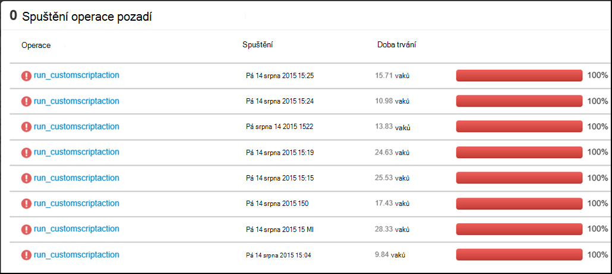

    Vyberte tuto položku a k podrobnostem pomocí odkazů zobrazit výstup STDOUT a STDERR přihlášení vygenerované při skript byl spuštěn na clusteru.

### Protokoly přístup z účtu výchozí úložiště

Pokud vytváření clusteru selže kvůli chybě v akci skript, protokoly akce skript můžete pořád přistupovat přímo z úložiště výchozí účet spojený s clusteru.

* Protokoly úložiště jsou dostupné na `\STORAGE_ACOCUNT_NAME\DEFAULT_CONTAINER_NAME\custom-scriptaction-logs\CLUSTER_NAME\DATE`.

    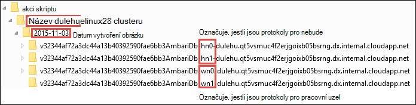

    Podle toho seřazené protokoly pro headnode, workernode a zookeeper uzly samostatně. Příklady:
    * **Headnode** - `<uniqueidentifier>AmbariDb-hn0-<generated_value>.cloudapp.net`
    * **Pracovní uzel** - `<uniqueidentifier>AmbariDb-wn0-<generated_value>.cloudapp.net`
    * **Zookeeper uzel** - `<uniqueidentifier>AmbariDb-zk0-<generated_value>.cloudapp.net`

* K tomuto účtu úložiště je nahrané stdout a stderr odpovídající hostitele. Existuje **výstup -\*txt** a **chyby –\*txt** pro každou akci skriptu. TXT výstupní soubor obsahuje informace o identifikátor URI skript, který máte spustit na hostiteli. Příklad

        'Start downloading script locally: ', u'https://hdiconfigactions.blob.core.windows.net/linuxrconfigactionv01/r-installer-v01.sh'

* Je možné opakovaně vytvořit skript clusteru akce se stejným názvem. V takovém případě můžete rozlišit relevantní protokoly podle názvu složky datum. Například struktura složek pro cluster (clusteru) vytvořili na jinou kalendářních dat nebudou:
    * `\STORAGE_ACOCUNT_NAME\DEFAULT_CONTAINER_NAME\custom-scriptaction-logs\mycluster\2015-10-04`
    * `\STORAGE_ACOCUNT_NAME\DEFAULT_CONTAINER_NAME\custom-scriptaction-logs\mycluster\2015-10-05`

* Pokud vytvoříte clusteru skript akce se stejným názvem na stejný den, můžete použít jedinečnou předponu k identifikaci příslušných souborů.

* Pokud vytvoříte clusteru na konci den, je možné, že soubory protokolu rozsahu přes dva dny. V těchto případech zobrazí se dvěma složkami jiné datum u stejného obrázku.

* Nahrávání souborů protokolu do kontejneru výchozí může trvat až 5 minut, zejména u velkých clusterů. Ano Pokud chcete získat přístup protokoly byste neměli odstraňovat okamžitě clusteru selže akci skriptu.

## Podpora pro otevřít zdroj software byl použit na HDInsight clusterů

Služba Microsoft Azure HDInsight je flexibilní platformy, který umožňuje vytvářet velký dat aplikace v cloudu pomocí ekosystém otevřít zdroj technologií vytvořené kolem Hadoop. Microsoft Azure obsahuje obecné úroveň podpory technologie otevřít zdroj, jak je popsáno v části **Podpora obor** [Azure podporují nejčastější dotazy týkající se webu](https://azure.microsoft.com/support/faq/). HDInsight služba poskytuje další úroveň podpory pro některé prvky, jak je popsáno níže.

Existují dva typy součástí otevřít zdroje, které jsou k dispozici ve službě HDInsight:

- **Předdefinované prvky** - tyto součásti jsou předinstalované ve HDInsight clusterů a poskytují základní funkce clusteru. Například vláken ResourceManager podregistru dotazovací jazyk (HiveQL) a knihovně Mahout patří této kategorii. Úplný seznam součástí clusteru je k dispozici v [Co je nového v verze obrázku Hadoop poskytovanou HDInsight?](hdinsight-component-versioning.md).

- **Vlastní součásti** -, jako uživatel clusteru, můžete nainstalovat nebo použití ve vaší pracovní zátěž všechny komponenty k dispozici v rámci komunity nebo vytvoření vy.

> [AZURE.WARNING] Součásti součástí clusteru HDInsight jsou plně podporovány a Microsoft Support vám pomůže izolovat a vyřešit problémy týkající se tyto součásti.
>
> Vlastní součásti dostávat komerčně rozumné podpory pomáhají při další řešení problému. To může mít za následek tento problém vyřešit nebo s žádostí o zapojení dostupných kanálů technologie otevřít zdroj, kde se nacházejí hloubkové odborných informací, které technologie. Například existuje mnoho webů komunity, které lze použít, třeba: [fórum MSDN pro HDInsight](https://social.msdn.microsoft.com/Forums/azure/en-US/home?forum=hdinsight), [http://stackoverflow.com](http://stackoverflow.com). Také Apache mít projekty webů projektů na [http://apache.org](http://apache.org), například: [Hadoop](http://hadoop.apache.org/).

Služba HDInsight nabízí několik způsobů použití vlastních součástí. Bez ohledu na to, jak je používat komponentu nebo se nainstalovaným clusteru platí stejné úrovni podpory. Tady je přehled nejčastěji vlastní komponent lze na HDInsight clusterů:

1. Odeslání úlohy - Hadoop a dalších typů úloh, které spustit komponenty ani používat vlastní lze odeslat do clusteru.

2. Vlastní nastavení obrázku – během vytváření clusteru, můžete zadat další nastavení a vlastní součásti nainstalované uzlech clusteru.

3. Ukázky - Oblíbené vlastní součásti, Microsoft a ostatní stanovit příklady použití těchto složek ve HDInsight. Tyto příklady jsou k dispozici bez podpory.

##Řešení potíží

###Historie nezobrazují skripty použít při vytváření obrázku

Pokud svůj cluster byla vytvořená před 15 březen 2016, nemusí se položky v historii akci skriptu pro všechny skripty používaný během vytváření clusteru. Však při změně velikosti clusteru za 15 březen 2016 skriptů pomocí během vytváření clusteru zobrazí v historii platí pro nové uzly clusteru jako součást operace změny velikosti.

Existují dvě výjimky:

* Pokud svůj cluster byla vytvořená před 1st září 2015. Při je to akce skriptu byly vydané, takže žádné clusteru vytvořené před tímto datem nelze použít akce skriptu pro vytvoření obrázku.

* Je-li použít více akcí skript během vytváření clusteru a použít stejný název pro více skriptů, nebo stejný název, stejný identifikátor URI, ale různých parametry k více skriptů. V těchto případech zobrazí se tato chyba.

    Žádné nové akce skript lze spustit na tomto obrázku z důvodu konfliktních názvů skript v existujících skriptů. Skript názvy v clusteru vytvořit musí být všechny jedinečné. Existující skripty bude spouštět pořád velikost.

## Další kroky

Najdou informace a příklady týkající se vytváření a přizpůsobení clusteru pomocí skriptů:

- [Můžete vyvíjet skripty akci skriptu pro HDInsight](hdinsight-hadoop-script-actions-linux.md)
- [Instalace a používání Solr v HDInsight clusterů](hdinsight-hadoop-solr-install-linux.md)
- [Instalace a používání Giraph v HDInsight clusterů](hdinsight-hadoop-giraph-install-linux.md)

[img-hdi-cluster-states]: ./media/hdinsight-hadoop-customize-cluster-linux/HDI-Cluster-state.png "Fáze při vytváření obrázku"
