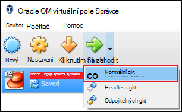

<properties
    pageTitle="Použití Hadoop izolovaného prostoru se naučit používat Hadoop | Microsoft Azure"
    description="Další informace o používání ekosystému Hadoop zahájíte můžete nastavit izolovaného prostoru Hadoop z Hortonworks na Azure virtuálního počítače. "
    keywords="hadoop emulátoru hadoop izolovaného prostoru"
    editor="cgronlun"
    manager="jhubbard"
    services="hdinsight"
    authors="nitinme"
    documentationCenter=""
    tags="azure-portal"/>

<tags
    ms.service="hdinsight"
    ms.workload="big-data"
    ms.tgt_pltfrm="na"
    ms.devlang="na"
    ms.topic="article"
    ms.date="08/24/2016"
    ms.author="nitinme"/>

# Začínáme v ekosystému Hadoop s Hadoop izolovaného prostoru v počítači virtuální

Zjistěte, jak nainstalovat izolovaného prostoru Hadoop z Hortonworks virtuálního počítače se naučit používat ekosystému Hadoop. Izolovaného prostoru poskytuje místní vývojové prostředí se naučit používat Hadoop Distributed souboru Hadoop systému (HDFS) a odeslání úlohy.

## Zjistit předpoklady pro

* [Oracle VirtualBox](https://www.virtualbox.org/)

Jakmile máte zkušenosti s Hadoop, můžete začít používat Hadoop na Azure vytvořením clusteru HDInsight. Další informace o tom, jak začít pracovat najdete v článku [Začínáme s Hadoop na HDInsight](hdinsight-hadoop-linux-tutorial-get-started.md).

## Stažení a instalace virtuálního počítače

1. Z [http://hortonworks.com/downloads/#sandbox](http://hortonworks.com/downloads/#sandbox)vyberte položku __Stáhnout VIRTUALBOX__ pro HDP 2.4 na Hortonworks izolovaného prostoru. Zobrazí se výzva k registraci Hortonworks před zahájením stahování.

    

2. Na stejné stránce webu vyberte __VirtualBox nainstalovat Průvodce__ pro HDP 2.4 na Hortonworks izolovaného prostoru. To stáhne PDF obsahuje pokyny k instalaci virtuálního počítače.

    

## Spuštění virtuálního počítače

1. Zahájení VirtualBox, vyberte izolovaného prostoru Hortonworks, vyberte __Start__a potom na __Spustit normální__.

    

2. Po dokončení procesu spouštění virtuální počítač zobrazí pokynů k přihlášení. Otevřete webový prohlížeč a přejděte na zobrazená adresa URL (obvykle http://127.0.0.1:8888).

## Nastavení hesla

1. V kroku __Začínáme__ stránce Hortonworks karanténě vyberte __Upřesnit nastavení zobrazení__. Informace v této stránky a přihlaste se k izolovaného prostoru pomocí SSH využít. Pomocí jména a hesla.

    > [AZURE.NOTE] Pokud nemáte klientem SSH nainstalovaný, můžete použít SSH webu založené na poskytovanou virtuálního počítače v __http://localhost:4200 /__.

    Při prvním připojení pomocí SSH, můžete se výzva k Změna hesla účtu root. Zadejte nové heslo, které se použije při přihlášení pomocí SSH v budoucnu.

2. Po přihlášení, zadejte tento příkaz:

        ambari-admin-password-reset
    
    Po zobrazení výzvy zadejte heslo účtu správce Ambari. Bude použit při přístupu k uživatelské rozhraní webu Ambari.

## Použití příkazu podregistru

1. SSH připojení k izolovaného prostoru můžete tento příkaz Spustit podregistru prostředí:

        hive

2. Jakmile prostředí začala, použijte následující tabulek, které jsou součástí izolovaného prostoru:

        show tables;

3. Můžete použít následující znaky k načtení 10 řádků z `sample_07` tabulky:

        select * from sample_07 limit 10;

## Další kroky

* [Zjistěte, jak pomocí aplikace Visual Studio s Hortonworks izolovaného prostoru](hdinsight-hadoop-emulator-visual-studio.md)
* [Přehled výukových LAN Hortonworks izolovaného prostoru](http://hortonworks.com/hadoop-tutorial/learning-the-ropes-of-the-hortonworks-sandbox/)
* [Kurz Hadoop – začínáte pracovat s HDP](http://hortonworks.com/hadoop-tutorial/hello-world-an-introduction-to-hadoop-hcatalog-hive-and-pig/)