<properties
pageTitle="Pomocí nástrojů Microsoft Azure dat jezera for Visual Studio s izolovaného prostoru Hortonworks | Microsoft Azure"
description="Zjistěte, jak pomocí služby Azure datové jezera nástroje for VIsual Studio Hortonworks izolovaného prostoru (spuštění v místním OM.) Pomocí tohoto nástroje můžete vytvořit a spustit podregistru a Prasátko úlohy na izolovaného prostoru a zobrazení výstupu projektu a historie."
services="hdinsight"
documentationCenter=""
authors="Blackmist"
manager="paulettm"
editor="cgronlun"/>

<tags
ms.service="hdinsight"
ms.devlang="na"
ms.topic="article"
ms.tgt_pltfrm="na"
ms.workload="big-data"
ms.date="08/26/2016"
ms.author="larryfr"/>

# Pomocí nástrojů jezera Azure dat for Visual Studio s Hortonworks izolovaného prostoru

Nástroje jezera dat Azure for Visual Studio obsahuje nástroje pro práci s obecný Hadoop clusterů, kromě nástroje pro práci s jezera dat Azure HDInsight. Tento dokument obsahuje kroky potřebné nástroje jezera dat Azure pomocí služby izolovaného prostoru Hortonworks spuštěné v místním počítači virtuální.

Použití izolovaného prostoru Hortonworks umožňuje pracovat s Hadoop místně na vývojové prostředí. Jakmile vytvořili řešení a chcete ho nasadit ve velkém měřítku, pak přejdete k HDInsight obrázku.

## Zjistit předpoklady pro

* Sandboxová Hortonworks ve počítače virtuální spuštěna vývojové prostředí. Tento dokument byl vytvoření a otestování s izolovaného prostoru aplikaci VirtualBox Oracle, které o konfiguraci pomocí informací v dokumentu [Začínáme v ekosystému Hadoop](hdinsight-hadoop-emulator-get-started.md) .

* Visual Studio 2013 nebo Outlooku 2015 libovolnou verzí.

* [Azure SDK pro .NET](https://azure.microsoft.com/downloads/) 2.7.1 nebo vyšší

* [Azure datové nástroje jezera for Visual Studio](https://www.microsoft.com/download/details.aspx?id=49504)

## Nastavení hesla pro izolovaného prostoru

Ujistěte se, jestli je spuštěný izolovaného prostoru Hortonworks a pak postupujte podle kroků v tématu [Začínáme v ekosystému Hadoop](hdinsight-hadoop-emulator-get-started.md#set-passwords) pro nastavení hesla pro SSH `root` účet a Ambari `admin` účtu. Tato hesla se použije při připojování k izolovaného prostoru z aplikace Visual Studio.

## Připojení nástroje izolovaného prostoru

1. Otevřete aplikaci Visual Studio a vyberte __zobrazení__a potom __Průzkumník serveru__.

2. Z __Průzkumníka serveru__klikněte pravým tlačítkem myši na položku __HDInsight__ a vyberte __připojit k emulátoru HDInsight__.

    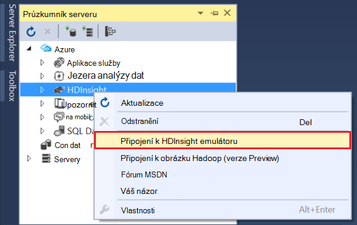

3. V dialogovém okně __připojit k emulátoru HDInsight__ zadejte heslo, které jste nakonfigurovali pro Ambari.

    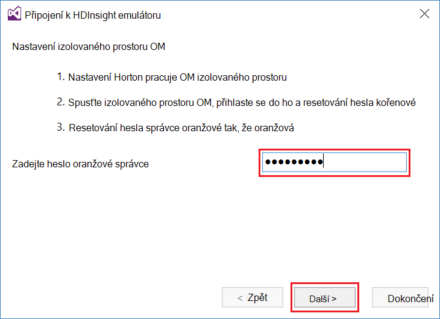

    Vyberte __Další__ a pokračujte.

4. Pomocí pole __heslo__ zadejte heslo nakonfigurován pro `root` účtu. Nechte dalších polí na výchozí hodnota.

    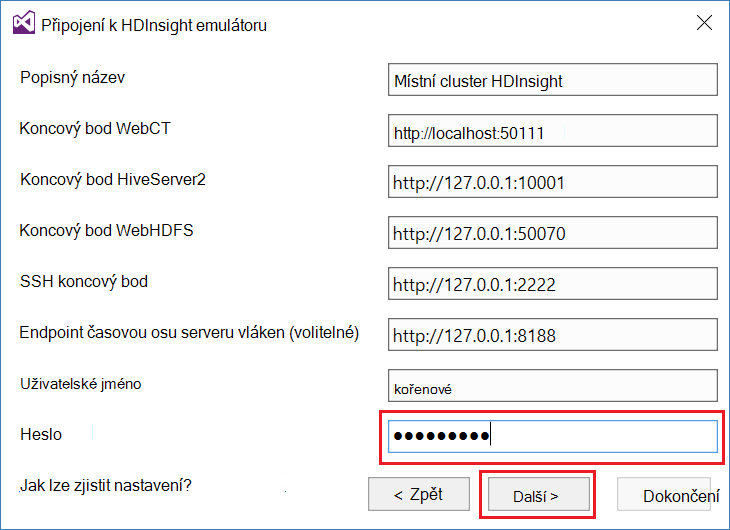

    Vyberte __Další__ a pokračujte.

5. Počkejte, než ověřovacích služeb dokončete. V některých případech může ověření selhání a objeví se výzva k aktualizaci konfigurace. Důvody tohoto chování, klikněte na tlačítko __Aktualizovat__ a počkejte, konfigurace a ověření pro službu dokončete.

    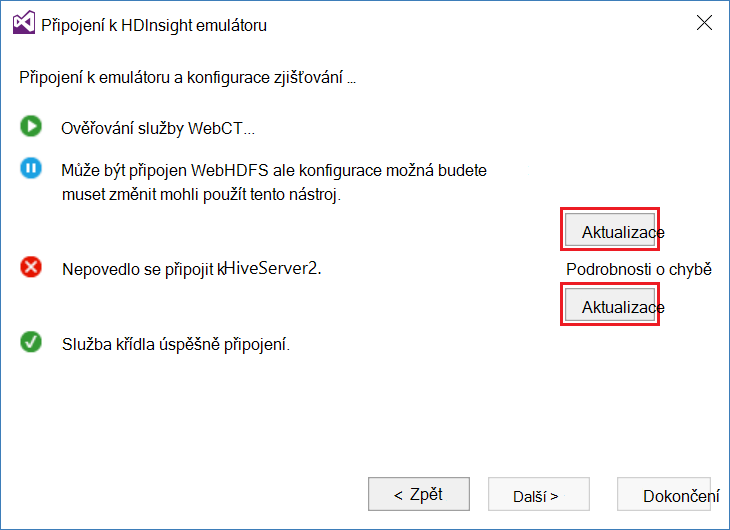

    > [AZURE.NOTE] Proces aktualizace používá Ambari pro úpravu konfigurace izolovaného prostoru Hortonworks očekávané nástroji jezera dat Azure for Visual Studio.

    Po dokončení ověření vyberte __Dokončit__ a dokončete konfiguraci.

    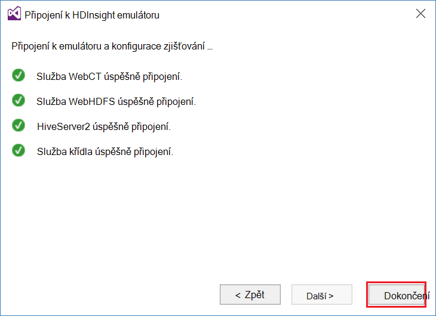

    > [AZURE.NOTE] V závislosti na rychlosti vývojové prostředí a velikosti paměti přidělit virtuální počítač může trvat několik minut ke konfiguraci a ověřte služby.

Po provedení těchto kroků, teď máte položku "HDInsight místní clusteru" v Průzkumníku serveru v části HDInsight.

## Psaní podregistru dotazu

Podregistru poskytuje SQL profesionálové dotazovací jazyk (HiveQL,) pro práci s strukturovaná data. Pomocí těchto kroků se dozvíte, jak spustit ad-hoc dotazů místní obrázku.

1. V __Průzkumníku serveru__klikněte pravým tlačítkem myši na položku místní obrázku, který jste přidali dříve a pak vyberte __vytvořit dotaz podregistru__.

    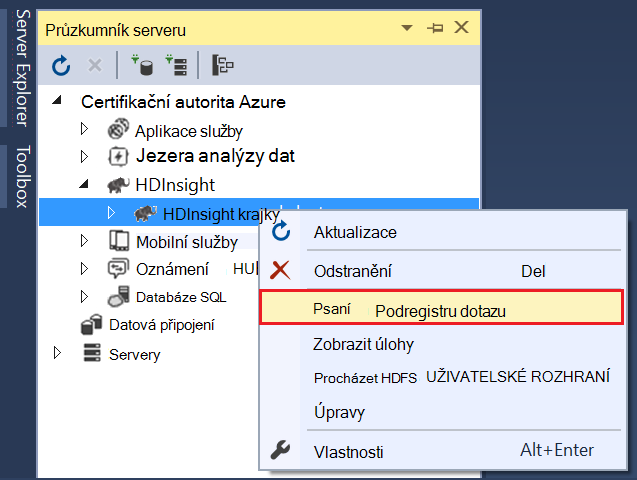

    Otevře se nové okno dotazu, které vám umožní rychle zadejte nahoru a odeslat dotaz na místní obrázku.

2. V okně Nový dotaz zadejte následující údaje:

        select count(*) from sample_08;
    
    V horní části okna dotazu zkontrolujte, jestli tuto konfiguraci pro místní cluster zaškrtnuté a klikněte na __Odeslat__. Další požadované hodnoty (__dávku__ a název serveru,) ponechte výchozí hodnoty.

    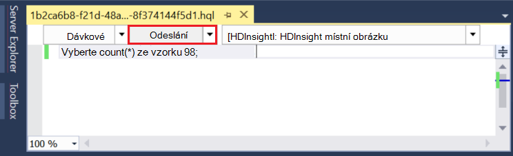

    Všimněte si, že můžete také na rozevírací nabídku vedle __Odeslat__ vyberte __Upřesnit__. Otevře se dialogové okno, které vám umožňuje zadat další možnosti při odeslání úlohy.

    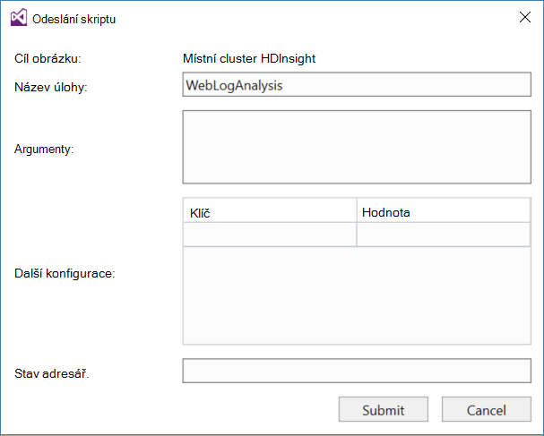

3. Po odeslání dotazu se zobrazí stav úlohy. To jak zpracovává Hadoop obsahuje informace o projektu. Položka __Stavu úlohy__ obsahuje aktuální stav projektu. Stav se aktualizuje pravidelně nebo ikonu aktualizace můžete ručně aktualizovat stav.

    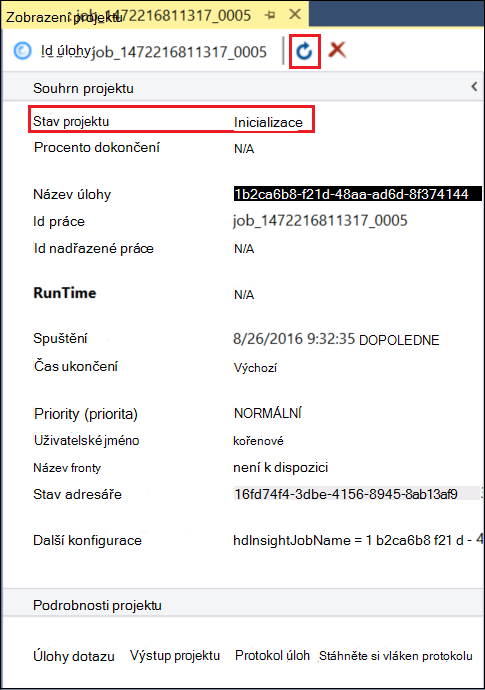

    Jakmile se __Stavem__ změní na __Dokončeno__, zobrazí se směrovány Acyklické grafu (DAG). Tento scénář vystihuje spuštění cestu, která byla určena Tez (výchozí spuštění modul podregistru místní clusteru.) 
    
    > [AZURE.NOTE] Tez je také výchozí při použití clusterů na základě Linux HDInsight. Není výchozí na serveru s Windows HDInsight; můžete ho tam, musíte přidat řádek `set hive.execution.engine = tez;` začátek podregistru dotazu. 

    Umožňuje zobrazit výstup odkaz __Výstup projektu__ . V tomto případě je __823__; počet řádků v tabulce sample_08. Diagnostické informace o projektu můžete zobrazit pomocí odkazů __Protokol úloh__ a __Stáhněte si vláken protokolu__ .

4. Můžete taky interaktivní spuštění úlohy podregistru změnou pole __dávky__ __interaktivní__a vyberte __Spustit__. 

    

    Přenáší datové proudy protokol výstup generované během zpracování do okna __HiveServer2 výstup__ .
    
    > [AZURE.NOTE] Toto je stejné informace, které neexistuje odkaz __Protokol úloh__ po dokončení projektu.

    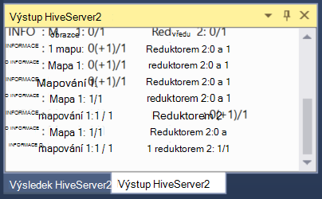

## Vytvoření projektu podregistru

Můžete taky vytvořit projekt, který obsahuje více podregistru skriptů. To je užitečná, když máte související skripty, které je potřeba mít pohromadě nebo spravovat pomocí řídicí systémy verze.

1. Ve Visual Studiu vyberte __soubor__, __Nový__a then__Project__.

2. V seznamu projektů rozbalte __šablony__ __Jezera dat Azure__ a pak vyberte __PODREGISTRU (HDInsight)__. V seznamu šablony vyberte __Podregistru vzorku__. Zadejte název a umístění a potom vyberte __OK__.

    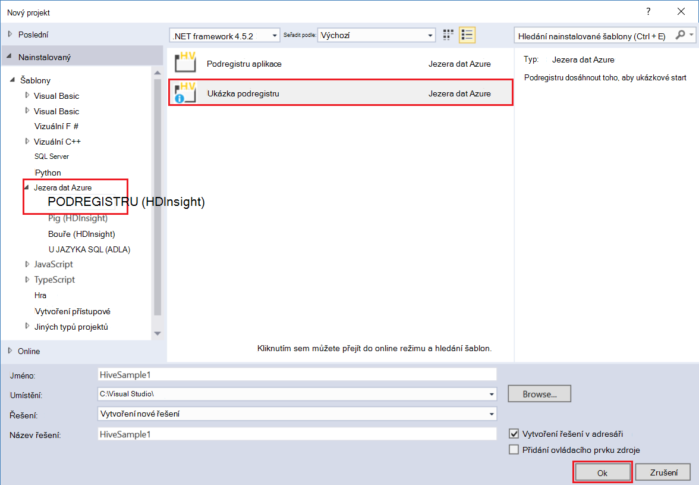

__Ukázkový podregistru__ projekt obsahuje dva skripty __WebLogAnalysis.hql__ a __SensorDataAnalysis.hql__. Můžete odeslat tyto pomocí stejného tlačítko __Odeslat__ v horní části okna.

## Vytvoření projektu Prasátko

Zatímco podregistru poskytuje jazyka SQL profesionálové pro práci s strukturovaných dat, obsahuje Prasátko jazyk (latinka Prasátko,), který umožňuje vyvíjet profilace transformace, které se použijí k datům. Pomocí následujících kroků využívat Prasátko s místní obrázku.

1. Otevřete aplikaci Visual Studio a vyberte __soubor__, __Nový__a potom __projekt__. V seznamu projektů rozbalte __šablony__ __Jezera dat Azure__a pak vyberte __Prasátko (HDInsight)__. V seznamu šablony vyberte __Prasátko aplikace__. Zadejte název, umístění a pak vyberte __OK__.

    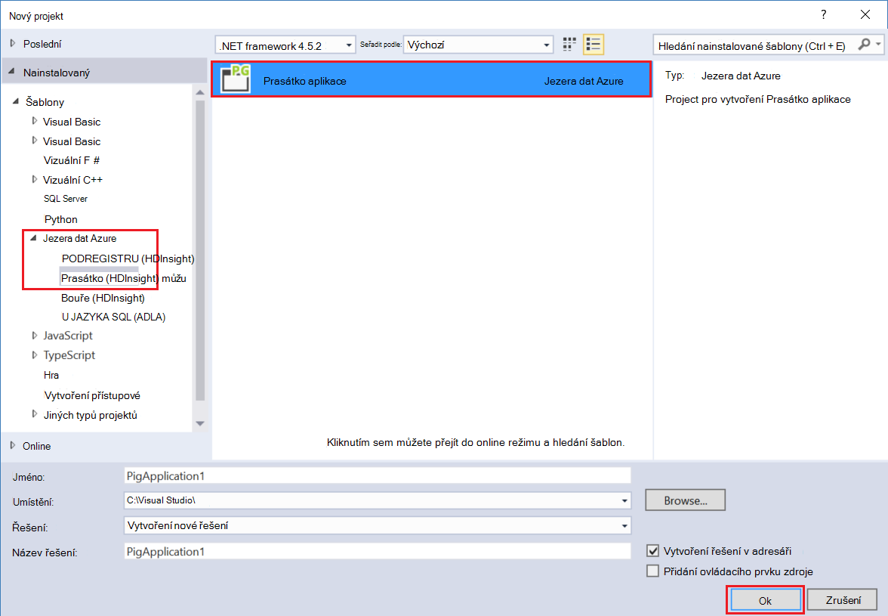

2. Zadejte následující libovolný obsah souboru __script.pig__ , který byl vytvořený pomocí tohoto projektu.

        a = LOAD '/demo/data/Website/Website-Logs' AS (
            log_id:int, 
            ip_address:chararray, 
            date:chararray, 
            time:chararray, 
            landing_page:chararray, 
            source:chararray);
        b = FILTER a BY (log_id > 100);
        c = GROUP b BY ip_address;
        DUMP c;

    Prasátko používá jiný jazyk než podregistru, způsobu spuštění úlohy je konzistentní mezi oběma jazyky prostřednictvím tlačítko __Odeslat__ . Výběr rozevíracího dolů vedle __Odeslat__ zobrazí dialogové okno Upřesnit odeslat Prasátko.

    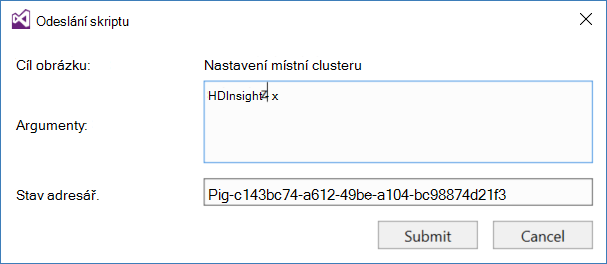
    
3. Stav projektu a výstupní se také zobrazí stejně jako podregistru dotaz.

    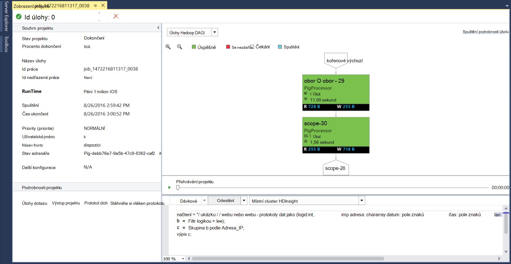

## Zobrazit úlohy

Azure datové nástroje jezera umožňují, můžete snadno zobrazit informace o úloh, které byly spustili na Hadoop. Pomocí následujících kroků najdete v tématu spuštění úlohy, které byly místní clusteru.

1. Z __Průzkumníka serveru__klikněte pravým tlačítkem myši na místní obrázku a pak vyberte __Zobrazit úlohy__. Tím zobrazíte seznam úloh, které byly odeslány do clusteru.

    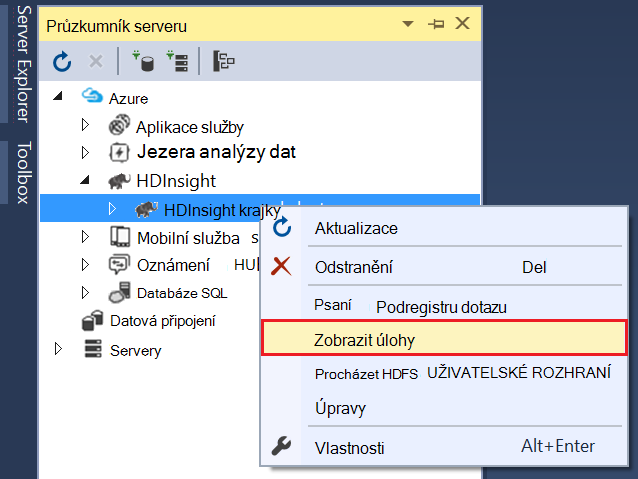

2. Ze seznamu úlohy vyberte skupinu pro zobrazení Podrobnosti projektu.

    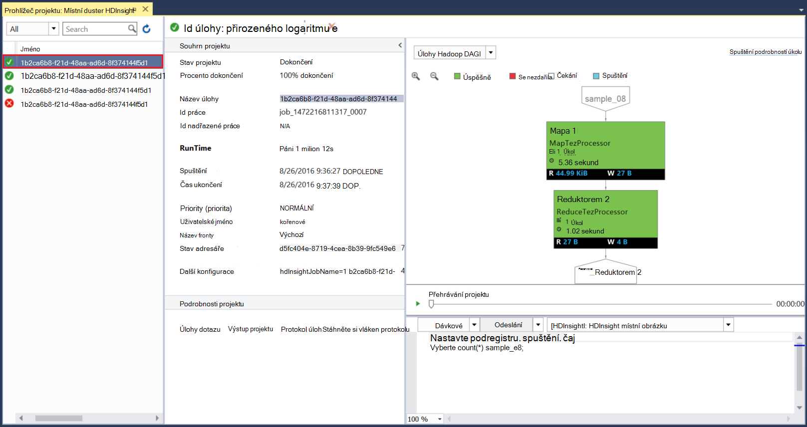

    Zobrazené informace je podobný příkazy dostupné po spuštění dotazu podregistru nebo Prasátko, včetně odkazů zobrazit výstup a přihlásit se informace.

3. Můžete taky upravovat a opětovné odeslání úlohy odsud.

## Zobrazení podregistru databází

1. V __Průzkumníku serveru__rozbalte položku __HDInsight místní obrázku__ a potom rozbalte položku __Podregistru databází__. To odkryjete __výchozí__ a __xademo__ databází na místní obrázku. Rozdělení databáze zobrazíte tabulek v databázi.

    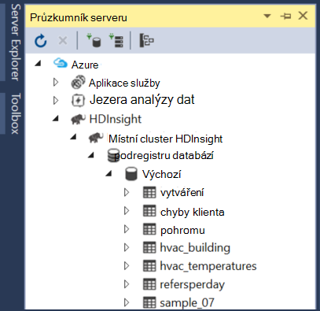

2. Rozbalení tabulky zobrazí sloupce tabulky. Můžete kliknout pravým tlačítkem tabulku a vyberte __Zobrazení horních 100 řádků__ rychle zobrazit data.

    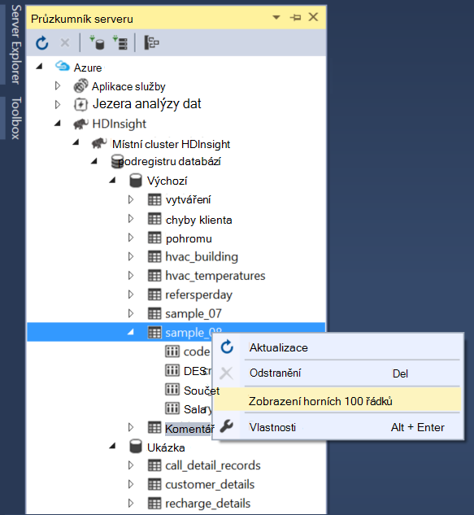

### Vlastnosti databáze a tabulky

Jste si všimli, že můžete vybrat zobrazte __Vlastnosti__ na databázi nebo tabulku. V okně Vlastnosti to bude zobrazit podrobnosti pro vybranou položku.

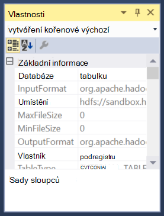

### Vytvoření tabulky

Vytvoření nové tabulky, klikněte pravým tlačítkem myši databázi a pak vyberte __Vytvořit tabulku__.

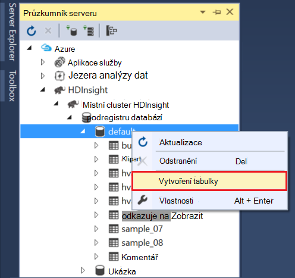

Můžete pak vytvořit tabulky pomocí formuláře. Můžete zobrazit jako nezpracovaná HiveQL, která bude použita k vytvoření tabulky v dolní části této stránky.

## Další kroky

* [Přehled výukových LAN Hortonworks izolovaného prostoru](http://hortonworks.com/hadoop-tutorial/learning-the-ropes-of-the-hortonworks-sandbox/)
* [Kurz Hadoop – začínáte pracovat s HDP](http://hortonworks.com/hadoop-tutorial/hello-world-an-introduction-to-hadoop-hcatalog-hive-and-pig/)