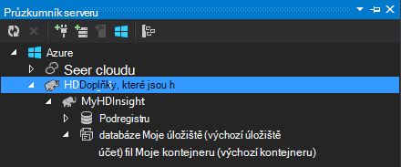

<properties
    pageTitle="Pomocí C# podregistru a Prasátko na Hadoop v HDInsight | Microsoft Azure"
    description="Naučte se používat C# funkcí definovaných uživatelem (UDF) s podregistru a Prasátko streamování v Azure HDInsight."
    services="hdinsight"
    documentationCenter=""
    authors="Blackmist"
    manager="jhubbard"
    editor="cgronlun"
    tags="azure-portal"/>

<tags
    ms.service="hdinsight"
    ms.workload="big-data"
    ms.tgt_pltfrm="na"
    ms.devlang="dotnet"
    ms.topic="article"
    ms.date="10/28/2016"
    ms.author="larryfr"/>

#Pomocí podregistru a Prasátko streamování na Hadoop v HDInsight C# funkcí definovaných uživatelem

Podregistru a Prasátko jsou skvělé pro práci s daty v Azure Hdinsightu, ale někdy budete potřebovat víc univerzální jazyk. Podregistru a Prasátko umožňují volání externí kódu pomocí funkcí definovaných uživatelem (UDF) nebo přenos.

V tomto dokumentu Naučte se používat C# s podregistru a Prasátko.

##Zjistit předpoklady pro

* Windows 7 nebo novější.

* Visual Studio s následujícími verzemi:

    * Visual Studio 2012 Professional/Premium/Ultimate s [Aktualizovat 4](http://www.microsoft.com/download/details.aspx?id=39305)

    * Visual Studio 2013 komunity/Professional/Premium/Ultimate s [Aktualizovat 4](https://www.microsoft.com/download/details.aspx?id=44921)

    * Visual Studio 2015

* Hadoop HDInsight clusteru – najdete v článku [poskytnutí HDInsight clusteru](hdinsight-provision-clusters.md) postup vytvoření clusteru

* Nástroje Hadoop for Visual Studio Postup instalace a konfigurace nástroje najdete v článku [Začínáme s používáním HDInsight Hadoop Tools for Visual Studio](hdinsight-hadoop-visual-studio-tools-get-started.md) .

##.NET na HDInsight

Ve výchozím nastavení na serveru s Windows HDInsight clusterů jsou nainstalovány .NET CLR (CLR) a rámce. Umožňuje provádět C# aplikací pomocí podregistru a Prasátko datových proudů (údajů proběhne mezi podregistru/Prasátko a C# aplikací prostřednictvím stdout/standardního).

> [AZURE.NOTE] Momentálně je nepodporuje výpočetnímu .NET Framework UDF clusterů na základě Linux HDInsight. 

##.NET a datových proudů

Přenos zahrnuje podregistru a Prasátko předávání dat do aplikace externí přes stdout a příjem výsledky prostřednictvím standardního. C# aplikací, to je snadno provést pomocí `Console.ReadLine()` a `Console.WriteLine()`.

Protože podregistru a Prasátko nutné spustit aplikaci za běhu, šablony **Aplikace konzoly** bude použito u projektů C#.

##Podregistru a C# 35;

###Vytvoření projektu C#

1. Otevřete aplikaci Visual Studio a vytvořit nové řešení. Typ projektu vyberte **Aplikaci konzoly**a název nového projektu **HiveCSharp**.

2. Nahraďte obsah **Program.cs** takto:

        using System;
        using System.Security.Cryptography;
        using System.Text;
        using System.Threading.Tasks;

        namespace HiveCSharp
        {
            class Program
            {
                static void Main(string[] args)
                {
                    string line;
                    // Read stdin in a loop
                    while ((line = Console.ReadLine()) != null)
                    {
                        // Parse the string, trimming line feeds
                        // and splitting fields at tabs
                        line = line.TrimEnd('\n');
                        string[] field = line.Split('\t');
                        string phoneLabel = field[1] + ' ' + field[2];
                        // Emit new data to stdout, delimited by tabs
                        Console.WriteLine("{0}\t{1}\t{2}", field[0], phoneLabel, GetMD5Hash(phoneLabel));
                    }
                }
                /// 

                /// Returns an MD5 hash for the given string
                /// 

                /// <param name="input">string value</param>
                /// <returns>an MD5 hash</returns>
                static string GetMD5Hash(string input)
                {
                    // Step 1, calculate MD5 hash from input
                    MD5 md5 = System.Security.Cryptography.MD5.Create();
                    byte[] inputBytes = System.Text.Encoding.ASCII.GetBytes(input);
                    byte[] hash = md5.ComputeHash(inputBytes);

                    // Step 2, convert byte array to hex string
                    StringBuilder sb = new StringBuilder();
                    for (int i = 0; i < hash.Length; i++)
                    {
                        sb.Append(hash[i].ToString("x2"));
                    }
                    return sb.ToString();
                }
            }
        }

3. Vytvoření projektu.

###Nahrajte do úložiště

1. Ve Visual Studiu spusťte **Průzkumníka serveru**.

3. Rozbalte **Azure**a potom rozbalte položku **HDInsight**.

4. Pokud se zobrazí výzva, zadejte svoje přihlašovací údaje Azure předplatného a potom klikněte na **Sign In**.

5. Rozbalte HDInsight obrázku, kterou chcete nasadit tuto aplikaci a potom rozbalte položku **Výchozí účet úložiště**.

    

6. Poklikejte na **Výchozí kontejner** clusteru. Tím otevřete nové okno, které zobrazí obsah výchozí kontejner.

7. Klikněte na ikonu upload a potom přejděte do složky **bin\debug** **HiveCSharp** projektu. Nakonec klikněte na soubor **HiveCSharp.exe** a klikněte na **Ok**.

    

8. Po dokončení nahrávání, budete moct používat aplikaci z podregistru dotazu.

###Podregistru dotazu

1. Ve Visual Studiu spusťte **Průzkumníka serveru**.

2. Rozbalte **Azure**a potom rozbalte položku **HDInsight**.

5. Klikněte pravým tlačítkem obrázku, které nasazené **HiveCSharp** aplikace a pak vyberte **vytvořit dotaz podregistru**.

6. Použijte následující podregistru dotazu:

        add file wasbs:///HiveCSharp.exe;

        SELECT TRANSFORM (clientid, devicemake, devicemodel)
        USING 'HiveCSharp.exe' AS
        (clientid string, phoneLabel string, phoneHash string)
        FROM hivesampletable
        ORDER BY clientid LIMIT 50;

    Vybere `clientid`, `devicemake`, a `devicemodel` pole můžete z `hivesampletable`a předá pole HiveCSharp.exe aplikaci. Dotaz očekává aplikaci, aby vracela tři pole, která jsou uložená jako `clientid`, `phoneLabel`, a `phoneHash`. Dotaz také očekává HiveCSharp.exe v kořenovém kontejneru výchozí úložiště (`add file wasbs:///HiveCSharp.exe`).

5. Kliknutím na možnost **Odeslat** odeslání úlohy clusteru HDInsight. Otevře se okno **Podregistru souhrn projektu** .

6. Klepnutím na tlačítko Aktualizovat na souhrn **Projektu stav** automaticky přepnul na **Dokončit**, dokud **aktualizace** . Zobrazit výstup projektu, klikněte na **Výstup projektu**.

##Prasátko a C# 35;

###Vytvoření projektu C#

1. Otevřete aplikaci Visual Studio a vytvořit nové řešení. Typ projektu vyberte **Aplikaci konzoly**a název nového projektu **PigUDF**.

2. Nahraďte obsah souboru **Program.cs** takto:

        using System;

        namespace PigUDF
        {
            class Program
            {
                static void Main(string[] args)
                {
                    string line;
                    // Read stdin in a loop
                    while ((line = Console.ReadLine()) != null)
                    {
                        // Fix formatting on lines that begin with an exception
                        if(line.StartsWith("java.lang.Exception"))
                        {
                            // Trim the error info off the beginning and add a note to the end of the line
                            line = line.Remove(0, 21) + " - java.lang.Exception";
                        }
                        // Split the fields apart at tab characters
                        string[] field = line.Split('\t');
                        // Put fields back together for writing
                        Console.WriteLine(String.Join("\t",field));
                    }
                }
            }
        }

    Tato aplikace nebude analyzovat řádky odeslané z Prasátko a přeformátovat řádků, které začínají `java.lang.Exception`.

3. Uložte **Program.cs**a potom vytvořit projekt.

###Nahrání aplikace

1. Prasátko streamování předpokládá, že aplikace místní systému souborů obrázku. Povolení připojení ke vzdálené ploše pro HDInsight obrázku a připojte k němu postupujte podle pokynů na [připojit k clusterů HDInsight pomocí RDP](hdinsight-administer-use-management-portal.md#rdp).

2. Po připojení, zkopírujte **PigUDF.exe** z adresáře **Koš/ladění** PigUDF projektu na místním počítači a vložit ho do adresáře **PIG_HOME %** na clusteru.

###Použití aplikace z Prasátko (latinka)

1. Z relace vzdálené plochy s navrhováním příkazového řádku Hadoop ikonu **Hadoop příkazového řádku** na stolním počítači.

2. Spuštění příkazového řádku Prasátko pomocí následujících akcí:

        cd %PIG_HOME%
        bin\pig

    Zobrazí se `grunt>` dotaz.

3. Zadejte tento příkaz Spustit jednoduchý Prasátko úlohy pomocí aplikace .NET Framework:

        DEFINE streamer `pigudf.exe` SHIP('pigudf.exe');
        LOGS = LOAD 'wasbs:///example/data/sample.log' as (LINE:chararray);
        LOG = FILTER LOGS by LINE is not null;
        DETAILS = STREAM LOG through streamer as (col1, col2, col3, col4, col5);
        DUMP DETAILS;

    `DEFINE` Údajů vytvoří alias `streamer` pigudf.exe aplikací a `SHIP` distribuuje mezi uzly clusteru. Později `streamer` se používá se `STREAM` operátor zpracovávat jediný řádky obsažené v protokolu a vraťte se data jako na řadu sloupců.

> [AZURE.NOTE] Název aplikace, který se používá pro přenos musí být uzavřen \` (backtick) character kdy aliasu, a "(jednoduché uvozovky) při použití s `SHIP`.

3. Po zadání posledního řádku, by měly začít projektu. Nakonec vrátí výstup podobná této:

        (2012-02-03 20:11:56 SampleClass5 [WARN] problem finding id 1358451042 - java.lang.Exception)
        (2012-02-03 20:11:56 SampleClass5 [DEBUG] detail for id 1976092771)
        (2012-02-03 20:11:56 SampleClass5 [TRACE] verbose detail for id 1317358561)
        (2012-02-03 20:11:56 SampleClass5 [TRACE] verbose detail for id 1737534798)
        (2012-02-03 20:11:56 SampleClass7 [DEBUG] detail for id 1475865947)

##Souhrn

V tomto dokumentu můžete se naučíte používat aplikaci .NET Framework z podregistru a Prasátko na HDInsight. Pokud chcete informace o použití Python s podregistru a Prasátko, najdete v článku [Použití Python s podregistru a Prasátko v HDInsight](hdinsight-python.md).

Další způsoby použití Prasátko a podregistru a informace o používání MapReduce najdete v těchto článcích:

* [Použití podregistru s HDInsight](hdinsight-use-hive.md)

* [Použití Prasátko s HDInsight](hdinsight-use-pig.md)

* [Použití MapReduce s HDInsight](hdinsight-use-mapreduce.md)
