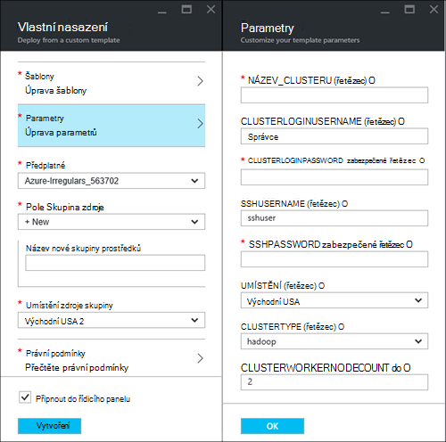
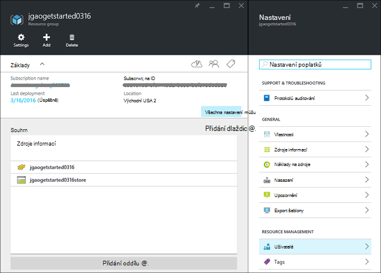
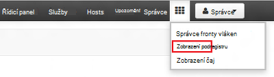
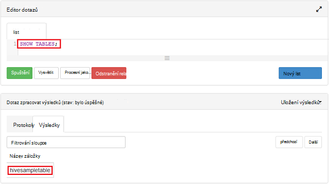

<properties
    pageTitle="Kurz Linux: Začínáme s Hadoop a podregistru | Microsoft Azure"
    description="Postupujte podle tohoto kurzu Linux začít používat Hadoop v HDInsight. Zjistěte, jak zřídit Linux clusterů a data s podregistru dotazu."
    services="hdinsight"
    documentationCenter=""
    authors="mumian"
    manager="jhubbard"
    editor="cgronlun"
    tags="azure-portal"/>

<tags
    ms.service="hdinsight"
    ms.devlang="na"
    ms.topic="hero-article"
    ms.tgt_pltfrm="na"
    ms.workload="big-data"
    ms.date="09/14/2016"
    ms.author="jgao"/>

# Kurz Hadoop: Začínáme s používáním na základě Linux Hadoop v HDInsight

> [AZURE.SELECTOR]
- [Na základě Linux](hdinsight-hadoop-linux-tutorial-get-started.md)
- [Serveru s Windows](hdinsight-hadoop-tutorial-get-started-windows.md)

Zjistěte, jak vytvořit na základě Linux [Hadoop](http://hadoop.apache.org/) clusterů v HDInsight a k tomu podregistru úlohy v HDInsight. [Apache podregistru](https://hive.apache.org/) je nejoblíbenější součást systému Hadoop ekosystému. Aktuálně HDInsight obsahuje 4 různých typů: [Hadoop](hdinsight-hadoop-introduction.md) [Spark](hdinsight-apache-spark-overview.md), [HBase](hdinsight-hbase-overview.md) a [bouře](hdinsight-storm-overview.md).  Každý typ obrázku podporuje jinou sadu součásti. Všechny typy 4 clusteru podporují podregistru. Seznam podporovaných součástí Hdinsightu najdete v tématu [Co je nového v verze obrázku Hadoop poskytovanou HDInsight?](hdinsight-component-versioning.md)  

[AZURE.INCLUDE [delete-cluster-warning](../../includes/hdinsight-delete-cluster-warning.md)]

## Zjistit předpoklady pro

Před zahájením tohoto kurzu, musíte mít:

- **Azure předplatné**: Pokud chcete vytvořit bezplatný účet zkušební měsíční, vyhledejte [azure.microsoft.com/free](https://azure.microsoft.com/free).

### Požadavky na řízení přístupu

[AZURE.INCLUDE [access-control](../../includes/hdinsight-access-control-requirements.md)]

## Vytvoření obrázku

Většina Hadoop úloh je dávkové úlohy. Vytvoření clusteru, spustit některé úlohy a potom odstraňte clusteru. V této části vytvoříte na základě Linux Hadoop obrázku v pomocí [šablony správce prostředků Azure](../resource-group-template-deploy.md)HDInsight. Správce prostředků šablona je plně přizpůsobitelného; umožňuje snadno vytvářet Azure zdrojů, jako jsou HDInsight. Správce prostředků šablony prostředí není potřeba pro po tomto kurzu. Jiné způsoby vytvoření obrázku a principy vlastnosti použité v tomto kurzu najdete v tématu [Vytvoření HDInsight clusterů](hdinsight-hadoop-provision-linux-clusters.md). Správce prostředků Šablona použitá v tomto kurzu je umístěn v kontejneru veřejné objektů blob [https://hditutorialdata.blob.core.windows.net/armtemplates/create-linux-based-hadoop-cluster-in-hdinsight.json](https://hditutorialdata.blob.core.windows.net/armtemplates/create-linux-based-hadoop-cluster-in-hdinsight.json). 

1. Klikněte na následujícím obrázku se přihlásit k Azure a otevření šablony správce na portálu Azure. 

    

2. Z zásuvné **Parametry** zadejte následující údaje:

    .

    - **Název_clusteru**: Zadejte název Hadoop obrázku, který chcete vytvořit.
    - **Shluk přihlašovací jméno a heslo**: výchozí přihlašovací jméno je **Správce**.
    - **SSH uživatelské jméno a heslo**: výchozí uživatelské jméno je **sshuser**.  Můžete ji přejmenovat. 
    
    Ostatní parametry funkce pro jsou volitelné po tomto kurzu. Můžete nechat jsou. 
    
    Každý cluster má závislost účtu úložiště objektů Blob Azure. Obvykle se označuje jako výchozí účet úložiště. HDInsight obrázku a jeho výchozí úložiště účet spoluvytváření nacházet v oblasti stejné Azure. Odstraněním clusterů nedojde k odstranění účtu úložiště. V šabloně výchozí název účtu úložiště je tato pole definovány jako název clusteru "store" přidaným. 
    
3. Kliknutím na **OK** uložte parametry.
4. Z zásuvné **Vlastní nasazení** zadejte **název nové skupiny prostředků** pro vytvoření nové skupiny prostředků.  Skupina zdroje je kontejner seskupující clusteru, účtu závislá úložiště a další s. Umístění skupiny zdroj se může lišit od umístění obrázku.
5. Klikněte na **právní podmínky**a pak klikněte na **vytvořit**.
6. Zkontrolujte **kód Pin pro řídicí panel** políčko zaškrtnuté a klikněte na **vytvořit**. Zobrazí se nová dlaždice s názvem **nasazení šablony nasazení**. Vytvoření clusteru trvá o asi 20 minut. 
7.  Po vytvoření clusteru titulek na dlaždici se změní na název skupiny zdroje, které jste zadali. A portálu automaticky otevře dva listy s clusteru a nastavení obrázku. 

    .

    Existují dva zdroje uvedené, clusteru a výchozí účet úložiště.

##Spouštění dotazů podregistru

[Apache podregistru](hdinsight-use-hive.md) je nejoblíbenější součásti použité v HDInsight. Spuštění úlohy podregistru HDInsight mnoha různými způsoby. V tomto kurzu použijete zobrazení Ambari podregistru z portálu ke spuštění některé úlohy podregistru. Jiné metody pro odeslání podregistru úlohy najdete v článku [Použití podregistru v HDInsight](hdinsight-use-hive.md).

1. Přejděte na **https://&lt;Název_clusteru >. azurehdinsight.net**, kde &lt;Název_clusteru > je clusteru jste vytvořili v předchozí části otevřete Ambari.
2. Zadejte Hadoop uživatelské jméno a heslo, které jste zadali v předchozí části. Výchozí uživatelské jméno je **Správce**.
3. Zobrazení **Podregistru** jak je vidět na následující snímek obrazovky:

    .
4. V části __Editoru dotazů__ stránku vložte následující příkazy HiveQL do sešitu:

        SHOW TABLES;

    >[AZURE.NOTE] Středník je potřeba podregistru.       
        
5. Klikněte na __Spustit__. Oddíl __Výsledky procesu dotazu__ by měl zobrazí pod editoru dotazů a zobrazení informací o projektu. 

    Po dokončení dotazu části __Obrázku výsledků dotazu__ se zobrazí výsledky operace. Zobrazí jednu tabulku s názvem **hivesampletable**. Tento ukázkovou tabulku podregistru je součástí všech clusterů HDInsight.

    .

6. Opakujte kroky 4 a 5 a spuštěním následujícího dotazu:

        SELECT * FROM hivesampletable;

    > [AZURE.TIP] Poznámka: __uložení výsledků__ rozevírací seznam v levém horním rohu oddílu __Proces výsledků dotazu__ . Můžete to stáhnout výsledky, nebo je uložíte do úložiště HDInsight do souboru CSV.

7. Klikněte na **Historie** zobrazte seznam úloh.

Po dokončení projektu podregistru můžete [Exportovat výsledky do databáze Azure SQL nebo databáze SQL serveru](hdinsight-use-sqoop-mac-linux.md), můžete také [vizualizovat výsledky kroky v Excelu](hdinsight-connect-excel-power-query.md). Další informace o používání podregistru v Hdinsightu najdete v článku [použití podregistru a HiveQL s Hadoop v HDInsight a analyzujte data ukázkový soubor log4j Apache](hdinsight-use-hive.md).

##Vyčistit kurzu

Po dokončení kurzu, můžete odstranit clusteru. S HDInsight data uložena v úložišti Azure, takže bezpečně odstraněním clusteru nepoužívá v. Můžete taky účtovány HDInsight clusteru, i když není použití. Protože poplatky za clusteru se opakovaně pokoušeli více než poplatky za úložiště, má smysl economic odstranit clusterů, pokud nejsou ve použití. 

>[AZURE.NOTE] Použití [Azure Data Factory](hdinsight-hadoop-create-linux-clusters-adf.md), můžete vytvořit HDInsight clusterů na vyžádání a konfigurovat nastavení TimeToLive odstranit clusterů automaticky. 

**Chcete-li odstranit clusteru a/nebo výchozí účet úložiště**

1. Přihlaste se k [portálu Azure](https://portal.azure.com).
2. Z portálu řídicího panelu klikněte na dlaždici s názvem zdroje, který jste použili při vytvoření clusteru.
3. Klikněte na **Odstranit** na zásuvné zdroje odstranit skupina zdroje, který obsahuje clusteru a výchozí úložiště účet; nebo klikněte na název obrázku na dlaždici **prostředky** a potom klepněte na zásuvné clusteru **Odstranit** . Osobní zprávu, odstranění skupina zdroje se odstraňte účtu úložiště. Pokud chcete zachovat účet úložiště, zvolte Odstranit pouze obrázku.

## Další kroky

V tomto kurzu jste se naučili postup vytvoření obrázku bázi Linux HDInsight pomocí šablony správce prostředků a jak provádět základní podregistru dotazů.

Další informace o analýze dat s HDInsight, najdete v těchto článcích:

- Další informace o použití podregistru s HDInsight, včetně jak provádět podregistru dotazy z aplikace Visual Studio, najdete v článku [Použití podregistru s HDInsight][hdinsight-use-hive].

- Další informace o Prasátko jazyk, který používá k transformaci dat, najdete v článku [Použití Prasátko s HDInsight][hdinsight-use-pig].

- Další informace o MapReduce způsob, jak psát programy, které zpracovávají data na Hadoop, najdete v článku [Použití MapReduce s HDInsight][hdinsight-use-mapreduce].

- Informace o používání nástroje HDInsight for Visual Studio k analýze dat na Hdinsightu najdete v tématu [Začínáme s používáním aplikace Visual Studio Hadoop nástroje pro HDInsight](hdinsight-hadoop-visual-studio-tools-get-started.md).

Pokud budete chtít začít pracovat s vlastními daty a potřebujete dozvědět víc o tom, jak ukládá HDInsight nebo jak lze získat data do HDInsight, najdete v těchto článcích:

- Informace o použití úložišti objektů blob Azure Hdinsightu najdete v tématu [úložiště objektů Blob Azure použití s HDInsight](hdinsight-hadoop-use-blob-storage.md).

- Informace o tom, jak nahrát dat k Hdinsightu najdete v tématu [Odeslat data k Hdinsightu][hdinsight-upload-data].

Pokud chcete další informace o vytváření a správa HDInsight clusteru, najdete v těchto článcích:

- Další informace o správě svůj cluster na základě Linux HDInsight, najdete v článku [Správa HDInsight clusterů pomocí Ambari](hdinsight-hadoop-manage-ambari.md).

- Další informace o možnostech, které můžete vybrat při vytváření HDInsight clusteru, najdete v článku [Vytvoření HDInsight na Linux pomocí vlastních možností](hdinsight-hadoop-provision-linux-clusters.md).

- Pokud se seznámíte s Linux a Hadoop, ale chcete se dozvědět, podrobnosti o Hadoop na HDInsight, najdete v článku [práce s HDInsight na Linux](hdinsight-hadoop-linux-information.md). To obsahuje informace, jako:

    * Adresy URL služby hostované na obrázku, například Ambari a WebHCat
    * Umístění souborů Hadoop a příklady místního systému souborů
    * Použití z Azure úložiště (WASB) místo HDFS jako výchozí data obsahují

[1]: ../HDInsight/hdinsight-hadoop-visual-studio-tools-get-started.md

[hdinsight-provision]: hdinsight-provision-clusters.md
[hdinsight-admin-powershell]: hdinsight-administer-use-powershell.md
[hdinsight-upload-data]: hdinsight-upload-data.md
[hdinsight-use-mapreduce]: hdinsight-use-mapreduce.md
[hdinsight-use-hive]: hdinsight-use-hive.md
[hdinsight-use-pig]: hdinsight-use-pig.md

[powershell-download]: http://go.microsoft.com/fwlink/p/?linkid=320376&clcid=0x409
[powershell-install-configure]: powershell-install-configure.md
[powershell-open]: powershell-install-configure.md#Install

[img-hdi-dashboard]: ./media/hdinsight-hadoop-tutorial-get-started-windows/HDI.dashboard.png
[img-hdi-dashboard-query-select]: ./media/hdinsight-hadoop-tutorial-get-started-windows/HDI.dashboard.query.select.png
[img-hdi-dashboard-query-select-result]: ./media/hdinsight-hadoop-tutorial-get-started-windows/HDI.dashboard.query.select.result.png
[img-hdi-dashboard-query-select-result-output]: ./media/hdinsight-hadoop-tutorial-get-started-windows/HDI.dashboard.query.select.result.output.png
[img-hdi-dashboard-query-browse-output]: ./media/hdinsight-hadoop-tutorial-get-started-windows/HDI.dashboard.query.browse.output.png
[image-hdi-clusterstatus]: ./media/hdinsight-hadoop-tutorial-get-started-windows/HDI.ClusterStatus.png
[image-hdi-gettingstarted-powerquery-importdata]: ./media/hdinsight-hadoop-tutorial-get-started-windows/HDI.GettingStarted.PowerQuery.ImportData.png
[image-hdi-gettingstarted-powerquery-importdata2]: ./media/hdinsight-hadoop-tutorial-get-started-windows/HDI.GettingStarted.PowerQuery.ImportData2.png
