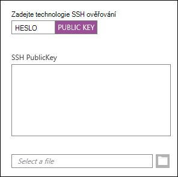
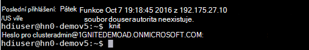
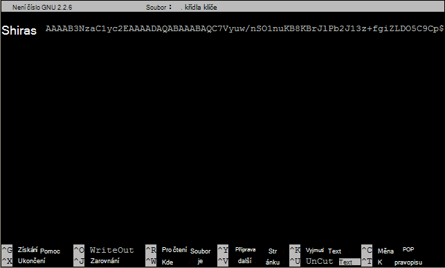

<properties
   pageTitle="S operačním systémem Linux Hadoop z OS X, Linux a Unix pomocí SSH klíčů | Microsoft Azure"
   description=" Můžete použít HDInsight systémem Linux pomocí Secure Shell (SSH). Tento dokument obsahuje informace o použití SSH klientů Linux a Unix, OS X s HDInsight."
   services="hdinsight"
   documentationCenter=""
   authors="Blackmist"
   manager="jhubbard"
   editor="cgronlun"
    tags="azure-portal"/>

<tags
   ms.service="hdinsight"
   ms.devlang="na"
   ms.topic="get-started-article"
   ms.tgt_pltfrm="na"
   ms.workload="big-data"
   ms.date="09/13/2016"
   ms.author="larryfr"/>

#<a name="use-ssh-with-linux-based-hadoop-on-hdinsight-from-linux-unix-or-os-x"></a>Použití SSH s operačním systémem Linux Hadoop v HDInsight z OS X, Linux a Unix

> [AZURE.SELECTOR]
- [Systém Windows](hdinsight-hadoop-linux-use-ssh-windows.md)
- [Linux, Unix, OS X](hdinsight-hadoop-linux-use-ssh-unix.md)

[Secure Shell (SSH)](https://en.wikipedia.org/wiki/Secure_Shell) umožňuje vzdáleně provádět operace na bázi Linux HDInsight clusterů pomocí rozhraní příkazového řádku. Tento dokument obsahuje informace o použití SSH klientů Linux a Unix, OS X s HDInsight.

> [AZURE.NOTE] Kroky v tomto článku se předpokládá, že používáte klienta Linux a Unix, OS X. Takto mohou provádět v počítači klienta se systémem Windows, pokud jste nainstalovali balíček, který obsahuje `ssh` a `ssh-keygen`, například [flám na Windows se systémem Ubuntu](https://msdn.microsoft.com/commandline/wsl/about).
>
> Pokud nemáte SSH nainstalována v klientovi se systémem Windows, postupujte podle kroků v [Pomocí SSH s operačním systémem Linux HDInsight (Hadoop) v systému Windows](hdinsight-hadoop-linux-use-ssh-windows.md) Další informace o instalaci a použití nátěrové.

##<a name="prerequisites"></a>Předpoklady

* **SSH-keygen** a **ssh** pro OS X, Linux a Unix klienty. Tohoto nástroje jsou obvykle poskytovány s operačním systémem, nebo je k dispozici prostřednictvím systému správy balíčku.

* Moderní webový prohlížeč, který podporuje HTML5.

NEBO

* [Azure CLI](../xplat-cli-install.md).

    [AZURE.INCLUDE [use-latest-version](../../includes/hdinsight-use-latest-cli.md)] 

##<a name="what-is-ssh"></a>Co je SSH?

SSH je nástroj pro přihlašování k a vzdáleným spuštěním příkazů na vzdáleném serveru. S operačním systémem Linux HDInsight SSH vytváří šifrované připojení ke clusteru headnode a poskytuje příkazového řádku, které umožňují zadat příkazy. Poté jsou provedeny příkazy přímo na serveru.

###<a name="ssh-user-name"></a>Uživatelské jméno SSH

SSH uživatelské jméno je jméno, které používáte k ověření clusteru HDInsight. Pokud zadáte uživatelské jméno SSH během vytváření clusteru, tento uživatel je vytvořen ve všech uzlech v clusteru. Po vytvoření clusteru můžete použít toto uživatelské jméno pro připojení k HDInsight cluster headnodes. Z headnodes lze potom připojit k uzly jednotlivých pracovníků.

###<a name="ssh-password-or-public-key"></a>Heslo SSH nebo veřejný klíč

Uživatele služby SSH můžete použít heslo nebo veřejný klíč pro ověření. Heslo je řetězec textu, který se tvoří, zatímco veřejný klíč je součástí páru kryptografických klíčů pro jednoznačnou identifikaci je generována.

Klíč je bezpečnější než heslo, však vyžaduje další kroky ke generování klíče a musí udržovat soubory obsahující klíče v zabezpečeném umístění. Každý uživatel získá přístup k soubory klíčů, získají přístup k vašemu účtu. Nebo pokud dojde ke ztrátě důležitých souborů, nebudete moci přihlásit ke svému účtu.

Dvojice klíčů se skládá z veřejného klíče (který je odeslán na server pro HDInsight) a soukromý klíč (který je veden v klientském počítači.) Při připojení k serveru HDInsight pomocí SSH SSH klienta pomocí soukromého klíče v počítači provést ověření se serverem.

##<a name="create-an-ssh-key"></a>Vytvořit klíč SSH

Pokud chcete pomocí SSH klíče clusteru, použijte následující informace. Pokud plánujete použití hesla, můžete tuto část vynechat.

1. Otevřete relaci Terminálové služby a zadejte následující příkaz, chcete-li zobrazit, pokud máte jakékoli existující klíče SSH:

        ls -al ~/.ssh

    Vyhledejte následující soubory v seznamu adresáře. Jedná se o běžné názvy veřejných klíčů SSH.

    * ID\_dsa.pub
    * ID\_ecdsa.pub
    * ID\_ed25519.pub
    * ID\_rsa.pub

2. Pokud nechcete použít existující soubor nebo jste žádné existující klíče SSH, použijte ke generování nového souboru následující:

        ssh-keygen -t rsa

    Zobrazí se výzva pro následující informace:

    * Soubor – umístění je výchozím umístěním ~/.ssh/id\_rsa.
    * A heslo - budete vyzváni znovu zadat to.

        > [AZURE.NOTE] Důrazně doporučujeme použít zabezpečené heslo pro klíč. Však pokud heslo zapomenete, neexistuje žádný způsob, jak obnovit.

    Po dokončení příkazu, bude mít dva nové soubory, soukromý klíč (například **id\_rsa**) a veřejný klíč (například **id\_rsa.pub**).

##<a name="create-a-linux-based-hdinsight-cluster"></a>Vytvoření clusteru Linux-based HDInsight

Při vytváření clusteru HDInsight systémem Linux, je nutné zadat veřejný klíč, který jste vytvořili dříve. Od klientů Linux a Unix, OS X existují dva způsoby k vytvoření clusteru HDInsight:

* **Portál azure** - webový portál použije k vytvoření clusteru.

* **Rozhraní příkazového řádku azure pro Mac, Linux a Windows** - používá příkazy příkazového řádku k vytvoření clusteru.

Každá z těchto metod vyžaduje heslo nebo veřejný klíč. Úplné informace týkající se vytvoření clusteru HDInsight systémem Linux viz [clustery HDInsight na základě ustanovení Linux](hdinsight-hadoop-provision-linux-clusters.md).

###<a name="azure-portal"></a>Portál Azure

Při použití [Portálu Azure] [ preview-portal] k vytvoření clusteru HDInsight systémem Linux, musíte zadat **SSH uživatelské jméno**a vyberte, chcete-li zadat **heslo** nebo **SSH veřejný klíč**.

Pokud vyberete **SSH veřejný klíč**, je vložit do pole __SSH PublicKey__ veřejný klíč (obsažené v souboru s příponou **pub** ), nebo vyberte možnost Procházet a vyberte soubor veřejného klíče __Vyberte soubor__ .



> [AZURE.NOTE] Soubor klíče je jednoduše textový soubor. Obsah by měl vypadat podobná následující:
> ```
ssh-rsa AAAAB3NzaC1yc2EAAAADAQABAAABAQCelfkjrpYHYiks4TM+r1LVsTYQ4jAXXGeOAF9Vv/KGz90pgMk3VRJk4PEUSELfXKxP3NtsVwLVPN1l09utI/tKHQ6WL3qy89WVVVLiwzL7tfJ2B08Gmcw8mC/YoieT/YG+4I4oAgPEmim+6/F9S0lU2I2CuFBX9JzauX8n1Y9kWzTARST+ERx2hysyA5ObLv97Xe4C2CQvGE01LGAXkw2ffP9vI+emUM+VeYrf0q3w/b1o/COKbFVZ2IpEcJ8G2SLlNsHWXofWhOKQRi64TMxT7LLoohD61q2aWNKdaE4oQdiuo8TGnt4zWLEPjzjIYIEIZGk00HiQD+KCB5pxoVtp user@system
> ```

Tím se vytvoří přihlašovací jméno pro zadaného uživatele pomocí hesla nebo veřejný klíč, který zadáte.

###<a name="azure-command-line-interface-for-mac-linux-and-windows"></a>Azure rozhraní příkazového řádku pro Mac, Linux a Windows

Můžete použít k vytvoření nového clusteru pomocí [Rozhraní příkazového řádku Azure pro Mac, Linux a Windows](../xplat-cli-install.md) `azure hdinsight cluster create` příkaz.

Další informace o použití tohoto příkazu naleznete v tématu [clustery Linux je Hadoop v HDInsight pomocí možnosti vlastní](hdinsight-hadoop-provision-linux-clusters.md).

##<a name="connect-to-a-linux-based-hdinsight-cluster"></a>Připojte se ke clusteru HDInsight se systémem Linux

Z relace Terminálové služby pomocí příkazu SSH připojení ke clusteru headnode poskytnutím adresu a uživatelské jméno:

* **SSH adresa** - existují dvě adresy, které mohou být použity pro připojení ke clusteru pomocí SSH:

    * **Připojit headnode**: název clusteru, následuje **-ssh.azurehdinsight.net**. Například **ssh.azurehdinsight.net clusteru**.
    
    * **Připojit k uzlu okraj**: Pokud cluster HDInsight R serveru, clusteru bude také obsahovat okraj uzlu, který je přístupný pomocí **RServer.CLUSTERNAME.ssh.azurehdinsight.net**, kde __NÁZEV_CLUSTERU__ představuje název clusteru.

* **Uživatelské jméno** - The SSH uživatelské jméno, které jste zadali při vytvoření clusteru.

Následující příklad připojí k primární headnode z **clusteru** jako uživatel **me**:

    ssh me@mycluster-ssh.azurehdinsight.net

Pokud jste použili heslo pro uživatelský účet, budete vyzváni k zadání hesla.

Pokud jste použili SSH klíč, který je zabezpečený pomocí přístupové heslo, budete vyzváni k zadání přístupové heslo. Jinak SSH se pokusí automaticky ověřit pomocí jedné z místních soukromých klíčů v klientovi.

> [AZURE.NOTE] Pokud SSH neověřuje automaticky správným soukromým klíčem, použijte parametr **-i** a zadat cestu k soukromému klíči. Následující příklad načte soukromého klíče z `~/.ssh/id_rsa`:
>
> `ssh -i ~/.ssh/id_rsa me@mycluster-ssh.azurehdinsight.net`

Pokud se připojujete pomocí adresy headnode a není port určen, bude výchozí SSH port 22, který se připojí k primární headnode v clusteru HDInsight. Pokud používáte port 23, se připojí k sekundární. Další informace o headnodes viz [dostupnost a spolehlivost clustery Hadoop v HDInsight](hdinsight-high-availability-linux.md).

###<a name="connect-to-worker-nodes"></a>Připojit k pracovní uzly

Pracovní uzly nejsou přímo přístupné z mimo Azure datacenter, ale lze k nim z headnode clusteru přes SSH.

Pokud použijete SSH klíč k ověření vašeho uživatelského účtu, je nutné provést následující kroky v klientovi:

1. Pomocí textového editoru otevřete `~/.ssh/config`. Pokud tento soubor neexistuje, můžete jej vytvořit zadáním `touch ~/.ssh/config` v terminálu.

2. Přidejte následující do souboru. *NÁZEV_CLUSTERU* nahraďte název clusteru HDInsight.

        Host CLUSTERNAME-ssh.azurehdinsight.net
          ForwardAgent yes

    To nakonfiguruje SSH agent předávající pro HDInsight cluster.

3. Test SSH agent předávající pomocí následujícího příkazu v terminálu:

        echo "$SSH_AUTH_SOCK"

    To by vrátit za podobná následující informace:

        /tmp/ssh-rfSUL1ldCldQ/agent.1792

    Pokud nic je vrácena, znamená to, že **ssh-agent** není spuštěn. Konkrétní postup instalace a konfigurace **ssh agenta**naleznete v dokumentaci operačního systému nebo naleznete v tématu [použití ssh-agent s ssh](http://mah.everybody.org/docs/ssh).

4. Jakmile ověříte, že **ssh-agent** spuštěn, použijte následující doplnit váš osobní klíč SSH agent:

        ssh-add ~/.ssh/id_rsa

    Pokud soukromý klíč je uložen v jiném souboru, nahraďte `~/.ssh/id_rsa` s cestou k souboru.

Následující kroky slouží k připojení k pracovní uzly clusteru.

> [AZURE.IMPORTANT] Pokud použijete SSH klíč k ověření vašeho účtu, musíte dokončit předchozích kroků ověřte, že agent předávající pracuje.

1. Připojte se ke clusteru HDInsight pomocí SSH, jak je popsáno výše.

2. Jakmile se připojíte, pomocí následujících načíst seznam uzlů v clusteru. *ADMINPASSWORD* nahraďte heslo pro účet Správce clusteru. Nahraďte název cluster *NÁZEV_CLUSTERU* .

        curl --user admin:ADMINPASSWORD https://CLUSTERNAME.azurehdinsight.net/api/v1/hosts

    Vrátí informace ve formátu JSON pro uzly v clusteru, včetně `host_name`, který obsahuje úplný doménový název (FQDN) pro každý uzel. Následuje příklad `host_name` položky vrácené příkazem **otáčení** :

        "host_name" : "workernode0.workernode-0-e2f35e63355b4f15a31c460b6d4e1230.j1.internal.cloudapp.net"

3. Jakmile seznam uzlů pracovníka, který chcete připojit k použijte následující příkaz SSH relace na serveru otevřít připojení k uzlu pracovníka:

        ssh USERNAME@FQDN

    Nahraďte *uživatelské jméno* uživatelské jméno SSH a *plně kvalifikovaný název domény* s plně kvalifikovaný název domény pro uzel pracovníka. Například `workernode0.workernode-0-e2f35e63355b4f15a31c460b6d4e1230.j1.internal.cloudapp.net`.

    > [AZURE.NOTE] Pokud používáte heslo pro ověřování SSH relace, zobrazí se výzva k zadání hesla znovu. Pokud byl klíč SSH připojení by měly být dokončeny bez zobrazování výzev.

4. Po navázání relace terminálového řádku změní z `username@hn#-clustername` k `username@wk#-clustername` k označení, zda jste připojeni k uzlu pracovní. Všechny příkazy, které spustíte v tomto okamžiku bude spuštěn v uzlu pracovní.

4. Po dokončení provádění akcí v uzlu pracovník použít `exit` příkaz pro ukončení relace uzlu pracovní. Tím se vrátíte do `username@hn#-clustername` řádku.

## <a name="connect-to-a-domain-joined-hdinsight-cluster"></a>Připojte se ke clusteru HDInsight doméně

[Doméně HDInsight](hdinsight-domain-joined-introduction.md) integruje s Hadoop v HDInsight pomocí protokolu Kerberos. Vzhledem k tomu, že SSH uživatel není pro uživatele domény služby Active Directory, tento uživatelský účet nelze spustit příkazy Hadoop z SSH shell v doméně clusteru přímo. Nejprve je nutné spustit *kinit* . 

**Podregistr spustit dotazy na clusteru HDInsight doméně pomocí SSH**

1. Připojení ke clusteru HDInsight doméně pomocí SSH.  Instrocutions viz [připojení ke clusteru HDInsight se systémem Linux](#connect-to-a-linux-based-hdinsight-cluster).
2. Spusťte kinit. Jej zobrazí výzvu pro domény, uživatelské jméno a heslo uživatele domény. Další informace o konfiguraci uživatelů domény k doméně HDInsight clusterů naleznete v tématu [clusterů konfigurovat doméně HDInisight](hdinsight-domain-joined-configure.md).

    
3. Otevřete podregistr zadejte konzole:

        hive

    Potom můžete spustit příkazy podregistru.

##<a name="add-more-accounts"></a>Přidat další účty

1. Generovat nový veřejný klíč a soukromý klíč pro nový uživatelský účet, jak je popsáno v části [Vytvoření SSH klíč](#create-an-ssh-key-optional) .

    > [AZURE.NOTE] Soukromé klíče by měly být generovány buď v klientském počítači, který uživatel bude používat pro připojení ke clusteru nebo bezpečně přenesena do takového klienta po vytvoření.

1. V relaci SSH do clusteru přidáte nového uživatele pomocí následujícího příkazu:

        sudo adduser --disabled-password <username>

    Vytvoří nový uživatelský účet, ale zakáže ověřování pomocí hesla.

2. Vytvoření adresáře a soubory podržte klávesu pomocí následujících příkazů:

        sudo mkdir -p /home/<username>/.ssh
        sudo touch /home/<username>/.ssh/authorized_keys
        sudo nano /home/<username>/.ssh/authorized_keys

3. Když se otevře nano editor, zkopírujte a vložte obsah veřejný klíč pro nový uživatelský účet. Nakonec pomocí **Ctrl-X** soubor uložte a ukončete editor.

    

4. Chcete-li změnit vlastnictví .ssh složky a obsah do nového uživatelského účtu, zadejte následující příkaz:

        sudo chown -hR <username>:<username> /home/<username>/.ssh

5. Nyní byste měli být schopni ověřování na serveru s nový uživatelský účet a soukromý klíč.

##<a id="tunnel"></a>Tunelové propojení SSH

SSH lze použít k vytvoření tunelového propojení místní požadavky, jako jsou například webové požadavky na HDInsight cluster. Žádosti pak budou směrovány k požadovanému prostředku jako by bylo provedeno na HDInsight cluster headnode.

> [AZURE.IMPORTANT] Tunelové propojení SSH je vyžadováno pro přístup k webové uživatelské rozhraní pro některé služby Hadoop. Například na UI historie úloh nebo správce prostředků uživatelského rozhraní lze přistupovat pouze pomocí tunelového propojení protokolu SSH.

Další informace o vytváření a používání tunelového propojení protokolu SSH naleznete v tématu [Použití SSH tunelového propojení pro přístup k Ambari webového uživatelského rozhraní, ResourceManager, JobHistory, NameNode, Oozie a ostatní webové uživatelské rozhraní v](hdinsight-linux-ambari-ssh-tunnel.md).

##<a name="next-steps"></a>Další kroky

Nyní, když chápete jak ověřit pomocí klávesy SSH, zjistěte, jak pomocí MapReduce Hadoop v HDInsight.

* [Podregistr pomocí HDInsight](hdinsight-use-hive.md)

* [Prasat pomocí HDInsight](hdinsight-use-pig.md)

* [MapReduce úlohy pomocí HDInsight](hdinsight-use-mapreduce.md)

[preview-portal]: https://portal.azure.com/
