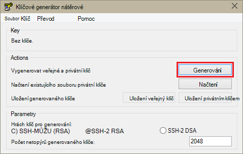
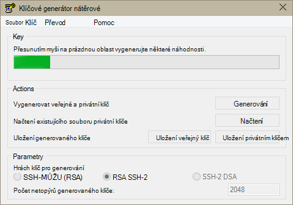
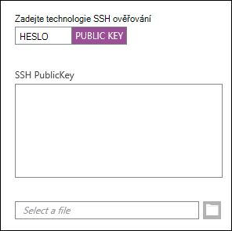
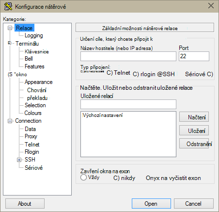
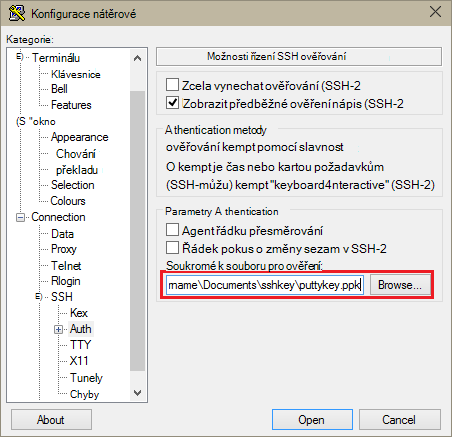
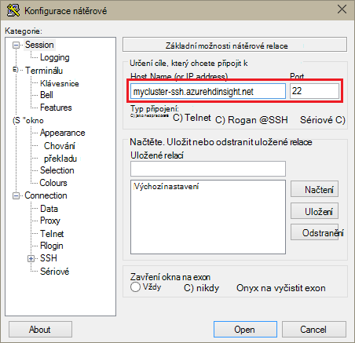
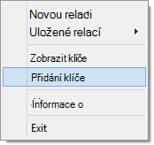
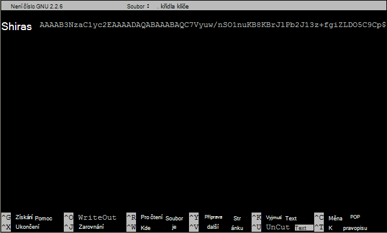

<properties
   pageTitle="Pomocí kláves SSH s Hadoop na základě Linux clusterů z Windows | Microsoft Azure"
   description="Naučte se vytvářet a klávesami SSH ověřování na základě Linux HDInsight clusterů. Připojení clusterů pomocí klienta SSH nátěrové klientů serveru s Windows."
   services="hdinsight"
   documentationCenter=""
   authors="Blackmist"
   manager="jhubbard"
   editor="cgronlun"
    tags="azure-portal"/>

<tags
   ms.service="hdinsight"
   ms.devlang="na"
   ms.topic="get-started-article"
   ms.tgt_pltfrm="na"
   ms.workload="big-data"
   ms.date="08/30/2016"
   ms.author="larryfr"/>

#Použití SSH s Hadoop Linux založené na HDInsight z Windows

> [AZURE.SELECTOR]
- [Windows](hdinsight-hadoop-linux-use-ssh-windows.md)
- [Linux, Unix OS X](hdinsight-hadoop-linux-use-ssh-unix.md)

[Zabezpečené prostředí (SSH)](https://en.wikipedia.org/wiki/Secure_Shell) umožňuje vzdáleně provádění operací na základě Linux HDInsight clusterů pomocí rozhraní příkazového řádku. Tento dokument obsahuje informace o připojení k Hdinsightu klientů serveru s Windows pomocí klienta SSH nátěrové.

> [AZURE.NOTE] Kroky v tomto článku se předpokládá, že používáte klienta serveru s Windows. Pokud používáte klienta Linux, Unix nebo OS X, přečtěte si článek [Použití SSH s Hadoop Linux založené na HDInsight z Linux, Unix nebo OS X](hdinsight-hadoop-linux-use-ssh-unix.md).
>
> Pokud máte Windows 10 a používáte [flám na systémem Ubuntu v systému Windows](https://msdn.microsoft.com/commandline/wsl/about), můžete pomocí postupu v dokumentu [Pomocí SSH s Hadoop Linux založené na HDInsight z Linux, Unix nebo OS X](hdinsight-hadoop-linux-use-ssh-unix.md) .

##Zjistit předpoklady pro

* **Nátěrové** a **PuTTYGen** pro klienty serveru s Windows. Tyto nástroje jsou k dispozici [http://www.chiark.greenend.org.uk/~sgtatham/putty/download.html](http://www.chiark.greenend.org.uk/~sgtatham/putty/download.html).

* Moderní webového prohlížeče, který podporuje HTML5.

NEBO

* [Azure rozhraní příkazového řádku](../xplat-cli-install.md).

    [AZURE.INCLUDE [use-latest-version](../../includes/hdinsight-use-latest-cli.md)] 

##Co je SSH?

SSH je nástroj pro přihlášení ke a vzdáleně provádění příkazů na vzdálený server. Na základě Linux HDInsight SSH naváže šifrované připojení k hlavy clusteru a poskytuje příkazový řádek, které používáte pro zadání v příkazech. Příkazy jsou potom spouštět přímo na serveru.

###SSH uživatelského jména

Uživatelské jméno SSH je název, který použijete k ověření clusteru HDInsight. Při zadání uživatelského jména SSH během vytváření clusteru tohoto uživatele se vytvoří ve všech uzlech clusteru. Po vytvoření clusteru můžete se připojit k uzlů hlavy HDInsight toto uživatelské jméno. Z hlavy uzlů můžete pak připojíte k uzly zaměstnance.

###SSH heslo nebo veřejný klíč

Uživatel aplikace SSH můžete použít heslo nebo veřejný klíč pro ověřování. Hesla se jenom textový řetězec, které vytvoříte, zatímco veřejným klíčem je součástí kryptografický klíčový pár vytvořený jednoznačně identifikovat.

Klíč je bezpečnější než heslo, ale vyžaduje další kroky pro generování klíče a musí spravovat soubory, které obsahuje klíč na zabezpečeném místě. Pokud všichni získá přístup ke svým souborům klíče, budou získat přístup ke svému účtu. Nebo pokud zapomenete soubory klíčů, nebude možné přihlásit ke svému účtu.

Klíčový pár se skládá z veřejný klíč (který se odesílá na server HDInsight) a privátním klíčem, (které bude k dispozici v klientském počítači.) Při připojení k serveru HDInsight pomocí SSH klient SSH používat k ověření se serverem privátním klíčem ve vašem počítači.

##Vytvoření SSH klíče

Pokud nebudete chtít použít SSH s svůj cluster, použijte následující informace. Pokud nebudete chtít pomocí hesla, můžete tuto část přeskočit.

1. Otevřete PuTTYGen.

2. Jako **Typ klíče generovat**vyberte **RSA SSH-2**a potom klikněte na **Generovat**.

    

3. Přesuňte ukazatel myši v oblasti pod pruh průběhu panelu výplně. Přesunutí myši vygeneruje náhodné data, která bude použito k vygenerování klávesu.

    

    Po vytvoření klávesu se zobrazí veřejným klíčem.

4. Zvýšit zabezpečení můžete do pole **klíč přístupové heslo** zadejte heslo a pak zadejte stejné hodnoty v poli **Potvrdit heslo** .

    

    > [AZURE.NOTE] Důrazně doporučujeme použít zabezpečené heslo pro klávesu. Ale pokud zapomenete heslo, nejde žádným způsobem jeho obnovení.

5. Klepnutím na tlačítko Uložit klíč do souboru **.ppk** **Uložit privátním klíčem** . Tento klíč se použijí k ověřování na základě Linux HDInsight obrázku.

    > [AZURE.NOTE] Měli byste ukládat tento klíč na zabezpečeném místě jako mohou sloužit k přístupu na základě Linux HDInsight obrázku.

6. Klepnutím na tlačítko Uložit klávesu jako soubor **txt** **Uložit veřejným klíčem** . Umožňuje provádět v budoucnu znovu veřejným klíčem při vytváření další clusterů na základě Linux HDInsight.

    > [AZURE.NOTE] Veřejný klíč se také zobrazí v horní části PuTTYGen. Klikněte pravým tlačítkem myši v tomto poli, zkopírujte hodnotu a potom je vložte do formuláře při vytváření obrázku na portálu Azure.

##Vytvoření obrázku na základě Linux HDInsight

Při vytváření na základě Linux HDInsight clusteru, je nutné zadat veřejným klíčem vytvořili v předchozích krocích. Klientů serveru s Windows existují dva způsoby, jak vytvořit na základě Linux HDInsight obrázku:

* **Portál azure** – slouží k vytváření clusteru portál založené na webu.

* **Azure rozhraní příkazového řádku pro Mac a Linux Windows** – slouží příkazy k vytváření clusteru.

Každá z těchto metod budou vyžadovat veřejným klíčem. Podrobné informace o vytváření clusteru na základě Linux Hdinsightu najdete v článku [clusterů na základě poskytování Linux HDInsight](hdinsight-hadoop-provision-linux-clusters.md).

###Azure portálu

Při použití [Portálu Azure] [ preview-portal] k vytvoření na základě Linux HDInsight clusteru, musíte zadejte **SSH jména**a vyberte k zadání **HESLA** nebo **SSH VEŘEJNÝM klíčem**.

Pokud vyberete **SSH VEŘEJNÝM klíčem**, můžete buď vložit veřejný klíč (zobrazené v __veřejný klíč pro vložení do funkci OpenSSH oprávnění\_klíče soubor__ pole v PuttyGen,) do pole __SSH PublicKey__ nebo vyberte __Vyberte soubor__ Procházet a vyberte soubor, který obsahuje veřejný klíč.

Vytvoří přihlašovací jméno pro zadaný uživatel a umožňuje ověřování hesla nebo SSH ověřování klíče.

###Azure rozhraní příkazového řádku pro Windows, Mac a Linux

[Azure rozhraní příkazového řádku pro Mac a Linux Windows](../xplat-cli-install.md) můžete použít k vytvoření nového clusteru pomocí `azure hdinsight cluster create` příkaz.

Další informace o použití tohoto příkazu najdete v článku [poskytnutí Hadoop Linux clusterů HDInsight pomocí vlastních možností](hdinsight-hadoop-provision-linux-clusters.md).

##Připojení k obrázku na základě Linux HDInsight

1. Otevřete nátěrové.

    

2. Pokud jste SSH klíč po vytvoření uživatelského účtu, postupujte podle následujících pokynů vyberte privátním klíčem používat při ověřování obrázku:

    V seznamu **kategorie**rozbalte **připojení**, rozbalte **SSH**a vyberte **Auth**. Nakonec klikněte na tlačítko **Procházet** a vyberte .ppk soubor, který obsahuje privátním klíčem.

    

3. V seznamu **kategorie**vyberte **relace**. Na obrazovce **základní možnosti relaci nátěrové** zadejte do pole **název hostitele (nebo IP adresa)** SSH adresu konfiguračního serveru vašeho HDInsight. Existují dvě možné SSH adresy můžete použít při připojování ke clusteru:

    * __Hlavy uzel adresu__: připojení k hlavního uzlu clusteru, pomocí názvu obrázku potom **-ssh.azurehdinsight.net**. Například **ssh.azurehdinsight.net clusteru**.
    
    * __Adresa uzlu okraj__: Pokud se připojujete k serveru R HDInsight clusteru, můžete připojit k uzel edge serveru R pomocí adresy __RServer.CLUSTERNAME.ssh.azurehdinsight.net__, kde NÁZEV_CLUSTERU je název vašeho obrázku. Například __RServer.mycluster.ssh.azurehdinsight.net__.

    

4. Uložit informace o připojení pro budoucí použití, zadejte název tohoto připojení v části **Uložit relace**a pak klikněte na **Uložit**. Připojení se přidají do seznamu uložené relace.

5. Klikněte na **Otevřít** a připojte se k němu.

    > [AZURE.NOTE] Pokud jste připojili ke clusteru poprvé, zobrazí se výstrahy zabezpečení. Toto je normální. Výběrem možnosti **Ano** mezipaměti klíč RSA2 serveru pokračovat.

6. Po zobrazení výzvy zadejte uživatele, který jste zadali při vytvoření clusteru. Pokud heslo pro uživatele se výzva k zadání taky.

> [AZURE.NOTE] Výše uvedené kroky se předpokládá, že používáte port 22, který se připojí k primární headnode clusteru HDInsight. Pokud používáte port 23, se připojí k sekundární. Další informace o hlavy uzlech najdete v článku [dostupnost a spolehlivost Hadoop clusterů HDInsight](hdinsight-high-availability-linux.md).

###Připojení k pracovní uzlů

Uzly pracovníka nejsou přístupné z mimo Azure datacentru, ale můžete k nim získat přístup z hlavy clusteru prostřednictvím SSH.

Pokud jste SSH klíč po vytvoření uživatelského účtu, třeba proveďte následující kroky používat privátním klíčem při ověřování clusteru, pokud chcete připojit k uzly pracovní.

1. Nainstalujte slavnost z [http://www.chiark.greenend.org.uk/~sgtatham/putty/download.html](http://www.chiark.greenend.org.uk/~sgtatham/putty/download.html). Tento nástroj slouží k mezipaměti SSH klávesy pro nátěrové.

2. Spusťte slavnost. Bude minimalizovat na ikonu na hlavním panelu stavu. Klikněte pravým tlačítkem myši na ikonu **Klíč**a vyberte Přidat.

    

3. Když se zobrazí dialogové okno Procházet, vyberte .ppk soubor, který obsahuje klíč a klikněte na **Otevřít**. Klávesy se přidá slavnost, které bude poskytněte je nátěrové při připojování ke clusteru.

    > [AZURE.IMPORTANT] Pokud jste použili SSH klíč k zabezpečení účtu, musíte nejdřív udělat předchozích kroků nedá předtím, než budete moct připojit k pracovní uzlů.

4. Otevřete nátěrové.

5. Pokud používáte SSH klíč k ověření, v části **kategorie** rozbalte **připojení**, rozbalte **SSH**a vyberte **ověření**.

    V části **ověřování parametry** povolte **agent povolit přesměrování**. Díky nátěrové automaticky předat ověřovací certifikát prostřednictvím připojení hlavy clusteru při připojování k pracovníka uzlů.

    

6. Připojte se k němu podle výše uvedených. Pokud používáte SSH klíč pro ověřování, nemusíte vyberte klíč: klávesu SSH přidána do slavnost se použijí k ověření clusteru.

7. Po připojení pomocí následující načtěte seznam uzlů v clusteru. Nahraďte *ADMINPASSWORD* heslo k vašemu účtu správce obrázku. *NÁZEV_CLUSTERU* nahraďte názvem vašeho obrázku.

        curl --user admin:ADMINPASSWORD https://CLUSTERNAME.azurehdinsight.net/api/v1/hosts

    Vrátí informace ve formátu JSON uzlů v clusteru, včetně `host_name`, která obsahuje plně kvalifikovaný název domény (FQDN) pro každý uzel. Následuje příklad `host_name` vrácené příkazem **otáčení** položky:

        "host_name" : "workernode0.workernode-0-e2f35e63355b4f15a31c460b6d4e1230.j1.internal.cloudapp.net"

8. Až budete mít seznam, který chcete připojit k uzlů kolegy, zadejte následující příkaz z relace nátěrové otevřete připojení k pracovní uzel:

        ssh USERNAME@FQDN

    Nahraďte *uživatelské jméno* SSH uživatelské jméno a *plně kvalifikovaný název domény* s plně kvalifikovaný název domény pro uzel kolegy. Například `workernode0.workernode-0-e2f35e63355b4f15a31c460b6d4e1230.j1.internal.cloudapp.net`.

    > [AZURE.NOTE] Pokud používáte hesla pro ověřování SSH relace, zobrazí se výzva k zadání hesla znova. Pokud používáte SSH klíč, připojení by měl dokončení úkolu bez zobrazování výzev.

9. Jakmile otevře relace vyzývat k relaci nátěrové se změní z `username@hn#-clustername` k `username@wn#-clustername` označíte, že jste připojeni k uzel kolegy. Některého z příkazů, které spouštíte v tomto okamžiku poběží na uzel kolegy.

10. Po dokončení provádění akcí se uzel pracovníka použít `exit` příkaz zavřete relace uzel pracovník. Tím se vrátíte k `username@hn#-clustername` dotaz.

##Přidat další účty

Pokud potřebujete přidat další účty do clusteru, proveďte následující kroky:

1. Jak je popsáno dříve generovat nové veřejným klíčem a soukromý klíč pro nový uživatelský účet.

2. Z relaci SSH clusteru přidáte nového uživatele s Tento příkaz:

        sudo adduser --disabled-password <username>

    Vytvoří nový uživatelský účet, ale zakáže ověřování hesla.

3. Vytvořte adresář a soubory a podržte klávesu s použitím následujících příkazů:

        sudo mkdir -p /home/<username>/.ssh
        sudo touch /home/<username>/.ssh/authorized_keys
        sudo nano /home/<username>/.ssh/authorized_keys

4. Po otevření editoru nano kopírování a vkládání obsahu veřejný klíč pro nový uživatelský účet. Nakonec pomocí **CTRL + X** soubor uložte a zavřete editor.

    

5. Umožňuje změnit vlastnictví .ssh složek a obsahu na nový uživatelský účet tento příkaz:

        sudo chown -hR <username>:<username> /home/<username>/.ssh

6. Teď byste měli být ověření na server s nový uživatelský účet a privátním klíčem.

##SSH tunneling

SSH mohou sloužit k tunelu místní požadavky, například web požadavky, clusteru HDInsight. Žádost bude pak směrovaná k požadovanému prostředku, jako by měla pochází z hlavního uzlu clusteru HDInsight.

> [AZURE.IMPORTANT] SSH tunelem je pro přístup k webu rozhraní některých služeb Hadoop povinné. Například uživatelského rozhraní historie úlohy nebo správce prostředků uživatelského rozhraní přístupný pouze pomocí SSH tunelem.

Další informace o vytváření a používání SSH tunelem najdete v článku [Použití SSH Tunneling přístup k webu Ambari uživatelského rozhraní, ResourceManager, JobHistory, NameNode, Oozie a jiným webovým uživatelské rozhraní na](hdinsight-linux-ambari-ssh-tunnel.md).

##Další kroky

Teď, když víte, jak ověřit pomocí klávesy SSH, informace o použití MapReduce s Hadoop na HDInsight.

* [Použití podregistru s HDInsight](hdinsight-use-hive.md)

* [Použití Prasátko s HDInsight](hdinsight-use-pig.md)

* [Použití MapReduce úlohy s HDInsight](hdinsight-use-mapreduce.md)

[preview-portal]: https://portal.azure.com/
