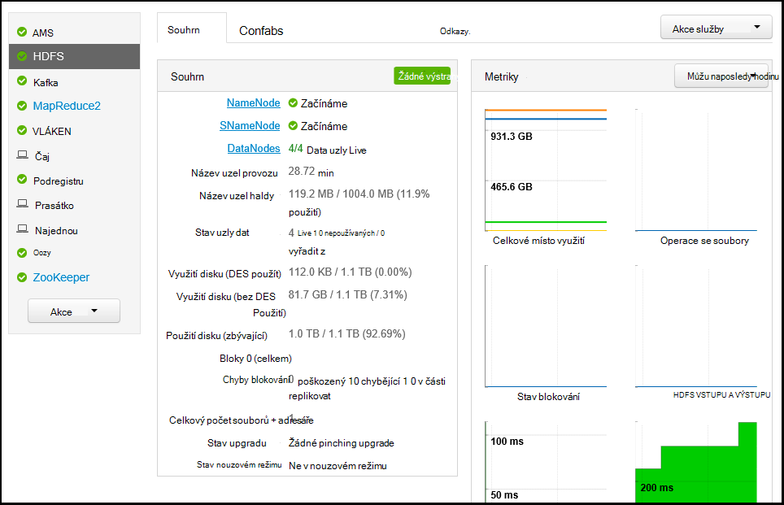

<properties
   pageTitle="Sledování a Správa clusterů HDInsight pomocí webového uživatelského rozhraní Apache Ambari | Microsoft Azure"
   description="Naučte se používat Ambari ke sledování a Správa clusterů na základě Linux HDInsight. V tomto dokumentu se dozvíte, jak používat uživatelské rozhraní webu Ambari zahrnutý v sadě clusterů HDInsight."
   services="hdinsight"
   documentationCenter=""
   authors="Blackmist"
   manager="jhubbard"
   editor="cgronlun"
    tags="azure-portal"/>

<tags
   ms.service="hdinsight"
   ms.devlang="na"
   ms.topic="article"
   ms.tgt_pltfrm="na"
   ms.workload="big-data"
   ms.date="09/27/2016"
   ms.author="larryfr"/>

#Správa clusterů HDInsight pomocí rozhraní webových Ambari

[AZURE.INCLUDE [ambari-selector](../../includes/hdinsight-ambari-selector.md)]

Apache Ambari usnadňuje správu a sledování clusteru Hadoop zadáním snadno použít pro web uživatelského rozhraní a rozhraní REST API. Ambari je k dispozici na základě Linux HDInsight clusterů a slouží ke sledování clusteru a provést změny konfigurace.

V tomto dokumentu se dozvíte, jak používat uživatelské rozhraní webu Ambari s HDInsight obrázku.

##Co je Ambari?

<a href="http://ambari.apache.org" target="_blank">Apache Ambari</a> usnadňuje správu Hadoop zadáním web snadno použitelné uživatelské rozhraní, které slouží ke zřízení, Správa a sledování Hadoop clusterů. Vývojáři můžete integrovat tyto funkce do svých aplikací pomocí rozhraní <a href="https://github.com/apache/ambari/blob/trunk/ambari-server/docs/api/v1/index.md" target="_blank">REST API Ambari</a>.

Uživatelské rozhraní webu Ambari není uvedený ve výchozím nastavení se clusterů bázi Linux HDInsight. 

##Připojení

Uživatelské rozhraní webu Ambari neexistuje HDInsight cluster v HTTPS://CLUSTERNAME.azurehdidnsight.net, kde __NÁZEV_CLUSTERU__ je název vašeho obrázku. 

> [AZURE.IMPORTANT] Připojení k Ambari na HDInsight vyžaduje HTTPS. Je třeba ověřit Ambari pomocí název účtu správce (výchozí hodnota je __Správce__) a heslo, které jste zadali při vytvoření clusteru.

##SSH proxy

> [AZURE.NOTE] Při Ambari pro svůj cluster přístupných osobám s postižením přímo přes Internet, některé odkazy ze uživatelského rozhraní Ambari webu (například JobTracker,) nejsou vystaven na Internetu. Takže "serveru není nebyl nalezen" chybové zprávy při pokusu o přístup k těmto funkcím, pokud nepoužijete tunelem zabezpečené prostředí (SSH) na proxy serveru webové umožnění datových přenosů do hlavního uzlu obrázku.

Informace o vytváření SSH tunelem pro práci s Ambari najdete v tématu [Použití SSH Tunneling přístup k webu Ambari uživatelského rozhraní, ResourceManager, JobHistory, NameNode, Oozie a jiným webovým uživatelské rozhraní na](hdinsight-linux-ambari-ssh-tunnel.md).

##Web Ambari uživatelského rozhraní

Při připojení k webové Ambari uživatelské rozhraní se výzva k ověření na stránku. Použití obrázku správce (výchozí nastavení správce) a heslo, které jste použili při vytváření obrázku.

Po otevření stránky, poznamenejte si na panelu nahoře. Tato stránka obsahuje následující informace a ovládací prvky:

* **Ambari logo** – otevře řídicím panelu, který slouží ke sledování clusteru.

* **Shluk název # ops** – zobrazí počet Ambari plánů. Výběr název nebo **# ops** se zobrazí seznam operací pozadí.

* **upozornění na #** – upozornění nebo kritické upozornění, případně clusteru. Tato možnost vybrána, se zobrazí seznam upozornění.

* **Řídicí panel** – zobrazí na řídicím panelu.

* **Služby** – informace a konfiguraci nastavení služeb v clusteru.

* **Hosts** – informace a konfigurace nastavení pro uzlů v clusteru.

* **Upozornění** – protokol informací, upozornění a kritické upozornění.

* **Správce** – softwarové zásobníku/služby, které jsou nainstalované v clusteru, informace o účtu služby a Kerberos zabezpečení.

* **Tlačítko Správce** – Ambari Správa nastavení uživatelů a odhlášení.

##Sledování

###Upozornění

Ambari obsahuje mnoho upozornění, která bude mít jednu z těchto při změně stavu:

* **Ok**

* **Upozornění**

* **KRITICKÝ**

* **NEZNÁMÝ**

Upozornění než **OK** způsobí položce **# upozornění** v horní části na stránce zobrazit počet upozornění. Výběr tato položka se zobrazí oznámení a jejich stav.

Upozornění jsou uspořádány do několika výchozí skupiny, které můžete zobrazit na stránce **upozornění** .

Správa skupin v nabídce **Akce** a výběrem **Spravovat upozornění skupiny**. Umožňuje upravit existující skupiny nebo vytvořit novou skupinu.

Oznámení můžete také vytvořit v nabídce **Akce** . Umožňuje vytvořit aktivačních událostí, které odesílat upozornění prostřednictvím **e-MAILU** nebo **SNMP** při výskytu konkrétní upozornění a závažnosti kombinace. Můžete třeba poslat, že upozornění při jejich upozornění ve skupinovém rámečku **Výchozí vláken** je nastavený na **položku kritické**.

###Obrázku

Karta **metriky** s řídicím panelem obsahuje řadu ovládacích prvků, které usnadňují sledování stavu svůj cluster na první pohled. Několik widgety, jako je **Využití procesoru**a poskytují další informace při kliknutí na.

Zobrazí se na kartě **Heatmaps** metriky jako barevné heatmaps přecházet od zelená na červené.

Podrobnější informace v jednotlivých uzlech v rámci clusteru vyberte **Hosts**a pak vyberte uzel konkrétní, které vás zajímají.

###Služby

Na bočním panelu **služby** na řídicím panelu obsahuje rychlý přehled o stavu služby v clusteru. Ikony různých slouží k označují stav nebo akce, které je třeba, například symbol žlutá Koš Pokud služba, musí být z koše.

Výběr služby zobrazí podrobnější informace na služby.

####Odkazy

Některé služby zobrazit odkaz **Odkazy** v horní části stránky. Můžete použít pro přístup k webu specifické pro služby UI, jako například:

* **Historie úlohy** – historie úlohy MapReduce.

* **Správce prostředků** – vláken ResourceManager uživatelského rozhraní.

* **NameNode** - Hadoop Distributed uživatelské rozhraní NameNode souborů systému (HDFS).

* **Web Oozie uživatelského rozhraní** - Oozie uživatelského rozhraní.

Výběrem některé z těchto odkazů se otevře na nové kartě v prohlížeči, které se zobrazí vybrané stránky.

> [AZURE.NOTE] Výběrem odkazu **Odkazy** na jiné služby bude výsledkem chyba "nebyl nalezen server" Pokud používáte tunelem Secure (Sockets Layer SSL) na proxy serveru webové umožnění datových přenosů do clusteru. Je to proto webových aplikací zobrazí tyto informace nejsou vystaven na Internetu.
>
> Informace o použití SSL tunelem s Hdinsightu najdete v tématu [Použití SSH Tunneling přístup k webu Ambari uživatelského rozhraní, ResourceManager, JobHistory, NameNode, Oozie a jiným webovým uživatelské rozhraní na](hdinsight-linux-ambari-ssh-tunnel.md)

##Správa

###Ambari uživatelé, skupiny a oprávnění

Správa uživatelů, skupin a oprávnění není vhodné používat s clusterů HDInsight.

###Hosts

Na stránce **hostitele** zobrazí všem hostitelé clusteru. Ke správě hosts, postupujte takto:

> [AZURE.NOTE] Přidání, vyřadit z nebo recommissioning hostitel není vhodné používat s clusterů HDInsight.

1. Vyberte hostiteli, který chcete spravovat.

2. Pomocí nabídky **Akce** vyberte akce, kterou chcete provést:

    * **Zahájení všechny komponenty** – všechny komponenty zahájen hostiteli.

    * **Ukončení všechny komponenty** - zastavit všechny komponenty na hostiteli.

    * **Restartujte všechny komponenty** - zastavit a začněte všechny komponenty na hostiteli.

    * **Zapnutí režimu údržby** - potlačí upozornění hostitele. To být povoleno, pokud jsou provádění akcí, které vygeneruje upozornění, třeba restartovat službu používající spuštěné služby.

    * **Vypnutí režimu údržby** – vrátí hostiteli normálnímu výstrahy.

    * **Ukončení** - DataNode tabulátoru nebo NodeManagers na hostiteli.

    * **Zahájení** - spustí DataNode nebo NodeManagers na hostiteli.

    * **Restartujte** - tabulátorů a spuštění DataNode nebo NodeManagers na hostiteli.

    * **Decommission** - odebere hostitel clusteru.

        > [AZURE.NOTE] Nepoužívejte tuto akci na clusterů HDInsight.

    * **Recommission** - přidá dříve odebraným hostitele do clusteru.

        > [AZURE.NOTE] Nepoužívejte tuto akci na clusterů HDInsight.

###Služby

Ze stránky **řídicího panelu** nebo **služby** pomocí tlačítka **akcí** v dolní části seznamu služeb zastavit a spustit všechny služby.

> [AZURE.WARNING] Při __Přidání__ je uvedený v této nabídce, není vhodné používat k přidání služeb do obrázku HDInsight. Nové služby má být přidán pomocí skriptu akce pracovní během vytváření obrázku. Další informace o používání akcí skript najdete v článku [přizpůsobení HDInsight clusterů pomocí skriptu akce](hdinsight-hadoop-customize-cluster-linux.md).

Když na tlačítko **Akce** můžete restartovat všechny služby, často chcete spustit, zastavit nebo restartovat konkrétní službu. Pomocí následujících kroků můžete provádět akce na jednotlivé služby:

1. Ze stránky **řídicího panelu** nebo **služby** vyberte službu.

2. V horní části kartě **souhrnné informace** pomocí tlačítka **Akce služby** a vyberte akci, kterou chcete provést. To bude restartovat službu na všech uzlů.

    

    > [AZURE.NOTE] Restartování některých služeb spuštěná clusteru může způsobit upozornění. Chcete-li této situaci předejít, můžete pomocí tlačítka **Akce služby** povolení **režimu údržby** pro službu před provedením restartování.

3. Po výběru akce **místní # verze** položky v horní části stránky zvýší zobrazíte probíhající operace pozadí. Pokud konfigurace zobrazení, se zobrazí seznam operací pozadí.

    > [AZURE.NOTE] Povolit **režim údržby** pro službu nezapomeňte ho zakázat pomocí tlačítka **Akce služby** po dokončení operace.

Konfigurace služby, pomocí následujících kroků:

1. Ze stránky **řídicího panelu** nebo **služby** vyberte službu.

2. Vyberte kartu **Configs** . Zobrazí se aktuální konfigurace. Seznam předchozí konfigurací se také zobrazí.

    

3. Pomocí polí zobrazena změna konfigurace a potom vyberte **Uložit**. Nebo vyberte předchozí konfiguraci a pak vyberte **vytvořit aktuální** návrat na předchozí nastavení.

##Zobrazení Ambari

Zobrazení Ambari umožňuje vývojářům prvkům uživatelského rozhraní zapojte uživatelské rozhraní webu Ambari pomocí [Ambari zobrazení Framework](https://cwiki.apache.org/confluence/display/AMBARI/Views). HDInsight poskytuje následující zobrazení s typy Hadoop obrázku:

* Správce fronty vláken: Správce fronty poskytuje jednoduché uživatelské rozhraní pro prohlížení a úpravy vláken fronty.
* Zobrazení podregistru: Zobrazení podregistru umožňuje spouštění dotazů podregistru přímo z webového prohlížeče. Můžete uložit dotazy, zobrazit výsledky, uložení výsledků k základnímu úložišti obrázku nebo stáhnout výsledky místní systém. Další informace o použití zobrazení podregistru najdete v článku [Použití podregistru zobrazení s HDInsight](hdinsight-hadoop-use-hive-ambari-view.md).
* Tez zobrazení: Zobrazení Tez umožňuje půjde vám ještě snadněji chápat a zobrazení informací o jak spouštět Tez úlohy a zdrojích používají úlohy optimalizovat úlohy.
