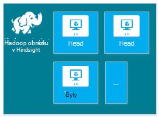
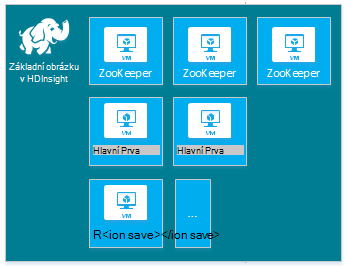
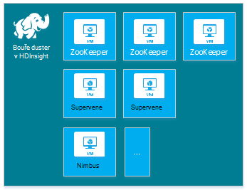
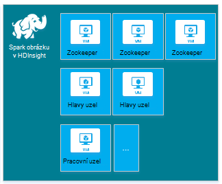
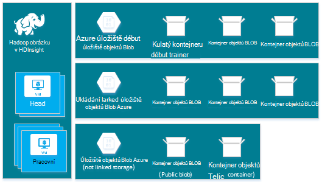
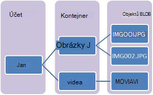
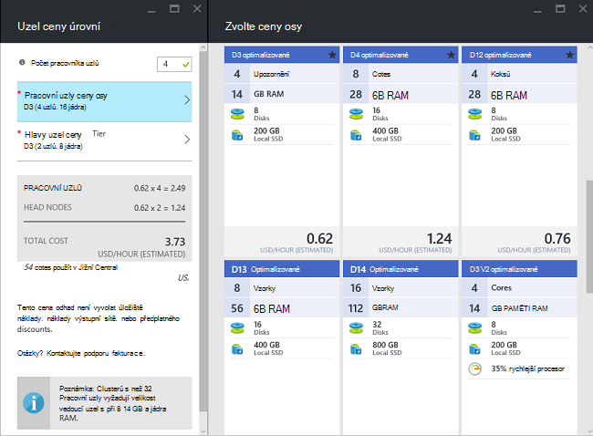
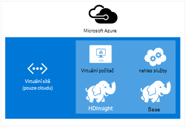
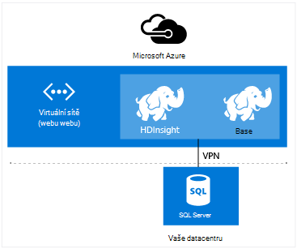

<properties
    pageTitle="Vytvoření Hadoop, HBase, bouře nebo Spark clusterů na Linux v HDInsight | Microsoft Azure"
    description="Naučte se vytvořit Hadoop, HBase, bouře nebo HDInsight v prohlížeči, Azure rozhraní příkazového řádku, Azure Powershellu, REST, nebo prostřednictvím SDK podnítit clusterů na Linux."
    services="hdinsight"
    documentationCenter=""
    authors="mumian"
    manager="jhubbard"
    editor="cgronlun"
    tags="azure-portal"/>

<tags
    ms.service="hdinsight"
    ms.devlang="na"
    ms.topic="article"
    ms.tgt_pltfrm="na"
    ms.workload="big-data"
    ms.date="10/18/2016"
    ms.author="jgao"/>

# Vytvoření na základě Linux Hadoop clusterů v HDInsight

[AZURE.INCLUDE [selector](../../includes/hdinsight-selector-create-clusters.md)]

Shluk Hadoop se skládá z několika virtuálních počítačích (uzly), které se používají pro distribuované zpracování úkolů na clusteru. Azure abstrahuje podrobnosti o implementaci instalace a konfigurace jednotlivých uzlech, stačí jenom poskytnout informace o obecné konfiguraci. V tomto článku se dozvíte o těchto nastaveních konfigurace.

## Požadavky na řízení přístupu

[AZURE.INCLUDE [access-control](../../includes/hdinsight-access-control-requirements.md)]

## Typy obrázku

V současné době Azure HDInsight poskytuje pěti různých typů clusterů, oba objekty mají sady součástí poskytovat některé funkce.

| Typ obrázku | Funkce |
| ------------ | ----------------------------- |
| Hadoop       | Dotaz a analýzy (dávku úlohy)     |
| HBase        | Ukládání dat NoSQL            |
| Bouře        | Zpracování v reálném čase události |
| Spark        | Zpracování v paměti, interaktivní dotazy, toku micro dávkové zpracování |
| [Interaktivní podregistru (verze Preview)](hdinsight-hadoop-use-interactive-hive.md) | V paměti ukládání do mezipaměti pro interaktivní a rychlejší podregistru dotazů|
| Server R místní Spark (verze Preview) | Různé statistiky velký dat, prediktivní modelování a automatické učení funkcí |

Každý typ obrázku má vlastní počtu uzlů v rámci clusteru terminologie pro uzlů v rámci clusteru a výchozí velikost OM u jednotlivých typů uzel. V následující tabulce je počtu uzlů u jednotlivých typů uzel v závorkách.

| Typ| Uzly | Diagram|
|-----|------|--------|
|Hadoop| Hlavy uzel (2) dat (1 +)||
|HBase|Hlavy server (2), oblasti serveru (1 +), předlohy/Zookeeper uzel (3)||
|Bouře|Nimbus uzel (2), správce serveru (1 +), Zookeeper (3)||
|Spark|Hlavy uzel (2), pracovní uzel (1 +), Zookeeper (3) (Free velikost OM Zookeepers A1)||

Následující tabulka uvádí výchozí velikosti OM pro HDInsight:

- Všechny podporované oblastí s výjimkou Brazílie jih a západ Japonsko:

  	|Typ obrázku                     | Hadoop               | HBase                | Bouře                | Spark                                                                 | R Server |
  	|---------------------------------|----------------------|----------------------|----------------------|-----------------------------------------------------------------------|-----------------------------------------------------------------------|
  	|Hlavy – výchozí velikosti OM           | D3 v2                | D3 v2                | A3                   | D12 v2                                                                | D12 v2                                                                |
  	|Hlavy – doporučené OM velikosti      | D3 v2, D4 v2, D12 v2 | D3 v2, D4 v2, D12 v2 | A3, A4, A5           | D12 v2, D13 v2, D14 v2                                                | D12 v2, D13 v2, D14 v2                                                |
  	|Pracovní – výchozí velikosti OM         | D3 v2                | D3 v2                | D3 v2                | Systém Windows: D12 v2; Linux: D4 v2                                         | Systém Windows: D12 v2; Linux: D4 v2                                         |
  	|Pracovní – doporučené OM velikosti    | D3 v2, D4 v2, D12 v2 | D3 v2, D4 v2, D12 v2 | D3 v2, D4 v2, D12 v2 | Systém Windows: D12 v2 D13 v2, D14 v2; Linux: D4 v2 D12 v2, D13 v2, D14 v2 | Systém Windows: D12 v2 D13 v2, D14 v2; Linux: D4 v2 D12 v2, D13 v2, D14 v2 |
  	|Zookeeper – výchozí velikosti OM      |                      | A3                   | A2                   |                                                                       |
  	|Zookeeper – doporučené OM velikosti |                      | A3, A4, A5           | A2, A3, A4           |                                                                       |
  	|Okraj - výchozí velikosti OM           |                      |                      |                      |                                                                       | Systém Windows: D12 v2; Linux: D4 v2                                         |
  	|Okraje - doporučená velikost OM       |                      |                      |                      |                                                                       | Systém Windows: D12 v2 D13 v2, D14 v2; Linux: D4 v2 D12 v2, D13 v2, D14 v2 |

- Brazílie jih a pouze západ Japonsko (bez v2 velikosti tady):

  	|Typ obrázku                     | Hadoop      | HBase       | Bouře      | Spark                                          |R Server|
  	|---------------------------------|-------------|-------------|------------|------------------------------------------------|--------|
  	|Hlavy – výchozí velikosti OM           | D3          | D3          | A3         | D12                                            | D12|
  	|Hlavy – doporučené OM velikosti      | D12 D3, D4, | D12 D3, D4, | A3, A4, A5 | D14 D12, D13,                                  | D14 D12, D13,|
  	|Pracovní – výchozí velikosti OM         | D3          | D3          | D3         | Systém Windows: D12; Linux: D4                        | Systém Windows: D12; Linux: D4|
  	|Pracovní – doporučené OM velikosti    | D12 D3, D4, | D12 D3, D4, | D12 D3, D4,| Systém Windows: D14 D12, D13, Linux: D4 D14 D12, D13,| Systém Windows: D14 D12, D13, Linux: D4 D14 D12, D13,|
  	|Zookeeper – výchozí velikosti OM      |             | A2          | A2         |                                                | |
  	|Zookeeper – doporučené OM velikosti |             | A2, A3, A4  | A2, A3, A4 |                                                | |
  	|Okraj – výchozí velikosti OM          |             |             |            |                                                | Systém Windows: D12; Linux: D4 |
  	|Okraj, doporučujeme OM velikosti      |             |             |            |                                                | Systém Windows: D14 D12, D13, Linux: D4 D14 D12, D13, |

Všimněte si, že vedoucí nazývá *Nimbus* bouře typ obrázku. Pracovní se označuje jako *oblast* pro typ obrázku HBase a jako *Správce* pro typ obrázku bouře.

> [AZURE.IMPORTANT] Pokud budete chtít s více než 32 pracovníka uzly při vytvoření obrázku nebo roztažením clusteru po vytvoření, je nutné vybrat velikostí hlavy uzel s nejméně 8 14 GB paměti RAM a jádra.

Můžete přidat další součásti odstín ATP R na tyto základní typy pomocí [Skriptu akce](#customize-clusters-using-script-action).

> [AZURE.IMPORTANT] HDInsight clusterů mohou mít různé typy, které odpovídají pracovní zátěž nebo technologii clusteru optimalizovaných pro. Neexistuje žádná podporované metoda k vytvoření obrázku, který kombinuje více typů, například bouře a HBase na jednoho obrázku. 

Pokud řešení vyžaduje technologie, které jsou rozšířit mezi více typů clusteru HDInsight, by měl vytvořit virtuální síť Azure a vytvořte typy požadované obrázku v rámci virtuální sítě. Díky clusterů a jakýkoli kód, který nasazení tak, aby byla přímo vzájemně komunikovat.

Další informace o pomocí virtuální sítě Azure Hdinsightu najdete v článku [Rozšíření Hdinsightu pomocí Azure virtuální sítě](hdinsight-extend-hadoop-virtual-network.md).

Příklad použití dva typy obrázku v rámci virtuální sítě Azure najdete v článku [analyzovat data snímače s bouře a HBase](hdinsight-storm-sensor-data-analysis.md).

## Úrovně obrázku

Azure HDInsight obsahuje nabídky cloudu velký dat ve dvou kategorií: Standard a [Premium](hdinsight-component-versioning.md#hdinsight-standard-and-hdinsight-premium). HDInsight Premium obsahuje R a další součásti. HDInsight Premium je podporována pouze u HDInsight verze 3.4.

Následující tabulka uvádí typ obrázku HDInsight a HDInsight Premium podpory matici.

| Typ obrázku | Standardní | Premium  |
|--------------|---------------|--------------|
| Hadoop       | Ano           | Ano          |
| Spark        | Ano           | Ano          |
| HBase        | Ano           | Ne           |
| Bouře        | Ano           | Ne           |
| Server R místní Spark | Ne | Ano |

V této tabulce se aktualizují při další typy clusteru jsou součástí HDInsight Premium. Následující obrázek ukazuje Azure portálu informace pro výběr typy obrázku.

## Základní možnosti konfigurace

Následují základní možnosti konfigurace slouží k vytvoření clusteru HDInsight.

### Název obrázku ###

Název clusteru slouží k identifikaci clusteru. Název clusteru musí být jedinečné a musí dodržovat následující pokyny pro pojmenování:

- Pole musí být řetězec obsahující mezi 3 a 63 znaky.
- Pole může obsahovat jenom písmena, číslice a spojovníky.

### Typ obrázku###

V tématu [typy obrázku](#cluster-types) a [úrovní obrázku](#cluster-tiers).

### Operační systém ###

Vytvoření HDInsight clusterů na jednu z následujících dvou operačních systémů:

- HDInsight na Linux.  HDInsight poskytuje možnost konfigurace Linux clusterů v Azure. Konfigurace clusteru Linux Pokud znáte Linux nebo Unix migrace z existujícího na základě Linux Hadoop řešení, nebo mají snadno integrace s součásti ekosystému Hadoop vytvořené pro Linux. Další informace najdete v tématu [Začínáme s Hadoop na Linux v HDInsight](hdinsight-hadoop-linux-tutorial-get-started.md).
- HDInsight v systému Windows (Windows serveru 2012 R2 Datacentra).

### HDInsight verze###

Slouží k určení verze systému HDInsight potřebné pro tento obrázku. Další informace najdete v tématu [verze obrázku Hadoop a součástí HDInsight](https://go.microsoft.com/fwLink/?LinkID=320896&clcid=0x409).

### Název předplatného###

Každý HDInsight clusteru je svázané se Azure předplatných.

### Název skupiny prostředků ###

[Správce prostředků Azure](../azure-resource-manager/resource-group-overview.md) pomůže práce se zdroji v aplikaci jako skupinu, uvedené jako skupina zdroje Azure. Můžete nasadit, aktualizace, sledovat nebo odstranit všechny zdroje pro aplikaci v jedné koordinovaný operace.

### Přihlašovací údaje###

Pomocí HDInsight clusterů můžete nakonfigurovat dvou uživatelských účtů při vytváření obrázku:

- Nastavit informace HTTP uživatele. Výchozí uživatelské jméno je *Správce* na portálu Azure pomocí základní konfigurace. V některých případech je označená jako "Clusteru uživatele."
- Uživatel SSH (Linux clusterů). Tím se používá pro připojení ke clusteru pomocí SSH. Další SSH uživatelských účtů můžete vytvořit clusteru je vytvořený pomocí následujících kroků v tématu [Použití SSH s Hadoop Linux založené na HDInsight z Linux, Unix nebo OS X](hdinsight-hadoop-linux-use-ssh-unix.md) nebo [Použití SSH s Hadoop Linux založené na HDInsight z Windows](hdinsight-hadoop-linux-use-ssh-unix.md).

    >[AZURE.NOTE] U serveru s Windows clusterů můžete vytvořit uživatel RDP se připojit k obrázku pomocí RDP.

### Zdroj dat###

Původní soubor systému Hadoop distributed (HDFS) bude použit mnoho místní disků clusteru. Úložiště objektů Blob Azure HDInsight používá pro ukládání dat. Úložiště objektů Blob Azure je robustní, univerzální úložiště řešení, které Bezproblémová integrace s HDInsight. Pomocí rozhraní HDFS můžete úplné sady součástí HDInsight pracovat přímo na strukturovaná a Nestrukturovaná data v úložišti objektů Blob. Ukládání dat v úložišti objektů Blob vám pomáhá bezpečně odstranit HDInsight clusterů, které slouží k výpočtu bez ztráty dat uživatele.

Během konfigurace je nutné zadat účet Azure úložiště a kontejneru úložiště objektů Blob Azure účet Azure úložiště. Některé kroky vytvoření vyžaduje účet Azure úložiště a kontejner úložiště objektů Blob vytvořen předem. Kontejner úložiště objektů Blob používá jako výchozí umístění úložiště clusteru. Pokud chcete můžete určit dalších účtů Azure úložiště (propojené úložiště), které budou dostupné clusteru. Obrázku, taky zpřístupníte žádné kontejnery úložiště objektů Blob, u kterých budou nakonfigurována důkladné veřejné přístup pro čtení nebo veřejných přístup pro čtení pro objekty BLOB pouze.  Další informace najdete v tématu [Řízení přístupu k prostředkům úložiště Azure](../storage/storage-manage-access-to-resources.md).

>[AZURE.NOTE] Kontejner úložiště objektů Blob poskytuje seskupení sadu objektů BLOB, jak je znázorněno na následujícím obrázku.

Nedoporučujeme používat výchozí kontejner úložiště objektů Blob pro ukládání obchodní data. Odstraněním kontejneru úložiště objektů Blob výchozí po každém použití snížit náklady úložiště je vhodné. Poznámka: aby kontejneru výchozí obsahuje aplikací a systému protokoly. Zkontrolujte, že získat protokoly před odstraněním kontejneru.

>[AZURE.WARNING] Sdílení jedné kontejner úložiště objektů Blob pro více clusterů není podporovaná.

Další informace o použití sekundárním úložiště objektů Blob najdete v článku [Použití úložišti objektů Blob Azure s HDInsight](hdinsight-hadoop-use-blob-storage.md).

Kromě úložiště objektů Blob Azure můžete také [Úložiště jezera dat Azure](../data-lake-store/data-lake-store-overview.md) jako výchozí účet úložiště pro HBase cluster v HDInsight a propojené úložiště pro všechny čtyři typy clusteru HDInsight. Další informace najdete v tématu [Vytvoření HDInsight obrázku s úložiště jezera dat Azure portálu](../data-lake-store/data-lake-store-hdinsight-hadoop-use-portal.md).

### Umístění (oblast) ###

HDInsight obrázku a jeho výchozí úložiště účet musí být umístěny ve stejném umístění Azure.

Seznam podporovaných oblastí klepněte na **oblast** rozevírací seznam na [ceny HDInsight](https://go.microsoft.com/fwLink/?LinkID=282635&clcid=0x409).

### Uzel ceny úrovní###

Zákazníci se vám účtovat poplatky pro použití tyto uzly po celou dobu životnosti clusteru. Fakturace, spustí se clusteru se vytvoří a zastavíte clusteru odstraněna. Clusterů nemůžete zrušit přidělit nebo blokování.

Typy různých mají různé typy uzlů, počtu uzlů a uzel velikosti. Typ obrázku Hadoop například má dva _hlavní uzly_ a výchozí čtyři _uzly dat_, zatímco typ obrázku bouře má dva _nimbus uzly_, tři _zookeeper uzly_a výchozí čtyři _uzly Správce_. Náklady HDInsight clusterů, je určený podle počtu uzlů a velikosti virtuálních počítačích uzlů. Pokud víte, že budete provádět operace, které potřebují hodně paměti, budete chtít vyberte zdroj výpočetním s víc paměti. Pro výuku účely, doporučujeme použít jednu uzel data. Další informace o HDInsight ceny najdete v článku [ceny HDInsight](https://go.microsoft.com/fwLink/?LinkID=282635&clcid=0x409).

>[AZURE.NOTE] Omezení velikosti obrázku liší Azure předplatná. Kontaktování podpory fakturace zvýšení limitu.

>Uzly používat svůj cluster nepočítají jako virtuálních počítačích, protože virtuálního počítače obrázky použité pro uzly jsou podrobností implementace služby HDInsight. Výpočetním jádra používaný uzly započítávají celkový počet výpočetním jádra k dispozici pro vaše předplatné. Zobrazí počet dostupných jádra a jádra, které použije cluster v části Souhrn zásuvné uzel ceny úrovně při vytváření clusteru HDInsight.

Konfigurace clusteru pomocí portálu Azure velikosti uzlu při dostupné prostřednictvím zásuvné __Uzel ceny osy__ . Zobrazí se také náklady spojené s velikostí různých uzel. Následující obrázek ukazuje možností pro cluster Hadoop Linux base.

V následujících tabulkách zobrazit formáty podporované kodérem HDInsight clusterů a kapacity, které poskytují.

#### Standardní osy: A řady####

V klasickém nasazení modelu jsou mírně odlišnou v prostředí PowerShell a rozhraní příkazového řádku některé OM velikosti.
* Standard_A3 je velká
* Standard_A4 je ExtraLarge

|Velikost |Procesor vzorky|Paměti|Nic (Max)|Max. velikost disku|Max. data disků (1023 GB každý)|Max. Procesorů (500 na disku)|
|---|---|---|---|---|---|---|
|Standard_A3\Large|4|7 GB|2|Dočasné = 285 GB |8|8 x 500|
|Standard_A4\ExtraLarge|8|14 GB|4|Dočasné = 605 GB |16|16 × 500|
|Standard_A6|4|28 GB|2|Dočasné = 285 GB |8|8 x 500|
|Standard_A7|8|56 GB|4|Dočasné = 605 GB |16|16 × 500|

#### Standardní osy: D řady####

|Velikost |Procesor vzorky|Paměti|Nic (Max)|Max. velikost disku|Max. data disků (1023 GB každý)|Max. Procesorů (500 na disku)|
|---|---|---|---|---|---|---|
|Standard_D3 |4|14 GB|4|Dočasné (SSD) = 200 GB |8|8 x 500|
|Standard_D4 |8|28 GB|8|Dočasné (SSD) = 400 GB |16|16 × 500|
|Standard_D12 |4|28 GB|4|Dočasné (SSD) = 200 GB |8|8 x 500|
|Standard_D13 |8|56 GB|8|Dočasné (SSD) = 400 GB |16|16 × 500|
|Standard_D14 |16|112 GB|8|Dočasné (SSD) = 800 GB |32|32 x 500|

#### Standardní osy: Dv2 řady####

|Velikost |Procesor vzorky|Paměti|Nic (Max)|Max. velikost disku|Max. data disků (1023 GB každý)|Max. Procesorů (500 na disku)|
|---|---|---|---|---|---|---|
|Standard_D3_v2 |4|14 GB|4|Dočasné (SSD) = 200 GB |8|8 x 500|
|Standard_D4_v2 |8|28 GB|8|Dočasné (SSD) = 400 GB |16|16 × 500|
|Standard_D12_v2 |4|28 GB|4|Dočasné (SSD) = 200 GB |8|8 x 500|
|Standard_D13_v2 |8|56 GB|8|Dočasné (SSD) = 400 GB |16|16 × 500|
|Standard_D14_v2 |16|112 GB|8|Dočasné (SSD) = 800 GB |32|32 x 500|    

Důležité informace o zavádění nějaká když plánujete používat tyto materiály najdete v článku [velikosti virtuálních počítačích](../virtual-machines/virtual-machines-windows-sizes.md). Informace o cenách různých velikostí najdete v tématu [Ceny HDInsight](https://azure.microsoft.com/pricing/details/hdinsight).   

> [AZURE.IMPORTANT] Pokud budete chtít s více než 32 pracovníka uzly při vytvoření obrázku nebo roztažením clusteru po vytvoření, je nutné vybrat velikostí hlavy uzel s nejméně 8 14 GB paměti RAM a jádra.

Fakturace, spustí se clusteru se vytvoří a zastavíte clusteru odstraněna. Další informace o cenách najdete v článku [Podrobnosti o cenách HDInsight](https://azure.microsoft.com/pricing/details/hdinsight/).

## Používat další úložiště

V některých případech můžete chtít přidat další úložiště clusteru. Například může mít více účtů Azure úložiště pro různé geografických oblastech nebo jiné služby, ale chcete analyzovat pomocí HDInsight.

Když vytváříte HDInsight obrázku nebo po vytvoření clusteru, můžete přidat úložiště účty.  V tématu [clusterů na základě přizpůsobení Linux HDInsight pomocí skriptu akce](hdinsight-hadoop-customize-cluster-linux.md).

Další informace o sekundárním úložiště objektů Blob najdete v tématu [úložiště objektů Blob Azure pomocí s HDInsight](hdinsight-hadoop-use-blob-storage.md). Další informace o sekundárním úložiště jezera dat najdete v článku [Vytvoření HDInsight clusterů s úložiště jezera dat Azure portálu](../data-lake-store/data-lake-store-hdinsight-hadoop-use-portal.md).

## Použití podregistru/Oozie metastore

Důrazně doporučujeme použít vlastní metastore, pokud chcete zachovat tabulku podregistru po odstranění svůj cluster HDInsight. Bude moct připojit této metastore do jiného clusteru HDInsight.

> [AZURE.IMPORTANT] HDInsight metastore vytvoří jedné verze obrázku HDInsight nemůže být sdíleny různé verze obrázku HDInsight. Seznam verze Hdinsightu najdete v tématu [podporované HDInsight verze](hdinsight-component-versioning.md#supported-hdinsight-versions).

Metastore obsahuje podregistru a Oozie metadat, třeba tabulek podregistru, oddíly, schémata a sloupců. Metastore umožňuje zachovat podregistru a Oozie metadata, abyste nemuseli znovu vytvořit podregistru tabulek nebo Oozie úlohy při vytváření nového obrázku. Ve výchozím nastavení používá podregistru vložený databáze Azure SQL k uložení tyto informace. Vložený databázi nelze zachová metadata při odstranění clusteru. Při vytváření tabulku podregistru clusteru HDInsight pomocí podregistru metastore nakonfigurované tyto tabulky při obnovil clusteru pomocí stejného metastore podregistru zachovány.

Konfigurace Metastore není k dispozici pro typy HBase obrázku.

> [AZURE.IMPORTANT] Při vytváření vlastních metastore, nepoužívejte název databáze, který obsahuje typ čáry nebo spojovníky. To může způsobovat proces vytváření clusteru selhání.

## Použití Azure virtuálních sítí

[Azure virtuální sítě](https://azure.microsoft.com/documentation/services/virtual-network/)můžete vytvořit zabezpečené trvalý sítě obsahující zdroje, které potřebujete pro řešení. Virtuální síť můžete:

* Připojte cloudové zdroje společně v privátní sítě (pouze cloudu).

    

* Vaše cloudové zdroje k síti místní datacentra (na webu nebo čárky webu) připojení prostřednictvím virtuální privátní sítě (VPN).

| Konfigurace webů pro web | Konfigurace čárky webu |
| -------------------------- | --------------------------- |
| Konfigurace webů pro web můžete připojit více zdrojů z vaší datacentra Azure virtuální sítě pomocí hardware virtuální privátní sítě nebo směrování a služby vzdáleného přístupu.  | Konfigurace čárky webu můžete připojit určitého zdroje k Azure virtuální sítě pomocí softwaru VPN.  |

Serveru s Windows clusterů vyžadují v1 (klasický) virtuální sítě, zatímco na základě Linux clusterů vyžadují virtuální sítě v2 (Azure správce zdrojů). Pokud nemáte správný typ sítě, nebude použít při vytváření clusteru.

Další informace o použití HDInsight s virtuální sítě, včetně konkrétní konfigurace požadavky pro virtuální sítě najdete v článku [funkce rozšíření HDInsight pomocí Azure virtuální sítě](hdinsight-extend-hadoop-virtual-network.md).

## Přizpůsobení clusterů pomocí úprav obrázku HDInsight (zavádění)

Někdy který chcete konfigurovat následující soubory konfigurace:

- clusterIdentity.xml
- základní site.xml
- Gateway.XML
- hbase env.xml
- hbase site.xml
- hdfs site.xml
- podregistru env.xml
- podregistru site.xml
- mapred webu
- oozie site.xml
- oozie env.xml
- bouře site.xml
- tez site.xml
- webhcat site.xml
- site.xml vláken

Zachovat změny prostřednictvím životnost clusteru, můžete použít HDInsight clusteru přizpůsobení během s vytvářením nebo Ambari můžete použít v na základě Linux clusterů. Další informace najdete v tématu [přizpůsobení HDInsight clusterů pomocí zavádění](hdinsight-hadoop-customize-cluster-bootstrap.md).

>[AZURE.NOTE] Clusterů serveru s Windows nelze zachovat změny kvůli znovu obrázek. Další informace najdete v tématu [Role Instance restartuje termín inovací s operačním systémem](http://blogs.msdn.com/b/kwill/archive/2012/09/19/role-instance-restarts-due-to-os-upgrades.aspx).  Pokud chcete ponechat změny až clusterů životnost, je nutné použít HDInsight clusteru přizpůsobení během s vytvářením.

## Přizpůsobení clusterů pomocí skriptu akce

Můžete nainstalovat další součásti nebo přizpůsobit konfigurace clusteru pomocí skriptů při vytváření. Tyto skripty spouštěly prostřednictvím **Skriptu akci**, která je možnost konfigurace, kterou budete moct použít z portálu Azure, rutin prostředí Windows PowerShell HDInsight nebo HDInsight .NET SDK. Další informace najdete v tématu [přizpůsobení HDInsight clusteru pomocí skriptu akce](hdinsight-hadoop-customize-cluster-linux.md).

Některé nativní součástí jazyka Java, jako jsou Mahout a s možností, je možné spouštět na clusteru jako soubory Java archivu (SKLENICE). Tyto soubory SKLENICE můžete distributed k úložišti objektů Blob Azure a odešle ke clusterů HDInsight pomocí Hadoop úlohy odeslání mechanismy. Další informace najdete v tématu [odeslání Hadoop úlohy programově](hdinsight-submit-hadoop-jobs-programmatically.md).

>[AZURE.NOTE] Pokud máte problémy s nasazováním SKLENICE soubory HDInsight clusterů nebo volání SKLENICE souborů na HDInsight clusterů, kontaktujte [Podporu od Microsoftu](https://azure.microsoft.com/support/options/).

> Kaskádové neposkytuje podporu HDInsight a není vhodný pro Microsoft Support. Seznam podporovaných součásti, najdete v článku [Co je nového v verze obrázku poskytovanou HDInsight?](hdinsight-component-versioning.md)

## Použijte okraj uzel

 Prázdný okraj uzel je Linux virtuálního počítače s stejné klientských nástrojích nainstalovali a nakonfigurovali jako headnodes. Uzel okraje můžete použít pro přístup k clusteru, testování klientské aplikace a který je hostitelem vaší klientské aplikace. Další informace najdete v tématu [použití prázdné okraje uzlů v HDInsight](hdinsight-apps-use-edge-node.md).
 
## Způsoby vytvoření obrázku

V tomto článku jste se naučili základní informace o vytváření clusteru na základě Linux HDInsight. V následující tabulce umožňuje najít konkrétní informace o tom, jak vytvořit clusteru pomocí metody, který nejlíp vyhovuje vašim potřebám.

| Vytvořená pomocí clusterů | Webový prohlížeč | Příkazového řádku | ROZHRANÍ REST API | SDK | Linux, systému Mac OS X nebo Unix | Windows |
| ------------------------------- |:----------------------:|:--------------------:|:------------------:|:------------:|:-----------------------------:|:------------:|
| [Portál Azure](hdinsight-hadoop-create-linux-clusters-portal.md) | ✔     | &nbsp; | &nbsp; | &nbsp; | ✔      | ✔ |
| [Azure Data Factory](hdinsight-hadoop-create-linux-clusters-adf.md) | ✔     | ✔  | ✔  |✔  | ✔      | ✔ |
| [Azure rozhraní příkazového řádku](hdinsight-hadoop-create-linux-clusters-azure-cli.md)         | &nbsp; | ✔     | &nbsp; | &nbsp; | ✔      | ✔ |
| [Azure Powershellu](hdinsight-hadoop-create-linux-clusters-azure-powershell.md) | &nbsp; | ✔     | &nbsp; | &nbsp; | ✔ | ✔ |
| [Otočení](hdinsight-hadoop-create-linux-clusters-curl-rest.md) | &nbsp; | ✔     | ✔ | &nbsp; | ✔      | ✔ |
| [.NET SDK](hdinsight-hadoop-create-linux-clusters-dotnet-sdk.md) | &nbsp; | &nbsp; | &nbsp; | ✔ | ✔      | ✔ |
| [Azure správce prostředků šablony](hdinsight-hadoop-create-linux-clusters-arm-templates.md) | &nbsp; | ✔     | &nbsp; | &nbsp; | ✔      | ✔ |
