<properties
   pageTitle="Začínáme se serverem R na HDInsight (verze preview) | Azure"
   description="Naučte se vytvářet Apache Spark clusteru HDInsight (Hadoop), který obsahuje R Server (verze preview) a odešlete skriptu R na clusteru."
   services="HDInsight"
   documentationCenter=""
   authors="jeffstokes72"
   manager="jhubbard"
   editor="cgronlun"
/>

<tags
   ms.service="HDInsight"
   ms.devlang="R"
   ms.topic="article"
   ms.tgt_pltfrm="na"
   ms.workload="data-services"
   ms.date="08/19/2016"
   ms.author="jeffstok"
/>

# Začínáme s používáním R serveru na HDInsight (verze preview)

Vrstvy premium nabízející pro HDInsight obsahuje R Server v rámci svůj cluster HDInsight (verze preview). Díky R skripty MapReduce a Spark spuštění distribuované výpočty. V tomto dokumentu budou Naučte se vytvořit nový Server R na HDInsight a potom spusťte R skript, který ukazuje, jak pomocí Spark pro distribuované R výpočty.

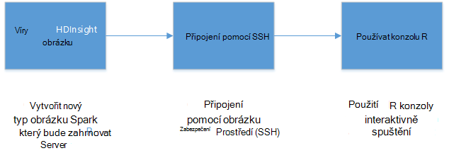

## Zjistit předpoklady pro

* __Azure předplatné__: před zahájením tohoto kurzu, musíte mít předplatné Azure. Další informace najdete v článku [získání Azure bezplatnou zkušební verzi](https://azure.microsoft.com/documentation/videos/get-azure-free-trial-for-testing-hadoop-in-hdinsight/) .

* __Klient A zabezpečené prostředí (SSH)__: klient SSH slouží k vzdáleně připojit k obrázku HDInsight a spusťte příkazy přímo na clusteru. Systémy Linux, Unix a OS X poskytují SSH klienta až `ssh` příkaz. Pro systémy Windows doporučujeme [nátěrové](http://www.chiark.greenend.org.uk/~sgtatham/putty/download.html).

    * __SSH klávesy (nepovinné)__: zabezpečené SSH účet používá pro připojení k obrázku pomocí hesla nebo veřejným klíčem. Použití hesla je jednodušší a umožňuje začít pracovat bez nutnosti vytvořte dvojici klíčů soukromá /; pomocí klávesy je však bezpečnější.
    
        Kroky v tomto dokumentu Předpokládejme, že používáte hesla. Informace o tom, jak vytvořit a pomocí kláves SSH s Hdinsightu najdete v tématu tyto dokumenty:
        
        * [Pomocí SSH HDInsight klientů Linux, Unix nebo OS X](hdinsight-hadoop-linux-use-ssh-unix.md)
        
        * [Pomocí SSH HDInsight klientů se systémem Windows](hdinsight-hadoop-linux-use-ssh-windows.md)

### Požadavky na řízení přístupu

[AZURE.INCLUDE [access-control](../../includes/hdinsight-access-control-requirements.md)]

## Vytvoření clusteru

> [AZURE.NOTE] Kroky v tomto dokumentu vytvořit R Server na HDInsight pomocí konfigurace základní informace. Nastavení dalších obrázku (například přidáte další úložiště účty, pomocí virtuální sítě Azure nebo vytvoříte metastore pro podregistru) najdete v článku [clusterů na základě vytvořit Linux HDInsight](hdinsight-hadoop-provision-linux-clusters.md).

1. Přihlaste se k [portálu Azure](https://portal.azure.com).

2. Vyberte __Nový__ __dat + technologie pro analýzu__a potom __HDInsight__.

    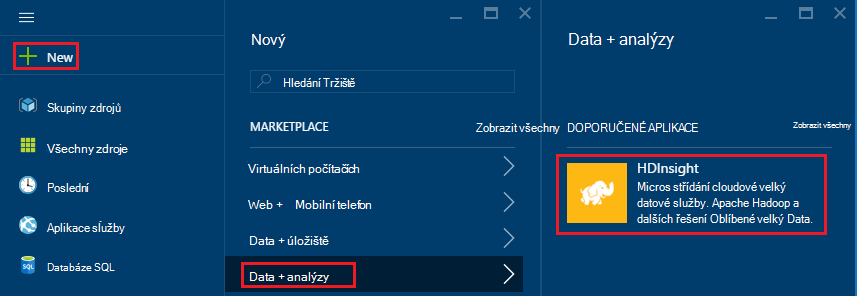

3. Zadejte název pro cluster v poli __Název obrázku__ . Pokud máte víc předplatných Azure, umožňuje položce __předplatného__ vyberte tu, kterou chcete použít.

    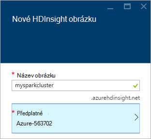

4. Vyberte možnost __Vybrat typ obrázku__. Na zásuvné __Typ obrázku__ vyberte z následujících možností:

    * __Typ obrázku__: Server R místní Spark
    
    * __Shluk osy__: Premium

    Další možnosti ponechte výchozí hodnoty a pak můžete pomocí tlačítka __Vybrat__ uložit typ obrázku.
    
    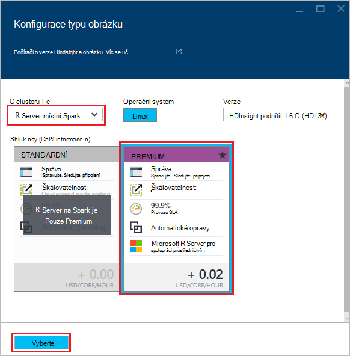
    
    > [AZURE.NOTE] Můžete také přidat R serveru na jiné typy HDInsight obrázku (například Hadoop nebo HBase,) tak, že vyberete požadovaný typ obrázku a potom možnost __Premium__.

5. Vyberte **Pole Skupina zdroje** , které chcete zobrazit seznam existující skupiny zdrojů a vyberte vytvořit obrázku v. Případně můžete vybrat **Vytvořit nový** a potom zadejte název nové skupiny prostředků. Zelené zaškrtnutí se zobrazí označíte, že je k dispozici název nové skupiny.

    > [AZURE.NOTE] Tato položka je výchozí nastavení jednu z existující skupiny zdrojů, pokud budou k dispozici.
    
    Pomocí tlačítka __Vybrat__ uložit skupina zdroje.

6. Vyberte **přihlašovací údaje**a pak zadejte **Clusteru přihlášení uživatelské jméno** a **Heslo pro přihlášení obrázku**.

    Zadejte __uživatelské jméno SSH__.  SSH slouží k vzdáleně připojovat k obrázku pomocí klienta __Zabezpečené prostředí (SSH)__ . Můžete buď zadáte SSH uživatel v tomto dialogovém okně nebo po clusteru vytvoření (karta Konfigurace clusteru). R Server nakonfigurovaný očekávat __SSH uživatelské jméno__ "remoteuser".  Pokud používáte jiný uživatelské jméno, budete muset provést další krok po vytvoření clusteru.
    
    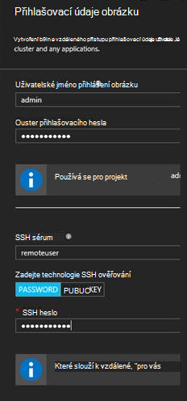

    __Typ ověřování SSH__: Vyberte typ ověřování __heslo__ , pokud preferujete používání veřejným klíčem.  Pokud chcete pro přístup k serveru R clusteru prostřednictvím vzdáleného klienta, například RTVS, RStudio nebo jiné plochy integrovaném vývojovém prostředí musíte pár veřejné a privátní klíče.   

    Vytvoření a použití soukromá/klíč pár vyberte "VEŘEJNÝM klíčem" a postupujte takto.  Tyto pokyny předpokládá, že jste softwaru Cygwin s ssh-keygen nebo ekvivalent nainstalovaný.

    -    Vygenerovat veřejné a privátní klíč z příkazového řádku na přenosném počítači:
      
            SSH-keygen - rsa -b 2048 – n < soukromý klíč název_souboru >
      
    -    Tím vytvoříte soubor privátní klíče a veřejné klíčové soubor v části název < soukromý klíč název_souboru > .pub, například  davec a davec.pub.  Zadejte souborem veřejného klíče (* .pub) přiřazujte HDI clusteru pověření:
      
        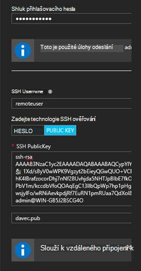  
      
    -    Změna oprávnění pro soukromé keyfile na přenosném počítači
      
            chmod 600 < soukromý klíč název_souboru >
      
    -    Pomocí souboru privátní klíče SSH pro vzdálené přihlášení, například
      
            SSH – i < soukromý klíč název_souboru >remoteuser@<hostname public ip>
      
      nebo část definici kontext výpočetním Hadoop Spark R serveru v klientském počítači (viz pomocí serveru Microsoft R jako Hadoop klienta v části [vytváření výpočet kontext pro Spark](https://msdn.microsoft.com/microsoft-r/scaler-spark-getting-started#creating-a-compute-context-for-spark) online [RevoScaleR Hadoop Spark příručce Začínáme](https://msdn.microsoft.com/microsoft-r/scaler-spark-getting-started)s.)

7. Vyberte **Zdroj dat** vyberte zdroj dat pro clusteru. Vyberte existujícího účtu úložiště tak, že vyberete __Vyberte úložiště účet__ a potom možnost účet nebo vytvoření nového účtu pomocí __Nový__ odkaz v části __Vyberte účet úložiště__ .

    Pokud vyberete možnost __Nový__, je nutné zadat název nového účtu úložiště. Zelené zaškrtnutí se zobrazí, pokud název nebude přijatá.

    Název clusteru je výchozí nastavení __Výchozí kontejner__ . Nechte to jako hodnota.
    
    Vyberte __umístění__ vyberte oblast pro vytvoření účtu úložiště v.
    
    > [AZURE.IMPORTANT] Výběr umístění zdroje dat výchozí také nastavit umístění obrázku HDInsight. Zdroj dat obrázku a výchozí musí být umístěné ve stejné oblasti.

    Uložit nastavení zdroje dat pomocí tlačítka **Vybrat** .
    
    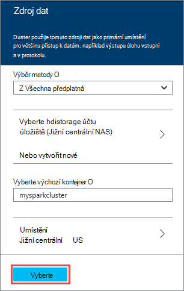

8. Vyberte **Uzel ceny úrovní** k zobrazení informací o vytvořené pro tento cluster uzlů. Pokud si nejste jisti, že, musíte mít větší obrázku, ponechte počtu uzlů pracovníka výchozí `4`. Odhad nákladů clusteru zobrazí v zásuvné.

    > [AZURE.NOTE] V případě potřeby můžete změnit velikost obrázku později prostřednictvím portálu (clusteru -> Nastavení -> měřítko obrázku) zvětšit nebo zmenšit počet pracovníka uzlů.  To může být užitečné pro volnoběhu dolů clusteru není při použití nebo pro přidání kapacita potřebám větší úkoly.

    Některé faktory byste měli myslet při pro změnu velikosti svůj cluster uzly dat a uzel okraj patří:  
   
    - Výkon distribuované R serveru analýzy Spark odpovídá počtu uzlů pracovníka po velkých data.  
    - Provádění analýz R Server je lineární velikost dat probíhá analýza. Příklad:  
        - Pro malé a menší data bude nejlépe, když analyzovat v kontextu místním na uzel okraje.  Další informace o scénáře v části který místní a Spark výpočetním kontexty fungují nejlépe najdete v článku možnosti kontextu výpočetním R serveru na HDInsight. 
        - Pokud přihlášení na uzel okraje a spusťte skript R tam pak všechny, ale ScaleR příjmu – funkce provede <strong>místně</strong> na uzel okraj tak paměti a počet jádra uzel okraj by měl být velikosti příslušným způsobem. To platí používáte R Server na HDI jako vzdálené výpočetním kontext z přenosném počítači.
    
    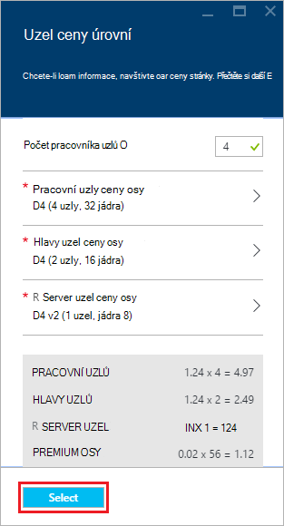

    Pomocí tlačítka **Vybrat** uložit na uzel ceny konfigurace.
    
9. Na zásuvné **Nového clusteru HDInsight** zkontrolujte, zda je zaškrtnuto **Připnout k Startboard** a pak vyberte **vytvořit**. Tím vytvoříte clusteru a přidání dlaždice pro něj Startboard portálu Azure. Na ikonu výskyt znamená, že clusteru vytváří a změní zobrazit ikonu HDInsight po vytvoření.

  	| Při vytváření | Vytvoření dokončeno. |
  	| ------------------ | --------------------- |
  	|  |  |

    > [AZURE.NOTE] Bude trvat delší dobu clusteru vytvořit, obvykle asi 15 minut. Použití dlaždice na Startboard nebo položce **oznámení** na levé straně stránky informace o s vytvářením.

## Připojení k uzel edge serveru R

Připojení k serveru R postranní uzel clusteru HDInsight pomocí SSH:

    ssh USERNAME@r-server.CLUSTERNAME-ssh.azurehdinsight.net
    
> [AZURE.NOTE] Můžete zjistit taky `R-Server.CLUSTERNAME-ssh.azurehdinsight.net` adresu na portálu Azure tak, že vyberete clusteru, a pak __Všechna nastavení__, __aplikace__a __RServer__. Zobrazí se informace o SSH Endpoint uzel okraje.
>
> 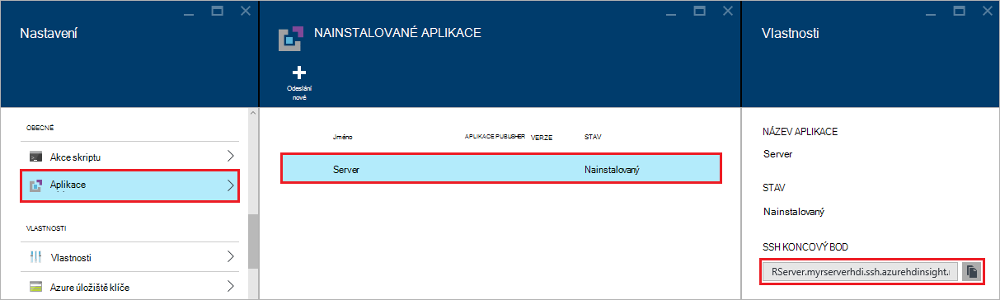
    
Pokud jste použili heslo zabezpečení SSH uživatelský účet, zobrazí se výzva k zadání ho. Pokud jste použili veřejný klíč, bude pravděpodobně nutné použít `-i` parametr určuje odpovídající privátním klíčem. Například `ssh -i ~/.ssh/id_rsa USERNAME@R-Server.CLUSTERNAME-ssh.azurehdinsight.net`.
    
Další informace o použití SSH s na základě Linux Hdinsightu najdete v následujících článcích:

* [Použití SSH s Hadoop Linux založené na HDInsight z Linux, Unix nebo OS X](hdinsight-hadoop-linux-use-ssh-unix.md)

* [Použití SSH s Hadoop Linux založené na HDInsight z Windows](hdinsight-hadoop-linux-use-ssh-windows.md)

Po připojení, budou přicházet výzvy podobně jako tento.

    username@ed00-myrser:~$

## Používat konzolu R

1. Z SSH relace pomocí následujícího příkazu spusťte konzolu R.

        R
    
    Zobrazí se výstup podobně jako tento.
    
        R version 3.2.2 (2015-08-14) -- "Fire Safety"
        Copyright (C) 2015 The R Foundation for Statistical Computing
        Platform: x86_64-pc-linux-gnu (64-bit)

        R is free software and comes with ABSOLUTELY NO WARRANTY.
        You are welcome to redistribute it under certain conditions.
        Type 'license()' or 'licence()' for distribution details.

        Natural language support but running in an English locale

        R is a collaborative project with many contributors.
        Type 'contributors()' for more information and
        'citation()' on how to cite R or R packages in publications.

        Type 'demo()' for some demos, 'help()' for on-line help, or
        'help.start()' for an HTML browser interface to help.
        Type 'q()' to quit R.

        Microsoft R Server version 8.0: an enhanced distribution of R
        Microsoft packages Copyright (C) 2016 Microsoft Corporation

        Type 'readme()' for release notes.

        >

2. V `>` výzvy, můžete zadat kód R. R server obsahuje balíčků, které umožňují snadno pracovat s Hadoop a spusťte distribuované výpočty. Například pomocí následujícího příkazu zobrazíte kořenovém výchozí systém souborů pro clusteru HDInsight.

        rxHadoopListFiles("/")
    
    Můžete taky adresování WASB styl.
    
        rxHadoopListFiles("wasbs:///")

## Pomocí serveru R na HDI z vzdálené instance serveru Microsoft R nebo Microsoft R klienta

V části nad týkající se používání klíčových dvojice soukromá/pro přístup ke clusteru je možné nastavení přístupu k kontextu výpočetním HDI Hadoop Spark z instanci vzdálené Microsoft R Server nebo Microsoft R klienty na stolním nebo přenosném počítači (viz jako Hadoop klienta v části [vytváření výpočet kontext pro Spark](https://msdn.microsoft.com/microsoft-r/scaler-spark-getting-started#creating-a-compute-context-for-spark) online [RevoScaleR Hadoop Spark příručce Začínáme](https://msdn.microsoft.com/microsoft-r/scaler-spark-getting-started)pomocí serveru Microsoft R).  K tomu budete muset zadat následující možnosti při definování RxSpark výpočet kontextu na přenosném počítači: hdfsShareDir, shareDir, sshUsername, sshHostname, sshSwitches a sshProfileScript. Příklad:

    
    myNameNode <- "default"
    myPort <- 0 
 
    mySshHostname  <- 'rkrrehdi1-ssh.azurehdinsight.net'  # HDI secure shell hostname
    mySshUsername  <- 'remoteuser'# HDI SSH username
    mySshSwitches  <- '-i /cygdrive/c/Data/R/davec'   # HDI SSH private key
 
    myhdfsShareDir <- paste("/user/RevoShare", mySshUsername, sep="/")
    myShareDir <- paste("/var/RevoShare" , mySshUsername, sep="/")
 
    mySparkCluster <- RxSpark(
      hdfsShareDir = myhdfsShareDir,
      shareDir     = myShareDir,
      sshUsername  = mySshUsername,
      sshHostname  = mySshHostname,
      sshSwitches  = mySshSwitches,
      sshProfileScript = '/etc/profile',
      nameNode     = myNameNode,
      port         = myPort,
      consoleOutput= TRUE
    )

    
 
## Použití výpočetních kontextu

Kontext výpočetním umožňuje určit, zda výpočtu proběhne místně na uzel okraje nebo zda budou mít rozvržena uzlů v clusteru HDInsight.
        
1. Z konzoly R pomocí následující načíst ukázková data do výchozí úložiště pro HDInsight.

        # Set the HDFS (WASB) location of example data
        bigDataDirRoot <- "/example/data"
        # create a local folder for storaging data temporarily
        source <- "/tmp/AirOnTimeCSV2012"
        dir.create(source)
        # Download data to the tmp folder
        remoteDir <- "http://packages.revolutionanalytics.com/datasets/AirOnTimeCSV2012"
        download.file(file.path(remoteDir, "airOT201201.csv"), file.path(source, "airOT201201.csv"))
        download.file(file.path(remoteDir, "airOT201202.csv"), file.path(source, "airOT201202.csv"))
        download.file(file.path(remoteDir, "airOT201203.csv"), file.path(source, "airOT201203.csv"))
        download.file(file.path(remoteDir, "airOT201204.csv"), file.path(source, "airOT201204.csv"))
        download.file(file.path(remoteDir, "airOT201205.csv"), file.path(source, "airOT201205.csv"))
        download.file(file.path(remoteDir, "airOT201206.csv"), file.path(source, "airOT201206.csv"))
        download.file(file.path(remoteDir, "airOT201207.csv"), file.path(source, "airOT201207.csv"))
        download.file(file.path(remoteDir, "airOT201208.csv"), file.path(source, "airOT201208.csv"))
        download.file(file.path(remoteDir, "airOT201209.csv"), file.path(source, "airOT201209.csv"))
        download.file(file.path(remoteDir, "airOT201210.csv"), file.path(source, "airOT201210.csv"))
        download.file(file.path(remoteDir, "airOT201211.csv"), file.path(source, "airOT201211.csv"))
        download.file(file.path(remoteDir, "airOT201212.csv"), file.path(source, "airOT201212.csv"))
        # Set directory in bigDataDirRoot to load the data into
        inputDir <- file.path(bigDataDirRoot,"AirOnTimeCSV2012") 
        # Make the directory
        rxHadoopMakeDir(inputDir)
        # Copy the data from source to input
        rxHadoopCopyFromLocal(source, bigDataDirRoot)

2. Pak Vytvořme některé informace o dat a definovat dva zdroje dat, abychom mohli pracovat s daty.

        # Define the HDFS (WASB) file system
        hdfsFS <- RxHdfsFileSystem()
        # Create info list for the airline data
        airlineColInfo <- list(
            DAY_OF_WEEK = list(type = "factor"),
            ORIGIN = list(type = "factor"),
            DEST = list(type = "factor"),
            DEP_TIME = list(type = "integer"),
            ARR_DEL15 = list(type = "logical"))

        # get all the column names
        varNames <- names(airlineColInfo)

        # Define the text data source in hdfs
        airOnTimeData <- RxTextData(inputDir, colInfo = airlineColInfo, varsToKeep = varNames, fileSystem = hdfsFS)
        # Define the text data source in local system
        airOnTimeDataLocal <- RxTextData(source, colInfo = airlineColInfo, varsToKeep = varNames)

        # formula to use
        formula = "ARR_DEL15 ~ ORIGIN + DAY_OF_WEEK + DEP_TIME + DEST"

3. Pojďme spustit logistickou regresní nad daty pomocí místní výpočet kontextu.

        # Set a local compute context
        rxSetComputeContext("local")
        # Run a logistic regression
        system.time(
            modelLocal <- rxLogit(formula, data = airOnTimeDataLocal)
        )
        # Display a summary 
        summary(modelLocal)

    Měli byste vidět výstup, který má na konci podobné následujícímu řádky.

        Data: airOnTimeDataLocal (RxTextData Data Source)
        File name: /tmp/AirOnTimeCSV2012
        Dependent variable(s): ARR_DEL15
        Total independent variables: 634 (Including number dropped: 3)
        Number of valid observations: 6005381
        Number of missing observations: 91381
        -2*LogLikelihood: 5143814.1504 (Residual deviance on 6004750 degrees of freedom)

        Coefficients:
                        Estimate Std. Error z value Pr(>|z|)
        (Intercept)   -3.370e+00  1.051e+00  -3.208  0.00134 **
        ORIGIN=JFK     4.549e-01  7.915e-01   0.575  0.56548
        ORIGIN=LAX     5.265e-01  7.915e-01   0.665  0.50590
        ......
        DEST=SHD       5.975e-01  9.371e-01   0.638  0.52377
        DEST=TTN       4.563e-01  9.520e-01   0.479  0.63172
        DEST=LAR      -1.270e+00  7.575e-01  -1.676  0.09364 .
        DEST=BPT         Dropped    Dropped Dropped  Dropped
        ---
        Signif. codes:  0 ‘***’ 0.001 ‘**’ 0.01 ‘*’ 0.05 ‘.’ 0.1 ‘ ’ 1

        Condition number of final variance-covariance matrix: 11904202
        Number of iterations: 7

4. Další Pojďme spuštění stejného logistickou při výpočtu lineární regrese v kontextu Spark. Kontext Spark distribuovat zpracování prostřednictvím všechny pracovníka uzlů v clusteru HDInsight.

        # Define the Spark compute context 
        mySparkCluster <- RxSpark()
        # Set the compute context 
        rxSetComputeContext(mySparkCluster)
        # Run a logistic regression 
        system.time(  
            modelSpark <- rxLogit(formula, data = airOnTimeData)
        )
        # Display a summary
        summary(modelSpark)

    > [AZURE.NOTE] Můžete taky MapReduce k distribuci výpočtu přes uzlech. Další informace o výpočetním kontext najdete v článku [Výpočet kontextu možnosti R serveru na HDInsight premium](hdinsight-hadoop-r-server-compute-contexts.md).

## Distribuce R kódu více uzlů

Serverem R můžete snadno převzít existující kód R a spustit napříč několika uzlů v clusteru pomocí `rxExec`. To je užitečné při provádění možnosti Uklidit parametr nebo simulace. Následuje příklad použití `rxExec`.

    rxExec( function() {Sys.info()["nodename"]}, timesToRun = 4 )
    
Používáte pořád Spark nebo MapReduce kontext, to vrátí hodnotu název_uzlu uzlů pracovníka, která kód (`Sys.info()["nodename"]`) spustili. Příklad čtyř uzel clusteru, může se zobrazit výstup podobně jako tento.

    $rxElem1
        nodename
    "wn3-myrser"

    $rxElem2
        nodename
    "wn0-myrser"

    $rxElem3
        nodename
    "wn3-myrser"

    $rxElem4
        nodename
    "wn3-myrser"

## Instalace balíčků R

Pokud chcete nainstalovat další balíčky R na uzel okraje, můžete použít `install.packages()` přímo z v rámci R konzola, když připojení k uzel okraj prostřednictvím SSH. Pokud budete potřebovat k instalaci R balíčků uzlech pracovníka clusteru, musí však použít akci skriptu.

Skript akce jsou flám skripty, které se používají k provádění změn konfigurace clusteru HDInsight nebo k instalaci další software. V tomto případě instalace další R balíčky. K instalaci další balíčků pomocí skriptu akce, pomocí následujících kroků.

> [AZURE.IMPORTANT] Použití akce skriptu k instalaci další balíčky R lze použít pouze po vytvoření clusteru. Při vytváření clusteru není vhodné používat jako skript závisí na serveru R je úplně nainstalovali a nakonfigurovali.

1. Z [Azure portál](https://portal.azure.com)vyberte Server R clusteru HDInsight.

2. Z zásuvné clusteru vyberte __Všechna nastavení__a potom __Skriptem akce__. Z zásuvné __Skript akce__ vyberte __Odeslat nový__ odešlete novou akci skriptu.

    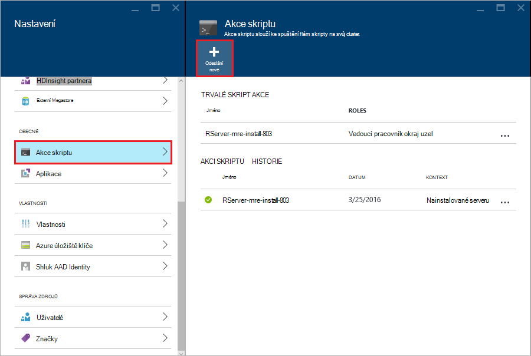

3. Z zásuvné __Akce skript odeslání__ zadejte následující informace.

  - __Název__: popisný název k identifikaci tohoto skriptu
  - __Flám skriptem URI__:`http://mrsactionscripts.blob.core.windows.net/rpackages-v01/InstallRPackages.sh`
  - __Hlavy__: je vhodné __zrušené zaškrtnutí políčka__
  - __Pracovní__: měly být __zaškrtnuté políčko__
  - __Zookeeper__: je vhodné __zrušené zaškrtnutí políčka__
  - __Parametry__: balíčků R je třeba nainstalovat. Například`bitops stringr arules`
  - __Trvalého tento skript..__: je vhodné __Checked__  

    > [AZURE.NOTE] 1. ve výchozím nastavení jsou nainstalované všechny balíčky R ze snímku konzistentní s verzi serveru R, má nainstalovanou Microsoft MRAN úložiště.  Pokud chcete nainstalovat novější verzi balíčků bude některé rizika nekompatibilita, ale toto je možné zadáním `useCRAN` jako první prvek balíček seznamu, například  `useCRAN bitops, stringr, arules`.  
    > 2. Některé R balíčky budou vyžadovat další knihovny systém Linux. Pro usnadnění jsme jsou předinstalované závislosti potřeby tak, že horních 100 nejoblíbenější balíčků R. Ale pokud balíčky R, který nainstalujete vyžadují knihoven za to, pak musíte stáhnout základní skript použitý tady a přidat pokynů k instalaci knihovny systému. Musí pak nahrajte změněné skriptu na kontejner veřejné objektů blob Azure úložiště, můžete nainstalovat balíčky změněné skriptu.
    > Další informace o vývoji skript akce najdete v článku [vývoj akci skriptu](hdinsight-hadoop-script-actions-linux.md).  

    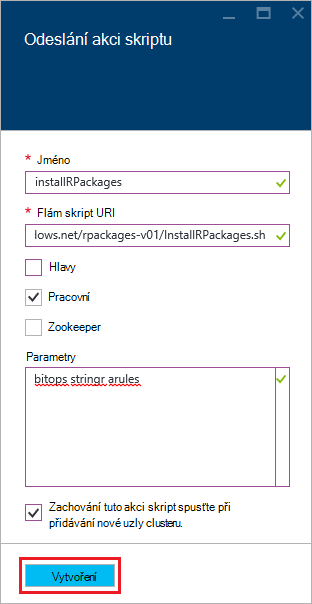

4. Výběrem možnosti __vytvořit__ následujícím způsobem. Po dokončení skriptu balíčků R budou k dispozici ve všech uzlech kolegy.
    
## Další kroky

Teď když víte, jak vytvořit nového clusteru HDInsight, která obsahuje serveru R a základní informace o použití konzole R z SSH relace, použijte následující zjistit další způsoby, jak pracovat se serverem R na HDInsight.

- [Přidání RStudio serveru HDInsight Premium](hdinsight-hadoop-r-server-install-r-studio.md)

- [Výpočet kontextu možnosti R serveru na HDInsight premium](hdinsight-hadoop-r-server-compute-contexts.md)

- [Azure možnosti ukládání R serveru na HDInsight premium](hdinsight-hadoop-r-server-storage.md)

### Azure správce prostředků šablony

Pokud máte zájem automatické vytváření R serveru na použití šablon správce prostředků Azure HDInsight, viz následující příklad šablony.

* [Vytvoření serveru R clusteru HDInsight pomocí SSH veřejný klíč](http://go.microsoft.com/fwlink/p/?LinkID=780809)
* [Vytvoření serveru R clusteru HDInsight pomocí hesla SSH](http://go.microsoft.com/fwlink/p/?LinkID=780810)

Obě šablony vytvořit nový cluster HDInsight a související úložiště účtu a mohou sloužit z Azure rozhraní příkazového řádku, Azure PowerShell nebo portálu Azure.

Obecné informace o použití šablon správce prostředků Azure najdete v článku [na základě vytvořit Linux Hadoop clusterů v používání šablon správce prostředků Azure HDInsight](hdinsight-hadoop-create-linux-clusters-arm-templates.md).
