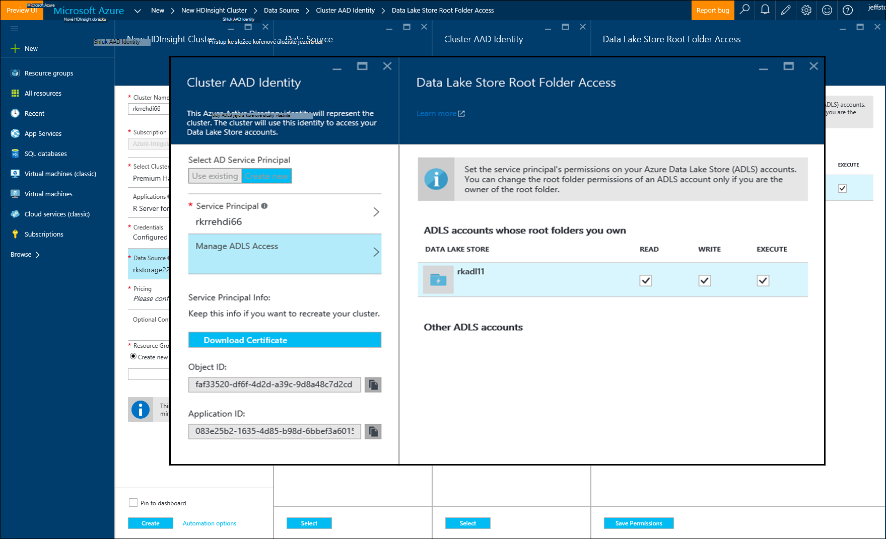

<properties
   pageTitle="Azure možnosti ukládání R serveru na HDInsight (verze preview) | Microsoft Azure"
   description="Další informace o různých úložiště dostupné možnosti uživatelé, kteří mají R serveru na HDInsight (verze preview)"
   services="HDInsight"
   documentationCenter=""
   authors="jeffstokes72"
   manager="jhubbard"
   editor="cgronlun"
/>

<tags
   ms.service="HDInsight"
   ms.devlang="R"
   ms.topic="article"
   ms.tgt_pltfrm="na"
   ms.workload="data-services"
   ms.date="09/01/2016"
   ms.author="jeffstok"
/>

# <a name="azure-storage-options-for-r-server-on-hdinsight-preview"></a>Azure možnosti ukládání R serveru na HDInsight (verze preview)

Microsoft R Server na HDInsight (verze preview) má přístup k obou objektů Blob Azure a [Jezera úložný prostor Azure](https://azure.microsoft.com/services/data-lake-store/)způsobem trvalá data, kód, výsledek od analýzy a tak dál.

Při vytváření Hadoop obrázku v HDInsight zadejte účet Azure úložiště. Konkrétní kontejneru úložiště objektů Blob z tohoto účtu obsahuje systému souborů pro obrázku, které vytvoříte (například systému souborů Hadoop Distributed). Pro účely výkonu clusteru HDInsight vytvořený v centru stejné dat jako primární účet, který určíte. Další informace najdete v tématu [úložiště objektů Blob Azure použití s HDInsight](hdinsight-hadoop-use-blob-storage.md "úložiště objektů Blob Azure použití s HDInsight").   


## <a name="use-multiple-azure-blob-storage-accounts"></a>Použití více účtů úložiště objektů Blob Azure

V případě potřeby můžete využít více účtů Azure úložiště nebo kontejnery s HDI obrázku. Postup, budete muset zadat další úložiště účty v uživatelském rozhraní při vytváření clusteru a pak postupujte podle kroků je lze používat v R.  

1.  Vytvoření clusteru HDInsight s název účtu úložiště **storage1** a kontejneru výchozí s názvem **container1**.
2. Zadejte další úložiště účet s názvem **storage2**.  
3. Zkopírujte soubor mycsv.csv k adresáři/Share a analýza u tohoto souboru.  

    ````
    hadoop fs –mkdir /share
    hadoop fs –copyFromLocal myscsv.scv /share  
    ````

3.  V kódu R nastavte uzel název výchozí **** a Procházet adresář a soubor, který chcete zpracovat.  

    ````
    myNameNode <- "default"
    myPort <- 0
    ````

  Umístění dat:  

    bigDataDirRoot <-"/ share"  

  Definování Spark výpočetním kontextu:

    mySparkCluster <-RxSpark(consoleOutput=TRUE)

  Nastavení výpočtu kontextu:

    rxSetComputeContext(mySparkCluster)

  Definování systému souborů Hadoop Distributed soubor systému (HDFS):

    hdfsFS <-RxHdfsFileSystem (název hostitele = myNameNode, port = myPort)

  Zadejte vstupní soubor a analyzujte data v HDFS:

    Vstupní_soubor <-file.path(bigDataDirRoot,"mycsv.csv")

Všechny odkazy na adresář a soubor přejděte na úložiště účet wasbs://container1@storage1.blob.core.windows.net. Jedná se o **výchozí úložiště účet** , který máte přidružený k obrázku HDInsight.

Předpokládejme, kterou chcete zpracovat soubor s názvem mySpecial.csv, která se nachází v /private adresáře z **container2** **storage2**.

Kódu R bodu uzel odkaz na název účtu úložiště **storage2** .

    myNameNode <- "wasbs://container2@storage2.blob.core.windows.net"
    myPort <- 0

  Umístění dat:

    bigDataDirRoot <- "/private"

  Definování Spark výpočetním kontextu:

    mySparkCluster <- RxSpark(consoleOutput=TRUE, nameNode=myNameNode, port=myPort)

  Nastavit výpočetní kontext:

    rxSetComputeContext(mySparkCluster)

  Definování systému souborů HDFS:

    hdfsFS <- RxHdfsFileSystem(hostName=myNameNode, port=myPort)

  Zadejte vstupní soubor a analyzujte data v HDFS:

    inputFile <-file.path(bigDataDirRoot,"mySpecial.csv")

Všechny odkazy na adresář a soubor teď přejděte na úložiště účet wasbs://container2@storage2.blob.core.windows.net. Toto je **Uzel název** , který jste zadali.

Všimněte si, že bude obsahuje konfigurace/User/RevoShare/<SSH username> adresáře na **storage2** takto:

    hadoop fs -mkdir wasbs://container2@storage2.blob.core.windows.net/user
    hadoop fs -mkdir wasbs://container2@storage2.blob.core.windows.net/user/RevoShare
    hadoop fs -mkdir wasbs://container2@storage2.blob.core.windows.net/user/RevoShare/<RDP username>

## <a name="use-an-azure-data-lake-store"></a>Použití úložiště jezera dat Azure

Pokud chcete použít Data jezera ukládá pomocí svého účtu Hdinsightu, budete muset poskytnout clusteru přístup ke každé jezera dat Azure úložiště, který chcete použít. Použili jste úložišti v skript R podobně jako použití účtu sekundárním úložiště (jak je popsáno v předchozím postupu).

## <a name="add-cluster-access-to-your-azure-data-lake-stores"></a>Přidání obrázku přístup do ukládá jezera dat Azure

Máte přístup k úložišti jezera dat pomocí jistinu služby Azure Active Directory (Azure AD), který máte přidružený k svůj cluster HDInsight.

### <a name="to-add-a-service-principal"></a>Chcete-li přidat hlavní název služby
1. Při vytváření HDInsight obrázku na kartě **Zdroje dat** vyberte **Identity AAD obrázku** .
2. V dialogovém okně **Identity AAD obrázku** v části **Vyberte jistinu služby AD**vyberte **vytvořit nový**.

Po pojmenujte jistinu služby a pro něj vytvořte hesla, na nové kartě otevře, kde můžete přidružit jistinu služby jezera datový úložiště.

Poznámky, můžete také přidat přístup k úložišti dat jezera později otevřením úložišti jezera dat na portálu Azure a přejdete na **Průzkumník dat** > **přístup**.  Následuje příklad dialogovém okně, které ukazuje, jak vytvořit hlavní název služby a spojit se obchodu dat jezera "rkadl11".




## <a name="use-the-data-lake-store-with-r-server"></a>Použití úložiště jezera Data se serverem R
Jakmile udělíte přístup k úložišti jezera dat, můžete úložiště na serveru R na HDInsight stejným způsobem, jako účet sekundárního Azure úložiště. Jediný rozdíl je předponu **wasb: / /** se změní na **adl: / /** následujícím způsobem:

````
# Point to the ADL store (e.g. ADLtest)
myNameNode <- "adl://rkadl1.azuredatalakestore.net"
myPort <- 0

# Location of the data (assumes a /share directory on the ADL account)
bigDataDirRoot <- "/share"  

# Define Spark compute context
mySparkCluster <- RxSpark(consoleOutput=TRUE, nameNode=myNameNode, port=myPort)

# Set compute context
rxSetComputeContext(mySparkCluster)

# Define HDFS file system
hdfsFS <- RxHdfsFileSystem(hostName=myNameNode, port=myPort)

# Specify the input file in HDFS to analyze
inputFile <-file.path(bigDataDirRoot,"AirlineDemoSmall.csv")

# Create factors for days of the week
colInfo <- list(DayOfWeek = list(type = "factor",
               levels = c("Monday", "Tuesday", "Wednesday", "Thursday",
                          "Friday", "Saturday", "Sunday")))

# Define the data source
airDS <- RxTextData(file = inputFile, missingValueString = "M",
                    colInfo  = colInfo, fileSystem = hdfsFS)

# Run a linear regression
model <- rxLinMod(ArrDelay~CRSDepTime+DayOfWeek, data = airDS)
````

Tady jsou příkazy, které slouží ke konfiguraci účtu úložiště jezera dat s adresářem RevoShare a přidání ukázkový soubor CSV z předchozího příkladu:

````
hadoop fs -mkdir adl://rkadl1.azuredatalakestore.net/user
hadoop fs -mkdir adl://rkadl1.azuredatalakestore.net/user/RevoShare
hadoop fs -mkdir adl://rkadl1.azuredatalakestore.net/user/RevoShare/<user>

hadoop fs -mkdir adl://rkadl1.azuredatalakestore.net/share

hadoop fs -copyFromLocal /usr/lib64/R Server-7.4.1/library/RevoScaleR/SampleData/AirlineDemoSmall.csv adl://rkadl1.azuredatalakestore.net/share

hadoop fs –ls adl://rkadl1.azuredatalakestore.net/share
````

## <a name="use-azure-files-on-the-edge-node"></a>Používání souborů Azure na uzel okraje

Je také možnost pohodlný datový úložiště pro použití na okraj uzel s názvem [Azure soubory](../storage/storage-how-to-use-files-linux.md "Azure soubory"). Umožňuje připojení úložišti Azure sdílené složky k systému souborů Linux. To může být užitečné pro ukládání datových souborů, R skripty a výsledek objekty, které mohou být při dává smysl pro systém nativní souborů na uzel hrany namísto HDFS potřeba později.

Hlavní výhodou Azure soubory je, že můžete sdílených souborů připojených a používaný systém, který obsahuje nepodporovaný operační systém Windows ATP Linux. Například lze použít jiné HDInsight obrázku s někým z členů vašeho týmu, OM Azure nebo i tak, že místní systém.


## <a name="next-steps"></a>Další kroky

Poté, co seznámili základní informace o tom, jak používat konzolu R z relaci SSH a postup pro vytvoření nového clusteru Hdinsightu, který obsahuje R serveru použijte následující odkazy zjistit další způsoby, jak pracovat se serverem R na HDInsight.

- [Základní informace o serveru R na HDInsight](hdinsight-hadoop-r-server-overview.md)
- [Začínáme se serverem R na Hadoop](hdinsight-hadoop-r-server-get-started.md)
- [Přidání RStudio serveru HDInsight Premium](hdinsight-hadoop-r-server-install-r-studio.md)
- [Výpočet kontextu možnosti R serveru na HDInsight](hdinsight-hadoop-r-server-compute-contexts.md)
