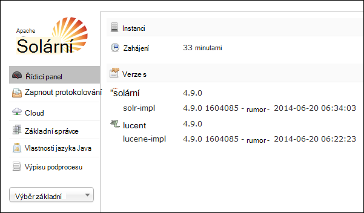
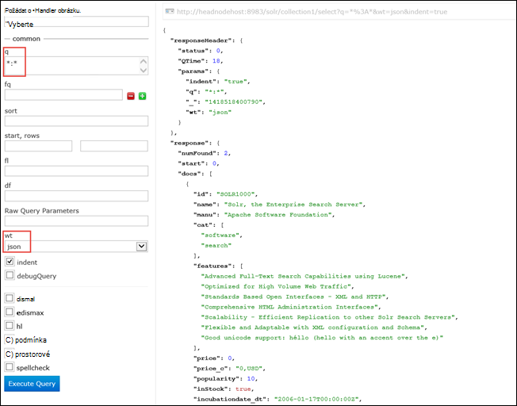

<properties
    pageTitle="Instalace Solr na základě Linux HDInsight pomocí skriptu akce | Microsoft Azure"
    description="Zjistěte, jak nainstalovat Solr na základě Linux HDInsight Hadoop clusterů pomocí skriptu akce."
    services="hdinsight"
    documentationCenter=""
    authors="Blackmist"
    manager="jhubbard"
    editor="cgronlun"
    tags="azure-portal"/>

<tags
    ms.service="hdinsight"
    ms.workload="big-data"
    ms.tgt_pltfrm="na"
    ms.devlang="na"
    ms.topic="article"
    ms.date="10/03/2016"
    ms.author="larryfr"/>

# Instalace a používání Solr v HDInsight Hadoop clusterů

V tomto tématu se dozvíte, jak nainstalovat Solr na Azure Hdinsightu pomocí skriptu akce. Solr je platformy výkonné vyhledávání a poskytuje možnosti vyhledávání na úrovni organizace dat spravuje Hadoop. Po instalaci Solr HDInsight clusteru také naučíte hledání dat pomocí Solr.

> [AZURE.NOTE] Kroky v tomto dokumentu vyžadují obrázku na základě Linux HDInsight. Informace o použití Solr s clusteru serveru s Windows najdete v tématu [instalace a použití Solr na clusterů HDinsight Hadoop (Windows)](hdinsight-hadoop-solr-install.md)

Ukázka skriptu použité v tomto tématu vytvoří Solr obrázku s konkrétní konfigurace. Podle potřeby můžete nakonfigurovat Solr obrázku s jinou kolekcí shards, schémat, repliky, atd musí změnit skriptu a Solr binární příslušným způsobem.

## Co je Solr?

[Apache Solr](http://lucene.apache.org/solr/features.html) je platforma hledání organizace, který umožňuje výkonné fulltextové vyhledávání na data. Během Hadoop umožňuje ukládání a správa velké množství dat, Apache Solr poskytuje možnosti vyhledávání rychle načítat data. Toto téma obsahuje pokyny k přizpůsobení HDInsight clusteru nainstalovat Solr.

> [AZURE.WARNING] Součásti součástí clusteru HDInsight jsou plně podporovány a Microsoft Support vám pomůže izolovat a vyřešit problémy týkající se tyto součásti.
>
> Vlastní součásti, například Solr, využijte komerčně rozumné podporu pomoci při další řešení problému. To může mít tento problém vyřešit nebo s žádostí o zapojit dostupných kanálů technologie otevřít zdroj, kde se nacházejí hloubkové odborných informací, které technologie. Například existuje mnoho webů komunity, které lze použít, třeba: [fórum MSDN pro HDInsight](https://social.msdn.microsoft.com/Forums/azure/en-US/home?forum=hdinsight), [http://stackoverflow.com](http://stackoverflow.com). Také Apache mít projekty webů projektů na [http://apache.org](http://apache.org), například: [Hadoop](http://hadoop.apache.org/).

## Co znamená skriptu

Tento skript udělá tyto změny HDInsight obrázku:

* Instalace Solr do`/usr/hdp/current/solr`
* Vytvoří nový uživatel, __solrusr__, který slouží ke spuštění služby Solr
* Nastaví __solruser__ jako vlastník`/usr/hdp/current/solr`
* Přidá [Upstart](http://upstart.ubuntu.com/) konfiguraci, který se spustí Solr, pokud se restartuje clusteru. Solr taky automaticky spuštěním uzlů po instalaci

## Instalace Solr pomocí skriptu akce

Ukázka skriptu nainstalovat Solr HDInsight clusteru je k dispozici v následujícím umístění.

    https://hdiconfigactions.blob.core.windows.net/linuxsolrconfigactionv01/solr-installer-v01.sh

Tato část obsahuje pokyny k použití ukázkový skript při vytváření nového clusteru pomocí portálu Azure. 

> [AZURE.NOTE] Azure Powershellu, rozhraní příkazového řádku Azure, HDInsight .NET SDK nebo správce prostředků Azure šablony lze také použít skript akce. Můžete taky použít akce skriptu na spuštěná clusterů. Další informace najdete v tématu [přizpůsobení HDInsight clusterů akcím skriptu](hdinsight-hadoop-customize-cluster-linux.md).

1. Spuštění zřizování clusteru pomocí kroků v [na základě poskytování Linux HDInsight clusterů](hdinsight-hadoop-create-linux-clusters-portal.md), ale není dokončena zřizování.

2. Na zásuvné **Volitelná konfigurace** vyberte **Akce skriptu**a zadejte následující informace:

    * __Název__: Zadejte popisný název akci skriptu.
    * __Identifikátor URI skript__: https://hdiconfigactions.blob.core.windows.net/linuxsolrconfigactionv01/solr-installer-v01.sh
    * __Hlavy__: Toto políčko zaškrtněte,
    * __Pracovní__: Toto políčko zaškrtněte,
    * __ZOOKEEPER__: Zkontrolujte tato možnost nainstalovat na uzel Zookeeper
    * __Parametry__: nechte toto pole prázdné

3. V dolní části **Akce skriptu**pomocí tlačítka **Vybrat** konfiguraci uložte. Nakonec pomocí tlačítka **Vybrat** v dolní části zásuvné **Volitelná konfigurace** pro uložení informací o volitelná konfigurace.

4. Pokračujte v zřizování clusteru podle popisu v [clusterů na základě poskytování Linux HDInsight](hdinsight-hadoop-create-linux-clusters-portal.md).

## Použití Solr v HDInsight

### Indexování dat

Musí začínat indexování Solr s některé datové soubory. Pomocí Solr můžete pak dělat vyhledávacích dotazů indexovaná data. Pomocí následujících kroků přidat některé vzorovými daty chcete Solr a potom dotazu:

1. Připojení k clusteru HDInsight pomocí SSH:

        ssh USERNAME@CLUSTERNAME-ssh.azurehdinsight.net

    Další informace o použití SSH s Hdinsightu najdete v těchto článcích:

    * [Použití SSH s Hadoop Linux založené na HDInsight z Linux, Unix nebo OS X](hdinsight-hadoop-linux-use-ssh-unix.md)

    * [Použití SSH s Hadoop Linux založené na HDInsight z Windows](hdinsight-hadoop-linux-use-ssh-windows.md)

    > [AZURE.IMPORTANT] Kroky později v tématu Přepnutí tento dokument využívání tunelem protokol SSL pro připojení k webu Solr uživatelského rozhraní. Mohli použít tento postup, musíte vytvořit tunelem SSL a nakonfigurujte prohlížeči používat.
    >
    > Další informace najdete v tématu [Použití SSH Tunneling přístup k webu Ambari uživatelského rozhraní, ResourceManager, JobHistory, NameNode, Oozie a jiným webovým uživatelské rozhraní na](hdinsight-linux-ambari-ssh-tunnel.md)

2. Použijte následující příkazy mít Solr index ukázkových dat:

        cd /usr/hdp/current/solr/example/exampledocs
        java -jar post.jar solr.xml monitor.xml

    Zobrazí se následující výstup konzole:

        POSTing file solr.xml
        POSTing file monitor.xml
        2 files indexed.
        COMMITting Solr index changes to http://localhost:8983/solr/update..
        Time spent: 0:00:01.624

    Nástroj post.jar indexy Solr s **solr.xml** a **monitor.xml**Dvouvýběrový párový dokumenty. Tyto budou uloženy v __collection1__ v rámci Solr.

3. Slouží k vytvoření dotazu rozhraní REST API zveřejněné příslušným Solr následující:

        curl "http://localhost:8983/solr/collection1/select?q=*%3A*&wt=json&indent=true"

    Problémy se dotaz na __collection1__ dokumentů, které vyhovují __ \*:\* __ (kódovaný jako \*% 3A\* v řetězci dotazu) a která má být vrácena odpověď jako JSON. Odpověď na by měla vypadat podobně jako tento:

            "response": {
                "numFound": 2,
                "start": 0,
                "maxScore": 1,
                "docs": [
                  {
                    "id": "SOLR1000",
                    "name": "Solr, the Enterprise Search Server",
                    "manu": "Apache Software Foundation",
                    "cat": [
                      "software",
                      "search"
                    ],
                    "features": [
                      "Advanced Full-Text Search Capabilities using Lucene",
                      "Optimized for High Volume Web Traffic",
                      "Standards Based Open Interfaces - XML and HTTP",
                      "Comprehensive HTML Administration Interfaces",
                      "Scalability - Efficient Replication to other Solr Search Servers",
                      "Flexible and Adaptable with XML configuration and Schema",
                      "Good unicode support: héllo (hello with an accent over the e)"
                    ],
                    "price": 0,
                    "price_c": "0,USD",
                    "popularity": 10,
                    "inStock": true,
                    "incubationdate_dt": "2006-01-17T00:00:00Z",
                    "_version_": 1486960636996878300
                  },
                  {
                    "id": "3007WFP",
                    "name": "Dell Widescreen UltraSharp 3007WFP",
                    "manu": "Dell, Inc.",
                    "manu_id_s": "dell",
                    "cat": [
                      "electronics and computer1"
                    ],
                    "features": [
                      "30\" TFT active matrix LCD, 2560 x 1600, .25mm dot pitch, 700:1 contrast"
                    ],
                    "includes": "USB cable",
                    "weight": 401.6,
                    "price": 2199,
                    "price_c": "2199,USD",
                    "popularity": 6,
                    "inStock": true,
                    "store": "43.17614,-90.57341",
                    "_version_": 1486960637584081000
                  }
                ]
              }

### Na řídicím panelu Solr

Řídicí panel Solr je web uživatelského rozhraní, který umožňuje pracovat s Solr prostřednictvím webového prohlížeče. Řídicí panel Solr přímo na Internetu z Hdinsightu clusteru, nebude vystaven, ale musí se otevřít prostřednictvím SSH tunelem. Další informace o použití SSH tunelem najdete v článku [Použití SSH Tunneling přístup k webu Ambari uživatelského rozhraní, ResourceManager, JobHistory, NameNode, Oozie a jiným webovým uživatelské rozhraní na](hdinsight-linux-ambari-ssh-tunnel.md)

Po vytvořené SSH tunelem pomocí řídicího panelu Solr pomocí následujících kroků:

1. Zjištění názvu hostitele pro primární headnode:

    1. Umožňuje připojit k obrázku na port 22 SSH. Například `ssh USERNAME@CLUSTERNAME-ssh.azurehdinsight.net` kde __uživatelské jméno__ je vaše SSH uživatelské jméno a __NÁZEV_CLUSTERU__ je název vašeho obrázku.

        Další informace o použití SSH najdete v tématu tyto dokumenty:

        * [Použití SSH s na základě Linux HDInsight z klienta Linux, Unix nebo Mac OS X](hdinsight-hadoop-linux-use-ssh-unix.md)

        * [Použití SSH s na základě Linux HDInsight z klienta se systémem Windows](hdinsight-hadoop-linux-use-ssh-windows.md)
    
    3. Chcete-li získat plně kvalifikovaný název hostitele zadejte následující příkaz:

            hostname -f

        Vrátí tento název podobná této:

            hn0-myhdi-nfebtpfdv1nubcidphpap2eq2b.ex.internal.cloudapp.net
    
        Toto je název hostitele, která má být použita v následujících krocích.
    
1. V prohlížeči připojení k __http://HOSTNAME:8983/solr / #/__, je-li __HOSTNAME__ je název určený v předchozích krocích. 

    Žádost by měl směrovaná přes tunelem SSH hlavy uzel pro svůj cluster HDInsight. Měli byste vidět podobná této stránky:

    

2. V levém podokně vyberte **collection1**pomocí **Základní výběr** rozevíracího seznamu. Několik položek je objevit pod __collection1__.

3. Z položky pod __collection1__výběrový __dotaz__. Použijte tyto hodnoty k naplnění stránce hledání:

    * Do textového pole **otázky** zadávání ** \*:**\*. Všechny dokumenty, které indexovaných to bude vrácená v Solr. Pokud chcete najít určitý řetězec v rámci dokumenty, můžete zadat Tento řetězec.

    * Do textového pole **wt** vyberte výstupní formát. Výchozí hodnota je **json**.

    Nakonec klikněte na tlačítko **Spustit dotaz** v dolní části pate vyhledávání.

    

    Vrátí dva dokumenty, které použité pro indexování Solr. Výstup vypadá takto:

            "response": {
                "numFound": 2,
                "start": 0,
                "maxScore": 1,
                "docs": [
                  {
                    "id": "SOLR1000",
                    "name": "Solr, the Enterprise Search Server",
                    "manu": "Apache Software Foundation",
                    "cat": [
                      "software",
                      "search"
                    ],
                    "features": [
                      "Advanced Full-Text Search Capabilities using Lucene",
                      "Optimized for High Volume Web Traffic",
                      "Standards Based Open Interfaces - XML and HTTP",
                      "Comprehensive HTML Administration Interfaces",
                      "Scalability - Efficient Replication to other Solr Search Servers",
                      "Flexible and Adaptable with XML configuration and Schema",
                      "Good unicode support: héllo (hello with an accent over the e)"
                    ],
                    "price": 0,
                    "price_c": "0,USD",
                    "popularity": 10,
                    "inStock": true,
                    "incubationdate_dt": "2006-01-17T00:00:00Z",
                    "_version_": 1486960636996878300
                  },
                  {
                    "id": "3007WFP",
                    "name": "Dell Widescreen UltraSharp 3007WFP",
                    "manu": "Dell, Inc.",
                    "manu_id_s": "dell",
                    "cat": [
                      "electronics and computer1"
                    ],
                    "features": [
                      "30\" TFT active matrix LCD, 2560 x 1600, .25mm dot pitch, 700:1 contrast"
                    ],
                    "includes": "USB cable",
                    "weight": 401.6,
                    "price": 2199,
                    "price_c": "2199,USD",
                    "popularity": 6,
                    "inStock": true,
                    "store": "43.17614,-90.57341",
                    "_version_": 1486960637584081000
                  }
                ]
              }

### Spuštění a ukončení Solr

Pokud potřebujete ručně zastavit nebo spustit solární, použijte následující příkazy:

    sudo stop solr

    sudo start solr

## Zálohování indexovat data

Jako vhodné byste měli zálohovat indexovaná data z Solr uzlů do úložiště objektů Blob Azure. Proveďte následující postup:

1. Připojte se k němu pomocí SSH a potom zadejte následující příkaz zjištění názvu hostitele pro hlavy uzel:

        hostname -f
        
2. Umožňuje vytvořit snímek indexované dat následující. __HOSTNAME__ nahraďte názvem vrátil příkaz předchozí:

        curl http://HOSTNAME:8983/solr/replication?command=backup

    Měli byste vidět odpověď takto:

        <?xml version="1.0" encoding="UTF-8"?>
        <response>
          <lst name="responseHeader">
            <int name="status">0</int>
            <int name="QTime">9</int>
          </lst>
          <str name="status">OK</str>
        </response>

2. Další přejděte do adresáře __/usr/hdp/current/solr/example/solr__. Nastane podadresáře tady pro každou kolekci. Každé kolekce adresář obsahuje __datový__ adresář, který je místo, kam snímek pro tuto kolekci nachází.

    Například, pokud jste použili kroky dříve indexovat ukázkové dokumenty, adresáři __/usr/hdp/current/solr/example/solr/collection1/data__ by teď měla obsahovat adresář s názvem __snímek. ###__ kde # 's jsou datum a čas snímku.

3. Vytvořte mu tuhle zkomprimovanou Archivovat složku snímek pomocí podobně jako tento příkaz:

        tar -zcf snapshot.20150806185338855.tgz snapshot.20150806185338855

    Tím vytvoříte nový archiv s názvem __snapshot.20150806185338855.tgz__, která obsahuje obsah __snapshot.20150806185338855__ adresáře.

3. Mohou být uloženy klikněte na možnost archivovat do primární úložiště clusteru pomocí následujícího příkazu:

    hadoop fs - copyFromLocal snapshot.20150806185338855.tgz/příklad/dat

    > [AZURE.NOTE] Je vhodné vytvořit vyhrazené adresář pro ukládání Solr snímky. Například `hadoop fs -mkdir /solrbackup`.

Další informace o práci s Solr zálohování a obnovení najdete v tématu [uskutečnění a obnovení záložní kopie SolrCores](https://cwiki.apache.org/confluence/display/solr/Making+and+Restoring+Backups+of+SolrCores).

## Viz taky

- [Instalace a použití clusterů odstín na HDInsight](hdinsight-hadoop-hue-linux.md). Odstín je web uživatelského rozhraní, který umožňuje snadno vytvářet, spustit a uložit Prasátko a podregistru úlohy a procházet výchozí úložiště pro vaše HDInsight clusteru.

- [Instalace R na HDInsight clusterů][hdinsight-install-r]. Pomocí úprav obrázku R nainstalovat clusterů HDInsight Hadoop. R je otevřít zdrojového jazyka a prostředí statistické výpočetních. Poskytuje stovky předdefinované statistických funkcí a vlastní programovací jazyk, který kombinuje aspekty funkční a objektově orientovaném programování. Také poskytuje rozsáhlé grafické možnosti.

- [Instalace Giraph na clusterů HDInsight](hdinsight-hadoop-giraph-install-linux.md). Pomocí úprav obrázku Giraph nainstalovat clusterů HDInsight Hadoop. Giraph umožňuje provádět grafu zpracování pomocí Hadoop a lze použít s Azure HDInsight.

- [Instalace odstín na clusterů HDInsight](hdinsight-hadoop-hue-linux.md). Pomocí úprav obrázku nainstalovat HDInsight Hadoop clusterů odstín. Odstín je sada webových aplikací slouží k interakci s Hadoop obrázku.

[hdinsight-install-r]: hdinsight-hadoop-r-scripts-linux.md
[hdinsight-cluster-customize]: hdinsight-hadoop-customize-cluster-linux.md
