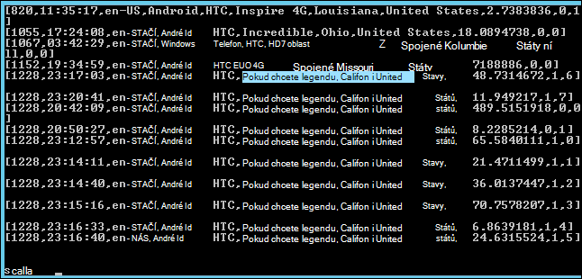

<properties
    pageTitle="K instalaci Spark Hadoop clusteru použijte akci skriptu | Microsoft Azure"
    description="Zjistěte, jak přizpůsobit HDInsight obrázku s Spark pomocí skriptu akce."
    services="hdinsight"
    documentationCenter=""
    authors="nitinme"
    manager="jhubbard"
    editor="cgronlun"/>

<tags
    ms.service="hdinsight"
    ms.workload="big-data"
    ms.tgt_pltfrm="na"
    ms.devlang="na"
    ms.topic="article"
    ms.date="02/05/2016"
    ms.author="nitinme"/>

# Instalace a používání Spark v clusterů HDInsight Hadoop pomocí skriptu akce

> [AZURE.IMPORTANT] Tento článek je teď změněny. HDInsight teď poskytuje Spark jako typu prvotřídní clusteru serveru s Windows clusterů, což znamená, že teď můžete přímo vytvářet clusteru Spark beze změny Hadoop clusteru pomocí skriptu akce. Použití typu clusteru Spark, dosáhnout pomocí Spark verze 1.3.1 clusteru verze 3,2 HDInsight.  K instalaci různých verzí Spark, můžete akci skriptu. HDInsight obsahuje skript akci skriptu vzorku.

Zjistěte, jak nainstalovat Spark v systému Windows na základě HDInsight pomocí skriptu akce a k tomu Spark dotazy na HDInsight clusterů.

**Související články**

- [Vytvoření Hadoop clusterů HDInsight](hdinsight-provision-clusters.md): Obecné informace o vytváření clusterů HDInsight.

- [Začínáme s Apache Spark na HDInsight](hdinsight-apache-spark-jupyter-spark-sql.md): vytvoření clusteru HDInsight Spark.

- [Přizpůsobení clusteru HDInsight pomocí skriptu akce][hdinsight-cluster-customize]: Obecné informace o úpravách clusterů HDInsight pomocí skriptu akce.

- [Vývoj akci skriptu skripty pro HDInsight](hdinsight-hadoop-script-actions.md).

## Co je Spark?

<a href="http://spark.apache.org/docs/latest/index.html" target="_blank">Apache Spark</a> je otevřít zdroj paralelní zpracování systém, který podporuje zpracování v paměti zvýšit výkon analytických aplikací velký data. Možnosti výpočtu v paměti společnosti Spark usnadnit Dobrá volba, pokud iterativních algoritmů ve počítače učení s pomocí grafu výpočty.

Spark lze také provádění běžných zpracování dat na základě disku. Spark zlepšuje tradiční framework MapReduce vyloučením zápisy disk intermediate postupně. Je také, Spark kompatibilní s úložištěm Hadoop Distributed soubor systému (HDFS) a objektů Blob Azure tak existující data můžete snadno zpracování prostřednictvím Spark.

Toto téma obsahuje pokyny k přizpůsobení HDInsight clusteru nainstalovat Spark.

## Instalace Spark pomocí portálu Azure

Ukázka skriptu nainstalovat Spark HDInsight clusteru je k dispozici jen pro čtení Azure úložiště objektů blob na [https://hdiconfigactions.blob.core.windows.net/sparkconfigactionv03/spark-installer-v03.ps1](https://hdiconfigactions.blob.core.windows.net/sparkconfigactionv03/spark-installer-v03.ps1). Tento skript můžete nainstalovat Spark 1.2.0 nebo Spark 1.0.2 v závislosti na verzi HDInsight obrázku, které vytvoříte.

- Pokud používáte skript při vytváření **HDInsight 3,2** clusteru, nainstaluje **Spark 1.2.0**.
- Pokud používáte skript při vytváření **HDInsight 3.1** clusteru, nainstaluje **Spark 1.0.2**.

Můžete upravit tento skript nebo vytvořit vlastní skript, který nainstalovat jiné verze Spark.

> [AZURE.NOTE] Ukázka skriptu funguje jenom s HDInsight 3.1 a 3,2 clusterů. Další informace o verzích clusteru Hdinsightu najdete v článku [verze obrázku HDInsight](hdinsight-component-versioning.md).

1. Zahájení vytváření clusteru pomocí možnost **Vytvořit vlastní** , jak je uvedeno na stránce [vytvořit Hadoop clusterů HDInsight](hdinsight-provision-clusters.md#portal). Vyberte verze obrázku v závislosti na těchto věcí:

    - Pokud chcete nainstalovat **Spark 1.2.0**, vytvoření clusteru 3,2 HDInsight.
    - Pokud chcete nainstalovat **Spark 1.0.2**, vytvoření clusteru HDInsight 3.1.

2. Na stránce **Akce skriptu** průvodce klikněte na **Přidat akci skript** k poskytování údajů o akci skript, jak je ukázáno v následujícím příkladu:

    ![Použití akce skript k přizpůsobení clusteru] (./media/hdinsight-hadoop-spark-install/HDI.CustomProvision.Page6.png "Použití akce skript k přizpůsobení clusteru")

    <table border='1'>
        <tr><th>Vlastnost</th><th>Hodnota</th></tr>
        <tr><td>Jméno</td>
            <td>Zadejte název akce skriptu. Například <b>Instalace Spark</b>.</td></tr>
        <tr><td>Skript URI</td>
            <td>Zadejte identifikátor URI (Uniform Resource) skript, který je zavolat a přizpůsobení clusteru. Například <i>https://hdiconfigactions.blob.core.windows.net/sparkconfigactionv03/spark-installer-v03.ps1</i></td></tr>
        <tr><td>Typ uzel</td>
            <td>Určete uzly, na kterých běží skript přizpůsobení. Můžete vybrat <b>všechny uzly</b>, <b>pouze záhlaví uzlů</b>nebo <b>pouze pracovníka uzlů</b>.
        <tr><td>Parametry</td>
            <td>Zadejte parametry, v případě potřeby skriptem. Skript, který chcete nainstalovat Spark nevyžaduje všechny parametry, takže to můžou být prázdné.</td></tr>
    </table>

    Můžete přidat víc akci skriptu pro instalaci více součástí na clusteru. Až přidáte skripty, klikněte na zaškrtnutí začnete vytvářet clusteru.

Pomocí skriptu můžete taky nainstalovat Spark HDInsight pomocí prostředí PowerShell Azure nebo HDInsight .NET SDK. Pokyny pro tyto postupy jsou uvedeny dál v tomto tématu.

## Použití Spark v HDInsight
Spark poskytuje rozhraní API v Scala, Python a Java. Můžete taky použijete interaktivní prostředí Spark ke spuštění Spark dotazů. Tato část obsahuje pokyny k použití jiné přístupy k práci s Spark:

- [Pomocí prostředí Spark spouštění interaktivní dotazů](#sparkshell)
- [Spouštění dotazů Spark SQL pomocí prostředí Spark](#sparksql)
- [Použití aplikace sady samostatného Scala](#standalone)

###Pomocí prostředí Spark spouštění interaktivní dotazů
Proveďte následující kroky a spouštění dotazů Spark z interaktivní prostředí Spark. V této části jsme spuštění dotazu Spark na Ukázka datového souboru (/ example/data/gutenberg/davinci.txt), která je dostupná na HDInsight clusterů ve výchozím nastavení.

1. Z portálu Azure povolte připojení ke vzdálené ploše pro obrázku, který jste vytvořili pomocí Spark nainstalovaný a potom remote do clusteru. Pokyny najdete v tématu [připojení clusterů HDInsight pomocí RDP](hdinsight-administer-use-management-portal.md#rdp).

2. V průběhu relace vzdálené plochy RDP (Protocol), z počítače otevřete příkazového řádku Hadoop (od zástupce na ploše) a přejděte do umístění, kde je nainstalovaný Spark; například **C:\apps\dist\spark-1.2.0**.

3. Spusťte tento příkaz Spustit Spark prostředí:

         .\bin\spark-shell --master yarn

    Po dokončení příkazu by měla získat Scala výzvy:

         scala>

5. Na řádku Scala zadejte dotaz Spark ukázáno v následujícím příkladu. Tento dotaz vrátí výskyt každého slova v davinci.txt souboru, který je k dispozici v/příklad / / gutenberg/umístění dat v úložišti objektů Blob Azure přidružené clusteru.

        val file = sc.textFile("/example/data/gutenberg/davinci.txt")
        val counts = file.flatMap(line => line.split(" ")).map(word => (word, 1)).reduceByKey(_ + _)
        counts.toArray().foreach(println)

6. Výstup by měl vypadat takto:

    

7. Zadejte: q ukončíte výzva Scala.

        :q

###Spouštění dotazů Spark SQL pomocí prostředí Spark

Spark SQL umožňuje použití Spark pro spuštění relačních dotazů vyjádřený v jazyce SQL (Structured Query), HiveQL nebo Scala. V tomto oddílu se podíváme na používání Spark ke spuštění dotazu podregistru na ukázkovou tabulku podregistru. Když vytvoříte clusteru je k dispozici ve výchozím nastavení tabulku podregistru použít v této části (nazývané **hivesampletable**).

>[AZURE.NOTE] Následující ukázce byla vytvořená před **podnítit 1.2.0**, nainstalovaný při spuštění akce skript při vytváření HDInsight 3,2 obrázku.

1. Z portálu Azure povolte připojení ke vzdálené ploše pro obrázku, který jste vytvořili pomocí Spark nainstalovaný a potom remote do clusteru. Pokyny najdete v tématu [připojení clusterů HDInsight pomocí RDP](hdinsight-administer-use-management-portal.md#rdp).

2. V relaci RDP ze stolního počítače otevřete příkazového řádku Hadoop (od zástupce na ploše) a přejděte do umístění, kde je nainstalovaný Spark; například **C:\apps\dist\spark-1.2.0**.

3. Spusťte tento příkaz Spustit Spark prostředí:

         .\bin\spark-shell --master yarn

    Po dokončení příkazu by měla získat Scala výzvy:

         scala>

4. Na řádku Scala nastavte podregistru kontextu. To je nutné pro práci s dotazy podregistru pomocí Spark.

        val hiveContext = new org.apache.spark.sql.hive.HiveContext(sc)

    Poznámka: Tento **sc** je výchozí Spark kontextu, který se nastaví, když začnete Spark prostředí.

5. Spuštění dotazu podregistru pomocí kontextu podregistru a vytiskněte výstupu ke konzole. Dotaz načte data na zařízeních určité značky a omezení počtu zobrazených záznamů načtené 20.

        hiveContext.sql("""SELECT * FROM hivesampletable WHERE devicemake LIKE "HTC%" LIMIT 20""").collect().foreach(println)

6. Měli byste vidět výstup takto:

    

7. Zadejte: q ukončíte výzva Scala.

        :q

### Použití aplikace sady samostatného Scala

V této části psaní Scala aplikace, která spočítá počet řádků obsahujících písmen "a" a "b" v Ukázka datového souboru (/ example/data/gutenberg/davinci.txt), která je dostupná na HDInsight clusterů ve výchozím nastavení. Psaní a používat samostatná Scala aplikace s clusteru přizpůsobený s instalací Spark, postupujte podle těchto kroků:

- Napište program, Scala
- Vytvoření programu Scala k získání .jar souboru
- Spuštění úlohy na clusteru

#### Napište program, Scala
V této části, napište Scala program, který spočítá počet řádků obsahujících "a" a "b" v Ukázka datového souboru.

1. Otevřete textový editor kód a vložte následující:

        /* SimpleApp.scala */
        import org.apache.spark.SparkContext
        import org.apache.spark.SparkContext._
        import org.apache.spark.SparkConf

        object SimpleApp {
          def main(args: Array[String]) {
            val logFile = "/example/data/gutenberg/davinci.txt"         //Location of the sample data file on Azure Blob storage
            val conf = new SparkConf().setAppName("SimpleApplication")
            val sc = new SparkContext(conf)
            val logData = sc.textFile(logFile, 2).cache()
            val numAs = logData.filter(line => line.contains("a")).count()
            val numBs = logData.filter(line => line.contains("b")).count()
            println("Lines with a: %s, Lines with b: %s".format(numAs, numBs))
          }
        }

2. Uložte soubor pod názvem **SimpleApp.scala**.

#### Vytvoření programu Scala
V této části použijeme k vytvoření programu Scala <a href="http://www.scala-sbt.org/0.13/docs/index.html" target="_blank">Jednoduchý nástroj vytvoření</a> (nebo sbt). SBT vyžaduje Java 1,6 nebo novější, proto Přesvědčte se, jestli že máte správná verze aplikace Java nainstalovaný před pokračováním v této části.

1. Nainstalujte sbt z http://www.scala-sbt.org/0.13/tutorial/Installing-sbt-on-Windows.html.
2. Vytvořte složku s názvem **SimpleScalaApp**a v této složce vytvořte soubor s názvem **simple.sbt**. Toto je konfigurační soubor, který obsahuje informace o verzi Scala závislosti knihovny, atd. Vložte následující do souboru simple.sbt a uložte jej:

        name := "SimpleApp"

        version := "1.0"

        scalaVersion := "2.10.4"

        libraryDependencies += "org.apache.spark" %% "spark-core" % "1.2.0"

    >[AZURE.NOTE] Zkontrolujte, že zachovat prázdných řádků v souboru.

3. Ve složce **SimpleScalaApp** vytvořte strukturu adresáře **\src\main\scala** a vložte Scala program (**SimpleApp.scala**) jste dříve vytvořili ve složce \src\main\scala.
4. Otevřete okno příkazového řádku, přejděte do adresáře SimpleScalaApp a zadejte tento příkaz:

        sbt package

    Jakmile aplikace kompilaci, zobrazí se **simpleapp_2.10 1.0.jar** soubor vytvořený v adresáři **\target\scala-2.10** v kořenové složce SimpleScalaApp.

#### Spuštění úlohy na clusteru
V této části můžete vzdálené do obrázku, který má Spark nainstalovaný a zkopírujte projektu SimpleScalaApp cílovou složku. Pak pomocí příkazu **Odeslat spark** můžou odeslat úlohy v clusteru.

1. Vzdálené do obrázku, který má Spark nainstalovaný. Z počítače, kde jste napsali a integrované aplikace SimpleApp.scala složce **SimpleScalaApp\target** zkopírovat a vložit ho do umístění na clusteru.
2. V relaci RDP ze stolního počítače otevřete příkazového řádku Hadoop a přejděte do umístění, kam jste vložili **cílovou** složku.
3. Zadejte tento příkaz Spustit SimpleApp.scala program:

        C:\apps\dist\spark-1.2.0\bin\spark-submit --class "SimpleApp" --master local target/scala-2.10/simpleapp_2.10-1.0.jar

4. Po ukončení programu, výstup se zobrazí v konzole.

        Lines with a: 21374, Lines with b: 11430

## Instalace Spark pomocí prostředí PowerShell Azure

V této části používáme rutinu **<a href = "http://msdn.microsoft.com/library/dn858088.aspx" target="_blank">Přidat AzureHDInsightScriptAction</a>** vyvolat skriptů pomocí skriptu akce můžete přizpůsobit clusteru. Než budete pokračovat, ujistěte se již nainstalovali a nakonfigurovali Azure Powershellu. Informace o konfiguraci workstation spuštění rutiny prostředí PowerShell Azure Hdinsightu najdete v tématu [instalace a konfigurace prostředí PowerShell Azure](../powershell-install-configure.md).

Proveďte následující kroky:

1. Otevřete okno Azure PowerShell a přidejte následující proměnné:

        # Provide values for these variables
        $subscriptionName = "<SubscriptionName>"        # Name of the Azure subscription
        $clusterName = "<HDInsightClusterName>"         # HDInsight cluster name
        $storageAccountName = "<StorageAccountName>"    # Azure Storage account that hosts the default container
        $storageAccountKey = "<StorageAccountKey>"      # Key for the Storage account
        $containerName = $clusterName
        $location = "<MicrosoftDataCenter>"             # Location of the HDInsight cluster. It must be in the same data center as the Storage account.
        $clusterNodes = <ClusterSizeInNumbers>          # Number of nodes in the HDInsight cluster
        $version = "<HDInsightClusterVersion>"          # For example, "3.2"

2. Zadejte hodnoty konfigurace například uzlů v clusteru a výchozí úložiště k použití.

        # Specify the configuration options
        Select-AzureSubscription $subscriptionName
        $config = New-AzureHDInsightClusterConfig -ClusterSizeInNodes $clusterNodes
        $config.DefaultStorageAccount.StorageAccountName="$storageAccountName.blob.core.windows.net"
        $config.DefaultStorageAccount.StorageAccountKey=$storageAccountKey
        $config.DefaultStorageAccount.StorageContainerName=$containerName

3. Chcete-li přidat akci skriptu konfigurace clusteru použijte rutinu **AzureHDInsightScriptAction přidat** . Později po vytvoření clusteru akci Skript provede.

        # Add a script action to the cluster configuration
        $config = Add-AzureHDInsightScriptAction -Config $config -Name "Install Spark" -ClusterRoleCollection HeadNode -Uri https://hdiconfigactions.blob.core.windows.net/sparkconfigactionv03/spark-installer-v03.ps1

    Rutina **AzureHDInsightScriptAction přidat** jen následujících parametrů:

    <table style="border-color: #c6c6c6; border-width: 2px; border-style: solid; border-collapse: collapse;">
    <tr>
    <th style="border-color: #c6c6c6; border-width: 2px; border-style: solid; border-collapse: collapse; width:90px; padding-left:5px; padding-right:5px;">Parametr</th>
    <th style="border-color: #c6c6c6; border-width: 2px; border-style: solid; border-collapse: collapse; width:550px; padding-left:5px; padding-right:5px;">Definice</th></tr>
    <tr>
    <td style="border-color: #c6c6c6; border-width: 2px; border-style: solid; border-collapse: collapse; padding-left:5px;">Konfigurace</td>
    <td style="border-color: #c6c6c6; border-width: 2px; border-style: solid; border-collapse: collapse; padding-left:5px; padding-right:5px;">Konfigurace objekt skript, který se přidá informace o akci.</td></tr>
    <tr>
    <td style="border-color: #c6c6c6; border-width: 2px; border-style: solid; border-collapse: collapse; padding-left:5px;">Jméno</td>
    <td style="border-color: #c6c6c6; border-width: 2px; border-style: solid; border-collapse: collapse; padding-left:5px;">Název akci skriptu.</td></tr>
    <tr>
    <td style="border-color: #c6c6c6; border-width: 2px; border-style: solid; border-collapse: collapse; padding-left:5px;">ClusterRoleCollection</td>
    <td style="border-color: #c6c6c6; border-width: 2px; border-style: solid; border-collapse: collapse; padding-left:5px;">Určuje uzly, na kterých běží skript přizpůsobení. Platné hodnoty jsou HeadNode (o instalaci na uzel hlavy) nebo DataNode (Pokud chcete nainstalovat na všechny uzly dat). Můžete použít jeden nebo oba hodnoty.</td></tr>
    <tr>
    <td style="border-color: #c6c6c6; border-width: 2px; border-style: solid; border-collapse: collapse; padding-left:5px;">Identifikátor URI</td>
    <td style="border-color: #c6c6c6; border-width: 2px; border-style: solid; border-collapse: collapse; padding-left:5px;">Určuje identifikátor URI skript, který se spustí.</td></tr>
    <tr>
    <td style="border-color: #c6c6c6; border-width: 2px; border-style: solid; border-collapse: collapse; padding-left:5px;">Parametry</td>
    <td style="border-color: #c6c6c6; border-width: 2px; border-style: solid; border-collapse: collapse; padding-left:5px;">Parametry vyžadované skript. Ukázka skriptu použité v tomto tématu není nutné zadávat všechny parametry a proto se nezobrazí tento parametr ve výše uvedené fragment kódu.
    </td></tr>
    </table>

4. Nakonec zahájení vytváření vlastního obrázku s Spark nainstalovaný.  

        # Start creating a cluster with Spark installed
        New-AzureHDInsightCluster -Config $config -Name $clusterName -Location $location -Version $version

Po zobrazení výzvy zadejte přihlašovací údaje pro clusteru. Může trvat několik minut, než bude vytvořena clusteru.

## Instalace Spark pomocí prostředí PowerShell

V tématu [přizpůsobení HDInsight clusterů pomocí skriptu akce](hdinsight-hadoop-customize-cluster.md#call_scripts_using_powershell).

## Instalace Spark pomocí .NET SDK

V tématu [přizpůsobení HDInsight clusterů pomocí skriptu akce](hdinsight-hadoop-customize-cluster.md#call_scripts_using_azure_powershell).

## Viz taky

- [Vytvoření Hadoop clusterů HDInsight](hdinsight-provision-clusters.md): Vytvoření clusterů HDInsight.
- [Začínáme s Apache Spark na HDInsight](hdinsight-apache-spark-jupyter-spark-sql.md): Začínáme s Spark na HDInsight.
- [Přizpůsobení clusteru HDInsight pomocí skriptu akce][hdinsight-cluster-customize]: přizpůsobení clusterů HDInsight pomocí skriptu akce.
- [Vývoj akci skriptu skripty pro HDInsight](hdinsight-hadoop-script-actions.md): vývoje akci skriptu skriptů.
- [Instalace R na HDInsight clusterů] [ hdinsight-install-r] pokyny, jak používat clusteru přizpůsobení si nainstalovat a použít pravidlo na clusterů HDInsight Hadoop. R je otevřít zdrojového jazyka a prostředí statistické výpočetních. Poskytuje stovky předdefinované statistických funkcí a vlastní programovací jazyk, který kombinuje aspekty funkční a objektově orientovaném programování. Také poskytuje rozsáhlé grafické možnosti.
- [Instalace Giraph na clusterů HDInsight](hdinsight-hadoop-giraph-install.md). Pomocí úprav obrázku Giraph nainstalovat clusterů HDInsight Hadoop. Giraph umožňuje provádět grafu zpracování pomocí Hadoop a lze použít s Azure HDInsight.
- [Instalace Solr na clusterů HDInsight](hdinsight-hadoop-solr-install.md). Pomocí úprav obrázku Solr nainstalovat clusterů HDInsight Hadoop. Solr umožňuje provádět výkonné vyhledávání operací dat uložených.

[hdinsight-provision]: hdinsight-provision-clusters.md
[hdinsight-install-r]: hdinsight-hadoop-r-scripts.md
[hdinsight-cluster-customize]: hdinsight-hadoop-customize-cluster.md
[powershell-install-configure]: powershell-install-configure.md
