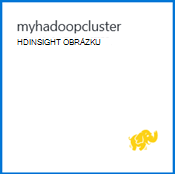

<properties
   pageTitle="Kurz Hadoop: Začínáme s Hadoop v systému Windows | Microsoft Azure"
   description="Začínáme s Hadoop v HDInsight. Informace o vytváření Hadoop clusterů v systému Windows, spuštění dotazu podregistru dat a Analýza výstupu v aplikaci Excel."
   keywords="hadoop kurzu hadoop v systému windows, hadoop obrázku, přečtěte si hadoop podregistru dotazu"
   services="hdinsight"
   documentationCenter=""
   authors="nitinme"
   manager="jhubbard"
   editor="cgronlun"
   tags="azure-portal"/>

<tags
   ms.service="hdinsight"
   ms.devlang="na"
   ms.topic="article"
   ms.tgt_pltfrm="na"
   ms.workload="big-data"
   ms.date="03/07/2016"
   ms.author="nitinme"/>

# Kurz Hadoop: Začínáme s používáním Hadoop v HDInsight v systému Windows

> [AZURE.SELECTOR]
- [Na základě Linux](../hdinsight-hadoop-linux-tutorial-get-started.md)
- [Serveru s Windows](../hdinsight-hadoop-tutorial-get-started-windows.md)

Vám pomůže další Hadoop v systému Windows a začněte používat HDInsight, tento kurz ukazuje, jak spustit dotaz podregistru na Nestrukturovaná data v clusteru Hadoop a analýza výsledků v aplikaci Microsoft Excel.

>[AZURE.NOTE] Informace v tomto dokumentu jsou specifické pro clusterů serveru s Windows HDInsight. Informace na základě Linux clusterů najdete v tématu [Hadoop kurz: Začínáme s používáním na základě Linux Hadoop v HDInsight](hdinsight-hadoop-linux-tutorial-get-started.md).

Předpokládejme máte velké nestrukturovaná sadu dat a chcete-li spustit dotaz podregistru na něm extrahovat několik důležitých informací. Je to přesně co budete dělat v tomto kurzu. Tady je, jak můžete dosáhnout:

   !["Hadoop kurz: vytvoření účet. Vytvoření Hadoop clusteru; odeslání dotazu podregistru; Analýza dat v Excelu.][image-hdi-getstarted-flow]

Podívejte se na video ukázku tohoto kurzu se dozvíte Hadoop na HDInsight:

![Video z první kurz Hadoop: odeslání dotazu podregistru clusteru Hadoop a analýza výsledků v aplikaci Excel.][img-hdi-getstarted-video]

**[Pozor na kurz Hadoop HDInsight na YouTube](https://www.youtube.com/watch?v=Y4aNjnoeaHA&list=PLDrz-Fkcb9WWdY-Yp6D4fTC1ll_3lU-QS)**

Ve spojení s všeobecně dostupná Azure HDInsight Microsoft také poskytuje HDInsight emulátor pro Azure dřív označoval jako *Microsoft HDInsight Developer Preview*. Emulátor zaměřuje scénáře vývojář a podporuje pouze jeden uzel nasazení. Informace o používání emulátoru Hdinsightu najdete v článku [Začínáme s emulátoru HDInsight][hdinsight-emulator].

[AZURE.INCLUDE [delete-cluster-warning](../../includes/hdinsight-delete-cluster-warning.md)]

## Zjistit předpoklady pro

Před zahájením tohoto kurzu pro Hadoop v systému Windows, musíte mít takto:

- **Azure předplatného**. Viz [získání Azure bezplatnou zkušební verzi](https://azure.microsoft.com/documentation/videos/get-azure-free-trial-for-testing-hadoop-in-hdinsight/).
- **Počítač workstation** s Office 2013 Professional Plus, Office 365 Pro Plus, samostatný Excel 2013 nebo Office 2010 Professional Plus.

### Požadavky na řízení přístupu

[AZURE.INCLUDE [access-control](../../includes/hdinsight-access-control-requirements.md)]

##Vytvoření Hadoop clusterů

Při vytváření clusteru vytvoříte Azure výpočetním prostředky, které obsahují Hadoop a souvisejících aplikací. V této části vytvoříte clusteru verze 3,2 HDInsight. Můžete taky vytvořit Hadoop clusterů ve všech verzích. Pokyny najdete v tématu [Vytvoření HDInsight clusterů pomocí vlastních možností][hdinsight-provision]. Informace o verzích HDInsight a jejich rozsahu najdete v tématu [HDInsight součást správy verzí](hdinsight-component-versioning.md).

**Vytvoření clusteru Hadoop**

1. Přihlaste se k [portálu Azure](https://portal.azure.com/).
2. Klikněte na **Nový**, klikněte na **Analýza dat**a potom klikněte na **HDInsight**. Na portálu otevře **Nový HDInsight Cluster** zásuvné.

    ![Vytvoření nového obrázku na portálu Azure] (./media/hdinsight-hadoop-tutorial-get-started-windows/HDI.CreateCluster.1.png "Vytvoření nového obrázku na portálu Azure")

3. Zadejte nebo vyberte takto:

    ![Zadejte clusteru název a typ] (./media/hdinsight-hadoop-tutorial-get-started-windows/HDI.CreateCluster.2.png "Zadejte clusteru název a typ")
    
  	|Název pole| Hodnota|
  	|----------|------|
  	|Název obrázku| Jedinečný název pro identifikaci clusteru|
  	|Typ obrázku| Vyberte **Hadoop** pro účely tohoto návodu. |
  	|Shluk operační systém| Vyberte **Windows serveru 2012 R2 Datacentra** pro účely tohoto návodu.|
  	|HDInsight verze| Zvolte nejnovější verzi pro účely tohoto návodu.|
  	|Předplatné| Vyberte Azure předplatné, které bude sloužit k clusteru.|
  	|Pole Skupina zdroje | Vyberte existující skupinu Azure prostředků nebo vytvořte nové skupiny prostředků. Základní clusteru HDInsight obsahuje clusteru a jeho výchozí úložiště účet.  Můžete seskupovat dvou do skupiny zdrojů správy snadno.|
  	|Přihlašovací údaje| Zadejte clusteru přihlašovací jméno a heslo. Shluk systémem Windows můžete mít 2 uživatelské účty.  Uživatel obrázku (nebo uživatel HTTP) slouží ke správě clusteru a odesílat úlohy.  Volitelně můžete vytvořit Vzdálená plocha (RDP) uživatelského účtu vzdáleného připojení k clusteru. Pokud zvolíte možnost povolit vzdálená plocha, vytvoříte RDP uživatelský účet.|
  	|Zdroj dat| Klikněte na vytvořit nový vytvořte nový účet Azure úložiště výchozí. Použijte název obrázku jako výchozí název kontejner. Každý cluster HDinsight má výchozí objektů Blob kontejner na existujících Azure úložiště.  Umístění výchozí účet Azure úložiště určuje umístění obrázku HDInsight.|
  	|Uzel ceny úrovní| 1 nebo 2 uzly pracovníka pomocí výchozí pracovní uzel a vedoucí poznámku ceny vrstvy pro účely tohoto návodu.|
  	|Volitelné konfigurace| Tuto část přeskočte.|

9. Na zásuvné **Nového clusteru HDInsight** zajistit, že **kód Pin pro Startboard** zaškrtnuté a klikněte na **vytvořit**. Tím vytvoříte clusteru a přidání dlaždice pro něj Startboard portálu Azure. Na ikonu výskyt znamená, že clusteru vytváří a změní zobrazit ikonu HDInsight po vytvoření.

  	| Při vytváření | Vytvoření dokončeno. |
  	| ------------------ | --------------------- |
  	|  |  |

    > [AZURE.NOTE] Bude trvat delší dobu clusteru vytvořit, obvykle asi 15 minut. Použití dlaždice na Startboard nebo položce **oznámení** na levé straně stránky informace o s vytvářením.

10. Po dokončení vystavením klikněte na dlaždici pro obrázku z Startboard spuštění zásuvné obrázku.

## Spuštění dotazu podregistru z portálu
Teď, když jste vytvořili HDInsight clusteru, dalším krokem je spuštění úlohy podregistru k vytvoření dotazu ukázkovou tabulku podregistru. Použijeme *hivesampletable*, která je součástí clusterů HDInsight. Tato tabulka obsahuje data o výrobci mobilní zařízení, platformy a modely. Podregistru dotazu v této tabulce načítá data pro mobilní zařízení pomocí konkrétního výrobce.

> [AZURE.NOTE] HDInsight Tools for Visual Studio součástí Azure SDK .NET verze 2,5 nebo novější. Pomocí nástrojů ve Visual Studiu můžete připojit k obrázku HDInsight, vytvářet tabulky podregistru a spouštění dotazů podregistru. Další informace najdete v tématu [Začínáme s používáním HDInsight Hadoop Tools for Visual Studio][1].

**Spuštění úlohy podregistru na řídicím panelu obrázku**

1. Přihlaste se k [portálu Azure](https://portal.azure.com/).
2. Klikněte na **Procházet vše** a potom klikněte na **HDInsight clusterů** zobrazíte seznam clusterů, včetně obrázku, který jste právě vytvořili v předchozí části.
3. Klikněte na název, který chcete použít ke spuštění úlohy podregistru obrázku a potom klikněte na **řídicí panel** v horní části zásuvné.
4. Na kartě jiné prohlížeče se otevře webovou stránku. Zadejte Hadoop uživatelský účet a heslo. Výchozí uživatelské jméno je **Správce**; co jste zadali při vytváření clusteru je heslo.
5. Na řídicím panelu klikněte na kartu **Podregistru Editor** . Otevře se následující webová stránka.

    ![Karta Editor podregistru na řídicím panelu clusteru HDInsight.][img-hdi-dashboard]

    Existuje několik karty v horní části stránky. Na výchozí kartu je **Podregistru Editor**a další karty jsou **Historie úlohy** a **Prohlížeč souborů**. Pomocí řídicího panelu můžete odeslat podregistru dotazů, protokolech úlohy Hadoop a procházení souborů v úložišti.

    > [AZURE.NOTE] Všimněte si, že adresa URL webové stránky je * &lt;název_clusteru&gt;. azurehdinsight.net*. Tak místo otevření řídicího panelu z portálu Microsoft, můžete otevřít na řídicím panelu z webového prohlížeče pomocí adresy URL.

6. Na kartě **Podregistru Editor** **Název dotazu**zadejte **HTC20**.  Funkce je v poli Název dotazu. V podokně dotazu zadejte dotaz podregistru, jak je vidět na obrázku:

    ![V podokně dotaz v editoru podregistru se zadal dotaz podregistru.][img-hdi-dashboard-query-select]

4. Klikněte na **Odeslat**. Na krátkou chvíli vrátit výsledky trvá. Na obrazovce aktualizuje každých 30 sekund. Můžete taky kliknout na aktualizace obrazovky **aktualizace** .

    ![Výsledky dotazu podregistru v uvedené v dolní části na řídicím panelu obrázku.][img-hdi-dashboard-query-select-result]

5. Po dokončení úlohy se zobrazí stav, klepněte na název dotazu na obrazovce zobrazit výstup. Poznamenejte si **Úloh spustit čas (UTC)**. Budete ho později potřebovat.

    ![Čas zahájení projektu uvedené na kartě Historie úlohy na řídicím panelu clusteru HDInsight.][img-hdi-dashboard-query-select-result-output]

    Na stránce se zobrazí také **Výstupu projektu** a **Protokol úloh**. Máte taky možnost stahování ve výstupním souboru (\_stdout) a soubor protokolu \(_stderr).

**Umožňuje přecházet na výstupní soubor**

1. Na řídicím panelu obrázku klikněte na **Soubor prohlížeče**.
2. Klikněte na název účtu úložiště, klikněte na své jméno container (což je stejný jako název svého obrázku) a potom klikněte na **uživatele**.
3. Klikněte na **Správce** a potom klikněte na GUID s časem poslední úpravy (trochu po úloha začít čas, kdy bylo uvedeno dříve). Zkopírujte tento GUID. Ho budete potřebovat v další části.

    ![Dotaz podregistru výstupní soubor, který GUID uvedené na kartě Soubor prohlížeče.][img-hdi-dashboard-query-browse-output]

##Připojení k nástrojů business intelligence společnosti Microsoft pro Excel

Výstup projektu z Hdinsightu do Excelu mohli importovat, použití nástrojů business intelligence společnosti Microsoft k analýze výsledků můžete použít doplněk Power Query pro aplikaci Microsoft Excel.

Pokud nemáte Excel 2013 nebo Outlooku 2010 nainstalovaný dokončování tuto část kurzu.

**Ke stažení Microsoft Power Query pro Excel**

- Stažení Microsoft Power Query pro aplikaci Microsoft Excel z [Webu služby Stažení softwaru](http://www.microsoft.com/download/details.aspx?id=39379) a nainstalujte ji.

**Import dat HDInsight**

1. Otevřete Excel a vytvořte nový sešit.
3. Klikněte na nabídku **Power Query** , klikněte na **Z jiných zdrojů**a potom klikněte na **Z Azure HDInsight**.

    ![Import z aplikace Excel PowerQuery nabídkou pro Azure HDInsight.][image-hdi-gettingstarted-powerquery-importdata]

3. Zadejte **Název účtu** úložiště objektů Blob Azure účtu, který je spojený s svůj cluster a potom klikněte na **OK**. (Toto je úložiště účet, který jste vytvořili dříve v tomto kurzu.)
4. Zadejte **Klíč účtu** k úložišti objektů Blob Azure účtu a klikněte na tlačítko **Uložit**.
5. V pravém podokně poklikejte na název objektů blob. Ve výchozím nastavení je název objektů blob shoduje s názvem obrázku.

6. Ve sloupci **název** najděte **stdout** . Ověřte, že GUID v odpovídajícím sloupci **Cestu ke složce** odpovídá GUID, kterou jste si zkopírovali. Shoda o tom, že výstupní data odpovídá úlohu, kterou jste odeslali. Klikněte na **binární** v levém sloupci **stdout**.

    ![Hledání dat výstupu pomocí GUID v seznamu obsahu.][image-hdi-gettingstarted-powerquery-importdata2]

9. V levém horním rohu k importu úlohy podregistru výstup do aplikace Excel klikněte na **Zavřít a načíst** .

##Spuštění ukázek

HDInsight clusteru obsahuje konzole dotazu, která obsahuje galerii Začínáme pro spuštění ukázek přímo na portálu. Použití vzorových se dozvíte, jak pracovat s HDInsight tak, že rozbor některé základní scénáře. Tyto příklady jsou součástí všechny požadované součásti, jako jsou data, která chcete analyzovat a dotazy na data. Další informace o vzorcích v galerii Začínáme najdete v tématu [Další Hadoop v HDInsight pomocí Galerie HDInsight Začínáme Začínáme](hdinsight-learn-hadoop-use-sample-gallery.md).

**Chcete-li spustit výběru**

1. Z portálu Azure startboard klikněte na dlaždici pro obrázku, který jste právě vytvořili.
 
2. Na nové zásuvné obrázku klikněte na **řídicí panel**. Po zobrazení výzvy zadejte clusteru správce uživatelské jméno a heslo.

    ![Spuštění clusteru řídicího panelu] (./media/hdinsight-hadoop-tutorial-get-started-windows/HDI.Cluster.Dashboard.png "Spuštění clusteru řídicího panelu")
 
3. Z webové stránky, která se otevře klikněte na kartu **Začínáme Začínáme Galerie** a pak ve skupinovém rámečku kategorie **řešení s ukázkovými daty** , klikněte na vzorku, který chcete spustit. Postupujte podle pokynů na stránce webových dokončete vzorku. Následující tabulka uvádí několik ukázek a další informace o jaké každý vzorek obsahuje.

Ukázka | Co to dělá?
------ | ---------------
[Analýza dat senzor][hdinsight-sensor-data-sample] | Naučte se používat HDInsight zpracuje historických dat, které je vytvořené pomocí topení, ventilace a klimatizace (TVK) systémy k identifikaci systémů, které nejsou možné problémy se spolehlivým udržovat teplotu nastavení.
[Analýza protokolu webu][hdinsight-weblogs-sample] | Naučte se používat HDInsight a analyzujte data webu protokoly získat přehled o četnost návštěvy na web v den z externích webů a Souhrn webu chyby, které uživatelé dojít.
[Analýza trendů Twitter](hdinsight-analyze-twitter-data.md) | Naučte se používat HDInsight analýze trendů v Twitter.

##Odstranění clusteru

[AZURE.INCLUDE [delete-cluster-warning](../../includes/hdinsight-delete-cluster-warning.md)]

##Další kroky
V tomto kurzu Hadoop jste se naučili postup vytvoření obrázku Hadoop v systému Windows v HDInsight spustit podregistru dotaz na data a importovat výsledků do Excelu, přičemž může platit další zpracování a znázornění pomocí nástrojů business intelligence. Další informace najdete v tématu následující kurzy:

- [Začínáme s používáním HDInsight Hadoop nástroje for Visual Studio][1]
- [Začínáme s emulátoru HDInsight][hdinsight-emulator]
- [Pomocí úložiště objektů Blob Azure HDInsight][hdinsight-storage]
- [Správa HDInsight pomocí prostředí PowerShell][hdinsight-admin-powershell]
- [Odeslání dat do HDInsight][hdinsight-upload-data]
- [Použití MapReduce s HDInsight][hdinsight-use-mapreduce]
- [Použití podregistru s HDInsight][hdinsight-use-hive]
- [Použití Prasátko s HDInsight][hdinsight-use-pig]
- [Použití Oozie s HDInsight][hdinsight-use-oozie]
- [Můžete vyvíjet aplikace Java MapReduce pro HDInsight][hdinsight-develop-mapreduce]

[1]: ../HDInsight/hdinsight-hadoop-visual-studio-tools-get-started.md

[hdinsight-versions]: hdinsight-component-versioning.md

[hdinsight-provision]: hdinsight-provision-clusters.md
[hdinsight-admin-powershell]: hdinsight-administer-use-powershell.md
[hdinsight-upload-data]: hdinsight-upload-data.md
[hdinsight-use-mapreduce]: hdinsight-use-mapreduce.md
[hdinsight-use-hive]: hdinsight-use-hive.md
[hdinsight-use-pig]: hdinsight-use-pig.md
[hdinsight-use-oozie]: hdinsight-use-oozie.md
[hdinsight-storage]: hdinsight-hadoop-use-blob-storage.md
[hdinsight-emulator]: hdinsight-hadoop-emulator-get-started.md
[hdinsight-develop-mapreduce]: hdinsight-develop-deploy-java-mapreduce-linux.md
[hadoop-hdinsight-intro]: hdinsight-hadoop-introduction.md
[hdinsight-weblogs-sample]: hdinsight-hive-analyze-website-log.md
[hdinsight-sensor-data-sample]: hdinsight-hive-analyze-sensor-data.md

[azure-purchase-options]: http://azure.microsoft.com/pricing/purchase-options/
[azure-member-offers]: http://azure.microsoft.com/pricing/member-offers/
[azure-free-trial]: http://azure.microsoft.com/pricing/free-trial/
[azure-management-portal]: https://portal.azure.com/
[azure-create-storageaccount]: ../storage-create-storage-account.md

[apache-hadoop]: http://go.microsoft.com/fwlink/?LinkId=510084
[apache-hive]: http://go.microsoft.com/fwlink/?LinkId=510085
[apache-mapreduce]: http://go.microsoft.com/fwlink/?LinkId=510086
[apache-hdfs]: http://go.microsoft.com/fwlink/?LinkId=510087
[hdinsight-hbase-custom-provision]: hdinsight-hbase-tutorial-get-started.md

[powershell-download]: http://go.microsoft.com/fwlink/p/?linkid=320376&clcid=0x409
[powershell-install-configure]: powershell-install-configure.md
[powershell-open]: powershell-install-configure.md#step-1-install

[img-hdi-dashboard]: ./media/hdinsight-hadoop-tutorial-get-started-windows/HDI.dashboard.png
[img-hdi-dashboard-query-select]: ./media/hdinsight-hadoop-tutorial-get-started-windows/HDI.dashboard.query.select.png
[img-hdi-dashboard-query-select-result]: ./media/hdinsight-hadoop-tutorial-get-started-windows/HDI.dashboard.query.select.result.png
[img-hdi-dashboard-query-select-result-output]: ./media/hdinsight-hadoop-tutorial-get-started-windows/HDI.dashboard.query.select.result.output.png
[img-hdi-dashboard-query-browse-output]: ./media/hdinsight-hadoop-tutorial-get-started-windows/HDI.dashboard.query.browse.output.png

[img-hdi-getstarted-video]: ./media/hdinsight-hadoop-tutorial-get-started-windows/hdi-get-started-video.png

[image-hdi-storageaccount-quickcreate]: ./media/hdinsight-hadoop-tutorial-get-started-windows/HDI.StorageAccount.QuickCreate.png
[image-hdi-clusterstatus]: ./media/hdinsight-hadoop-tutorial-get-started-windows/HDI.ClusterStatus.png
[image-hdi-quickcreatecluster]: ./media/hdinsight-hadoop-tutorial-get-started-windows/HDI.QuickCreateCluster.png
[image-hdi-getstarted-flow]: ./media/hdinsight-hadoop-tutorial-get-started-windows/HDI.GetStartedFlow.png

[image-hdi-gettingstarted-powerquery-importdata]: ./media/hdinsight-hadoop-tutorial-get-started-windows/HDI.GettingStarted.PowerQuery.ImportData.png
[image-hdi-gettingstarted-powerquery-importdata2]: ./media/hdinsight-hadoop-tutorial-get-started-windows/HDI.GettingStarted.PowerQuery.ImportData2.png
 
