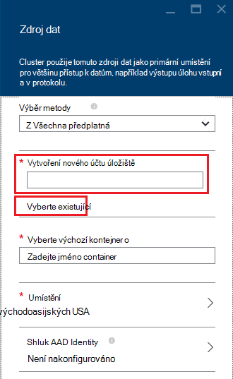

<properties
    pageTitle="Data z úložiště objektů Blob kompatibilní s prohlížečem HDFS dotazu | Microsoft Azure"
    description="Úložiště objektů Blob Azure HDInsight používá jako velký datový úložiště pro HDFS. Zjistěte, jak můžete načítat data z úložiště objektů Blob a ukládat výsledky analýzy."
    keywords="kulatý úložiště, hdfs, strukturovaná data, Nestrukturovaná data"
    services="hdinsight,storage"
    documentationCenter=""
    tags="azure-portal"
    authors="mumian"
    manager="jhubbard"
    editor="cgronlun"/>

<tags
    ms.service="hdinsight"
    ms.workload="big-data"
    ms.tgt_pltfrm="na"
    ms.devlang="na"
    ms.topic="get-started-article"
    ms.date="09/06/2016"
    ms.author="jgao"/>

# Úložiště objektů Blob Azure kompatibilní s prohlížečem HDFS pomocí Hadoop v HDInsight

Zjistěte, jak pomocí minimum náklady úložiště objektů Blob Azure HDInsight, vytvořit účet Azure úložiště a kontejner úložiště objektů Blob a pak adresu dat obsažených v.

Úložiště objektů Blob Azure je robustní, univerzální úložiště řešení, které Bezproblémová integrace s HDInsight. Pomocí rozhraní systému (HDFS) Hadoop distributed souboru můžete úplné sady součástí HDInsight pracovat přímo na strukturovaná a Nestrukturovaná data v úložišti objektů Blob.

Ukládání dat v úložišti objektů Blob vám umožní bezpečně odstranit HDInsight clusterů, které slouží k výpočtu bez ztráty dat uživatele.

> [AZURE.IMPORTANT] HDInsight podporuje pouze objektů BLOB blokovat. Ho nepodporuje stránky nebo přidat objektů BLOB.

Informace o vytváření HDInsight obrázku najdete v tématu [Začínáme s HDInsight] [ hdinsight-get-started] nebo [Vytvoření HDInsight clusterů][hdinsight-creation].

## HDInsight úložiště architektura
Následující diagram nabízí abstraktní zobrazení úložiště architektury HDInsight:

![Hadoop clusterů pomocí rozhraní API HDFS přístup a uložit strukturovaná a Nestrukturovaná data v úložišti objektů Blob.] (./media/hdinsight-hadoop-use-blob-storage/HDI.WASB.Arch.png "Architektura HDInsight úložiště")

HDInsight poskytuje přístup k distribuovaný systém souborů připojený místně do výpočetního uzlů. Tento soubor systém lze přistupovat pomocí plně kvalifikovaný URI, například:

    hdfs://<namenodehost>/<path>

Kromě toho HDInsight umožňuje přístup k datům, která je uložena v úložišti objektů Blob Azure. Syntaxe je:

    wasb[s]://<containername>@<accountname>.blob.core.windows.net/<path>

> [AZURE.NOTE] V části HDInsight dřívějších verzích než 3.0 `asv://` byla použita namísto `wasb://`. `asv://`neměli použít s HDInsight clusterů 3.0 nebo novější, bude výsledkem chyba.

Hadoop podporuje pojmu výchozí systém souborů. Systém souborů výchozí znamená výchozí schéma a autorita. Je taky slouží k řešení relativní cesty. Během procesu vytváření HDInsight, účet Azure úložiště a konkrétní úložiště objektů Blob Azure kontejneru z tohoto účtu označen jako výchozí systém souborů.

Kromě tohoto účtu úložiště můžete přidat další úložiště účty ze stejného Azure předplatné nebo různých Azure předplatných během s vytvářením nebo po vytvoření clusteru. Pokyny pro přidání dalšího úložiště účtů najdete v článku [Vytvoření HDInsight clusterů][hdinsight-creation].

- **Kontejnery do úložiště účtů připojených k clusteru:** Protože název účtu a klíč souvisí s clusteru při vytváření, máte plný přístup ke objektů BLOB v těchto kontejnerech.

- **Veřejné kontejnerů nebo veřejné objektů BLOB v úložiště účty, které nejste připojeni k clusteru:** Které smíte jen pro čtení objektů BLOB v kontejnerech.

    > [AZURE.NOTE]
        > Veřejné kontejnery umožňují zobrazte seznam všechny objekty BLOB, které jsou dostupné v tomto kontejneru a získat kontejneru metadata. Veřejné objektů BLOB umožňuje přístup k objektů BLOB jenom v případě, že znáte přesná adresa URL. Další informace najdete v článku <a href="http://msdn.microsoft.com/library/windowsazure/dd179354.aspx">omezení přístupu ke kontejnerů a objektů BLOB</a>.

- **Soukromé kontejnery v úložiště účty, které nejste připojeni k clusteru:** Pokud při odeslání úlohy WebHCat definovat účtu úložiště nebudete mít přístup objektů BLOB v kontejnerech. To je vysvětleno dále v tomto článku.

Úložiště účty, které jsou definované v proces vytváření a legendou jsou uložené ve %HADOOP_HOME%/conf/core-site.xml uzlech clusteru. Výchozí chování HDInsight, je použít úložiště účtů podle site.xml základní soubor. Nedoporučujeme upravovat soubor základní site.xml, protože hlavy node(master) clusteru může reimaged nebo migrovaná kdykoli a k těmto souborům se ztratí se všechny změny.

Více WebHCat úloh, včetně podregistru, MapReduce, Hadoop streamování a Prasátko, můžete provádět popis úložiště účty a metadata s nimi. (To aktuálně funguje Prasátko s účty úložiště, ale ne metadata.) V části [přístup objektů BLOB pomocí prostředí PowerShell Azure](#powershell) v tomto článku jsou výběrem této funkce. Další informace najdete v tématu [použití HDInsight obrázku s alternativním úložiště účty a Metastores](http://social.technet.microsoft.com/wiki/contents/articles/23256.using-an-hdinsight-cluster-with-alternate-storage-accounts-and-metastores.aspx).

Úložiště objektů blob se dá použít pro strukturovaná a Nestrukturovaná data. Kontejnery úložiště objektů BLOB ukládají data jako klíč/dvojice a bez hierarchie adresář. Ale lomítko (/) lze v názvu klíče ji zobrazíte, jako kdybyste je soubor uložen struktuře adresář. Například objektů blob klíč může být *input/log1.txt*. Žádné skutečné *vstupní* adresář nachází, ale kvůli stavu znak lomítka v názvu klíče má vzhled cestu k souboru.

###Výhody úložiště objektů Blob
Předpokládané náročnosti není spoluvytváření vyhledání výpočet clusterů a zmírnit prostředků úložiště tím vytvořili výpočetních clusterů zavřít prostředků účtu úložiště uvnitř Azure oblasti, kde vysokorychlostní sítě díky kterému je velmi efektivní využití uzlů pro přístup k datům v úložišti objektů Blob Azure.

Existuje několik výhod přidružený k ukládání dat v úložišti objektů Blob Azure místo HDFS:

* **Sdílení a opakované použití dat:** Data v HDFS se nachází uvnitř výpočetním clusteru. Jenom aplikace, které mají přístup k výpočetním clusteru můžete používat data pomocí rozhraní API HDFS. Data v úložišti objektů Blob Azure můžete k nim získat přístup prostřednictvím rozhraní API HDFS nebo prostřednictvím rozhraní [REST API úložiště objektů Blob][blob-storage-restAPI]. Proto větší sadu aplikace (včetně jiných HDInsight clusterů) a nástroje lze vytvářet a používat data.
* **Archivace dat:** Ukládání dat v úložišti objektů Blob Azure umožňuje HDInsight clusterů používá pro výpočet bezpečně odstraněno bez ztráty dat uživatele.
* **Datový úložiště náklady:** Ukládání dat v distribuovaného systému souborů dlouhodobým je nákladnější než ukládání dat v úložišti objektů Blob Azure, protože náklady ve výpočetním clusteru je vyšší než náklady kontejneru úložiště objektů Blob Azure. Kromě toho vzhledem k tomu, aby bylo možné načíst pro každý výpočetním clusteru generování nemá data, taky ukládáte dat načítání náklady.
* **Pružná škálování:** Přestože HDFS poskytuje systému souborů rozšířených, měřítka, je určený podle počtu uzlů vytvořené pro svůj cluster. Změna měřítka, může být složitější proces než může na ohebné měřítka funkcí, které se automaticky zobrazí v úložišti objektů Blob Azure.
* **Geo replikace:** Vaše kontejnery úložiště objektů Blob Azure může být replikovat geo. I když to vám zeměpisné využití a redundance dat, selhání místo replikovat geo vážně ovlivňuje výkon a ji může vynakládá Další. Tak, aby naši doporučení pro promyšlený geo replikace a pouze pokud je hodnota dat jmění dalších nákladů.

Některé MapReduce úlohy a balíčků může vytvořit intermediate výsledky, které nechcete skutečně ukládat v úložišti objektů Blob Azure. V takovém případě můžete vybrat, zda chcete data uložit do místního HDFS. Ve skutečnosti HDInsight používá distribuovaného systému souborů pro některé z těchto intermediate výsledkem podregistru úlohy a jiných procesů.

> [AZURE.NOTE] Většinu HDFS příkazů (například <b>ls</b> <b>copyFromLocal</b> a <b>mkdir</b>) pořád očekávaným způsobem. Pouze příkazy, které jsou specifické pro nativní HDFS implementaci (což se označuje jako distribuovaného systému souborů), například <b>fschk</b> a <b>dfsadmin</b>zobrazí různé chování v úložišti objektů Blob Azure.

## Vytvoření objektů Blob kontejnery

Použití objektů BLOB, nejdřív vytvořit [účet Azure úložiště][azure-storage-create]. Jako součást této zadáte Azure oblasti, které se uloží objekty, které vytvoříte pomocí tohoto účtu. Clusteru a účtu úložiště musí být umístěny ve stejné oblasti. Databáze SQL serveru metastore podregistru a databáze SQL serveru metastore Oozie musí být také umístěné ve stejné oblasti.

Místo, kde je umístěn každý objektů blob vytvořená patří do kontejneru ve vašem úložišti Azure účtu. Tento kontejner může být existující objektů blob, který byl vytvořený mimo HDInsight nebo může být kontejneru, která se vytvoří pro HDInsight obrázku.

Výchozí objektů Blob kontejner ukládá clusteru určité informace, například historie úlohy a protokoly. Nechcete sdílet kontejneru objektů Blob výchozí s více clusterů HDInsight. To může dojít k poškození historie úlohy a bude misbehave clusteru. Doporučujeme použít jiný kontejner pro každý cluster a umístění sdílené dat na účet propojené úložiště podle nasazení všechny relevantní clusterů spíše než výchozí účet úložiště. Další informace o konfiguraci propojené úložiště účtů najdete v článku [Vytvoření HDInsight clusterů][hdinsight-creation]. Však můžete znovu použít výchozí úložiště kontejner po odstranění původního clusteru HDInsight. HBase clusterů můžete ve skutečnosti zachovat schématu HBase tabulky a dat podle vytvořte nové clusteru HBase pomocí výchozího kontejneru úložiště objektů blob používanou HBase obrázku, který byl odstraněn.

### Pomocí portálu Azure

Při vytváření clusteru HDInsight z portálu Microsoft, máte možnost použít existující účet úložiště nebo vytvořte nový účet úložiště:

###Použití Azure rozhraní příkazového řádku

[AZURE.INCLUDE [use-latest-version](../../includes/hdinsight-use-latest-cli.md)]

Pokud máte [nainstalovali a nakonfigurovali rozhraní příkazového řádku Azure](../xplat-cli-install.md), tento příkaz mohou sloužit k účtu úložiště a kontejner.

    azure storage account create <storageaccountname> --type LRS

> [AZURE.NOTE] `--type` Parametr určuje, jak bude replikovat účtu úložiště. Další informace najdete v tématu [Replikace úložiště Azure](../storage/storage-redundancy.md). Nepoužívejte ZRS jako ZRS, které nejsou podporovány objektů blob stránky, souboru, tabulky nebo fronty.

Zobrazí se výzva k určení zeměpisná oblast účtu úložiště bude nacházet v. Ve stejné oblasti, kterou chcete k vytvoření HDInsight clusteru měli vytvořit účet úložiště.

Po vytvoření účtu úložiště použijte k načtení klíčů účtu úložiště tento příkaz:

    azure storage account keys list <storageaccountname>

Pokud chcete vytvořit kontejner, použijte tento příkaz:

    azure storage container create <containername> --account-name <storageaccountname> --account-key <storageaccountkey>

### Pomocí prostředí PowerShell Azure

Pokud jste [nainstalovali a nakonfigurovali Azure PowerShell][powershell-install], od příkazovém řádku prostředí PowerShell Azure můžete použít k vytvoření účtu úložiště a kontejner:

[AZURE.INCLUDE [upgrade-powershell](../../includes/hdinsight-use-latest-powershell.md)]

    $SubscriptionID = "<Your Azure Subscription ID>"
    $ResourceGroupName = "<New Azure Resource Group Name>"
    $Location = "EAST US 2"
    
    $StorageAccountName = "<New Azure Storage Account Name>"
    $containerName = "<New Azure Blob Container Name>"
    
    Add-AzureRmAccount
    Select-AzureRmSubscription -SubscriptionId $SubscriptionID
    
    # Create resource group
    New-AzureRmResourceGroup -name $ResourceGroupName -Location $Location
    
    # Create default storage account
    New-AzureRmStorageAccount -ResourceGroupName $ResourceGroupName -Name $StorageAccountName -Location $Location -Type Standard_LRS 
    
    # Create default blob containers
    $storageAccountKey = (Get-AzureRmStorageAccountKey -ResourceGroupName $resourceGroupName -StorageAccountName $StorageAccountName)[0].Value
    $destContext = New-AzureStorageContext -StorageAccountName $storageAccountName -StorageAccountKey $storageAccountKey  
    New-AzureStorageContainer -Name $containerName -Context $destContext

## Soubory v úložišti objektů Blob

Schéma URI pro přístup k souborům v úložišti objektů Blob z Hdinsightu je:

    wasb[s]://<BlobStorageContainerName>@<StorageAccountName>.blob.core.windows.net/<path>

Schéma URI jsou k dispozici nešifrovaném (s *wasb:* předpona) a SSL šifrované přístupu (pomocí *wasbs*). Doporučujeme používat *wasbs* kdykoli je to možné, i když přístup k datům, které je uvnitř stejné oblasti v Azure.

&lt;BlobStorageContainerName&gt; identifikuje jméno container v úložišti objektů Blob Azure.
&lt;StorageAccountName&gt; identifikuje název účtu úložiště Azure. Požaduje plně kvalifikovaný název domény (FQDN).

Pokud ani &lt;BlobStorageContainerName&gt; ani &lt;StorageAccountName&gt; není zadáno, je použít výchozí systém souborů. Pro soubory v systému souborů výchozí můžete použít absolutní nebo relativní cestu. Například souborů *hadoop mapreduce examples.jar* , které jsou součástí HDInsight clusterů mohou odkazovat jedním z těchto věcí:

    wasbs://mycontainer@myaccount.blob.core.windows.net/example/jars/hadoop-mapreduce-examples.jar
    wasbs:///example/jars/hadoop-mapreduce-examples.jar
    /example/jars/hadoop-mapreduce-examples.jar

> [AZURE.NOTE] Je v poli Název souboru <i>hadoop examples.jar</i> clusterů verze 2.1 a 1,6 HDInsight.

&lt;Cestu&gt; se jmenuje HDFS cesta k souboru nebo složky. Vzhledem k tomu kontejnery v úložišti objektů Blob Azure ukládá jednoduše klíč hodnota, je žádné systém souborů HFS PRAVDA. Lomítko (/), v klíči objektů blob je odkaz interpretován jako oddělovač adresář. Například název objektů blob *hadoop mapreduce examples.jar* je:

    example/jars/hadoop-mapreduce-examples.jar

> [AZURE.NOTE] Při práci s objekty BLOB mimo HDInsight většině nástrojů není s tímto formátem WASB a místo toho očekávají, že formátu základní cestu jako `example/jars/hadoop-mapreduce-examples.jar`.

## Objekty BLOB přístup pomocí rozhraní příkazového řádku Azure

Pomocí následujícího příkazu zobrazíte seznam souvisejících objektů blob příkazů:

    azure storage blob

**Příklad použití rozhraní příkazového řádku Azure k nahrání souboru**

    azure storage blob upload <sourcefilename> <containername> <blobname> --account-name <storageaccountname> --account-key <storageaccountkey>

**Příklad použití Azure rozhraní příkazového řádku pro stažení souboru**

    azure storage blob download <containername> <blobname> <destinationfilename> --account-name <storageaccountname> --account-key <storageaccountkey>

**Příklad použití rozhraní příkazového řádku Azure při odstraňování souboru**

    azure storage blob delete <containername> <blobname> --account-name <storageaccountname> --account-key <storageaccountkey>

**Příklad použití Azure rozhraní příkazového řádku do seznamu souborů**

    azure storage blob list <containername> <blobname|prefix> --account-name <storageaccountname> --account-key <storageaccountkey>

## Objekty BLOB přístup pomocí prostředí PowerShell Azure

> [AZURE.NOTE] Příkazy v této části poskytují základní příklady pomocí Powershellu pro přístup k datům uložené v objektů BLOB. Další plnohodnotně vybaveného jako příklad, který používá vlastní nastavení pro práci s Hdinsightu najdete v článku [Nástroje HDInsight](https://github.com/Blackmist/hdinsight-tools).

Pomocí následujícího příkazu uvádějí rutiny související objektů blob:

    Get-Command *blob*

![Seznam souvisejících objektů blob rutiny prostředí PowerShell.][img-hdi-powershell-blobcommands]

###Nahrávání souborů

V tématu [nahrání data, která chcete HDInsight][hdinsight-upload-data].

###Stahování souborů

Následující skriptu stáhne objektů blob blok je aktuální složka. Před spuštěním skriptu, přejděte v adresáři složky, kde máte oprávnění k zápisu.

    $resourceGroupName = "<AzureResourceGroupName>"
    $storageAccountName = "<AzureStorageAccountName>"   # The storage account used for the default file system specified at creation.
    $containerName = "<BlobStorageContainerName>"  # The default file system container has the same name as the cluster.
    $blob = "example/data/sample.log" # The name of the blob to be downloaded.
    
    # Use Add-AzureAccount if you haven't connected to your Azure subscription
    Login-AzureRmAccount 
    Select-AzureRmSubscription -SubscriptionID "<Your Azure Subscription ID>"
    
    Write-Host "Create a context object ... " -ForegroundColor Green
    $storageAccountKey = (Get-AzureRmStorageAccountKey -ResourceGroupName $resourceGroupName -Name $storageAccountName)[0].Value
    $storageContext = New-AzureStorageContext -StorageAccountName $storageAccountName -StorageAccountKey $storageAccountKey  
    
    Write-Host "Download the blob ..." -ForegroundColor Green
    Get-AzureStorageBlobContent -Container $ContainerName -Blob $blob -Context $storageContext -Force
    
    Write-Host "List the downloaded file ..." -ForegroundColor Green
    cat "./$blob"

Poskytování skupinu název zdroje a název obrázku, můžete použít následující kód:

    $resourceGroupName = "<AzureResourceGroupName>"
    $clusterName = "<HDInsightClusterName>"
    $blob = "example/data/sample.log" # The name of the blob to be downloaded.
    
    $cluster = Get-AzureRmHDInsightCluster -ResourceGroupName $resourceGroupName -ClusterName $clusterName
    $defaultStorageAccount = $cluster.DefaultStorageAccount -replace '.blob.core.windows.net'
    $defaultStorageAccountKey = (Get-AzureRmStorageAccountKey -ResourceGroupName $resourceGroupName -Name $defaultStorageAccount)[0].Value
    $defaultStorageContainer = $cluster.DefaultStorageContainer
    $storageContext = New-AzureStorageContext -StorageAccountName $defaultStorageAccount -StorageAccountKey $defaultStorageAccountKey 
    
    Write-Host "Download the blob ..." -ForegroundColor Green
    Get-AzureStorageBlobContent -Container $defaultStorageContainer -Blob $blob -Context $storageContext -Force

###Odstranění souborů

    Remove-AzureStorageBlob -Container $containerName -Context $storageContext -blob $blob

###Seznam souborů

    Get-AzureStorageBlob -Container $containerName -Context $storageContext -prefix "example/data/"

###Spouštění dotazů podregistru pomocí účtu Nedefinováno úložiště

Tento příklad ukazuje, jak seznam složky z úložiště účet, který není definované při vytváření procesu.
$clusterName = "<HDInsightClusterName>"

    $undefinedStorageAccount = "<UnboundedStorageAccountUnderTheSameSubscription>"
    $undefinedContainer = "<UnboundedBlobContainerAssociatedWithTheStorageAccount>"

    $undefinedStorageKey = Get-AzureStorageKey $undefinedStorageAccount | %{ $_.Primary }

    Use-AzureRmHDInsightCluster $clusterName

    $defines = @{}
    $defines.Add("fs.azure.account.key.$undefinedStorageAccount.blob.core.windows.net", $undefinedStorageKey)

    Invoke-AzureRmHDInsightHiveJob -Defines $defines -Query "dfs -ls wasbs://$undefinedContainer@$undefinedStorageAccount.blob.core.windows.net/;"

## Další kroky

V tomto článku se naučíte používat úložiště objektů Blob Azure HDFS kompatibilní s HDInsight a jste se naučili úložiště objektů Blob Azure je základní součásti HDInsight. Umožňuje a vytváření řešení pořízení scalable dlouhodobé archivace dat s úložiště objektů Blob Azure HDInsight odemknout informací obsažených uložené strukturovaná a Nestrukturovaná data.

Další informace najdete v tématu:

* [Začínáme s Azure HDInsight][hdinsight-get-started]
* [Odeslání dat do HDInsight][hdinsight-upload-data]
* [Použití podregistru s HDInsight][hdinsight-use-hive]
* [Použití Prasátko s HDInsight][hdinsight-use-pig]
* [Použití Azure úložiště sdílené přístup podpisy omezení přístupu k datům s HDInsight][hdinsight-use-sas]

[hdinsight-use-sas]: hdinsight-storage-sharedaccesssignature-permissions.md
[powershell-install]: ../powershell-install-configure.md
[hdinsight-creation]: hdinsight-provision-clusters.md
[hdinsight-get-started]: hdinsight-hadoop-tutorial-get-started-windows.md
[hdinsight-upload-data]: hdinsight-upload-data.md
[hdinsight-use-hive]: hdinsight-use-hive.md
[hdinsight-use-pig]: hdinsight-use-pig.md

[blob-storage-restAPI]: http://msdn.microsoft.com/library/windowsazure/dd135733.aspx
[azure-storage-create]: ../storage/storage-create-storage-account.md

[img-hdi-powershell-blobcommands]: ./media/hdinsight-hadoop-use-blob-storage/HDI.PowerShell.BlobCommands.png
[img-hdi-quick-create]: ./media/hdinsight-hadoop-use-blob-storage/HDI.QuickCreateCluster.png
[img-hdi-custom-create-storage-account]: ./media/hdinsight-hadoop-use-blob-storage/HDI.CustomCreateStorageAccount.png  
