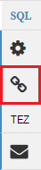

<properties
   pageTitle="Použití Ambari zobrazení pro práci s podregistru na HDInsight (Hadoop) | Microsoft Azure"
   description="Informace o použití zobrazení podregistru z webového prohlížeče na odeslání podregistru dotazů. Zobrazení podregistru je součástí uživatelské rozhraní webu Ambari součástí svůj cluster na základě Linux HDInsight."
   services="hdinsight"
   documentationCenter=""
   authors="Blackmist"
   manager="jhubbard"
   editor="cgronlun"
    tags="azure-portal"/>

<tags
   ms.service="hdinsight"
   ms.devlang="na"
   ms.topic="article"
   ms.tgt_pltfrm="na"
   ms.workload="big-data"
   ms.date="10/28/2016"
   ms.author="larryfr"/>

#Použití zobrazení vedle podregistru s Hadoop v HDInsight

[AZURE.INCLUDE [hive-selector](../../includes/hdinsight-selector-use-hive.md)]

Ambari je Správa a sledování nástroj součástí clusterů na základě Linux HDInsight. Jednou z funkce dostupné prostřednictvím Ambari je uživatelské rozhraní webu, které slouží ke spouštění dotazů podregistru. Jedná se o __Podregistru zobrazení__, část zobrazení Ambari součástí svůj cluster HDInsight.

> [AZURE.NOTE] Ambari má mnoho možností, které nebude popisované v tomto dokumentu. Další informace najdete v tématu [Správa HDInsight clusterů pomocí rozhraní webových Ambari](hdinsight-hadoop-manage-ambari.md).

##Zjistit předpoklady pro

- Na základě Linux HDInsight obrázku. Další informace o vytvoření nového clusteru najdete v článku [Začínáme se systémem Linux HDInsight](hdinsight-hadoop-linux-tutorial-get-started.md).

##Otevřete zobrazení podregistru

Je možné zobrazení Ambari z portálu Microsoft Azure; Vyberte svůj cluster HDInsight a pak vyberte __Zobrazení Ambari__ v oddílu __Rychlé odkazy__ .

Můžete taky přejít přímo do Ambari tak, že přejdete do https://CLUSTERNAME.azurehdinsight.net ve webovém prohlížeči (kde __NÁZEV_CLUSTERU__ je název vaší HDInsight clusteru) a vyberte požadovanou sadu čtverců z nabídky stránky (vedle položky odkaz pro __správu__ a požadovaného tlačítka na levé straně stránky) k dispozici zobrazení seznamů. Vyberte __podregistru zobrazení__.

.

> [AZURE.NOTE] Při přístupu k Ambari, budete vyzváni k ověření na web. Zadejte správce (výchozí `admin`,) účtu jméno a heslo, které jste použili při vytváření clusteru.

Měli byste vidět podobná této stránky:

##Zobrazení tabulky

V části __Průzkumník databáze__ na stránce vyberte položku __výchozí__ na kartě __databáze__ . Tím zobrazíte seznam tabulek v databázi výchozí. Pro nový cluster HDInsight by měl existovat jenom jednu tabulku; __hivesampletable__.

Postup podle tohoto dokumentu při přidávání nové tabulky, můžete v pravém horním rohu Průzkumníka databází ikonu Aktualizovat aktualizujte seznam všech dostupných tabulek.

##Editor dotazů

Postupujte následujícím ze zobrazení podregistru ke spuštění dotazu podregistru proti dat zahrnutý v sadě clusteru.

1. V části __Editoru dotazů__ stránku vložte následující příkazy HiveQL do sešitu:

        DROP TABLE log4jLogs;
        CREATE EXTERNAL TABLE log4jLogs(t1 string, t2 string, t3 string, t4 string, t5 string, t6 string, t7 string)
        ROW FORMAT DELIMITED FIELDS TERMINATED BY ' '
        STORED AS TEXTFILE LOCATION 'wasbs:///example/data/';
        SELECT t4 AS sev, COUNT(*) AS cnt FROM log4jLogs WHERE t4 = '[ERROR]' GROUP BY t4;

    Tyto příkazy provádět následující akce:

    - **PŘETAŽENÍ tabulky** – odstraní tabulku a datovém souboru, v případě, že v tabulce už existuje.
    - **Vytvořit externí tabulka** – vytvoří nová tabulka "externí" v podregistru. Externí tabulky uložit pouze definici tabulku podregistru; data ještě zbývá do původního umístění.
    - **Formát řádku** - říká podregistru formátování data. V tomto případě polí v jednotlivých protokolu oddělená mezerou.
    - **ULOŽENÁ jako textový soubor umístění** - říká podregistru, kde jsou data uložená (příklad/datového adresáře) a že je uložená jako text.
    - **Vyberte** – slouží k výběru počet řádků místo, kam t4 sloupec obsahuje hodnotu [Chyba].

    >[AZURE.NOTE] Externí tabulky má používat, když je očekávaná podkladová data mají být aktualizovány externí aplikací, jako je proces nahrávání automatické dat nebo jinou MapReduce operací, ale chcete, aby podregistru dotazů použít nejnovější data. Uvolnění externí tabulce znamená *neodstraňujte data, pouze definici tabulky* .

2. Spuštění dotazu pomocí tlačítka __spouštění__ v dolní části editoru dotazů. Doporučujeme zapnout oranžová a text se změní na __zastavíte__. Oddíl __Výsledky procesu dotazu__ by měl zobrazí pod editoru dotazů a zobrazení informací o projektu.

    > [AZURE.IMPORTANT] Některých prohlížečích nemusí správně aktualizujte informace o protokolu nebo výsledky. Pokud spustíte úlohy a zobrazí se trvale spustit bez aktualizace protokol nebo nevrací žádné výsledky, zkuste místo toho použít Mozilla FireFox nebo Google Chrome.

3. Po dokončení dotazu části __Obrázku výsledků dotazu__ se zobrazí výsledky operace. Tlačítko __zastavíte__ změní zpátky na zelenou tlačítko __Spustit__ . Karta __výsledky__ by měl obsahovat následující informace:

        sev       cnt
        [ERROR]   3

    Na kartě __protokoly__ mohou sloužit k zobrazení informace zaznamenané do protokolu vytvořeného projektu. Tímto způsobem můžete řešit potíže, pokud narazíte na problémy s dotazem.

    > [AZURE.TIP] Dialogové okno poznámky na __uložení výsledků__ rozevírací seznam v levém horním rohu oddílu __Proces výsledků dotazu__ . Můžete to stáhnout výsledky, nebo je uložíte do úložiště HDInsight do souboru CSV.

3. Vyberte první čtyři řádky tento dotaz a pak vyberte __Spustit__. Všimněte si, že nejsou žádné výsledky dokončení projektu. Důvodem je pomocí tlačítka __Spustit__ , je-li vybrán část Dotaz se spustí pouze vybrané příkazy. V tomto případě výběr neměli obsahovat konečný příkaz, který získá řádků z tabulky. Pokud vyberte jenom tuto linku a používáte __spouštět__, byste měli vidět očekávané výsledky.

3. Pomocí tlačítka __Nový list__ v dolní části __Editoru dotazů__ můžete vytvořit nový list. V novém listu zadejte následující příkazy HiveQL:

        CREATE TABLE IF NOT EXISTS errorLogs (t1 string, t2 string, t3 string, t4 string, t5 string, t6 string, t7 string) STORED AS ORC;
        INSERT OVERWRITE TABLE errorLogs SELECT t1, t2, t3, t4, t5, t6, t7 FROM log4jLogs WHERE t4 = '[ERROR]';

    Tyto příkazy provádět následující akce:

    - **Vytvoření tabulky IF NOT EXISTS** - vytvoří tabulku, pokud už neexistuje. Protože nepoužívá **externí** klíčové slovo, toto je vnitřní tabulku, která je uložena v datový sklad podregistru a úplně spravuje podregistru. Na rozdíl od externích tabulek uvolnění vnitřní tabulku odstraníte podkladová data.
    - **ULOŽENÝ jako ORC** - jsou uložená data ve formátu optimalizované řádku sloupcový (ORC). Jedná se o formát vysoce Optimalizovaná a efektivně pro ukládání dat podregistru.
    - PŘEPSAT **vložení... Vyberte** – slouží k výběru řádků z tabulky **log4jLogs** , které obsahují [Chyba] a vloží data do tabulky **errorLogs** .

    Pomocí tlačítka __Spustit__ spusťte dotaz. Karta __výsledky__ nebude obsahovat žádné informace, jak žádné řádky jsou výsledky tohoto dotazu, ale stav má zobrazit jako __byl úspěšný__.

###Nastavení podregistru

Klikněte na ikonu __Nastavení__ vpravo od editoru.

Nastavení lze MapReduce nastavení různých podregistru, například změnu modul spuštění pro podregistru z Tez (výchozí nastavení,).

###Vizuální vysvětlují

Vyberte ikonu __Vizuální vysvětlit__ napravo od editoru.

Jedná se o __Vizuální vysvětlit__ zobrazení dotazu, který může být užitečné pro porozumění tok složitých dotazů. Textový ekvivalent toto zobrazení můžete zobrazit pomocí tlačítko __Vysvětlit__ v editoru dotazů.

###Tez

Vyberte ikonu __Tez__ napravo od editoru.

Zobrazí se směrovány Acyklické grafu (DAG) používané Tez pro tento dotaz, pokud je k dispozici. Pokud chcete zobrazit DAG pro dotazy jste spuštění v minulosti nebo ladění procesu Tez použití [Zobrazení Tez](hdinsight-debug-ambari-tez-view.md) místo.

###Oznámení

Vyberte ikonu __oznámení__ napravo od editoru.

Oznámení jsou zprávy, které jsou přihlášení vygenerované při spouštění dotazů. Například zobrazí se oznámení po odeslání dotazu nebo dojde k chybě.

##Uložené dotazy

1. V editoru dotazů, vytvořte nový list a zadejte následující dotaz:

        SELECT * from errorLogs;

    Spuštění dotazu můžete ověřit, že funguje. Výsledek bude následujícím způsobem:

        errorlogs.t1    errorlogs.t2    errorlogs.t3    errorlogs.t4    errorlogs.t5    errorlogs.t6    errorlogs.t7
        2012-02-03  18:35:34    SampleClass0    [ERROR]     incorrect   id  
        2012-02-03  18:55:54    SampleClass1    [ERROR]     incorrect   id  
        2012-02-03  19:25:27    SampleClass4    [ERROR]     incorrect   id

2. Použijte tlačítka __Uložit jako__ v dolní části editoru. Název tohoto dotazu __Errorlogs__ a vyberte __OK__. Všimněte si, že název listu změní na __Errorlogs__.

3. Vyberte kartu __Uložené dotazy__ v horní části stránky podregistru zobrazení. Všimněte si, že __Errorlogs__ teď zobrazují jako uložený dotaz. Zůstane v tomto seznamu, dokud ho odebrat. Výběrem názvu se otevře dotaz v editoru dotazů.

##Historie dotazu

Tlačítko __Historie__ v horní části zobrazení podregistru umožňuje k zobrazení dotazů, ke kterým máte spuštění dříve. Použijte nyní a vyberte některé dotazy, které máte spustili dříve. Když vyberete dotazu, otevře se v editoru dotazů.

##Uživatelem definované funkce (UDF)

Podregistru lze také rozšířit pomocí **funkcí definovaných uživatelem (UDF)**. Uživatelem definovanou FUNKCI umožňuje implementace funkcí nebo použití logických operátorů, který není modelovat snadno HiveQL.

Můžete přidat sice uživatelem definovanou FUNKCI jako součást příslušným HiveQL v dotazu, na kartu UDF v horní části zobrazení podregistru umožňuje deklarovat a uložte sadu funkce definované uživatelem, které lze použít v __Editoru dotazů__.

Po přidání uživatelem definovanou FUNKCI do zobrazení podregistru, zobrazí se tlačítka __Vložit funkce definované uživatelem__ v dolní části __Editoru dotazů__. Pokud vyberete tuto se zobrazí rozevíracím seznamu funkce definované uživatelem definované v zobrazení podregistru. Výběr uživatelem definovanou FUNKCI přidá HiveQL příkazů do dotazu pro povolení souboru UDF.

Řekněme, že jste definovali UDF s následujícími vlastnostmi:

* Název zdroje: myudfs
* Cesta zdroje: wasbs:///myudfs.jar
* Název UDF: myawesomeudf
* Název třídy UDF: com.myudfs.Awesome

Použití tlačítka __Vložit UDF__ zobrazí položku s názvem __myudfs__s jinou rozevírací seznam pro každou UDF definované pro daný zdroj. V tomto případě __myawesomeudf__. Výběr tuto položku přidá následující začátek dotazu:

    add jar wasbs:///myudfs.jar;

    create temporary function myawesomeudf as 'com.myudfs.Awesome';

Pak můžete souboru UDF v dotazu. Například `SELECT myawesomeudf(name) FROM people;`.

Další informace o použití funkce definované uživatelem s podregistru na Hdinsightu najdete v těchto článcích:

* [Prostřednictvím Python podregistru Prasátko v HDInsight](hdinsight-python.md)

* [Jak přidat vlastní podregistru uživatelem definovanou FUNKCI HDInsight](http://blogs.msdn.com/b/bigdatasupport/archive/2014/01/14/how-to-add-custom-hive-udfs-to-hdinsight.aspx)

##Další kroky

Obecné informace o podregistru v HDInsight:

* [Použití podregistru s Hadoop na HDInsight](hdinsight-use-hive.md)

Informace o jiných způsobech můžete pracovat s Hadoop na HDInsight:

* [Použití Prasátko s Hadoop na HDInsight](hdinsight-use-pig.md)

* [Použití MapReduce s Hadoop na HDInsight](hdinsight-use-mapreduce.md)
