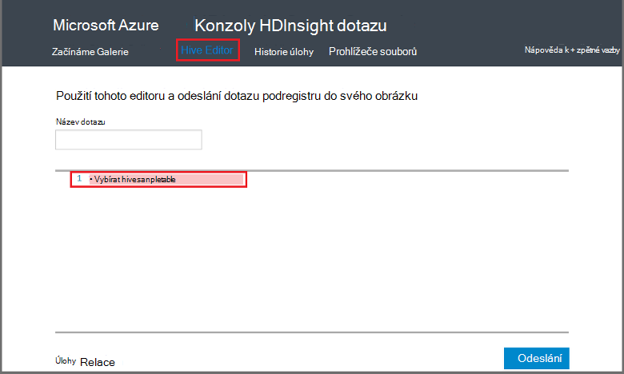

<properties
   pageTitle="Použití Hadoop podregistru na konzole dotazu v HDInsight | Microsoft Azure"
   description="Naučte se používat konzole webový dotaz na spouštění dotazů podregistru clusteru HDInsight Hadoop v prohlížeči."
   services="hdinsight"
   documentationCenter=""
   authors="Blackmist"
   manager="jhubbard"
   editor="cgronlun"
    tags="azure-portal"/>

<tags
   ms.service="hdinsight"
   ms.devlang="na"
   ms.topic="article"
   ms.tgt_pltfrm="na"
   ms.workload="big-data"
   ms.date="09/20/2016"
   ms.author="larryfr"/>

# Spouštění dotazů podregistru pomocí konzoly dotazu

[AZURE.INCLUDE [hive-selector](../../includes/hdinsight-selector-use-hive.md)]

V tomto článku se dozvíte, jak používat konzolu HDInsight dotazu k spouštění dotazů podregistru clusteru HDInsight Hadoop v prohlížeči.

> [AZURE.IMPORTANT] Konzole HDInsight dotazu je dostupný pouze na serveru s Windows HDInsight clusterů. Pokud používáte na základě Linux HDInsight clusteru, najdete v článku [Spustit podregistru dotazů pomocí zobrazení podregistru](hdinsight-hadoop-use-hive-ambari-view.md).

##Zjistit předpoklady pro

Kroky v tomto článku, budete potřebovat.

* Shluk HDInsight Hadoop serveru s Windows

* Moderní webového prohlížeče

##Spouštění dotazů podregistru pomocí konzoly dotazu

1. Otevřete webový prohlížeč a přejděte na __https://CLUSTERNAME.azurehdinsight.net__, kde __NÁZEV_CLUSTERU__ je název svůj cluster HDInsight. Pokud se zobrazí výzva, zadejte uživatelské jméno a heslo, které jste použili při vytvoření clusteru.

2. Před odkazy v horní části stránky vyberte **Podregistru Editor**. Zobrazí formulář, který slouží k zadávání HiveQL příkazů, které chcete používat v clusteru HDInsight.

    

    Nahrazení textu `Select * from hivesampletable` s následující příkazy HiveQL:

        set hive.execution.engine=tez;
        DROP TABLE log4jLogs;
        CREATE EXTERNAL TABLE log4jLogs (t1 string, t2 string, t3 string, t4 string, t5 string, t6 string, t7 string)
        ROW FORMAT DELIMITED FIELDS TERMINATED BY ' '
        STORED AS TEXTFILE LOCATION 'wasbs:///example/data/';
        SELECT t4 AS sev, COUNT(*) AS count FROM log4jLogs WHERE t4 = '[ERROR]' AND INPUT__FILE__NAME LIKE '%.log' GROUP BY t4;

    Tyto příkazy provádět následující akce:

    * **PŘETAŽENÍ tabulky**: Odstraní tabulku a datového souboru, pokud již existuje v tabulce.
    * **Vytvořit externí tabulka**: vytvoří nová tabulka "externí" v podregistru. Externí tabulky uložit pouze definici tabulku podregistru; data ještě zbývá do původního umístění.

    > [AZURE.NOTE] Externí tabulky má používat, když je očekávaná podkladová data mají být aktualizovány externí zdroj (například proces nahrávání automatické data) nebo jinou MapReduce operací, ale chcete, aby podregistru dotazů použít nejnovější data.
    >
    > Uvolnění externí tabulce znamená **neodstraňujte data, pouze definici tabulky** .

    * **Formát řádku**: říká podregistru formátování data. V tomto případě polí v jednotlivých protokolu oddělená mezerou.
    * **ULOŽENÝ jako textový soubor umístění**: říká podregistru, kde jsou data uložená (příklad/datového adresáře) a je uložená jako text
    * **Vyberte**: Vyberte počet řádků místo, kam sloupec **t4** obsahují hodnotu **[Chyba]**. Protože jsou tři řádky, které obsahují hodnotu to by vrátit hodnotu **3** .
    * **INPUT__FILE__NAME jako "%.log"** - říká, která by měla pouze vrácených data ze souborů, které končí na podregistru. protokolu. Omezuje hledání sample.log soubor, který obsahuje data, zůstane vracet dat z jiných příkladu datové soubory, které se neshodují schéma, které byla definována.

2. Klikněte na **Odeslat**. **Relaci úloh** v dolní části stránky by měl zobrazit podrobnosti projektu.

3. Při změně pole **Stav** na **Dokončeno**, vyberte **Zobrazit podrobnosti** pro daný úkol. Na stránce Podrobnosti **Projektu výstup** obsahuje `[ERROR]   3`. Tlačítko **Stáhnout** v části toto pole umožňuje stáhnout soubor, který obsahuje výstup projektu.

##Souhrn

Jakmile uvidíte, konzole dotazu vám bude radit snadný způsob, jak ke spouštění dotazů podregistru HDInsight clusteru, sledování stavu úlohy a načíst výstupu.

Další informace o použití podregistru konzoly dotaz spustit podregistru úlohy, vyberte **Začínáme** v horní části konzole dotaz a potom použijte výběry, které jsou k dispozici. Každý vzorek provede proces používání podregistru k analýze dat, včetně vysvětlení o dotazech HiveQL použitých ve výběru.

##Další kroky

Obecné informace o podregistru v HDInsight:

* [Použití podregistru s Hadoop na HDInsight](hdinsight-use-hive.md)

Informace o jiných způsobech můžete pracovat s Hadoop na HDInsight:

* [Použití Prasátko s Hadoop na HDInsight](hdinsight-use-pig.md)

* [Použití MapReduce s Hadoop na HDInsight](hdinsight-use-mapreduce.md)

Pokud používáte Tez se podregistru, přečtěte si článek tyto dokumenty pro ladění informace:

* [Použití rozhraní Tez na serveru s Windows HDInsight](hdinsight-debug-tez-ui.md)

* [Použití zobrazení Ambari Tez na základě Linux HDInsight](hdinsight-debug-ambari-tez-view.md)

[1]: ../HDInsight/hdinsight-hadoop-visual-studio-tools-get-started.md

[hdinsight-sdk-documentation]: http://msdnstage.redmond.corp.microsoft.com/library/dn479185.aspx

[azure-purchase-options]: http://azure.microsoft.com/pricing/purchase-options/
[azure-member-offers]: http://azure.microsoft.com/pricing/member-offers/
[azure-free-trial]: http://azure.microsoft.com/pricing/free-trial/

[apache-tez]: http://tez.apache.org
[apache-hive]: http://hive.apache.org/
[apache-log4j]: http://en.wikipedia.org/wiki/Log4j
[hive-on-tez-wiki]: https://cwiki.apache.org/confluence/display/Hive/Hive+on+Tez
[import-to-excel]: http://azure.microsoft.com/documentation/articles/hdinsight-connect-excel-power-query/

[hdinsight-use-oozie]: hdinsight-use-oozie.md
[hdinsight-analyze-flight-data]: hdinsight-analyze-flight-delay-data.md

[hdinsight-storage]: hdinsight-hadoop-use-blob-storage.md

[hdinsight-provision]: hdinsight-provision-clusters.md
[hdinsight-submit-jobs]: hdinsight-submit-hadoop-jobs-programmatically.md
[hdinsight-upload-data]: hdinsight-upload-data.md
[hdinsight-get-started]: hdinsight-hadoop-linux-tutorial-get-started.md

[Powershell-install-configure]: powershell-install-configure.md
[powershell-here-strings]: http://technet.microsoft.com/library/ee692792.aspx

[img-hdi-hive-powershell-output]: ./media/hdinsight-use-hive/HDI.Hive.PowerShell.Output.png
