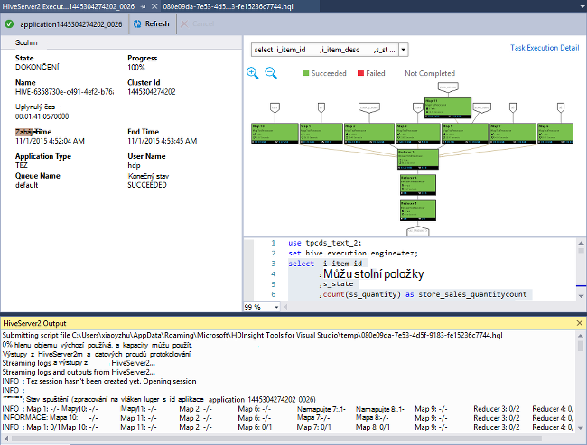
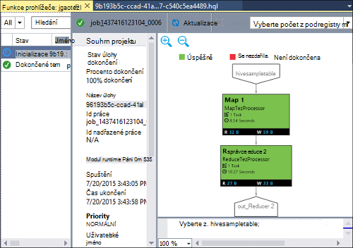

<properties
    pageTitle="Naučte se používat aplikaci Visual Studio Hadoop nástroje pro HDInsight | Microsoft Azure"
    description="Zjistěte, jak nainstalovat a používat aplikace Visual Studio Hadoop nástroje pro HDInsight připojit k obrázku Hadoop a spuštění dotazu podregistru."
    keywords="hadoop nástroje podregistru dotazu visual studio"
    services="HDInsight"
    documentationCenter=""
    tags="azure-portal"
    authors="mumian"
    manager="jhubbard"
    editor="cgronlun"/>

<tags
    ms.service="hdinsight"
    ms.devlang="na"
    ms.topic="get-started-article"
    ms.tgt_pltfrm="na"
    ms.workload="big-data"
    ms.date="08/10/2016"
    ms.author="jgao"/>

# Začínáme s používáním aplikace Visual Studio Hadoop nástroje pro HDInsight ke spuštění dotazu podregistru

Naučte se používat HDInsight Tools for Visual Studio pro připojení k HDInsight clusterů a odesílání podregistru dotazů. Další informace o používání Hdinsightu najdete v článku [Úvod k Hdinsightu] [ hdinsight.introduction] a [začít pracovat s HDInsight][hdinsight.get.started]. Další informace o připojování k bouře obrázku najdete v článku [topologií vyvíjet C# pro Apache bouře na HDInsight pomocí aplikace Visual Studio][hdinsight.storm.visual.studio.tools].

**Zjistit předpoklady pro**

Tento kurz a používat nástroje Hadoop ve Visual Studiu, musíte mít takto:

- Clusteru služby Azure HDInsight: na základě Linux nebo serveru s Windows clusteru budou fungovat s tímto postupem v tomto dokumentu. Viz následující informace týkající se vytváření clusteru:

    - [Začínáme s používáním na základě Linux HDInsight](hdinsight-hadoop-linux-tutorial-get-started.md)
    - [Začínáme s používáním HDInsight serveru s Windows](hdinsight-hadoop-tutorial-get-started-windows.md)

- Pracoviště se následujícím softwarem:

    - Windows 8.1, Windows 8 nebo Windows 7
    - Visual Studio (jedno z následujících verzí):
        - Visual Studio 2013 komunity/Professional/Premium/Ultimate s [Aktualizovat 4](https://www.microsoft.com/download/details.aspx?id=44921)
        - Visual Studio 2015 (komunity a Enterprise)

    >[AZURE.NOTE] V současné době nástroje HDInsight for Visual Studio pouze jsou součástí anglické verzi.

## Instalace nástroje HDInsight for Visual Studio

HDInsight Tools for Visual Studia a Microsoft podregistru ovladač ODBC jsou sbalený s Microsoft Azure SDK verzi pro .NET 2.5.1 nebo novější. Nainstalovat pomocí [Webové platformy](http://go.microsoft.com/fwlink/?LinkId=255386). Je nutné vybrat ten, který shoduje s verzí aplikace Visual Studio. Pokud nemáte nainstalované Visual Studio, můžete nainstalovat nejnovější aplikace Visual Studio komunity a SDK Azure pomocí [Webové platformy](http://go.microsoft.com/fwlink/?LinkId=255386) nebo pomocí následující odkazy:

- [Komunita aplikace Visual Studio 2015 s Microsoft Azure SDK](https://www.microsoft.com/web/handlers/webpi.ashx/getinstaller/VS2015CommunityAzurePack.appids)
- [Komunita aplikace Visual Studio 2013 s Microsoft Azure SDK](https://www.microsoft.com/web/handlers/webpi.ashx/getinstaller/VS2013CommunityAzurePack.appids)
- [Microsoft Azure SDK pro .NET (a 2015)](https://www.microsoft.com/web/handlers/webpi.ashx/getinstaller/VWDOrVs2015AzurePack.appids)
- [Microsoft Azure SDK pro .NET (a 2013)](https://www.microsoft.com/web/handlers/webpi.ashx/getinstaller/VWDOrVs2013AzurePack.appids)

![Nástroje Hadoop: HDinsight Tools for Visual Studio Web platformy.][1]

## Připojení k předplatným Azure
Nástroje HDInsight for Visual Studio umožňuje připojení k HDInsight clusterů, proveďte některé základní Správa operace a spouštění dotazů podregistru.

>[AZURE.NOTE] Informace o připojení k obecný Hadoop obrázku najdete v tématu [napsat a odeslat podregistru dotazů pomocí aplikace Visual Studio](http://blogs.msdn.com/b/xiaoyong/archive/2015/05/04/how-to-write-and-submit-hive-queries-using-visual-studio.aspx).

**Připojení k předplatnému Azure**

1.  Otevřete aplikaci Visual Studio.
2.  V nabídce **Zobrazit** klikněte na položku **Průzkumník serveru** otevřete okno Průzkumníka serveru.
3.  Rozbalte **Azure**a potom rozbalte položku **HDInsight**.

    >[AZURE.NOTE]Všimněte si, že okno **Seznam úkolů HDInsight** by měl být otevřený. Pokud nevidíte, v nabídce **Zobrazit** klikněte na **Ostatní okna** a klikněte na **Okno seznam úkolů HDInsight**.  
4.  Zadejte svoje přihlašovací údaje Azure předplatného a potom klikněte na **Přihlásit**se. Jenom povinné, pokud jste nikdy připojili ke Azure předplatné z aplikace Visual Studio v tomto workstation.
5.  V Průzkumníku serveru zobrazí se seznam existující clusterů HDInsight. Pokud už nemáte žádné clusterů, je možné zajistit pomocí portálu Azure, Azure PowerShell nebo HDInsight SDK. Další informace najdete v tématu [poskytování HDInsight clusterů][hdinsight-provision].

    ![Nástroje Hadoop: HDInsight Tools for Visual Studio Server Explorer clusteru seznamu][5]
6.  Rozbalte HDInsight cluster. Uvidíte **Podregistru databází**, výchozí účet úložiště, propojené úložiště účty a **protokol Hadoop služby**. Dále můžete rozbalit entity.

Po připojení k předplatnému Azure, budete moct provádět následující akce:

**Připojení k portálu Azure pomocí aplikace Visual Studio**

- Z Průzkumníka Server rozbalte **Azure** > **HDInsight**, klikněte pravým tlačítkem myši HDInsight obrázku a potom klikněte na **Spravovat clusteru Azure portálu**.

**Chcete-li klást otázky a názory uživatelů z aplikace Visual Studio**

- V nabídce **Nástroje** klikněte **HDInsight**a klikněte na **Fórum MSDN** pro klást otázky nebo klikněte na **Předat svůj názor**.

## Přejděte propojených zdrojů

Z Průzkumníka serveru zobrazí se výchozí úložiště účet a všechny účty propojené úložiště. Pokud rozdělíte výchozí úložiště účet, uvidíte kontejnery na účtu úložiště. Výchozí úložiště účet a výchozí kontejner označené. Je můžete také kliknout pravým tlačítkem žádné kontejnerů zobrazíte obsah.

![HDInsight Tools for Visual Studio serveru explorer clusteru seznamu][2]

Po openning kontejneru můžete pomocí tlačítek k odeslání, odstranění a stáhnout objektů blob:

## Spuštění dotazu podregistru
[Apache podregistru] [ apache.hive] je infrastruktura data warehouse založená na Hadoop umožňující souhrnu dat, dotazy a analýzy. HDInsight Tools for Visual Studio podporuje pracovního podregistru dotazy z aplikace Visual Studio. Další informace o podregistru, najdete v článku [Použití podregistru s HDInsight][hdinsight.hive].

Je časově náročný otestovat podregistru skript vůči HDInsight obrázku. Může trvat několik minut nebo další. HDInsight Tools for Visual Studio je schopen ověřování podregistru skript místně bez propojovacích ke živé clusteru.

HDInsight Tools for Visual Studio umožňuje uživatelům najdete v článku co je uvnitř úlohy podregistru shromažďování a zobrazení protokolů vláken některých úloh podregistru.

### Zobrazení **hivesampletable**
Všechny HDInsight clusterů jsou součástí ukázkovou tabulku podregistru s názvem *hivesampletable*. Chcete-li zobrazit seznam podregistru tabulek, zobrazení schémata tabulky a seznam řádků v tabulce podregistru použijeme v této tabulce.

**Seznam podregistru tabulek a zobrazení schématu tabulku podregistru**

1.  V systému Windows **Server Explorer**rozbalte **Azure** > **HDInsight** > clusteru podle svého výběru > **Podregistru databázích** > **výchozí** > **hivesampletable** zobrazíte schématu tabulky.
4.  Klikněte pravým tlačítkem myši **hivesampletable**a potom klikněte na **Zobrazení horních 100 řádků** seznam řádky. Rovná se systémem následující dotaz podregistru pomocí ovladač ODBC podregistru:

        SELECT * FROM hivesampletable LIMIT 100

    Můžete přizpůsobit počet řádků.

    ![Nástroje Hadoop: dotaz schéma HDinsight podregistru Visual Studio][6]

### Vytvoření podregistru tabulek

Můžete vytvořit tabulku podregistru nebo použití dotazů podregistru grafického uživatelského rozhraní. Informace o používání podregistru dotazů najdete v tématu [spuštění podregistru dotazů](#run.queries).

**Chcete-li vytvořit tabulku podregistru**

1. V systému Windows **Server Explorer**rozbalte **Azure** > **HDInsight clusterů** HDInsight obrázku > **Podregistru databází**, klikněte pravým tlačítkem **výchozí**a klikněte na **Vytvořit tabulku**.
2. Konfigurace v tabulce.
3. Klikněte na **Vytvořit tabulku** na odeslání úlohy můžete vytvořit novou tabulku podregistru.

    ![Nástroje Hadoop: nástroje hdinsight visual studiu vytvořte tabulku podregistru][7]

### Ověřte a spouštění dotazů podregistru
Vytváření a spouštění dotazů podregistru dvěma způsoby:

- Vytváření ad hoc dotazů
- Vytvoření aplikace podregistru

**Pokud chcete vytvořit, ověřte a spouštění dotazů ad-hoc**

1. V systému Windows **Server Explorer**rozbalte **Azure**a potom rozbalte položku **Clusterů HDInsight**.
2. Klikněte pravým tlačítkem na místo, kam chcete spustit dotaz obrázku a klikněte na **vytvořit dotaz podregistru**.
3. Zadejte podregistru dotazů. Všimněte si, že editoru podregistru podporuje technologii IntelliSense. HDInsight Tools for Visual Studio podporuje načítání vzdálené metadat při úpravách podregistru skriptu. Třeba když zadáte "Klauzuli SELECT * FROM", technologie IntelliSense uvádí všechny navrhované tabulky. Pokud není zadán název tabulky, jsou uvedeny názvy sloupců pomocí technologie IntelliSense. Nástroj podporuje skoro všechny příkazy podregistru DML, poddotazy a integrované funkce definované uživatelem.

    ![Nástroje Hadoop: HDInsight Visual Studio nástroje technologie IntelliSense][13]

    ![Nástroje Hadoop: HDInsight Visual Studio nástroje technologie IntelliSense][14]

    > [AZURE.NOTE] Budou doporučovány pouze metadata clusterů vybraném v panelu nástrojů HDInsight.
4. (Volitelné): klikněte na **Ověřit skript** ke kontrole chyb syntaxe skriptů.

    ![Nástroje Hadoop: hdinsight nástroje místní ověřovacích Visual Studio][10]

4. Klikněte na **Odeslat** nebo **Odeslat (Upřesnit)**. Při použití možnosti Upřesnit odeslat budete konfigurovat **Název projektu**, **argumenty**, **Další konfiguraci**a **Stav adresáře** skriptu:

    ![hdinsight hadoop podregistru dotazu][9]

    Po odeslání úlohy zobrazte okno **Podregistru souhrn projektu** .

    ![Přehled HDInsight Hadoop podregistru dotazu][8]
5. Tlačítko **Aktualizovat** slouží k aktualizaci stavu tak, aby stav úlohy změnil na **Dokončit**.
6. Kliknutím na odkazy v dolní části naleznete v následujícím: **Úlohy dotazu**, **Výstup projektu**, **protokol úloh**nebo **vláken protokolu**.

**Vytvoření a spuštění podregistru řešení**

1. V nabídce **soubor** klikněte na **Nový**a potom klikněte na **projekt**.
2. V levém podokně vyberte **HDInsight** vyberte **Podregistru aplikace** v prostředním podokně, zadejte vlastnosti a potom klikněte na **OK**.

    ![Nástroje Hadoop: nástroje nový projekt podregistru hdinsight visual studio][11]
3. V **Průzkumníku řešení**poklepejte na **Script.hql** a otevřete ho.
4. Ověřit skript podregistru, můžete klikněte na tlačítko **Ověřit skript** nebo klikněte pravým tlačítkem skript v editoru podregistru a potom klikněte na **Ověřit index** v místní nabídce.

### Zobrazit podregistru úlohy
Můžete zobrazit úlohy dotazů, výstup projektu, protokoly úlohy a vláken protokoly pro podregistru úlohy. Další informace najdete v tématu předchozí snímek.

Na nejnovější vydání nástroj umožňuje najdete v článku co je uvnitř podregistru úlohy shromažďování a zobrazení vláken protokoly. Protokol vláken můžete vyšetřování problémy s výkonem. Další informace o tom, jak HDInsight shromažďuje vláken protokoly, získáte [Přístup HDInsight aplikace protokoly programově][hdinsight.access.application.logs].

**Chcete-li zobrazit úlohy podregistru**

1. V systému Windows **Server Explorer**rozbalte **Azure**a potom rozbalte položku **HDInsight**.
2. Klikněte pravým tlačítkem myši HDInsight obrázku a klikněte na **Zobrazit úlohy**. Zobrazí se seznam podregistru úloh, které spustili na clusteru.
3. Klikněte na projektu v seznamu vyberte a pak pomocí okna **Podregistru souhrn projektu** otevřete **Úlohy dotazu**, **Výstup projektu**, **Protokol úloh**nebo **vláken protokolu**.

    ![Nástroje Hadoop: HDInsight Visual Studio Tools zobrazení podregistru úloh][12]

### Rychlejší cestu podregistru spuštění prostřednictvím HiveServer2

>[AZURE.NOTE] Tato funkce funguje jenom na verze obrázku HDInsight 3,2 a novější.

Nástrojích HDInsight používaných odesílat podregistru úlohy pomocí [WebHCat](https://cwiki.apache.org/confluence/display/Hive/WebHCat) (označovaná taky jako Templeton). Trvala dlouho navrácení podrobnosti projektu nebo informace o chybě.
Pokud chcete vyřešit tento problém výkonu, nástroje HDInsight spustí podregistru úlohy přímo clusteru prostřednictvím HiveServer2, tak, aby obchází RDP/SSH.
Kromě lepší výkon uživatelů můžete prohlédnout podregistru Tez grafy a podrobnosti úkolu.

Verze obrázku HDInsight 3,2 nebo novější zobrazí se tlačítko **spustit prostřednictvím HiveServer2** :

Můžete a najdete v článku protokoly streamují zpět v reálném čase jestlil podregistru dotaz je spuštěn v Tez grafy projektu.

**Rozdíl mezi spouštění dotazů přes HiveServer2 a odeslání dotazů přes WebHCat**

I když je spouštění dotazů přes HiveServer2 má mnoho výhod výkonu, obsahuje několik omezení. Některá omezení nejsou vhodné pro použití výroby. V následující tabulce najdete rozdíly:

| |Spuštění prostřednictvím HiveServer2 |Odeslání prostřednictvím WebHCat|
|---|---|---|
|Spouštění dotazů|Eliminuje režijních v WebHCat (který spustí MapReduce úlohu s názvem "TempletonControllerJob").|Dokud spuštění dotazu pomocí WebHCat WebHCat spuštění úlohy MapReduce, která představuje další latence.|
|Protokoly toku zpět|V blízkosti v reálném čase.|Protokoly spuštění úlohy jsou k dispozici pouze v případě, že dokončení projektu.|
|Zobrazení historie úlohy|Pokud dotaz je spuštěn prostřednictvím HiveServer2, není zachována jeho historie úlohy (protokol úloh, výstup projektu). Aplikaci můžete zobrazit v uživatelském rozhraní vláken s omezené informace.|Pokud dotaz je spuštěn prostřednictvím WebHCat, jeho historie úlohy (protokol úloh, úlohy výstup) se zachová a je možné zobrazit pomocí aplikace Visual Studio/HDInsight SDK/Powershellu. |
|Zavření okna|  Spuštění prostřednictvím HiveServer2 způsobem "synchronní" tak systému windows musí obsahovat otevřít; Pokud windows uzavřeny bude zrušen spuštění dotazu.|Odeslání prostřednictvím WebHCat způsobem "asynchronní" abyste mohli odeslat dotaz prostřednictvím WebHCat a zavřete Visual Studio. Můžete vrátit a uvidíte výsledky kdykoli.|

### Graf výkonu tez podregistru projektu

Podpora HDInsight Visual Studio Tools zobrazující výkonu grafy pro úlohy podregistru spustili modulem spuštění Tez. Informace o povolení Tez najdete v tématu [použití podregistru v HDInsight][hdinsight.hive]. Po odeslání podregistru úlohy ve Visual Studiu Visual Studio se dozvíte, zobrazí se v grafu dokončení projektu.  Možná budete muset klikněte na tlačítko **Aktualizovat** nejnovější stav projektu.

> [AZURE.NOTE] Tato funkce je dostupný jenom u verze obrázku HDInsight nad 3.2.4.593 a můžete jenom pracovní zátěž: dokončené práce (Pokud jste odeslali práce prostřednictvím WebHCat; tento graf se zobrazí po spuštění dotazu pomocí HiveServer2). To funguje pro oba Windows a Linux na základě clusterů.

Které vám pomohou porozumět dotazu podregistru lépe, nástroj Přidat zobrazení podregistru operátor v této verzi. Stačí dvakrát klikněte na vrcholy grafu úlohy a zobrazí se všechny operátory uvnitř na vrchol obrazce. I když najedete na konkrétní operátor zobrazíte další podrobnosti o tento operátor.

### Provádění úkolů pro podregistru Tez úloh

Zobrazení provádění úloh podregistru na Tez úlohy lze použít k získání strukturovanými a vizualizovat informace pro podregistru úlohy a získání dalších podrobností projektu. Pokud jsou některé problémy s výkonem, můžete zobrazení získání dalších podrobností. Například fungování každého úkolu a podrobné informace o jednotlivých úkolech (dat pro čtení i zápis, plán/počáteční a koncový čas, atd.), takže můžete doladit konfigurace projektu nebo architektura systému podle visualized informací.

## Spustit skripty Prasátko

HDInsight Tools for Visual Studio podporuje vytvoření a odeslání Prasátko skriptů clusterů HDInsight. Uživatele můžete vytvořit Prasátko projektu ze šablony a odešlete skript clusterů HDInsight.

## Známé problémy a názory

- HiveServer2 výsledky jsou aktuálně zobrazeny způsobem běžný text, který není ideální. Pracujeme na řešení, která.

- Pokud jsou výsledky spuštěný s hodnoty NULL, aktuálně výsledky se nezobrazují. Pracujeme mít podařilo odstranit problém, pokud jsou blokovány o tomto problému neváhejte pošlete nám e-mailu nebo kontaktujte tým podpory.

- Skript HQL vytvořené pomocí aplikace Visual Studio zakódovaný v závislosti na nastavení místní oblasti uživatele. Nemusí spustit správně Pokud uživatel odešle skript clusteru jako binární.

Pokud máte nápady nebo názory nebo pokud jste používání narazíte na problémy při použití tohoto nástroje, neváhejte upusťte nám e-mailu na hdivstool v microsoft tečka cz.

## Další kroky
V tomto článku jste se naučili jak se připojit k HDInsight clusterů z aplikace Visual Studio pomocí nástroje balíček Hadoop a k tomu podregistru dotazu. Další informace najdete v tématu:

- [Použití Hadoop podregistru v HDInsight][hdinsight.hive]
- [Začínáme s používáním Hadoop v HDInsight][hdinsight.get.started]
- [Odeslat Hadoop úlohy v HDInsight][hdinsight.submit.jobs]
- [Analýza dat Twitter pomocí Hadoop v HDInsight][hdinsight.analyze.twitter.data]

<!--Anchors-->
[Installation]: #installation
[Connect to your Azure subscription]: #connect-to-your-azure-subscription
[Navigate the linked resources]: #navigate-the-linked-resources
[Run Hive queries]: #run-hive-queries
[Next steps]: #next-steps

<!--Image references-->
[1]: ./media/hdinsight-hadoop-visual-studio-tools-get-started/hdinsight.visual.studio.tools.wpi.png
[2]: ./media/hdinsight-hadoop-visual-studio-tools-get-started/hdinsight.visual.studio.tools.linked.resources.png
[5]: ./media/hdinsight-hadoop-visual-studio-tools-get-started/hdinsight.visual.studio.tools.server.explorer.png
[6]: ./media/hdinsight-hadoop-visual-studio-tools-get-started/hdinsight.visual.studio.tools.hive.schema.png
[7]: ./media/hdinsight-hadoop-visual-studio-tools-get-started/hdinsight.visual.studio.tools.create.hive.table.png
[8]: ./media/hdinsight-hadoop-visual-studio-tools-get-started/hdinsight.visual.studio.tools.run.hive.job.summary.png
[9]: ./media/hdinsight-hadoop-visual-studio-tools-get-started/hdinsight.visual.studio.tools.submit.jobs.advanced.png
[10]: ./media/hdinsight-hadoop-visual-studio-tools-get-started/hdinsight.visual.studio.tools.validate.hive.script.png
[11]: ./media/hdinsight-hadoop-visual-studio-tools-get-started/hdinsight.visual.studio.tools.new.hive.project.png
[12]: ./media/hdinsight-hadoop-visual-studio-tools-get-started/hdinsight.visual.studio.tools.view.hive.jobs.png
[13]: ./media/hdinsight-hadoop-visual-studio-tools-get-started/hdinsight.visual.studio.tools.intellisense.table.names.png
[14]: ./media/hdinsight-hadoop-visual-studio-tools-get-started/hdinsight.visual.studio.tools.intellisense.column.names.png

<!--Link references-->
[hdinsight-provision]: hdinsight-provision-clusters.md
[hdinsight.introduction]: hdinsight-hadoop-introduction.md
[hdinsight.get.started]: hdinsight-hadoop-linux-tutorial-get-started.md
[hdinsight.hive]: hdinsight-use-hive.md
[hdinsight.submit.jobs]: hdinsight-submit-hadoop-jobs-programmatically.md
[hdinsight.analyze.twitter.data]: hdinsight-analyze-twitter-data.md
[hdinsight.storm.visual.studio.tools]: hdinsight-storm-develop-csharp-visual-studio-topology.md
[hdinsight.access.application.logs]: hdinsight-hadoop-access-yarn-app-logs.md

[apache.hive]: http://hive.apache.org
