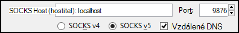

<properties
pageTitle="Umožňuje SSH Tunneling přístup k webu Ambari uživatelského rozhraní, ResourceManager, JobHistory, NameNode, Oozie a jiným webovým uživatelské rozhraní na"
description="Naučte se používat SSH tunelem bezpečně procházet webech hostovaných na základě Linux HDInsight uzlů."
services="hdinsight"
documentationCenter=""
authors="Blackmist"
manager="jhubbard"
editor="cgronlun"/>

<tags
ms.service="hdinsight"
ms.devlang="na"
ms.topic="article"
ms.tgt_pltfrm="na"
ms.workload="big-data"
ms.date="10/17/2016"
ms.author="larryfr"/>

# Použití SSH Tunneling pro přístup k webu Ambari uživatelského rozhraní JobHistory, NameNode, Oozie a jiným webovým uživatelské rozhraní na

Na základě Linux clusterů HDInsight poskytnutí přístupu na web Ambari uživatelské rozhraní přes Internet, ale nebudou některé funkce uživatelského rozhraní. Například webu uživatelského rozhraní pro dalších službách, které jsou vytažená prostřednictvím Ambari. Funkce webu Ambari uživatelského rozhraní je nutné použít SSH tunelem do záhlaví obrázku.

## Co vyžaduje SSH tunelem?

Některé z nabídky Ambari nebude naplnění plně bez SSH tunelem, jako jsou závislé na weby a služby vystaveným jiných Hadoop služeb spuštěných clusteru. Často nejsou zabezpečená těchto webů, takže není bezpečný přímo vystavit na Internetu. Někdy službu spustí web na jiný clusteru například uzel Zookeeper.

Služby, které používá Ambari web uživatelského rozhraní, které nemají přístup k bez SSH tunelem jsou následující:

* JobHistory,
* NameNode,
* Vlákna hromádek
* Web Oozie uživatelského rozhraní
* Hlavní HBase a protokoly uživatelského rozhraní

Pokud používáte akce skriptu přizpůsobit svůj cluster, služby nebo nástroje pro instalované zaznamenávající web uživatelského rozhraní budou vyžadovat SSH tunelem. Například nainstalujete odstín pomocí skriptu akce, musíte pomocí SSH tunelem přístup k webu odstín uživatelského rozhraní.

## Co je SSH tunelem?

[Zabezpečené prostředí (SSH) tunneling](https://en.wikipedia.org/wiki/Tunneling_protocol#Secure_Shell_tunneling) přesměrovává přenosy odeslané na port na místním počítači, přes připojení k SSH HDInsight hlavy uzel clusteru, kde žádost potom vyřeší jako by bylo provedeno na uzel hlavy. Odpověď na je nedefinujete zpět tunelem k počítači.

## Zjistit předpoklady pro

Při použití SSH tunelem přenosů web, musíte mít takto:

* SSH klienta. Distribuce Linux a Unix nebo Macintosh OS X `ssh` příkaz je součástí operačního systému. Pro systém Windows doporučujeme [nátěrové](http://www.chiark.greenend.org.uk/~sgtatham/putty/download.html)

    > [AZURE.NOTE] Pokud budete chtít používat klienta SSH jiné než `ssh` nebo nátěrové, najdete v dokumentaci k svému klientovi na tom, jak vytvořit SSH tunelem.

* Webový prohlížeč, který může být nakonfigurované pro použití proxy serveru SOCKS

## Vytvoření tunelem pomocí příkazu SSH

Pomocí následujícího příkazu Vytvořit SSH tunelu pomocí `ssh` příkaz. Nahraďte uživatel SSH pro svůj cluster HDInsight __uživatelské jméno__ a __NÁZEV_CLUSTERU__ nahraďte názvem HDInsight obrázku

    ssh -C2qTnNf -D 9876 USERNAME@CLUSTERNAME-ssh.azurehdinsight.net

Tím vytvoříte připojení, který přesměrovává přenosy na místní port 9876 clusteru přes SSH. Tyto možnosti jsou:

* **D 9876** - místního portu, které budou směrovat přenosy v síti tunelem.

* **C** - komprimovat všechna data, protože webový přenos je většinou text.

* **2** – vyšší SSH zkusit protokol pouze verze 2.

* **otázky** – bezobslužný režim.

* **T** - rozdělení pseudo tty zakázat, protože jsme jenom přeposíláte port.

* **n** - zabránit čtení standardního, protože jsme jenom přeposíláte portu.

* **N** – spuštění vzdáleného příkazu, protože jsme jenom přeposíláte portu.

* **f** - běží na pozadí.

Pokud jste nakonfigurovali clusteru klíčem SSH, může být nutné použít `-i` parametr a zadejte cestu k privátním klíčem SSH.

Po dokončení příkaz přenosů na port 9876 v místním počítači bude směrovaná přes Sockets Layer SSL (Secure) do clusteru sídlo uzel a zdá se, že pocházejí.

## Vytvoření tunelem pomocí nátěrové

Pomocí následujících kroků k vytvoření SSH tunelem pomocí nátěrové.

1. Otevřete nátěrové a zadejte informace o připojení. Pokud znáte není nátěrové, přečtěte si článek [Použití SSH s Hadoop Linux založené na HDInsight z Windows](hdinsight-hadoop-linux-use-ssh-windows.md) informace o tom, jak ho použít s HDInsight.

2. V části **kategorie** nalevo od dialogového okna rozbalte **připojení**, rozbalte **SSH**a vyberte **tunelů**.

3. Ve formuláři **Možnosti řízení SSH port předávání** zadejte následující informace:

    * **Zdrojový port** - port na straně klienta, který chcete předat dál. Například **9876**.

    * **Určení** – SSH adresu na základě Linux HDInsight clusteru. Například **ssh.azurehdinsight.net clusteru**.

    * **Dynamické** – umožňuje dynamické proxy serveru SOCKS směrování.

    

4. Kliknutím na **Přidat** přidejte nastavení a potom klikněte na **Otevřít** otevřete SSH připojení.

5. Po zobrazení výzvy, přihlaste se k serveru. Tím vytvořit relaci SSH a povolit tunelem.

## Použití tunelem z prohlížeče

> [AZURE.NOTE] Postup v této části pomocí prohlížeče FireFox, jako je zdarma systémy Linux, Unix, Macintosh OS X a Windows. Další moderní prohlížečů podporujících pomocí SOCKS proxy budou fungovat stejně.

1. Prohlížeč nakonfigurujte pro použití **localhost:9876** jako **verze 5 SOCKS** proxy. Tady je nastavení Firefox vypadat takto. Pokud jste použili jiný port než 9876, změňte číslo portu tu, kterou jste použili:

    

    > [AZURE.NOTE] Výběr **Vzdálené DNS** vyřeší požadavky na systém DNS (Domain Name) pomocí clusteru HDInsight. Pokud to není vybrána, bude DNS místně přeložit.

2. Ověřte, že přenosy směrovány tunelem tak, že vising na webu, jako [http://www.whatismyip.com/](http://www.whatismyip.com/) s nastavením proxy serveru povolit nebo zakázat v prohlížeči Firefox. Při nastavení jsou povoleny, IP adresu budou pro počítač v Microsoft Azure datacentra.

##Ověření pomocí webového Ambari uživatelského rozhraní

Po vytvořila clusteru ověřte, jestli se mají přístup k webové služby UI z webu Ambari pomocí následujících kroků:

1. V prohlížeči přejděte na http://headnodehost:8080. `headnodehost` Adres odešle myší tunelem clusteru a překládal headnode, která Ambari běží na. Po zobrazení výzvy zadejte uživatelské jméno správce (Správci) a heslo pro svůj cluster. Můžete být vyzváni podruhé prostřednictvím webu Ambari uživatelského rozhraní. Pokud ano, znovu zadejte informace.
    
    > [AZURE.NOTE] Pokud chcete použít adresu http://headnodehost:8080 připojení k clusteru, se připojujete přímo nad tunelem hlavy uzlu Ambari při práci pomocí protokolu HTTP a je zabezpečená komunikace pomocí tunelem SSH. Při připojení přes internet bez použití tunelem, je zabezpečená komunikace pomocí HTTPS. Připojení přes internet pomocí HTTPS, můžete https://CLUSTERNAME.azurehdinsight.net, kde __NÁZEV_CLUSTERU__ je název clusteru.

2. V uživatelském rozhraní Ambari Web vyberte v seznamu na levé straně stránky HDFS.

    

3. Až se zobrazí informace o služeb HDFS, vyberte __Odkazy__. Zobrazí se seznam hlavy uzlů. Vyberte jeden z hlavy uzlů a pak vyberte __NameNode uživatelského rozhraní__.

    

    > [AZURE.NOTE] Pokud máte pomalé připojení k Internetu nebo hlavou uzel je velmi zaneprázdněn, při se může zobrazit indikátor čekání místo nabídky vyberte __Odkazy__. Pokud ano, počkejte chvíli jednu až dvě pro data do dostali ze serveru a pak to zkuste znova seznamu.
    >
    > Pokud máte nižší monitor s rozlišením nebo není maximalizovat okno prohlížeče, některé položky v nabídce __Rychlé odkazy__ může být oříznutí tak, že pravé straně obrazovky. Pokud ano, rozbalte nabídku pomocí myši a potom pomocí klávesy šipka vpravo se posuňte obrazovku doprava zobrazíte zbytek nabídky.

4. By měla vypadat podobně jako tento stránky:

    

    > [AZURE.NOTE] Všimněte si adresu URL pro tuto stránku; by měl být stejný ____http://hn1-CLUSTERNAME.randomcharacters.cx.internal.cloudapp.net:8088/clusteru. Používá vnitřní plně kvalifikovaný název domény (FQDN) uzlu a není k dispozici bez použití SSH tunelem.

## Další kroky

Teď, když jste se naučili vytvoření a použití SSH tunelem, najdou informace o sledování a správa svůj cluster pomocí Ambari:

* [Správa clusterů HDInsight pomocí Ambari](hdinsight-hadoop-manage-ambari.md)

Další informace o použití SSH s Hdinsightu najdete v těchto článcích:

* [Použití SSH s Hadoop Linux založené na HDInsight z Linux, Unix nebo OS X](hdinsight-hadoop-linux-use-ssh-unix.md)

* [Použití SSH s Hadoop Linux založené na HDInsight z Windows](hdinsight-hadoop-linux-use-ssh-windows.md)
