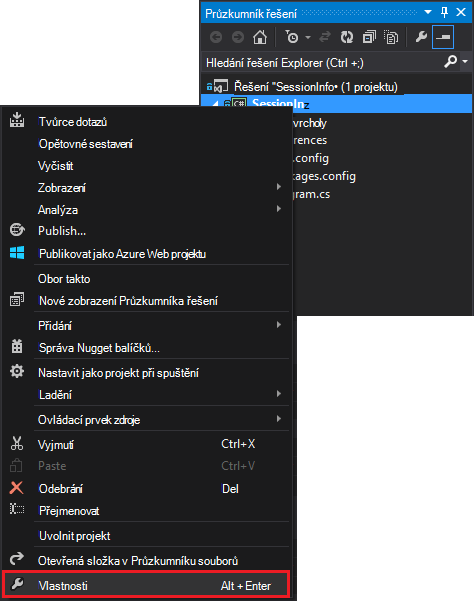
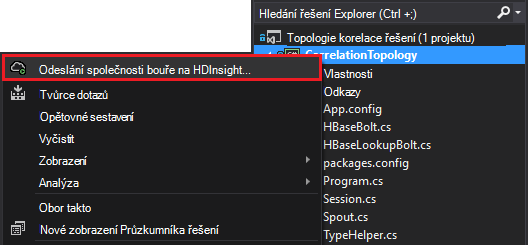

<properties
 pageTitle="Sladit událostí v čase s bouře a HBase na HDInsight"
 description="Naučte se koordinaci události, které se ukládají v různou pomocí bouře a HBase na HDInsight."
 services="hdinsight"
 documentationCenter=""
 authors="Blackmist"
 manager="jhubbard"
 editor="cgronlun"
 tags="azure-portal"/>

<tags
 ms.service="hdinsight"
 ms.devlang="dotnet"
 ms.topic="article"
 ms.tgt_pltfrm="na"
 ms.workload="big-data"
 ms.date="10/27/2016"
 ms.author="larryfr"/>

# Sladit událostí v čase s bouře a HBase na HDInsight

Pomocí úložiště trvalý dat s Apache bouře můžete porovnat údaje, které se ukládají ve stejnou dobu. Například propojení přihlášení a odhlášení událostí pro relaci uživatele k výpočtu, jak dlouho činí relace.

V tomto dokumentu se dozvíte, jak vytvořit základní topologie C# bouře, která sleduje přihlášení a odhlášení události relací uživatelů a vypočítá dobu trvání relace. Topologie použije HBase jako trvalý úložiště. HBase umožňuje provádět dávku dotazy na historické data, která chcete vytvořit další přehledy ATP kolik uživatelských relací byly spuštění ukončena během určitého časového období.

## Zjistit předpoklady pro

- Visual Studia a nástroje HDInsight for Visual Studio: informace najdete v tématu [Začínáme používat nástroje HDInsight for Visual Studio](../HDInsight/hdinsight-hadoop-visual-studio-tools-get-started.md) instalace.

- Apache bouře na HDInsight clusteru (serveru s Windows). Tím spustíte topologii bouře, zpracuje příchozí data, která jsou uložená na HBase.

    > [AZURE.IMPORTANT] Během SCP.NET topologií jsou podporovány na základě Linux bouře clusterů vytvořené po 10/28/2016, SDK HBase .NET balíčku dostupný od 10/28/2016 nefunguje správně na Linux.

- Apache HBase HDInsight clusteru (Linux nebo serveru s Windows). Toto je úložiště dat v tomto příkladu.

## Architektura

Srovnávací události vyžaduje obecný identifikátor pro zdroj události. For example ID uživatele, ID relace nebo jiný druh data, která jsou) jedinečný a b) součástí všechna data posílat bouře. V tomto příkladu je hodnota GUID představující ID relace.

V tomto příkladě se skládá ze dvou HDInsight clusterů:

-   HBase: trvalá úložiště pro historických dat

-   Bouře: slouží k jedí příchozí data

Data náhodně generovaných topologii bouře a se skládá z následujících položek:

-   ID relace: identifikátor GUID, který jednoznačně identifikuje každý relace

-   Události: zahájení nebo dokončení událost nastavit jako. V tomto příkladu START dochází vždy před KONCEM

-   Čas: čas události.

Tato data jsou zpracovány a uložené v HBase.

### Topologie bouře

Po spuštění relace s **Počáteční** událost dostali topologii a přihlášení k lyncu k HBase. Po přijetí **KONCOVÁ** událost topologie načte **Počáteční** událost a přepočtu časový interval mezi dvěma události. Tato hodnota **doby trvání** je pak uložena v HBase spolu s informacemi o **ukončení** události.

> [AZURE.IMPORTANT] Během této topologie ukazuje základní vzorku, výrobní řešení by potřeba přijmout návrh v následujících situacích:
>
> - Události příchozí mimo pořadí
> - Duplicitní události
> - Přerušená události

Topologie ukázka se skládá z těchto složek:

-   Session.cs: napodobuje relaci uživatele tak, že vytvoříte ID náhodné relace, počáteční čas a jak dlouho bude trvat relace

-   Spout.cs: Vytvoří 100 relace, posílá počáteční událost, čeká náhodné časový limit pro každou relaci a posílá KONCOVÁ událost. Potom recykluje ukončí osobně generovat nové.

-   HBaseLookupBolt.cs: použije ID relace k vyhledání informací o relaci z HBase. Při zpracování KONCOVÁ událost najde odpovídající událost zahájení a vypočítá dobu trvání relace.

-   HBaseBolt.cs: Ukládá informace do HBase.

-   TypeHelper.cs: Pomáhá slouží k převodu typu při čtení a zápis HBase.

### Schéma HBase

V HBase uložení dat v tabulce s následující schéma/nastavení:

-   Řádek klíč: relace ID slouží jako klíč pro řádky v této tabulce

-   Sloupec řady: příjmení je "cf". Jsou uložené v této skupině sloupce:

    -   události: zahájení nebo dokončení

    -   čas: čas v milisekundách, které události

    -   Doba trvání: vzdálenost mezi zahájení a ukončení události

-   VERZE: rodinu "cf" je nastavený na uchovávání 5 verzích každý řádek

    > [AZURE.NOTE] Jsou protokol předchozí hodnot uložených jako klíč konkrétní řádek. Ve výchozím nastavení HBase pouze hodnotu v nejnovější verzi řádku. V tomto případě do stejného řádku se používá pro každou verzí řádek je určen hodnotu časového razítka všechny události (začátek, konec.). To nabízí historické zobrazení událostí přihlášení k lyncu pro konkrétní ID.

## Stáhněte si projektu

Ukázka projektu můžete stáhnout z [https://github.com/Azure-Samples/hdinsight-storm-dotnet-event-correlation](https://github.com/Azure-Samples/hdinsight-storm-dotnet-event-correlation).

Tento soubor ke stažení obsahuje následující projekty C#:

-   CorrelationTopology: C# bouře topologie náhodně posílá zahájení a ukončení události relací uživatelů. Každá relace trvá od 1 do 5 minut.

-   SessionInfo: C# konzoly aplikace, která vytvoří tabulku HBase a poskytuje příklad dotazy k vrácení informací o data uložená relace.

## Vytvoření tabulky

1. Otevřete projekt **SessionInfo** ve Visual Studiu.

2. V **Okně Průzkumník**projektu **SessionInfo** klikněte pravým tlačítkem myši a vyberte **Vlastnosti**.

    

3. Vyberte **Nastavení**a pak nastavte následující hodnoty:

    -   HBaseClusterURL: adresa URL obrázku HBase. Například https://myhbasecluster.azurehdinsight.net

    -   HBaseClusterUserName: Správce/HTTP uživatelský účet pro svůj cluster

    -   HBaseClusterPassword: heslo k uživatelskému účtu správce/HTTP

    -   HBaseTableName: název tabulky použít v tomto příkladu

    -   HBaseTableColumnFamily: Sloupce Příjmení

    

5. Spusťte řešení. Po zobrazení výzvy vyberte klávesu "c" na svůj cluster HBase vytvořit tabulku.

## Vytvořte a nasaďte topologii bouře

1.  Otevřete **CorrelationTopology** řešení ve Visual Studiu.

2.  V **Okně Průzkumník řešení**klikněte pravým tlačítkem myši na projekt **CorrelationTopology** a vyberte vlastnosti.

3.  V okně Vlastnosti klikněte na **Nastavení** a zadejte následující informace. První 5 by měl být stejné hodnoty používané v **SessionInfo** projektu:

    -   HBaseClusterURL: adresa URL obrázku HBase. Například https://myhbasecluster.azurehdinsight.net

    -   HBaseClusterUserName: Správce/HTTP uživatelský účet pro svůj cluster

    -   HBaseClusterPassword: heslo k uživatelskému účtu správce/HTTP

    -   HBaseTableName: název tabulky použít v tomto příkladu. Tento by měl obsahovat stejný název tabulky jako použitého v SessionInfo projektu

    -   HBaseTableColumnFamily: Sloupce Příjmení. Tento by měl obsahovat stejný název rodiny sloupce jako používaného v aplikaci project SessionInfo

    > [AZURE.IMPORTANT] Se nemění HBaseTableColumnNames, jako jsou výchozí hodnoty jsou názvy používané **SessionInfo** k načtení dat.

4.  Uložení vlastnosti a potom vytvořit projekt.

5.  V **Okně Průzkumník řešení**klikněte pravým tlačítkem myši projektu a vyberte **Odeslat bouře na HDInsight**. Pokud se zobrazí výzva, zadejte její přihlašovací údaje Azure předplatné.

    

6.  V dialogovém okně **Odeslat topologie** vyberte bouře clusteru, který se spustí tato topologie.

    > [AZURE.NOTE] Při prvním odeslání topologii, může trvat několik sekund, než načtení názvu clusterů HDInsight.

7.  Jakmile topologii byl nahrané a odesílání do clusteru, **Bouře topologie zobrazení** otevřete a zobrazte pracovního topologie. Vyberte **CorrelationTopology** a použijte tlačítko Aktualizovat na horním rohu stránky aktualizovat informace topologie.

    

    Při generování dat, nebude zahájen topologii, hodnotu ve sloupci **Emitted** zvýší.

    > [AZURE.NOTE] Pokud **Bouře topologie zobrazení** automaticky neotevře, použijte a otevřete ho podle těchto kroků:
    >
    > 1. V **Okně Průzkumník**rozbalte **Azure**a potom rozbalte položku **HDInsight**.
    >
    > 2. Klikněte pravým tlačítkem myši bouře obrázku, který topologii běží v a vyberte **Zobrazení bouře topologií**

## Dotaz na data

Po vyzařovaného dat pomocí následujících kroků k vytvoření dotazu data.

1. Vraťte se do **SessionInfo** projektu. Pokud není spuštěná spuštění nové instance od něj.

2. Po zobrazení výzvy vyberte **s** vyhledat počáteční událost. Zobrazí se výzva k zadání počátečního a koncového času definovat časový rozsah – pouze události mezi těmito dvěma časovými hodnotami, bude vrácena.

    Použijte při zadávání počátečního a koncového času v tomto formátu: hh: mm a "m" nebo "odp.". Příklad 11:20 odp.

    Protože topologii začíná, použití času zahájení než byl používaný a koncový čas nyní. To měli zachytit většina START události, které byly přihlášení vygenerované při spuštění. Při spuštění dotazu by se zobrazí seznam položek podobná této:

        Session e6992b3e-79be-4991-afcf-5cb47dd1c81c started at 6/5/2015 6:10:15 PM. Timestamp = 1433527820737

Hledání pro konec události funguje stejně jako začátek události. KONCOVÉ události se však vytvářejí náhodně od 1 do 5 minut po zahájení události. Takže možná bude potřeba vyzkoušejte několik časového rozsahu abyste našli koncové události. KONCOVÉ události bude obsahovat také trvání relace - rozdíl mezi události čas zahájení a čas ukončení události. Tady je příklad dat pro konec události:

    Session fc9fa8e6-6892-4073-93b3-a587040d892e lasted 2 minutes, and ended at 6/5/2015 6:12:15 PM

> [AZURE.NOTE] Časových hodnot, které zadáte v průběhu místní čas, dobu vráceno z dotazu budou UTC.

##Ukončení topologie

Až budete chtít přestat topologii, vraťte se do projektu **CorrelationTopology** ve Visual Studiu. V **Zobrazení topologie bouře**topologii a potom použijte tlačítko **Ukončit** v horní části zobrazení topologie.

##Odstranění svůj cluster

[AZURE.INCLUDE [delete-cluster-warning](../../includes/hdinsight-delete-cluster-warning.md)]

##Další kroky

Další příklady bouře najdete v článku [Příklad topologie pro bouře na HDInsight](hdinsight-storm-example-topology.md).
 
