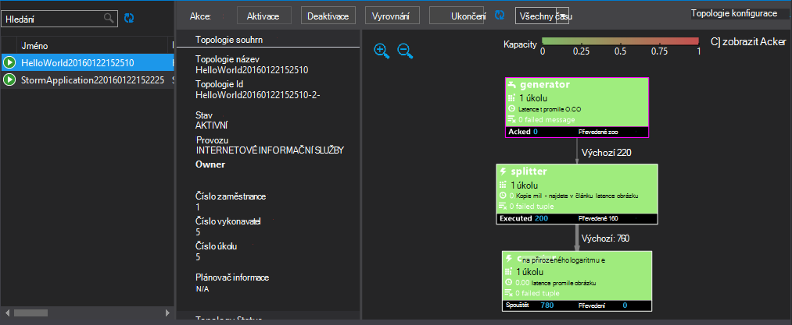

<properties
   pageTitle="Nasazením a správou Apache bouře topologií na HDInsight | Microsoft Azure"
   description="Naučte se nasadit, sledování a správa Apache bouře topologií na řídicím panelu bouře HDInsight. Použití Hadoop tools for Visual Studio."
   services="hdinsight"
   documentationCenter=""
   authors="Blackmist"
   manager="jhubbard"
   editor="cgronlun"
    tags="azure-portal"/>

<tags
   ms.service="hdinsight"
   ms.devlang="java"
   ms.topic="article"
   ms.tgt_pltfrm="na"
   ms.workload="big-data"
   ms.date="10/11/2016"
   ms.author="larryfr"/>

#Nasazením a správou Apache bouře topologií na serveru s Windows HDInsight

Řídicí panel bouře umožňuje snadno nasazení a spusťte Apache bouře topologií clusteru HDInsight pomocí webového prohlížeče. Sledování a správa pracovního topologií můžete na řídicím panelu. Pokud používáte Visual Studiu, nástroje HDInsight for Visual Studio poskytují podobné funkce ve Visual Studiu.

Řídicí panel bouře a funkce bouře v nástrojích HDInsight spolehnout bouře REST API, která slouží k vytvoření vlastního sledování a řešení pro správu.

> [AZURE.IMPORTANT] Kroky v tomto dokumentu vyžadují serveru s Windows bouře clusteru HDInsight. Informace o použití na základě Linux obrázku najdete v tématu [nasazení a správu Apache bouře topologií na základě Linux HDInsight](hdinsight-storm-deploy-monitor-topology-linux.md)

##Zjistit předpoklady pro

* **Apache bouře na HDInsight** - naleznete v tématu <a href="../hdinsight-storm-getting-started/" target="_blank">Začínáme s Apache bouře na HDInsight</a> kroky k vytvoření clusteru

* **Řídicí panel bouře**: moderní webového prohlížeče, který podporuje HTML5

* Pro **Visual Studio** - Azure SDK 2.5.1 nebo novější a nástrojích HDInsight for Visual Studio. Najdete v článku <a href="../hdinsight-hadoop-visual-studio-tools-get-started/" target="_blank">Začínáme s používáním HDInsight Tools for Visual Studio</a> můžete nainstalovat a nakonfigurovat nástroje HDInsight for Visual Studio.

    Jedna z následujících verzích aplikace Visual Studio:

    * Visual Studio 2012 s <a href="http://www.microsoft.com/download/details.aspx?id=39305" target="_blank">Aktualizovat 4</a>

    * Visual Studio 2013 s <a href="http://www.microsoft.com/download/details.aspx?id=44921" target="_blank">aktualizace 4</a> nebo <a href="http://go.microsoft.com/fwlink/?LinkId=517284" target="_blank">Visual Studio 2013 komunity</a>

    * <a href="http://visualstudio.com/downloads/visual-studio-2015-ctp-vs" target="_blank">Visual Studio 2015 CTP6</a>

    > [AZURE.NOTE] Nástroje HDInsight for Visual Studio momentálně podporují pouze bouře verze obrázku HDInsight 3,2.

##Řídicí panel bouře

Řídicí panel bouře je k dispozici na svůj cluster bouře webové stránky. Adresa URL je **https://&lt;Název_clusteru >.azurehdinsight.net/**, kde **název_clusteru** je název vaší bouře clusteru HDInsight.

V horní části řídicího panelu bouře vyberte **Odeslat topologie**. Postupujte podle pokynů na stránce spustit topologie vzorku nebo odeslat a spusťte topologie, který jste vytvořili.

![Odeslat stránku topologii][storm-dashboard-submit]

###Bouře uživatelského rozhraní

Na řídicím panelu bouře výběrem odkazu **Bouře uživatelského rozhraní** . Zobrazí se informace o clusteru kromě pracovního topologií.

![uživatelské rozhraní bouře][storm-dashboard-ui]

> [AZURE.NOTE] V některých verzích Internet Exploreru můžete zjistit, uživatelské rozhraní bouře Neaktualizovat poté, co jste ji nejdřív navštívili. Například to se nemusí zobrazit nové topologií jste odeslali nebo ho může zobrazit topologie jako aktivní při dříve deaktivovat. Společnost Microsoft známa tohoto problému a pracuje na řešení.

####Hlavní stránky

Hlavní stránky uživatelského rozhraní bouře poskytuje následující údaje:

* **Shluk souhrnné**: základní informace o bouře obrázku.

* **Topologie souhrnné**: seznam spuštěných topologií. Pomocí odkazů v této části zobrazíte další informace o konkrétních topologií.

* **Správce souhrnné**: informace o bouře správce.

* **Konfigurace nimbus**: Konfigurace Nimbus clusteru.

####Topologie souhrn

Výběr odkazu z části **topologie souhrnné** zobrazí tyto informace o topologii:

* **Topologie souhrnné**: základní informace o topologii.

* **Topologie akce**: Správa akce, které můžete provádět pro topologii.

    * **Aktivace**: životopisy zpracování deaktivovaný topologie.

    * **Deaktivovat**: Pozastaví pracovního topologie.

    * **Vyrovnání**: upraví paralelismus topologii. Průběžný topologií by měl vyrovnání po změně počtu uzlů v clusteru. Díky topologii upravte paralelismus pro zvýšení nebo snížení počtu uzlů v clusteru.

        Další informace najdete v tématu <a href="http://storm.apache.org/documentation/Understanding-the-parallelism-of-a-Storm-topology.html" target="_blank">Princip paralelismus bouře topologie</a>.

    * **Odstranění**: ukončí bouře topologie po zadaný časový limit.

* **Topologie stat**: statistických údajů o topologii. Chcete-li nastavit časový rámec pro zbývající položky na stránce pomocí odkazů ve sloupci **okna** .

* **Spouts**: spouts používaný topologii. Chcete-li zobrazit další informace o konkrétních spouts pomocí odkazů v této části.

* **Bolts**: prvky používaný topologii. Chcete-li zobrazit další informace o konkrétní prvky pomocí odkazů v této části.

* **Topologie konfigurace**: Konfigurace aplikace vybrané topologie.

####Hubičky a blesku souhrn

Výběr hubičkou z části **Spouts** nebo **Bolts** zobrazí tyto informace o vybrané položky:

* **Součásti souhrnné**: základní informace o hubičky nebo blesku.

* **Hubičky/blesku stat**: statistických údajů o hubičky nebo blesku. Chcete-li nastavit časový rámec pro zbývající položky na stránce pomocí odkazů ve sloupci **okna** .

* **Vstupní stat** (pouze šroubu): informace o zadávání datových proudů využívané šroubu.

* **Výstup stat**: informace o datových proudů které to spout nebo šroubu.

* **Vykonavatelů**: informace o výskyty hubičky nebo blesku. Vyberte položku **Port** pro konkrétní vykonavatel protokol diagnostické informace pro tuto instanci mohou prohlížet.

* **Chyby**: všechny informace o chybě pro tuto spout nebo šroubu.

##HDInsight Tools for Visual Studio

V sekci nástroje HDInsight mohou sloužit k odeslání C# nebo hybridní topologií bouře clusteru. Následující postup používá ukázkový aplikace. Informace o vytváření vlastních topologií pomocí nástroje Hdinsightu najdete v tématu [vyvíjet C# topologií pomocí nástroje HDInsight for Visual Studio](hdinsight-storm-develop-csharp-visual-studio-topology.md).

Pomocí následujících kroků nasazení výběru bouře HDInsight clusteru, a pak zobrazovat a spravovat topologii.

1. Pokud jste nenainstalovali nejnovější verzi nástroje HDInsight for Visual Studio, přečtěte si článek <a href="../hdinsight-hadoop-visual-studio-tools-get-started/" target="_blank">Začínáme s používáním HDInsight Tools for Visual Studio</a>.

2. Otevřete aplikaci Visual Studio, vyberte **soubor** > **Nový** > **projektu**.

3. V dialogovém okně **Nový projekt** rozbalte **Instalované** > **šablony**a pak vyberte **HDInsight**. V seznamu šablony vyberte **Bouře vzorku**. V dolní části dialogu zadejte název aplikace.

    

1. V **Okně Průzkumník**projektu klikněte pravým tlačítkem myši a vyberte **Odeslat bouře na HDInsight**.

    > [AZURE.NOTE] Pokud se zobrazí výzva, zadejte přihlašovací údaje pro předplatné Azure. Pokud máte víc předplatných, přihlaste se k ten, který obsahuje vaše bouře clusteru HDInsight.

2. Vyberte bouře HDInsight clusteru z rozevíracího seznamu **Bouře obrázku** a pak vyberte **Odeslat**. Můžete sledovat, zda podávání proběhne úspěšně pomocí v okně **výstupu** .

3. Po úspěšném odeslání topologii by se měly **Bouře topologií** clusteru. Topologie vyberte ze seznamu zobrazíte informace o topologii pracovního.

    

    > [AZURE.NOTE] Můžete také zobrazit **Bouře topologií** ze **Serveru Exploreru** rozbalením **Azure** > **HDInsight**a klikněte pravým tlačítkem myši bouře HDInsight clusteru a výběr **Topologií bouře zobrazení**.

    Vyberte obrazec spouts nebo prvky k zobrazení informací o tyto součásti. Otevře se nové okno pro každé vybrané položky.
    
    > [AZURE.NOTE] Název topologii je název třídy topologii (v tomto případě `HelloWord`,) s časovým razítkem přidaným.

4. V zobrazení **Souhrn topologie** vyberte **Ukončit** ukončíte topologii.

    > [AZURE.NOTE] Topologie bouře pokračovat, dokud jsou zastavit nebo clusteru odstraněna.

##ROZHRANÍ REST API

Uživatelské rozhraní bouře je této technologii postavené rozhraní REST API, můžete provádět podobné pro správu a sledování funkce pomocí rozhraní REST API. Rozhraní REST API slouží k vytvoření vlastního nástroje pro správu a sledování bouře topologií.

Další informace najdete v tématu [Bouře uživatelského rozhraní REST API](https://github.com/apache/storm/blob/0.9.3-branch/STORM-UI-REST-API.md). Následující informace jsou specifické pro rozhraní REST API pomocí Apache bouře na HDInsight.

###Base URI

Základní identifikátor URI pro rozhraní REST API na HDInsight clusterů je **https://&lt;Název_clusteru >.azurehdinsight.net/stormui/api/v1/**, kde **název_clusteru** je název vaší bouře clusteru HDInsight.

###Ověřování

Požadavky na rozhraní REST API musíte použít **základní ověřování**, abyste používat HDInsight clusteru jména a hesla správce.

> [AZURE.NOTE] Protože základní ověřování odeslaný pomocí formátu prostého textu, měli byste **vždy** použít HTTPS k zabezpečení komunikace s clusteru.

###Vrácené hodnoty

Informace, které vrácená rozhraní REST API lze pouze použitelné z obrázku nebo virtuálních počítačích ve stejné síti Azure virtuální jako clusteru. Například plně kvalifikovaný název domény (FQDN) pro Zookeeper servery vrací nebude přístupný z Internetu.

##Další kroky

Teď, když jste se naučili jak nasazení a sledovat pomocí řídicího panelu bouře topologií se dozvíte, jak:

* [Můžete vyvíjet C# topologií pomocí nástroje HDInsight for Visual Studio](hdinsight-storm-develop-csharp-visual-studio-topology.md)

* [Vývoj na základě Java topologií pomocí Maven](hdinsight-storm-develop-java-topology.md)

Seznam Další příklad topologie najdete v tématu [Příklad topologie pro bouře na HDInsight](hdinsight-storm-example-topology.md).

[hdinsight-dashboard]: ./media/hdinsight-storm-deploy-monitor-topology/dashboard-link.png
[storm-dashboard-submit]: ./media/hdinsight-storm-deploy-monitor-topology/submit.png
[storm-dashboard-ui]: ./media/hdinsight-storm-deploy-monitor-topology/storm-ui-summary.png
