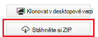
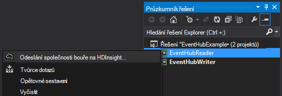
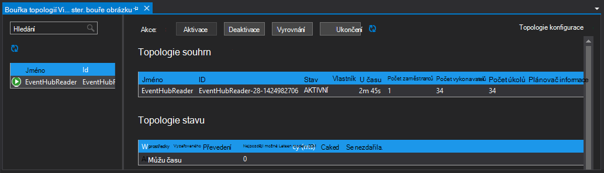

<properties
   pageTitle="Zpracování událostí z události rozbočovače s bouře na HDInsight | Microsoft Azure"
   description="Zjistěte, jak zpracuje události rozbočovače dat s C# bouře topologie vytvořené ve Visual Studiu pomocí nástroje HDInsight for Visual Studio."
   services="hdinsight,notification hubs"
   documentationCenter=""
   authors="Blackmist"
   manager="jhubbard"
   editor="cgronlun"/>

<tags
   ms.service="hdinsight"
   ms.devlang="dotnet"
   ms.topic="article"
   ms.tgt_pltfrm="na"
   ms.workload="big-data"
   ms.date="10/27/2016"
   ms.author="larryfr"/>

# Proces události z Azure události rozbočovače s bouře na HDInsight (C#)

Azure rozbočovače události umožňuje zpracovat obrovské množství dat z webové stránky, aplikace a zařízení. Událost rozbočovače hubičky umožňuje snadno se použije bouře Apache na HDInsight k analýze dat v reálném čase. Můžete taky zápisu dat na událost rozbočovače z bouře pomocí blesku rozbočovače události.

V tomto kurzu se naučíte pomocí šablon aplikace Visual Studio součástí HDInsight Tools for Visual Studio můžete vytvořit dvě topologie, které spolupracují s Azure události rozbočovače.

* **EventHubWriter**: náhodně generuje data a zapíše do rozbočovače události

* **EventHubReader**: načte data z rozbočovače událostí a zaznamená data do bouře protokoly

> [AZURE.NOTE] Během kroků uvedených v tomto dokumentu spolehnout vývojové prostředí Windows s Visual Studiu, zkompilované projektu můžete zaslat Linux nebo serveru s Windows HDInsight clusteru. Na základě Linux clusterů vytvořit pouze po 10/28/2016 podpory SCP.NET topologií.
>
> Topologie C# pomocí Linux clusteru, musíte aktualizovat balíček Microsoft.SCP.Net.SDK NuGet používá společnost projektu verzi 0.10.0.6 nebo vyšší. Verze balíčku odpovídat také hlavní verze bouře nainstalovaným HDInsight. Bouře na HDInsight verze 3.3 a 3.4 ji například používat verzi bouře 0.10.x, zatímco HDInsight 3.5 používá bouře 1.0.x.
> 
> Topologie C# na základě Linux clusterů musí používat .NET 4.5 a používejte Mono spustit clusteru HDInsight. Většinu věcí, které budou fungovat, ale byste měli zkontrolovat [Kompatibilitu Mono](http://www.mono-project.com/docs/about-mono/compatibility/) dokument potenciální kompatibilitou.
>
> Verze Java tohoto projektu, která budou fungovat i clusteru na základě Linux nebo serveru s Windows, najdete v článku [Proces události z Azure události rozbočovače s bouře na HDInsight (Java)](hdinsight-storm-develop-java-event-hub-topology.md).

## Zjistit předpoklady pro

* [Apache bouře clusteru HDInsight](hdinsight-apache-storm-tutorial-get-started.md)

* [Centrální Azure události](../event-hubs/event-hubs-csharp-ephcs-getstarted.md)

* [Azure .NET SDK](http://azure.microsoft.com/downloads/)

* [HDInsight Tools for Visual Studio](hdinsight-hadoop-visual-studio-tools-get-started.md)

## Dokončení projektu

Můžete si stáhnout úplnou verzi projekt vytvořený v tomto kurzu z GitHub: [eventhub bouře hybridní](https://github.com/Azure-Samples/hdinsight-dotnet-java-storm-eventhub). Ale přesto musíte zadat nastavení konfigurace podle pokynů uvedených v tomto kurzu.

## Událost rozbočovače hubičky a šroub

Událost rozbočovače spout a pevným jsou součástí jazyka Java, které umožňují snadno pracovat s rozbočovače událost z Apache bouře. I když jsou tyto komponenty napsané v Java, nástroje HDInsight for Visual Studio umožňují vytvářet hybridní topologií kombinující C# a součástí jazyka Java.

Hubičky a šroub distributed jako jeden soubor archivu (.jar) Java s názvem **eventhubs-storm-spout-#.#-jar-with-dependencies.jar**, kde ## je verzi souboru.

### Stáhněte si soubor .jar

Nejnovější verzi souboru sklenice je součástí projektu [HDInsight bouře příklady](https://github.com/hdinsight/hdinsight-storm-examples) ve složce **knihovny/eventhubs** . Budou moct soubor stáhnout, můžete jedním z následujících postupů.

> [AZURE.NOTE] Pro zahrnutí do projektu Apache bouře byly odeslány hubičky a šroub. Další informace najdete v tématu [bouře 583: počáteční vrácení se změnami pro událost bouře rozbočovače](https://github.com/apache/storm/pull/336/files) v GitHub.

* **Stáhněte si soubor ZIP**: Z webu [HDInsight bouře příklady](https://github.com/hdinsight/hdinsight-storm-examples) vyberte **Stáhnout ZIP** v pravém podokně pro stažení souboru ZIP obsahujícího projektu.

    

    Po stažení souboru se dají extrahovat archivu a soubor bude v adresáři **knihovny** .

* **Klonovat projektu**: Pokud máte [Libovolná](http://git-scm.com/) nainstalovaný, použijte tento příkaz klonovat úložiště místně a pak najděte soubor v adresáři **knihovny** .

        git clone https://github.com/hdinsight/hdinsight-storm-examples

## Konfigurace události rozbočovače

Událost rozbočovače je zdroj dat v tomto příkladu. Pomocí informací v části __Vytvoření rozbočovači události__ dokumentu [začít pracovat s rozbočovače události](../event-hubs/event-hubs-csharp-ephcs-getstarted.md) .

3. Po vytvoření centra událost zobrazení zásuvné EventHub portálu Azure a vyberte __sdílené přístup zásady__. Pomocí __+ Přidat__ položky přidat následující zásady:

  	| Jméno | Oprávnění |
  	| ----- | ----- |
  	| zápis | Odeslání |
  	| čtečky | Poslech |

    

5. Výběr zásad __čtečka__ a __Autor__ . Kopírování a uložit hodnotu __Primární klíč__ pro obě zásady jako se použijí později.

## Konfigurace EventHubWriter

1. Pokud jste nenainstalovali nejnovější verzi nástroje HDInsight for Visual Studio, přečtěte si článek [Začínáme s používáním HDInsight Tools for Visual Studio](hdinsight-hadoop-visual-studio-tools-get-started.md).

2. Stažení řešení z [eventhub bouře hybridní](https://github.com/Azure-Samples/hdinsight-dotnet-java-storm-eventhub). Otevřete řešení a krátkou chvíli si můžete prohlédnout kód __EventHubWriter__ projektu.

4. V projectu __EventHubWriter__ otevřete __konfiguračního__ souboru. Pomocí informace z centra události dříve nakonfigurovali vyplňte hodnotu, pro následující klíče:

  	| Klíč | Hodnota |
  	| ----- | ----- |
  	| EventHubPolicyName | zápis (Pokud jste použili jiný název pro zásady _odeslání_ oprávnění, použijte ji.) |
  	| EventHubPolicyKey | Klíč pro zápis zásad |
  	| EventHubNamespace | Obor názvů, který obsahuje vaše Centrum události |
  	| EventHubName | Vaše jméno centrální události |
  	| EventHubPartitionCount | Počet oddílů v centrální události |

4. Uložte a zavřete **konfiguračního** souboru.

## Konfigurace EventHubReader

1. Otevřete projekt __EventHubReader__ a provést několik momoents si můžete prohlédnout kód.

2. Otevřete __App.config__ __EventHubWriter__. Pomocí informace z centra události dříve nakonfigurovali vyplňte hodnotu, pro následující klíče:

  	| Klíč | Hodnota |
  	| ----- | ----- |
  	| EventHubPolicyName | čtečky (Pokud jste použili jiný název pro zásady _Poslech_ oprávnění, použijte ji.) |
  	| EventHubPolicyKey | Klíč pro zásady Readeru |
  	| EventHubNamespace | Obor názvů, který obsahuje vaše Centrum události |
  	| EventHubName | Vaše jméno centrální události |
  	| EventHubPartitionCount | Počet oddílů v centrální události |

3. Uložte a zavřete **konfiguračního** souboru.

## Nasazení topologií

1. V **Okně Průzkumník**projektu **EventHubReader** pravým tlačítkem vyberte **Odeslat bouře na HDInsight**.

    

2. V dialogovém okně **Odeslat topologie** vyberte svůj **Cluster bouře**. Rozbalení **Další konfigurace**vyberte **Java soubor cesty**, vyberte **…** a vyberte adresář, který obsahuje **eventhubs-storm-spout-0.9-jar-with-dependencies.jar** soubor, který jste stáhli dříve. Nakonec klikněte na **Odeslat**.

    

3. Po odeslání topologii se zobrazí **Bouře topologií prohlížeč** . Vyberte topologii **EventHubReader** v levém podokně zobrazte statistiku topologii. V současné době nic se děje, protože žádné události byla vytvořilo k události rozbočovače ještě.

    

4. V **Okně Průzkumník**projektu **EventHubWriter** pravým tlačítkem vyberte **Odeslat bouře na HDInsight**.

2. V dialogovém okně **Odeslat topologie** vyberte svůj **Cluster bouře**. Rozbalení **Další konfigurace**vyberte **Java soubor cesty**, vyberte **...** a vyberte adresář, který obsahuje **eventhubs-storm-spout-0.9-jar-with-dependencies.jar** soubor, který jste stáhli dříve. Nakonec klikněte na **Odeslat**.

5. Po odeslání topologii aktualizujte seznam topologie v **Bouře topologií prohlížeč** zkontrolujte, že obou topologií běží na clusteru.

6. V **Bouře topologií prohlížeč**vyberte topologii **EventHubReader** .

4. V zobrazení Diagram poklikáním na komponentu __LogBolt__ . Tím se otevře stránku __Souhrnu součásti__ pro šroubu.

3. V části __vykonavatelů__ vyberte jeden z odkazů ve sloupci __Port__ . Zobrazí se informace zaznamenané komponentu. Zaznamenané informace je podobná této:

        2016-10-20 13:26:44.186 m.s.s.b.ScpNetBolt [INFO] Processing tuple: source: com.microsoft.eventhubs.spout.EventHubSpout:7, stream: default, id: {5769732396213255808=520853934697489134}, [{"deviceId":3,"deviceValue":1379915540}]
        2016-10-20 13:26:44.234 m.s.s.b.ScpNetBolt [INFO] Processing tuple: source: com.microsoft.eventhubs.spout.EventHubSpout:7, stream: default, id: {7154038361491319965=4543766486572976404}, [{"deviceId":3,"deviceValue":459399321}]
        2016-10-20 13:26:44.335 m.s.s.b.ScpNetBolt [INFO] Processing tuple: source: com.microsoft.eventhubs.spout.EventHubSpout:6, stream: default, id: {513308780877039680=-7571211415704099042}, [{"deviceId":5,"deviceValue":845561159}]
        2016-10-20 13:26:44.445 m.s.s.b.ScpNetBolt [INFO] Processing tuple: source: com.microsoft.eventhubs.spout.EventHubSpout:7, stream: default, id: {-2409895457033895206=5479027861202203517}, [{"deviceId":8,"deviceValue":2105860655}]

## Ukončení topologií

Topologií ukončíte vyberte každý topologie v **Bouře topologie prohlížeč**a klikněte na **Ukončit**.

## Odstranění svůj cluster

[AZURE.INCLUDE [delete-cluster-warning](../../includes/hdinsight-delete-cluster-warning.md)]

## Poznámky

### Kontrola

EventHubSpout pravidelně kontroly svůj stav na uzel Zookeeper, které se uloží aktuální posun zpráv čtení ve frontě. Díky komponentu zahájíte přijímat zprávy na uložený posunu v následujících situacích:

* Instanci komponenty selhání a restartovat.

* Zvětšit nebo zmenšit clusteru přidáním nebo odebráním uzlů.

* Topologie je ukončit a znovu spustit **se stejným názvem**.

Můžete taky exportovat a importovat trvalých kontrolních bodů WASB (Azure úložišti používat svůj cluster HDInsight.) Tyto skripty akce se nachází na bouře HDInsight clusteru na **c:\apps\dist\storm-0.9.3.2.2.1.0-2340\zkdatatool-1.0\bin**.

>[AZURE.NOTE] Číslo verze na cestě může lišit podle verzi bouře nainstalovaným clusteru může v budoucnosti změnit.

Skripty v této složce jsou:

* **stormmeta_import.cmd**: naimportujte všechna bouře metadata v kontejneru clusteru výchozí úložiště Zookeeper.

* **stormmeta_export.cmd**: Export všechna metadata bouře z Zookeeper do kontejneru clusteru výchozí úložiště.

* **stormmeta_delete.cmd**: zabránění Zookeeper všechna bouře metadata.

Export operaci importu umožňuje uchovávat data kontrolní bod, když potřebujete odstranit clusteru, ale budete chtít pokračovat zpracování aktuální posun v centru při aktivaci nového clusteru zase online.

> [AZURE.NOTE] Od data uložena v kontejneru výchozí úložiště, nové clusteru **musí** používat stejný účet úložiště a kontejneru jako předchozí obrázku.

## Další kroky

V tomto dokumentu, můžete se naučíte používat Java události rozbočovače Spout a šroub z topologie C# pro práci s daty v centrální Azure události. Další informace o vytváření C# topologií, najdete v těchto článcích.

* [Můžete vyvíjet C# topologie pro Apache bouře na HDInsight pomocí aplikace Visual Studio](hdinsight-storm-develop-csharp-visual-studio-topology.md)

* [Průvodce programováním spojovací bod služby](hdinsight-storm-scp-programming-guide.md)

* [Příklad topologie pro bouře na HDInsight](hdinsight-storm-example-topology.md)
 
