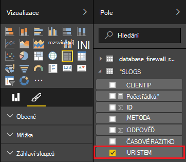

<properties
 pageTitle="Pomocí Power BI Apache bouře | Microsoft Azure"
 description="Vytvoření sestavy Power BI pomocí dat z topologie C# výpočetnímu clusteru Apache bouře v HDInsight."
 services="hdinsight"
 documentationCenter=""
 authors="Blackmist"
 manager="jhubbard"
 editor="cgronlun"
    tags="azure-portal"/>

<tags
 ms.service="hdinsight"
 ms.devlang="dotnet"
 ms.topic="article"
 ms.tgt_pltfrm="na"
 ms.workload="big-data"
 ms.date="10/27/2016"
 ms.author="larryfr"/>

# Vizualizace dat z Apache bouře topologie pomocí Power BI

Power BI umožňuje vizuálně zobrazit data sestavy. Pomocí šablony aplikace Visual Studio bouře na HDInsight, můžete snadno použít uložte data z topologie na Apache bouře HDInsight clusteru nastanou SQL Azure a vizualizace dat pomocí Power BI.

V tomto dokumentu se naučíte se vytvářet sestavy z dat generovaný Apache bouře topologie a uložené v databázi SQL Azure pomocí Power BI.

> [AZURE.NOTE] Během kroků uvedených v tomto dokumentu spolehnout vývojové prostředí Windows s Visual Studiu, zkompilované projektu můžete zaslat Linux nebo serveru s Windows HDInsight clusteru. Na základě Linux clusterů vytvořit pouze po 10/28/2016 podpory SCP.NET topologií.
>
> Topologie C# pomocí Linux clusteru, musíte aktualizovat balíček Microsoft.SCP.Net.SDK NuGet používá společnost projektu verzi 0.10.0.6 nebo vyšší. Verze balíčku odpovídat také hlavní verze bouře nainstalovaným HDInsight. Bouře na HDInsight verze 3.3 a 3.4 ji například používat verzi bouře 0.10.x, zatímco HDInsight 3.5 používá bouře 1.0.x.
> 
> Topologie C# na základě Linux clusterů musí používat .NET 4,5 a používejte Mono spustit clusteru HDInsight. Většinu věcí, které budou fungovat, ale byste měli zkontrolovat [Kompatibilitu Mono](http://www.mono-project.com/docs/about-mono/compatibility/) dokument potenciální kompatibilitou.
>
> Verze Java tohoto projektu, která budou fungovat i clusteru na základě Linux nebo serveru s Windows, najdete v článku [Proces události z Azure události rozbočovače s bouře na HDInsight (Java)](hdinsight-storm-develop-java-event-hub-topology.md).

## Zjistit předpoklady pro

- Předplatné Azure. Viz [získání Azure bezplatnou zkušební verzi](https://azure.microsoft.com/documentation/videos/get-azure-free-trial-for-testing-hadoop-in-hdinsight/).

* Uživatele služby Azure Active Directory s [Power BI](https://powerbi.com) přístup

* Visual Studio (jedno z následujících verzí)

    * Visual Studio 2012 s [Aktualizovat 4](http://www.microsoft.com/download/details.aspx?id=39305)

    * Visual Studio 2013 s [aktualizace 4](http://www.microsoft.com/download/details.aspx?id=44921) nebo [Visual Studio 2013 komunity](http://go.microsoft.com/fwlink/?linkid=517284&clcid=0x409)

    * [Visual Studio 2015](https://www.visualstudio.com/downloads/download-visual-studio-vs.aspx)

* Nástroje HDInsight for Visual Studio: informace najdete v tématu [Začínáme používat nástroje HDInsight for Visual Studio](../HDInsight/hdinsight-hadoop-visual-studio-tools-get-started.md) na informace o instalaci.

## Jak to funguje

V tomto příkladu obsahuje C# bouře topologie náhodně generovaný dat protokolu Internetové informační služby (IIS). Tato data se pak došlo k zápisu databázi SQL a odtud pracovní postup slouží ke generování sestav v Power BI.

Následuje seznam souborů, které implementaci hlavních funkcí v tomto příkladu.

* **SqlAzureBolt.cs**: zapíše informací vytvořených v topologii bouře k SQL databázi.

* **IISLogsTable.sql**: použita k vytvoření databáze, uložení dat v jazyce Transact-SQL příkazy.

> [AZURE.WARNING] Před spuštěním topologii HDInsight clusteru musí vytvořit tabulku v databázi SQL.

## Stáhněte si v příkladu

Stáhněte si [Příklad HDInsight C# bouře Power BI](https://github.com/Azure-Samples/hdinsight-dotnet-storm-powerbi). Stáhněte si ho, buď vidlice/klonovat pomocí [Libovolná](http://git-scm.com/)nebo pomocí odkaz **Stáhnout** si Pokud chcete stáhnout ZIP archivu.

## Vytvoření databáze

1. Pomocí postupu v dokumentu [databáze SQL kurz](../sql-database/sql-database-get-started.md) vytvoření nové databáze SQL.

2. Připojení k databázi pomocí kroků uvedených v dokumentu [připojení k databázi SQL pomocí aplikace Visual Studio](../sql-database/sql-database-connect-query.md) pro připojení k databázi.

4. Klikněte pravým tlačítkem na databázi v prohlížeči objektů a vytvořte __Nový dotaz__. Vložení obsahu ze souboru __IISLogsTable.sql__ zahrnuty ve staženém projektu do okna dotazu a pak pomocí kombinace kláves Ctrl + Shift + E spuštění dotazu. Dostanete zprávu, že příkazy byla úspěšně dokončena.

    Po dokončení to bude nová tabulka s názvem __IISLOGS__ v databázi.

## Konfigurace výběru

1. Z [Azure portál](https://portal.azure.com)vyberte databázi SQL. V části __Základy__ zásuvné SQL databáze zaškrtněte políčko __Zobrazit řetězců připojení k databázi__. Ze seznamu, který se zobrazí zkopírujte informace __ADO.NET (ověřování serveru SQL)__ .

1. Otevření ukázky ve Visual Studiu. V **Okně Průzkumník**otevřete **konfiguračního** souboru a pak najděte následující položky:

        <add key="SqlAzureConnectionString" value="##TOBEFILLED##" />
    
    Nahraďte hodnotu __## TOBEFILLED ##__ připojovací řetězec databáze zkopírovali v předchozím kroku. Nahradit __{vaší\_username}__ a __{vaší\_heslo}__ pomocí jména a hesla pro databázi.

2. Uložte a zavřete soubory.

## Nasazení výběru

1. V **Okně Průzkumník** **StormToSQL** projektu klikněte pravým tlačítkem myši a vyberte **Odeslat bouře na HDInsight**. Vyberte HDInsight cluster v dialogovém okně **Bouře clusteru** rozevíracího seznamu.

    > [AZURE.NOTE] Může trvat několik sekund, než u rozevíracího seznamu **Bouře clusteru** naplnění s názvy serverů.
    >
    > Pokud se zobrazí výzva, zadejte přihlašovací údaje pro předplatné Azure. Pokud máte víc předplatných, přihlaste se k ten, který obsahuje vaše bouře clusteru HDInsight.

2. Po úspěšném odeslání topologii by se měly topologií bouře clusteru. Vyberte položku SqlAzureWriterTopology ze seznamu zobrazíte informace o topologii pracovního.

    

    Přečtěte si informace o topologii, a poklikejte na položky (například SqlAzureBolt) a přečtěte si informace specifické pro komponentu v topologii můžete toto zobrazení.

3. Po topologii spustili několik minut, vraťte se do okna dotazu SQL, který jste použili k vytvoření databáze. Nahraďte stávající příslušným takto.

        select * from iislogs;
    
    Podržením klávesy Ctrl + Shift + E spustit dotaz a tabulky, které mají přijímat výsledky podobně jako tento.
    
        1   2016-05-27 17:57:14.797 255.255.255.255 /bar    GET 200
        2   2016-05-27 17:57:14.843 127.0.0.1   /spam/eggs  POST    500
        3   2016-05-27 17:57:14.850 123.123.123.123 /eggs   DELETE  200
        4   2016-05-27 17:57:14.853 127.0.0.1   /foo    POST    404
        5   2016-05-27 17:57:14.853 10.9.8.7    /bar    GET 200
        6   2016-05-27 17:57:14.857 192.168.1.1 /spam   DELETE  200

    Toto je data, která byla vytvořena z topologie bouře.

## Vytvoření sestavy

1. Připojení k [databázi SQL Azure spojnice](https://app.powerbi.com/getdata/bigdata/azure-sql-database-with-live-connect) k Power BI.

2. V rámci __databází__vyberte __získat__.

3. Vyberte __Databázi SQL Azure__a pak vyberte __Připojit__.

4. Zadejte informace o připojení k databázi SQL Azure. Návštěva [Azure portál](https://portal.azure.com) a výběrem databázi SQL můžete najít takto.

    > [AZURE.NOTE] Můžete také nastavit interval aktualizace a vlastní filtry pomocí __Povolit Upřesnit možnosti__ v dialogovém okně připojení.

5. Po připojení, zobrazí se nové datovou sadu se stejným názvem jako databáze, kterou jste připojení k. Vyberte datovou sadu zahájíte navrhování sestavy.

3. Z __pole__rozbalte položku __IISLOGS__ . Zaškrtněte políčko pro __URISTEM__. Tím vytvoříte novou sestavu, která jsou uvedeny stonky identifikátor URI (/ foo, / pruhové, apod) přihlášení k lyncu v databázi.

    

5. Pak přetáhněte __Metoda__ do sestavy. Sestava aktualizuje seznamu stonky a odpovídající HTTP způsob žádost HTTP.

    

4. Ve sloupci __vizualizace__ klikněte na ikonu __pole__ a potom klikněte na šipku dolů vedle __způsobu__ v části __hodnoty__ . V zobrazeném seznamu vyberte __počet__. Tím se změní sestava seznam počtu kolikrát byl otevřen konkrétní URI.

    

6. Pak vyberte __Skládaný sloupcový graf__ , chcete-li změnit způsob zobrazení informací.

    

7. Až budete mít sestavu jak vám vyhovoval, pomocí __Uložit__ položky v nabídce zadejte název a uložte sestavu.

## Ukončení topologie

Topologie zůstanou spustit, dokud ho zastavit nebo odstranění bouře clusteru HDInsight. Proveďte následující kroky ukončíte topologii.

1. Ve Visual Studiu vraťte se do okna topologie a vyberte topologii.

2. Klikněte na tlačítko **Ukončit** ukončíte topologii.

    

## Odstranění svůj cluster

[AZURE.INCLUDE [delete-cluster-warning](../../includes/hdinsight-delete-cluster-warning.md)]

## Další kroky

V tomto dokumentu se naučíte odeslat data z topologie bouře k SQL databázi a potom vizualizace dat pomocí Power BI. Informace o tom, jak pracovat s jinými technologiemi Azure HDInsight pomocí bouře najdete v těchto článcích:

* [Příklad topologie pro bouře na HDInsight](hdinsight-storm-example-topology.md)
