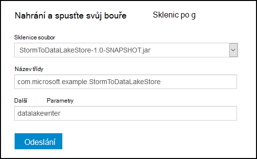

<properties
pageTitle="Použití Azure jezera úložiště s Apache bouře na Azure HDInsight"
description="Zjistěte, jak k zápisu dat do úložiště jezera dat Azure z Apache bouře topologie na HDInsight. V tomto dokumentu a související ukázkové ukazují, jak komponentu HdfsBolt mohou sloužit k zápisu dat jezera úložiště."
services="hdinsight"
documentationCenter="na"
authors="Blackmist"
manager="jhubbard"
editor="cgronlun"/>

<tags
ms.service="hdinsight"
ms.devlang="na"
ms.topic="article"
ms.tgt_pltfrm="na"
ms.workload="big-data"
ms.date="09/06/2016"
ms.author="larryfr"/>

#Použití Azure jezera úložiště s Apache bouře s HDInsight

Úložiště jezera dat Azure je HDFS kompatibilní cloudové úložiště služba, která poskytuje vysoký výkon, dostupnost, životnosti a spolehlivost pro vaše data. V tomto dokumentu dozvíte používání založené na Java bouře topologie zápis dat do úložiště jezera dat Azure pomocí [HdfsBolt](http://storm.apache.org/javadoc/apidocs/org/apache/storm/hdfs/bolt/HdfsBolt.html) součásti, která je součástí Apache bouře.

> [AZURE.IMPORTANT] Příklad topologie v tomto dokumentu závisí na součástí, které jsou součástí bouře na HDInsight clusterů a může vyžadovat změnu pro práci s Azure jezera úložiště při použití jiných Apache bouře clusterů.

##Zjistit předpoklady pro

* [Java JDK 1.7](https://www.oracle.com/technetwork/java/javase/downloads/jdk7-downloads-1880260.html) nebo vyšší
* [Maven 3.x](https://maven.apache.org/download.cgi)
* Předplatné Azure
* Bouře verze obrázku HDInsight 3,2. Pokud chcete vytvořit nové bouře HDInsight clusteru, postupujte v dokumentu [pomocí Hdinsightu pomocí úložiště jezera dat pomocí Azure](../data-lake-store/data-lake-store-hdinsight-hadoop-use-portal.md) . Kroky v tomto dokumentu vás provede jednotlivými vytváření nových HDInsight obrázku a úložiště jezera dat Azure.  

    > [AZURE.IMPORTANT] Při vytváření HDInsight clusteru je nutné vybrat __bouře__ jako typ obrázku a __3,2__ jako verze. Operační systém může být Windows nebo Linux.  

###Konfigurace proměnné

Následující proměnné možná nastavil, když nainstalujete Java a JDK k počítači, vývoj. Měli byste zkontrolovat, že existují a mohou obsahovat správné hodnoty systému.

* __JAVA_HOME__ - by měl přejděte v adresáři, kde je nainstalovaný runtime prostředí Java (JRE). Například v Unix nebo Linux rozdělení, měl by mít podobně jako hodnotu `/usr/lib/jvm/java-7-oracle`. V systému Windows má hodnotu podobně jako `c:\Program Files (x86)\Java\jre1.7`.

* __Cesta__ – by měl obsahovat následující cesty:

    * __JAVA\_HOME__ (nebo rovnocenný cesta)
    
    * __JAVA\_HOME\bin__ (nebo rovnocenný cesta)
    
    * V adresáři, kde je nainstalovaný Maven

##Topologie implementaci

Příklad v tomto dokumentu napsané v Java a používá tyto prvky:

* __TickSpout__: vygeneruje data použitá v jiných komponent topologie.

* __PartialCount__: Spočítá události generované TickSpout.

* __FinalCount__: agregace počítat data z PartialCount.

* __ADLStoreBolt__: data zapisuje úložiště jezera dat Azure pomocí komponentu [HdfsBolt](http://storm.apache.org/javadoc/apidocs/org/apache/storm/hdfs/bolt/HdfsBolt.html) .

Projekt obsahující tato topologie je k dispozici ke stažení z [https://github.com/Azure-Samples/hdinsight-storm-azure-data-lake-store](https://github.com/Azure-Samples/hdinsight-storm-azure-data-lake-store).

###Principy ADLStoreBolt

ADLStoreBolt je název použitý u instance HdfsBolt topologie, který data zapisuje jezera dat Azure. Toto není zvláštní verzi HdfsBolt vytvořil Microsoft; ale závisí na webu základní konfigurace hodnoty, jakož i Hadoop součástí, které jsou součástí Azure HDInsight komunikaci s jezera Data.

Konkrétně při vytváření HDInsight obrázku můžete propojit ji s Azure úložišti jezera. Tato data zapisuje položek do core webu pro jezera úložišti jste vybrali, které využívají součásti například hadoop klienta a hadoop hdfs povolit komunikaci s jezera úložiště.

> [AZURE.NOTE] Microsoft přispěla kódu Apache Hadoop a bouře projektů, který umožňuje komunikace s ukládáním informací úložiště jezera dat Azure a objektů Blob Azure, ale tato funkce nemusí být standardně součástí jiných Hadoop a bouře rozdělení.

Konfigurace HdfsBolt topologie vypadá takto:

    // 1. Create sync and rotation policies to control when data is synched
    //    (written) to the file system and when to roll over into a new file.
    SyncPolicy syncPolicy = new CountSyncPolicy(1000);
    FileRotationPolicy rotationPolicy = new FileSizeRotationPolicy(0.5f, Units.KB);
    // 2. Set the format. In this case, comma delimited
    RecordFormat recordFormat = new DelimitedRecordFormat().withFieldDelimiter(",");
    // 3. Set the directory name. In this case, '/stormdata/'
    FileNameFormat fileNameFormat = new DefaultFileNameFormat().withPath("/stormdata/");
    // 4. Create the bolt using the previously created settings,
    //    and also tell it the base URL to your Data Lake Store.
    // NOTE! Replace 'MYDATALAKE' below with the name of your data lake store.
    HdfsBolt adlsBolt = new HdfsBolt()
        .withFsUrl("adl://MYDATALAKE.azuredatalakestore.net/")
        .withRecordFormat(recordFormat)
        .withFileNameFormat(fileNameFormat)
        .withRotationPolicy(rotationPolicy)
        .withSyncPolicy(syncPolicy);
    // 4. Give it a name and wire it up to the bolt it accepts data
    //    from. NOTE: The name used here is also used as part of the
    //    file name for the files written to Data Lake Store.
    builder.setBolt("ADLStoreBolt", adlsBolt, 1)
      .globalGrouping("finalcount");
      
Pokud máte zkušenosti s použitím HdfsBolt, zjistíte, že se jedná o všech poměrně standardní konfiguraci s výjimkou adresu URL. Adresa URL nabízí cesta ke kořenové úložiště jezera dat Azure.

Vzhledem k tomu zápisu dat jezera Store používá HdfsBolt a je jednoduše změnit adresu URL, je třeba moct přijmout všechny existující topologie, který data zapisuje HDFS nebo WASB pomocí HdfsBolt a snadno ji změnit na použití úložiště jezera dat Azure.

##Vytvoření a balíček topologii

1. Stažení příklad projektu z [https://github.com/Azure-Samples/hdinsight-storm-azure-data-lake-store](https://github.com/Azure-Samples/hdinsight-storm-azure-data-lake-store
) vývojové prostředí.

2. Otevřít `StormToDataLake\src\main\java\com\microsoft\example\StormToDataLakeStore.java` soubor v editoru a vyhledejte řádek, který obsahuje `.withFsUrl("adl://MYDATALAKE.azuredatalakestore.net/")`. Změna __MYDATALAKE__ název úložiště jezera dat Azure jste použili při vytváření serveru HDInsight.

3. Příkazem výzva, terminál nebo prostředí relace, změňte adresáře do kořenové staženém projektu a následující příkazy pro vytváření a balíček topologii.

        mvn compile
        mvn package
    
    Po dokončení Tvůrce dotazů a balení bude nový adresář s názvem `target`, který obsahuje do souboru nazvaného `StormToDataLakeStore-1.0-SNAPSHOT.jar`. Tato stránka obsahuje zkompilované topologie.

##Nasazení a spuštění na základě Linux HDInsight

Pokud jste vytvořili bouře na základě Linux clusteru HDInsight pomocí následujících kroků nasazení a organizovat topologii.

1. Pomocí následujícího příkazu zkopírujte topologii clusteru HDInsight. Nahradíte __uživatele__ uživatelské jméno SSH, který jste použili při vytváření clusteru. __NÁZEV_CLUSTERU__ nahraďte názvem clusteru.

        scp target\StormToDataLakeStore-1.0-SNAPSHOT.jar USER@CLUSTERNAME-ssh.azurehdinsight.net:StormToDataLakeStore-1.0-SNAPSHOT.jar
    
    Po zobrazení výzvy zadejte heslo při vytváření uživatelského SSH clusteru. Pokud jste použili veřejným klíčem místo hesla, budete muset používat `-i` parametr zadejte cestu k odpovídající privátním klíčem.
    
    > [AZURE.NOTE] Pokud používáte Windows klienta pro vývoj, nejspíš nemáte `scp` příkaz. Pokud ano, můžete použít `pscp`, která je dostupná z [http://www.chiark.greenend.org.uk/~sgtatham/putty/download.html](http://www.chiark.greenend.org.uk/~sgtatham/putty/download.html).

2. Po dokončení nahrávání, použijte následující se připojit k obrázku HDInsight pomocí SSH. Nahradíte __uživatele__ uživatelské jméno SSH, který jste použili při vytváření clusteru. __NÁZEV_CLUSTERU__ nahraďte názvem clusteru.

        ssh USER@CLUSTERNAME-ssh.azurehdinsight.net

    Po zobrazení výzvy zadejte heslo při vytváření uživatelského SSH clusteru. Pokud jste použili veřejným klíčem místo hesla, budete muset používat `-i` parametr zadejte cestu k odpovídající privátním klíčem.
    
    > [AZURE.NOTE] Pokud používáte Windows klienta pro vývoj, postupujte podle informace v části [připojit ke na základě Linux Hdinsightu pomocí SSH z Windows](hdinsight-hadoop-linux-use-ssh-windows.md) informace na pomocí klienta nátěrové připojení k clusteru.
    
3. Po připojení, použijte následující zahájíte topologii:

        storm jar StormToDataLakeStore-1.0-SNAPSHOT.jar com.microsoft.example.StormToDataLakeStore datalakewriter
    
    Tím se spustí topologii s popisný název `datalakewriter`.

##Nasazení a spustit HDInsight serveru s Windows

1. Otevřete webový prohlížeč a přejděte na HTTPS://CLUSTERNAME.azurehdinsight.net, kde __NÁZEV_CLUSTERU__ je název svůj cluster HDInsight. Pokud budete vyzváni, zadejte uživatelské jméno správce (`admin`) a heslo, které jste použili pro tento účet při vytvoření clusteru.

2. Na řídicím panelu bouře vyberte __Procházet__ z rozevíracího seznamu __Jar soubor__ a pak soubor StormToDataLakeStore 1.0 SNAPSHOT.jar z `target` adresář. Použijte tyto hodnoty pro jiné položky ve formuláři:

    * Název třídy: com.microsoft.example.StormToDataLakeStore
    * Další parametry: datalakewriter
    
    

3. Klikněte na tlačítko __Odeslat__ nahrávat a začněte topologii. Výsledek pole pod tlačítkem __Odeslat__ by měl zobrazit informace podobně jako tento po topologii spustila:

        Process exit code: 0
        Currently running topologies:
        Topology_name        Status     Num_tasks  Num_workers  Uptime_secs
        -------------------------------------------------------------------
        datalakewriter       ACTIVE     68         8            10        

##Zobrazit výstup data

Existuje několik způsobů, jak zobrazit data. V této části používáme portálu Azure a `hdfs` příkaz Zobrazit data.

> [AZURE.NOTE] Měli byste povolit topologií spuštění za několik minut před vyhledáváním výstupní data tak, aby data se nesynchronizuje několik souborů v úložišti jezera dat Azure.

* __Z [Portálu Azure](https://portal.azure.com)__: V portálu vyberte Azure jezera úložišti něhož jste s HDInsight.

    > [AZURE.NOTE] Pokud připnete not úložiště jezera Azure portálu řídicího panelu, najdete ji výběrem __přejděte__ v dolní části seznamu v levé části pak __Úložiště jezera dat__a nakonec stiskněte úložišti.
    
    Z ikon v horní části úložiště jezera dat vyberte __Průzkumník Data__.
    
    
    
    Potom vyberte složku __stormdata__ . Seznam soubory ve formátu RTF budou zobrazeny.
    
    
    
    Vyberte jednu z soubory a zobrazit její obsah.

* __Z clusteru__: Pokud jste připojili ke clusteru HDInsight pomocí SSH (Linux obrázku) nebo Vzdálená plocha (Windows obrázku), můžete použít následující zobrazíte data. Nahraďte názvem vašeho úložiště jezera __DATALAKE__

        hdfs dfs -cat adl://DATALAKE.azuredatalakestore.net/stormdata/*.txt

    To bude zřetězit textové soubory uložené v adresáři a zobrazit informace o podobná této:
    
        406000000
        407000000
        408000000
        409000000
        410000000
        411000000
        412000000
        413000000
        414000000
        415000000
        
##Ukončení topologie

Topologie bouře spustí až do ukončení nebo odstraněn clusteru. Ukončit topologií, použijte následující informace.

__Pro na základě Linux HDInsight__:

Relaci SSH clusteru můžete tento příkaz:

    storm kill datalakewriter

__Pro HDInsight serveru s Windows__:

1. Na bouře řídicím panelu (https://CLUSTERNAME.azurehdinsight.net) zvolte odkaz __Bouře uživatelského rozhraní__ v horní části stránky.

2. Jakmile uživatelského rozhraní bouře načte, zvolte odkaz __datalakewriter__ .

    

3. V části __Akce topologie__ vyberte __Odstranit__ a pak vyberte OK v dialogovém okně, které se zobrazí.

    

## Odstranění svůj cluster

[AZURE.INCLUDE [delete-cluster-warning](../../includes/hdinsight-delete-cluster-warning.md)]

##Další kroky

Teď, když jste se naučili používání bouře zapisovat do úložiště jezera dat Azure, seznamte se s dalšími [bouře příklady HDInsight](hdinsight-storm-example-topology.md).
