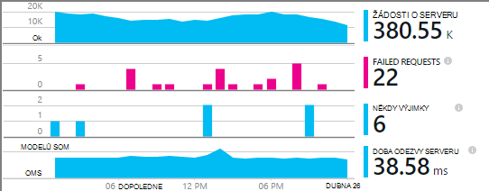

<properties
    pageTitle="Příklad MyDriving Azure IoT: sestavit | Microsoft Azure"
    description="Vytvořte aplikace, která je komplexní ukázku architektonické systému IoT pomocí Microsoft Azure včetně technologie pro analýzu toku, výukové počítače a rozbočovače události."
    services=""
    documentationCenter=".net"
    suite=""
    authors="harikmenon"
    manager="douge"/>

<tags
    ms.service="multiple"
    ms.workload="tbd"
    ms.tgt_pltfrm="ibiza"
    ms.devlang="dotnet"
    ms.topic="article"
    ms.date="03/25/2016"
    ms.author="harikm"/>


# <a name="build-and-deploy-the-mydriving-solution-to-your-environment"></a>Vytvoření a nasazení řešení MyDriving prostředí

MyDriving je řešení Internet věcí (IoT), který shromáždí data z vaší auta, zpracuje pomocí počítače výukové a nabídne vám na vašem mobilním telefonu. Back-end se skládá z různých služeb Microsoft Azure. Klienti můžou být telefony s Androidem, iOS nebo Windows 10.

Jsme vytvořili řešení MyDriving vám umožní jumpstart při vytváření systému IoT. Z [úložiště MyDriving na GitHub](https://github.com/Azure-Samples/MyDriving)můžete získat správce prostředků Azure skripty pro nasazení architektura back-end do Azure účtu. Od tohoto okamžiku překonfigurovat různých službách, můžete změnit dotazy vlastních datech, a tak dále. Můžete najít tyto skripty – spolu s kódem pro mobilní aplikaci, API služby Azure aplikace project a další – v úložišti MyDriving.

Pokud jste ještě vyzkoušeli aplikace, podívejte se na [získání příručka](iot-solution-get-started.md).

Je podrobné účet architektury [MyDriving referenční příručka](http://aka.ms/mydrivingdocs). Souhrn existuje několik částí, které jsme vytvořili a, že byste měli nastavit až vytvářet podobné projektu:

* **Klient aplikace** je spuštěn telefony s Androidem, iOS a Windows 10. Velkou část kód, který je uložený na GitHub v části sdílení používáme Xamarin platform `src/MobileApp`. Aplikace ve skutečnosti provádí dvou různých funkcí:
 * Přenáší telemetrie od zařízení vlaku Diagnostika (OBD) a od služby back-end systému cloudu vlastní umístění.
 * Je s uživatelským rozhraním, které uživatelé mohou zadat dotaz o jejich zaznamenané řízením cest.
* **Cloudová služba** ingests cest ze služební cesty data v reálném čase a zpracuje ji. Hlavní pracovní vytváření tuto službu je zvolte, parametrizovat a drátu nahoru řadu Azure služeb. Některé části vyžadují skripty filtru a proces příchozí data. Šablony pro správce prostředků Azure jsme používá ke konfiguraci všechny části.
* **Mobilní služba aplikace** je webová služba za součástí uživatelského rozhraní aplikace zařízení. Jeho hlavního projektu je k vytvoření dotazu databáze uložené, zpracovaných data. Svůj kód zapnuté GitHub v části `src/MobileAppService`.
* **Visual Studio s Xamarin** je naše vývojové prostředí. Xamarin, který existuje jako součást aplikace Visual Studio i jako samostatný integrované vývojové prostředí integrovaném vývojovém (prostředí), je použita k vytvoření kód různé platformy zařízení. Pokud chcete vytvořit kód iOS, je nutné mít instanci Xamarin spuštěné v počítači OS X. V případě potřeby lze spustit jako agent, spravovat pomocí aplikace Visual Studio.
* **Testování jednotku** aplikací zařízení se provádí v cloudu Test Xamarin.
* **GitHub** slouží jako úložiště kde jsme ukládat kód, skripty a šablony.
* **Visual Studio týmovou** je do cloudové služby, který slouží ke správě nepřetržité vytváření a otestujte webové aplikace služby a zařízení.
* **HockeyApp** slouží k distribuci verzích kód zařízení. Také shromažďuje pád a použití sestavy a názory uživatelů.
* **Přehledy aplikace Visual Studio** sleduje mobilní webové služby.

Tak se Pojďme najdete v článku Jak jsme nastavit všech akcí. Všimněte si, že spoustu kroky jsou volitelné.

## <a name="sign-up-for-accounts"></a>Registrace k účtům

-   [Základy vývojáře aplikace visual Studio](https://www.visualstudio.com/products/visual-studio-dev-essentials-vs.aspx). Tento bezplatný program poskytuje snadný přístup k hodně nástrojů pro vývojáře a služby, třeba Visual Studiu, Visual Studio týmovou a Azure. Nabízí 25 USD nebo měsících platební Azure 12 měsíců. Obsahuje taky předplatná pro Pluralsight školení a pro Vysokoškoláky Xamarin. Můžete taky registraci samostatně bezplatné úrovní [Azure](https://azure.com) a [Visual Studio týmovou](https://www.visualstudio.com/products/visual-studio-team-services-vs.aspx), ale tyto nenabízejí Azure přeplatky.

-   [HockeyApp](https://rink.hockeyapp.net/) (nepovinné), pro správu test výskyt mobilních aplikací a získávání telemetrie.

-   [Xamarin](https://xamarin.com/) (povinné), pro mobilní aplikaci vytváření a spouštění ladění se spustí a testuje na [Xamarin Test cloudu](https://xamarin.com/test-cloud).

-   [GitHub](https://github.com/Azure-Samples/MyDriving/) (volitelné), vytvořit bezplatné veřejné úložištích pro vlastní kód (platí soukromé úložištích). Můžete taky můžete použít základní plánu služby Visual Studio týmu pro soukromé úložištích.

-   [Power BI](https://powerbi.microsoft.com/) (volitelné), jak vytvořit propracovaných vizualizacích dat přes celého systému.

> [AZURE.NOTE] Nemusíte GitHub účtu pro přístup k MyDriving kódu v [úložišti GitHub MyDriving](https://github.com/Azure-Samples/MyDriving).

## <a name="install-development-tools"></a>Instalace nástroje pro vývoj

Následující nastavení je k vývoji úplné řešení: iOS, Android a Windows 10 Mobile aplikaci různé platformy, s Azure serverová.

Jako alternativu můžete Xamarin Studio na Mac a Windows se dají mobilní aplikace, pokud nepracujete na Azure serverová.

Existuje nějaký [delší popis toto nastavení](https://msdn.microsoft.com/library/mt613162.aspx).

### <a name="windows-development-machine"></a>Vývojové počítače se systémem Windows

Nástroj centrální v systému Windows je Visual Studiu pro práci s MyDriving aplikace pro Android a Windows, API služby aplikace project a microservice rozšíření.

Xamarin, libovolná, emulátorů a dalších užitečné součástí jsou všechny integrována Visual Studio.

Nainstalujte:

-   [Visual Studio 2015 se Xamarin](https://www.visualstudio.com/products/visual-studio-community-vs) (všechny edition – komunity je zadarmo).

-   [SQLite pro platformu univerzální Windows](https://visualstudiogallery.msdn.microsoft.com/4913e7d5-96c9-4dde-a1a1-69820d615936). Je potřebná k vytvoření kód pro Windows 10 Mobile.

-   [Azure SDK Visual Studio 2015](https://go.microsoft.com/fwlink/?linkid=518003&clcid=0x409). Umožňuje SDK pro spuštění aplikace v Azure, spolu s příkazového řádku nástroje pro správu Azure.

-   [Služby azure struktury SDK](http://www.microsoft.com/web/handlers/webpi.ashx?command=getinstallerredirect&appid=MicrosoftAzure-ServiceFabric). Je potřebná k vytvoření koncovku [microservice](../service-fabric/service-fabric-get-started.md) .

Nezapomeňte, jsou správné rozšíření Visual Studia. Zaškrtněte políčko v části **Nástroje**, viz **Android, iOS, Xamarin...**. Pokud ne, otevřete ovládací panely a pak vyberte **programy a funkce** > **Microsoft** > **Visual Studio 2015** > **změnit**. V části **vývojové platformy**, vyberte **C\#/.Net (Xamarin)**. Při práci v tomto zkontrolujte, že je nainstalovaný **Libovolná pro Windows** .

### <a name="mac-development-machine"></a>Vývojové počítače Mac

Mac (Yosemite nebo novější) požaduje, pokud chcete vyvíjet pro iOS. I když jsme pomocí aplikace Visual Studio Xamarin v systému Windows k vytvoření a správa celý kód, používá Xamarin agent nainstalovaný na počítači Mac při vytváření a podepsání kódu iOS.


(Jako alternativu můžete Xamarin Studio přímo na Mac se dají aplikace platformě.)

Pokud nechcete zahrnout iOS jako cílové platformy Mac nepotřebujete.

Nainstalujte:

-   [Xamarin Studio pro iOS](https://developer.xamarin.com/guides/ios/getting_started/installation/mac/). Můžete taky nastavit Visual Studia a Xamarin na počítači Mac, na kterém běží Windows virtuálního počítače. V tématu [nastavení, instalovat a ověření uživatelé počítačů Mac](https://msdn.microsoft.com/library/mt488770.aspx) na webu MSDN.

-   [Azure vývojového nástroje](https://azure.microsoft.com/downloads/) (volitelné).

Povolení vzdáleného přihlášení na Mac. Otevřete **Předvolby systému** > **sdílení**a pak vyberte **Remote přihlášení**.

Když otevřete projekt iOS ve Visual Studiu v systému Windows, Plug-inu Xamarin vás vyzve k ID Mac.

## <a name="fetch-the-github-repository"></a>Vzdálené použití GitHub úložiště

Načtení místní kopii [úložišti GitHub MyDriving](https://github.com/Azure-Samples/MyDriving) pomocí tlačítka **Stáhnout ZIP** GitHub, Visual Studio nebo jiného klienta libovolná.

Rozbalení souboru do složky s krátký název cesty, například C:\\kód.

Můžete taky Pokud chcete aktuálnost s nebo na jaké přispíváte naše kód, klonovat úložiště následujícím způsobem:

**Libovolná klonovat https://github.com/Azure-Samples/MyDriving.git**

## <a name="get-a-bing-maps-api-key"></a>Získání Bing mapy rozhraní API klíče

[Zaregistrujte si klíč rozhraní API aplikace mapy Bing](https://msdn.microsoft.com/library/ff428642.aspx).

Potřebujete změnit to v řádku 22 `src/MobileApps/MyDriving/MyDriving.Utils/Logger.cs`.


## <a name="build-the-demo-app"></a>Vytvářet aplikace ukázka

Otevřete tato řešení ve Visual Studiu:

-   src\MobileApps\MyDriving.sln

-   src\MobileAppService\MyDrivingService.sln

-   src\Extensions\ServiceFabric\VINLookUpApplication\VINLookUpApplication.sln

Dostanete pokynů:

-   Důvěřujte některé potenciálně nedůvěryhodných projekty. Vyberte otevírat, pokud chcete pokračovat.

-   Pokud pracujete na svěže počítač Windows 10, nastavte režimu Vývojář.

-   Zadejte svoje přihlašovací údaje Xamarin.

-   Připojení k Xamarin Mac. Pokud nemáte Mac, klikněte pravým tlačítkem myši na iOS projekt ve Visual Studiu a vyberte **Uvolnit projekt**.

Opětovné sestavení řešení.

Pokud máte potíže s budovy, vyzkoušejte řešení quirks, které jste nalezeny:

-   *VINLookupApplication projektu se nenačte*: Ujistěte se, že jste si nainstalovali [Azure SDK Visual Studio 2015](https://go.microsoft.com/fwlink/?linkid=518003&clcid=0x409).

-   *Služba struktury projektu není vytvořit*: budování rozhraní projekty nejdřív a ujistěte se, že jste si nainstalovali SDK struktury služby.

-   *Nelze vytvářet aplikace androidu*:

    -   Otevřete **Nástroje** > **Android** > **Android SDK správce**a ujistěte se, že Android 6 (rozhraní API 23) / SDK platformy nainstalovaný.

    -   Odstranit tento adresář a pak znovu vytvořte:<br/>
        `%LocalAppData%\Xamarin\zips`

## <a name="get-to-know-the-code"></a>Seznámení s kód

V řešení najdete:

-   Azure rozšíření: struktury služby.

-   Azure HDInsight: Skripty pro zpracování dat ze služební cesty v Azure.

-   Mobilní aplikace: Zařízení aplikace.

-   MobileAppsService/MyDrivingService: Ukončení webu zpět.

-   Power BI: Definice sestavy.

-   Skripty:

    -   Správce prostředků: šablony můžete vytvořit Azure zdroje.

    -   Powershellu: Spuštění Správce prostředků šablony skriptů.

    -   Databáze SQL Azure: Ladění databází.

-   Databáze SQL: CreateTables: definice schématu.

-   Azure analýzy toku: Dotazy, které transformace příchozí datového proudu.

## <a name="run-the-apps-in-development-mode"></a>Spuštění aplikace ve vývojovém režimu

Proveďte akci ke spuštění aplikace založené na zařízení, které používáte:

-  Back-end: nastavení MyDrivingService jako projekt při spuštění a stiskněte klávesu F5 ke spuštění back-end webové služby. Otevře se prohlížeč zobrazení seznamu rozhraní API.

-  Mobilní klienti: [mobilní aplikace jsou vytvořené v Xamarin](https://developer.xamarin.com/guides/cross-platform/deployment,_testing,_and_metrics/debugging_with_xamarin/).
 -  Android: Další informace najdete v tématu [Ladění Android v Xamarin](http://developer.xamarin.com/guides/android/deployment,_testing,_and_metrics/debugging_with_xamarin_android/).

 -  iOS: Podrobnosti najdete v tématu [ladění v iOS](http://developer.xamarin.com/guides/ios/deployment,_testing,_and_metrics/debugging_in_xamarin_ios/).

 -  Windows Phone: Další informace najdete v tématu [Xamarin + Windows Phone](https://developer.xamarin.com/guides/cross-platform/windows/phone/).

## <a name="upload-the-mobile-app-to-hockeyapp"></a>Nahrání mobilní aplikace na HockeyApp

HockeyApp má na starosti distribuce aplikace Android, iOS nebo Windows otestovat uživatelů, oznamování uživatelům nové verze. Shromažďuje také užitečné pád sestav, názory uživatelů se snímky obrazovek a použití metriky.

[Začněte tím, že odešlete](http://support.hockeyapp.net/kb/app-management-2/how-to-create-a-new-app) aplikace Tvůrce dotazů. Přihlaste se k [HockeyApp](https://rink.hockeyapp.net) z počítače vývoj. Na řídicím panelu vývojář klikněte na **Nová aplikace**a potom přetáhněte vytvořené soubory do okna. (Novějších verzích můžete automatizovat služby sestavení k tomuto.)

Teď můžete na řídicím panelu aplikace.


Opakujte postup pro každou platformu aplikaci kompatibilní s. Potom můžete udělat toto:

-  Pomocí [ID aplikace](http://support.hockeyapp.net/kb/app-management-2/how-to-find-the-app-id) na řídicím panelu odesílat pád dat a zpětné vazby z aplikace. V MyDriving aktualizujte ID ve src/MobileApps/MyDriving/MyDriving.Utils/Logger.cs.

-  [Pozvat zkušební uživatele](http://support.hockeyapp.net/kb/app-management-2/how-to-invite-beta-testers). Získání adresy URL náboru testeři uživatelů. Budou moct zaregistrujte se svým týmem, stáhněte si aplikaci a odeslat názor.

-  Pokud chcete raději více otevřít beta verzi, nastavte hodnotu rozdělení veřejnosti. Klikněte na **Spravovat aplikace** > **rozdělení** > **Stáhnout = veřejné**. Teď všichni budou moct stáhnout aplikaci a odeslat názor a jejich oznámení při uvidíte zveřejňují novou verzi. Některé sestavy pád z nich se může objevit taky.

    

-  [Odkaz pád sestav aplikace Visual Studio týmovou](http://support.hockeyapp.net/kb/third-party-bug-trackers-services-and-webhooks/how-to-use-hockeyapp-with-visual-studio-team-services-vsts-or-team-foundation-server-tfs). Klikněte na **Spravovat aplikace** > **Visual Studio týmovou**. HockeyApp můžete automatické vytváření pracovních položek Team Services kdy dojde k chybě sestavy nebo při doručení svůj názor.

Další informace na [webu HockeyApp](https://hockeyapp.net).

## <a name="test-the-mobile-app-on-xamarin-test-cloud"></a>Testování mobilní aplikace na Xamarin Test cloudu

Umožňuje [Xamarin Test cloudu](https://developer.xamarin.com/guides/testcloud/introduction-to-test-cloud/) automatizovat uživatelského rozhraní testování na skutečný zařízeních v cloudu. Pomocí rozhraní NUnit napíšete testů spuštěné aplikaci prostřednictvím uživatelského rozhraní.

Pokud chcete použít Xamarin, začlenit [Xamarin.UITests](https://developer.xamarin.com/guides/testcloud/uitest/intro-to-uitest/) SDK do aplikace, který se jako balíček NuGet. Najdete ji v aplikaci ukázku a zahrnula při vytváření nových projektů test se šablonami Xamarin.


Příklad test projektu je součástí aplikace v úložišti. V [MyDriving](https://github.com/Azure-Samples/MyDriving/tree/master/src/MobileAppService)se podívejte do části [src](https://github.com/Azure-Samples/MyDriving/tree/master/src)/MobileApps/[MyDriving](https://github.com/Azure-Samples/MyDriving/tree/master/src/MobileApps/MyDriving)/MyDriving.UITests/.

Pokud používáte Tvůrce dotazů aplikace Visual Studio týmovou, není těžké si psát uživatelského rozhraní Xamarin testování a spouštět jako součást vašeho Tvůrce dotazů.

## <a name="deploy-azure-services"></a>Nasazení služby Azure

Provádět automatické nasazení služby Azure a týmovou Tvůrce dotazů podrobné pokyny naleznete v **scripts/README.md**.

Microsoft Azure poskytuje širokou různých službách, které můžete použít k vytváření aplikací cloudu. Přestože mnoho lze použít jednotlivě (například aplikaci služby/Web Apps), budou tyto jejich optimální když jste propojeny formuláře integrovaný systém, jako že používáme v MyDriving.

Je možné vytvořit a propojení služby Azure ručně, ale je mnohem rychlejší a spolehlivější správce prostředků Azure použít šablony. [Správce prostředků](../azure-resource-manager/resource-group-overview.md) umožňuje automatizovat nasazení řešení zdrojů a provádění propojení mezi nimi.

Šablony pro systém MyDriving najdete v úložišti GitHub v části [Skripty/ARM](https://github.com/Azure-Samples/MyDriving/tree/master/scripts/ARM). Poskytuje komplexní a stručný přehled jak jsou propojeny různých službách Naše architektura. Jsme všechny tyto podrobně [MyDriving referenční příručka](http://aka.ms/mydrivingdocs)vysvětlit, ale zjistíte hodně pouhým prostřednictvím samotné šablony pro čtení.

> [AZURE.NOTE] Většina Azure služby mít odpovídající náklady v závislosti na ceny osy. Pokud jste novými uživateli Azure, můžete [vyzkoušet si zdarma](https://azure.microsoft.com/free/). Ale pokud nechcete použít některé součásti systému MyDriving, nezapomeňte odeberete účtovány náklady. V části "Odhad nákladů provozní" dál v tomto článku se zobrazí souhrn výdaje typické služby.

### <a name="edit-the-template"></a>Úprava šablony

Přizpůsobení nasazením, třeba pro odebrání nepotřebné součástí nebo další, které chcete přidat nejdřív kopií scénář\_complete.params.json a scénář\_complete.json ve kterém chcete změnit.

Můžete použít scénáře\_complete.params.json soubor, který chcete přepsat různé výchozí hodnoty, například služby SKU nebo k typu replikační úložiště popsané v následující tabulce. Výchozí hodnoty vyberte požadované možnosti nejnižší náklady.

| **Parametr**         | **Popis**                | **Výchozí hodnota** |
|--------|---------|-------|
| Rozbočovač IoT SKU           | Úroveň pro službu Azure IoT centrální | F1                |
| Typ účtu úložiště  | Typ replikace úložiště       | Standardní LRS      |
| Cíl služby SQL | Souběžné úsek spotřebu   | DW100             |
| Hostingu plán SKU      | Plán služeb pro aplikaci služby   | F1                |

V případě\_complete.json:

-   Vyhledejte "baseName" a změňte ho na název, který upřednostňujete.

-   Vyhledejte "Vytvořit". Jednotlivé části vytvoří zdroje.

-   Nastavte sqlServerAdminLogin a sqlServerAdminPassword vhodné hodnoty.

-   Před odstraněním oddíl, který vytváří zdroje, zkontrolujte, zda je Následníci vyhledáním jejich jména kdekoliv v souboru. Všimněte si, že každý oddíl, který vytvoří službu obsahuje *dependsOn* oddílu, který obsahuje jeho závislosti.

Tady je nakonfiguruje šablonu. [Referenční příručka](http://aka.ms/mydrivingdocs)jsou podrobnosti.

| **Služba**                 | **Popis a podrobností**  
|---|----
| Účty úložiště            | Šablona vytvoří tři účty:                                                                                                                                                                       
|| -SQL databázi, která přijímá agregované telemetrie z toku technologie pro analýzu a slouží jako záložní úložiště tabulek Azure aplikaci služby, které vystavit tyto údaje pomocí rozhraní API koncové body.                      
|| – Úložiště objektů blob, která shromáždí historických dat z jiného úlohy toku analýzy zpracovány službou HDInsight.                                                                                         
|| -SQL databáze, která přijímá výsledky zpracovány službou Hdinsightu pomocí Power BI.                                                                                                                 
| Azure centrální IoT                     | Vytvoří obousměrné připojení pro každé připojení zařízení. V řešení MyDriving mobilní aplikaci slouží jako pole brány odeslání dat do centrální IoT Azure. Azure IoT centrální potom slouží jako vstupů pro analýzy proudu. |
| Rozbočovače Azure události                   | Výstup projektu toku analýzy fronty výstup přípon souborů, které jsou vytvořené pomocí struktury služby Azure.                                                                                               
| Datový sklad Azure SQL          |                                                                                                                                                                                                            
| Úlohy analýzy toku | Zadávání a výstupy připojení pomocí dotazu, který se používá k agregovat data v reálném čase a historických pro aplikaci rozhraní API služeb, výukové počítače Azure, rozšíření i Power BI.                               
| Pracovní prostor výukové počítače  | Obsahuje pokusy, R kód a rozhraní API služeb.                                                                                                                                                              
| Azure Data Factory                | Plánované přeškolení výukové počítače.                                                                                                                                                                     
| Služba struktury hostingu plán | Rozšíření.                                                                                                                                                                                            
| Aplikace služby ("mobilní aplikace")  | Hostuje mobilní aplikace API projekt, který obsahuje koncové body pro mobilní aplikaci. Kód rozhraní API musí být nasazené na aplikaci služby z aplikace Visual Studio.                                                         
| Upozornění pravidel                 | Odešle e-mailové Pokud odpovědi aplikace akci k chybám.                                                                                                                                            
| Přehledy aplikace        | Ke sledování výkonu rozhraní API v aplikaci služby. Budete muset nakonfiguruje připojení ve Visual Studiu.                                                                                          
| Azure klíčové trezoru                   | Uložení obrázku certifikát webové služby.                                                                                                                                                                

### <a name="run-the-template"></a>Spuštění šablony

V **scripts/README.md**jsou podrobné pokyny pro spuštění šabloně.

Zřízení tyto služby Azure účtu pomocí skriptu, proveďte jednu z následujících akcí:

-   Použití Powershellu:

    ```

    cd scripts/PowerShell;
    deploy.ps1 *location* *resourceGroupName*
    ```

 -   *umístění* , jako je [Azure umístění](https://azure.microsoft.com/regions/) `North Europe` nebo `West US`. Použití `Get-AzureLocation` zobrazíte seznam dostupných umístění.

 -   *resourceGroupName* je název, který chcete poskytnout ke skupině, která bude patří všechny zdroje. Po dokončení se zdroji, můžete odstranit je vůbec odstraněním tuto skupinu.

-   Spusťte DeploymentScripts/Bash/deploy.sh flám.

-   Otevřete a vytváření řešení Visual Studio DeploymentScripts/VS/DeployARM.sln.

Všimněte si, že při každém spuštění šabloně vytvoří novou sadu zdroje s novým názvem. Odstranění zdroje, přejděte na portál a odstraňovat skupina zdroje.

Pokud z nějakého důvodu selže skript, můžete jej znovu spustit.

Skript vám nabídne možnost konfigurace nepřetržitý integrace ve Visual Studiu Team Services. Pokud jste nastavili týmovou projektu, budete mít adresy URL: https://yourAccountName.visualstudio.com. Pokud se zobrazí výzva, zadejte úplnou adresu URL. Můžete jí název nového nebo existujícího projektu týmovou.

## <a name="set-up-build-and-test-definitions-in-visual-studio-team-services"></a>Nastavení Tvůrce dotazů a otestovat definice ve Visual Studiu týmovou

Určenou týmovou pro tento projekt převážně jeho tvůrce dotazů jsme testování funkcí. Ale ho taky podporuje pracovníků spolupráce, jako je Správa úkolů s kanbanové vývěsky, kódech integrovaný s úkoly a ovládacího prvku zdroje a gated vytvoří. Lze integrovat s další nástroje GitHub, Xamarin, HockeyApp a samozřejmě Visual Studio dobře. Můžete k němu přístup prostřednictvím webového rozhraní nebo Visual Studio, podle toho, co je lepší okamžiku.

Kroků v tématu definice Tvůrce dotazů a vydání pomocí různých Plug-inu služeb, které jsou k dispozici ve týmovou [Marketplace](https://marketplace.visualstudio.com/VSTS). Kromě základní nástroje pro spuštění příkazu řádky nebo kopírování soubory jsou služby, které vyvolat buildy Xamarin, Android a jiných dodavatelů a, připojte k HockeyApp.


### <a name="build-definitions"></a>Vytvoření definice

Máme definice vytvořit pro každý hlavní cílů. Máme také variantami funkce a regresní testování. Které dostaneme:

-   MyDriving.Services (back-end web app pro mobilní aplikaci)

-   MyDriving.Xamarin.Android

    -   Funkce MyDriving.Xamarin.Android

    -   Regresní MyDriving.Xamarin.Android

-   MyDriving.Xamarin.iOS

    -   Funkce MyDriving.Xamarin.iOS

    -   Regresní MyDriving.Xamarin.iOS

-   MyDriving.Xamarin.UWP

    -   Funkce MyDriving.Xamarin.UWP

    -   Regresní MyDriving.Xamarin.UWP

Pokud chcete zobrazit podrobnosti o naše konfigurace, v části 4.7 [MyDriving referenční příručka](http://aka.ms/mydrivingdocs)"Tvůrce dotazů a konfiguraci uvolnění." Následují stejné obecné vzorku. Skript:

1.  Obnoví balíček NuGet. Jsme Neuchovávat zkompilovaný kód v úložišti, tak, aby byly první kroky každý sestavení obnovíte vyžadované balíčky NuGet.

2.  Aktivuje licence. Sestavení probíhá v cloudu, kde potřebujeme licenci – zejména pro službu sestavení Xamarin – máme aktivace naše licence na aktuální počítač Tvůrce dotazů. Jsme deaktivujte ho okamžitě později, aby mohla používat na jiném počítači.

3.  Vytvoří pomocí příslušné služby. Používáme Xamarin buildy pro mobilní aplikace a aplikace Visual Studio vytvoří back-end webové služby.

4.  Vytvoří testů.

5.  Spustí testů. Mobilní aplikace testy jsme spustit v cloudu Test Xamarin.

6.  Publikuje výsledku Tvůrce dotazů do místa.

Aktivační události pro hlavní buildy nastavenou souvislé integrace. To znamená sestavení běží pokaždé, když kód se změnami na hlavní větev.


### <a name="release-definitions"></a>Definice vydání

Definice vydání nastavené velmi stejným způsobem.

Webová služba jsme nastavit nasazení jako Azure webovou aplikaci:


A nastavení aktivační události vydání nepřetržitý nasazení. To znamená každé vrácení se změnami a za ním uveďte úspěšném sestavení výsledkem aktualizaci na web appu.


Pro mobilní aplikace jsme nasazení HockeyApp:


## <a name="explore-telemetry-by-using-application-insights"></a>Prozkoumejte telemetrie pomocí aplikace přehledy

[Aplikace přehledy](../application-insights/app-insights-overview.md) shromažďuje telemetrie týkající se výkonu a použití te000126961 webové služby. V aplikaci přehledy SDK rozešle telemetrie ze služby zdrojů aplikace přehledy v Azure.

Přejděte do aplikace přehledy prostředek, který nastavení šablony. Tady můžete prozkoumat grafy výkonu [projektu mobilní aplikaci služby](https://github.com/Azure-Samples/MyDriving/tree/master/src/MobileAppService). Znázorňují požadavky serveru a doba odezvy chyby, a vrátí výjimce. Existují také grafy závislost doby odezvy – to znamená volání do databáze a REST API například výukové počítače. Pokud jsou případné problémy s výkonem, budete moct najdete v článku jaký druh systému způsobuje.



Pokud máte webové služby, který jste si nastavili od ruky, je můžete snadno získat stejný grafy. Na zásuvné webové služby, klikněte na **Nástroje** > **rozšíření** > **Přidat**. Vyberte **aplikaci přehledy**.


Tato funkce funguje tak, že nastavení aplikace s přehledy SDK aplikace.

Přidáním [SDK přehledy aplikace](../application-insights/app-insights-asp-net.md) v době vývoje můžete přidat vlastní telemetrie (nebo nástroj aplikace, na kterém běží někam mimo Azure). To je užitečné k protokolu metriky, které jsou závislé na aplikaci, třeba uživatelů ze služební cesty průměrná délka trvání nebo datum celkové vzdálenost. Ve Visual Studiu klikněte pravým tlačítkem myši projektu a vyberte **Přidat přehledy aplikace**.


Aplikace přehledy odešle upozornění e-mailů v případě uvidí neobvyklé počtu selhání odpovědi. Můžete taky nastavit vlastní upozornění na různých metriky, například doby odezvy.

Ujistěte se, že webová služba je vždy nahoru a systém, můžete nastavit [dostupnost testů](../application-insights/app-insights-monitor-web-app-availability.md)chci jen. Tyto testy pomocí příkazu ping webu z různých míst po celém světě každých 15 minut. Znovu zobrazí se e-mailu Pokud došlo k potížím.

## <a name="estimate-operational-costs"></a>Odhad provozní nákladů

Je pozoruhodně levný ke spuštění aplikace zpráva na malá. Spoustu služby mít bezplatnou základní úrovní, aby vývoj a drobným operace nákladů velmi málo. A samozřejmě vlastní aplikace nemusíte používat všechny funkce znázorněn v MyDriving.

Tady je odhad naše náklady v nastavení konfigurace vývoj pro MyDriving. Jsme Všimněte si také pár alternativ, které jsme *údajů* . Tyto informace mohou být užitečné jako odhad nákladů na vlastní.

Předpokladu, že:

-   Tým o velikosti maximálně pět (plus pozorování zúčastněných stran).

-   Spuštěna o za měsíc.

-   100 uživatelé s čtyři cest po dnech.

>[AZURE.NOTE] Pokud jste novými uživateli Azure, je [bezplatný účet](https://azure.microsoft.com/free/).

| **Součást/služby**  | **Poznámky** | **Pole náklady nebo měsících** |
|--------|--------|----------------|
| [Visual Studio 2015 komunity](https://www.visualstudio.com/products/visual-studio-community-vs) s [Xamarin](https://visualstudiogallery.msdn.microsoft.com/dcd5b7bd-48f0-4245-80b6-002d22ea6eee) <br/>Různé platformy vývojovém prostředí| Komunita aplikace Visual Studio. (Třeba [Visual Studio Professional](https://www.visualstudio.com/vs-2015-product-editions) [Xamarin.Forms](https://xamarin.com/forms)navrhnout platformy z bázi jedním kódem.)  | 0 Kč   |
| [Azure centrální IoT](https://azure.microsoft.com/pricing/details/iot-hub/) <br/>Mezi dvěma stranami datového připojení na zařízení | 8000 zprávy + 0,5 znalostní bázi Knowledge Base/zprávy bez. | 0 Kč             |
| [Technologie pro analýzu toku](https://azure.microsoft.com/pricing/details/stream-analytics/)  <br/>   Zpracování velkých objemů toku dat                                                                                                                                                              | Částka 0.031 za streamování jednotku / hod, zatímco povolené. Zvolte požadovaný počet datových proudů jednotky; Další přejít. | $23            |
| [Výukové počítače](https://azure.microsoft.com/documentation/services/machine-learning/)<br/> Adaptivní odpovědi                                                                                                                                                                              |  10/licencí/měsíc. <br/>                                                                                                                                                                                 + 3 hodiny experiment \* $1 / experimentovat hodinu. <br/>                                                                                                                                                           + 3.5 hodinu rozhraní API procesoru \* $2 / výrobní procesoru hodinu. <br/>                                                                                                                                                          Časového využití procesoru rozhraní API předpokládá 5 minut/den rekvalifikace, když je to roste, s více vstupní data.                   <br/>                                                                                                                                                                     + 2 minuty/den bodování zpracuje 400 cest/den.  | 20 USD            |
| [Aplikace služby](https://azure.microsoft.com/pricing/details/app-service/)  <br/> Host (hostitel) pro mobilní back-end                                                                                                                                                                              | Vrstvy B1 – výrobní webových aplikacích. | $56            |
| [Týmovou Visual Studio](https://azure.microsoft.com/pricing/details/visual-studio-team-services/)  <br/> Vytvoření, Jednotková testovací a správu verze; Správa úkolů | Soukromé agenti – pět uživatelů.| 0 Kč             |
| [Přehledy aplikace](https://azure.microsoft.com/pricing/details/application-insights/) <br/>Sledování výkonu a použití te000126961 webovým službám a webů| Bezplatné osy.  | 0 Kč             |
| [HockeyApp](http://hockeyapp.net/pricing/) <br/> Rozdělení beta aplikace a k tomu kolekce zpětnou vazbu, použití a dojde k chybě dat                                                                                                                                      | Dvě bezplatné aplikace pro nové uživatele.<br/> 30 korun či následujícího měsíce.  | 0 Kč    |
| [Xamarin](https://store.xamarin.com/)<br/> Kód na jednotné platformu pro několika zařízeních | Bezplatnou zkušební verzi. <br/>25 USD či následujícího měsíce.| 0 Kč    |
| [Databáze SQL](https://azure.microsoft.com/pricing/details/sql-database/) Azure aplikace služby| Základní vrstva; model jedné databáze. | 5             |
| [Služba struktury](https://azure.microsoft.com/pricing/details/service-fabric/) (volitelné)  | Spusťte místní obrázku. | 0 Kč             |
| [Power BI](https://powerbi.microsoft.com/pricing/)<br/> Univerzální zobrazí a vyšetřování proudu a statické dat| Bezplatné osy: 1 GB 10 000 řádků/hodiny, denní aktualizace. <br/> 10/uživatele a měsíc [vyšší limity](https://powerbi.microsoft.com/documentation/powerbi-power-bi-pro-content-what-is-it/)víc připojení, možnosti spolupráce.    | 0 Kč             |
| [Úložiště](https://azure.microsoft.com/pricing/details/storage/)   | L (místně nadbytečné) &lt; 100 G $0.024/GB.  | $3             |
| [Data Factory](https://azure.microsoft.com/pricing/details/data-factory/)                                                                                                                       | 0,60 za aktivity \* (FOC 8-5).| $2             |
| [HDInsight](https://azure.microsoft.com/pricing/details/hdinsight/) <br/>  Na vyžádání obrázku pro denní přeškolení   | Tři A3 uzlů $0.32/ hod pro 1 hodinu denně * 31 dnech. | 30 korun            |
| [Rozbočovače události](https://azure.microsoft.com/pricing/details/event-hubs/)  | Základní jednotka výkon $11 nebo měsících + $0.028 průniku. | $11            |
| Hardwarový OBD klíč  || $12            |
| **Součet**|    | **$157**       |

Další informace najdete v tématu:

-   Přehled [služby Azure kvót a omezení](../azure-subscription-service-limits.md#iot-hub-limits)

-   Azure [ceny Kalkulačka](https://azure.microsoft.com/pricing/calculator/)

## <a name="send-us-your-feedback"></a>Pošlete nám svůj názor

Protože jsme vytvořili MyDriving pomůže jumpstart systém IoT, určitě chceme se od vás něco dozvědět o tom, jak správně funguje. Dejte nám vědět, pokud:

-  Se dostanete do potíží nebo úkoly.

-  Existuje rozšíření bod, který by byl vhodnější nefunguje.

-  Najděte efektivnější způsob, jak provádět určitých potřeb.

-  Máte další návrhy pro vylepšení MyDriving nebo tato si přečtěte následující dokumentaci.

Co si myslíte, soubor [problém na GitHub] nebo komentář dole (cs-cz edition).

Podíváme vpřed sluchu od vás!

## <a name="next-steps"></a>Další kroky

Doporučujeme [MyDriving referenční příručka](http://aka.ms/mydrivingdocs), která je úplný popis návrhu systému a jeho složek.
