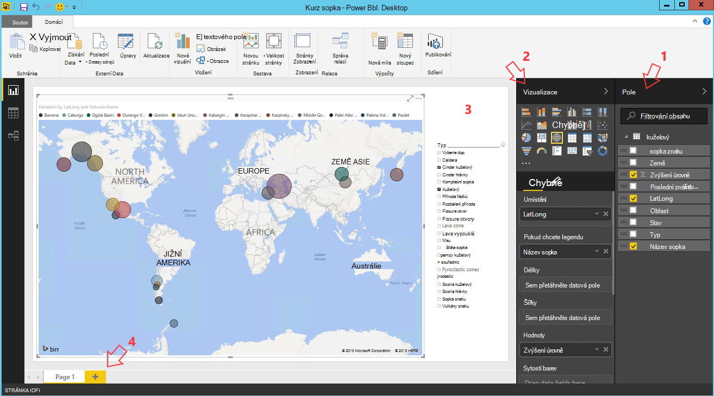

<properties
    pageTitle="Deset věcí, které můžete provádět na jiné vědecké dat virtuálního počítače | Microsoft Azure"
    description="Proveďte různé průzkum a úkol modelování dat vědy virtuálního počítače."
    services="machine-learning"
    documentationCenter=""
    authors="bradsev"
    manager="jhubbard"
    editor="cgronlun"  />

<tags
    ms.service="machine-learning"
    ms.workload="data-services"
    ms.tgt_pltfrm="na"
    ms.devlang="na"
    ms.topic="article"
    ms.date="08/29/2016"
    ms.author="gokuma;weig;bradsev" />

# <a name="ten-things-you-can-do-on-the-data-science-virtual-machine"></a>Deset věcí, které můžete provádět na jiné vědecké dat virtuálního počítače

Virtuální počítač vědy dat Microsoft (DSVM) je výkonné datové vývojové prostředí pro výzkum, který umožňuje dělat nejrůznější věci průzkum a modelování dat. Prostředí pochází již vytvořené a skupinové s několika Oblíbené dat analytických nástrojů, které usnadňují začít rychle pracovat s analýz pro místní, cloudu nebo hybridních nasazeních. DSVM spolupracuje s mnoha Azure služeb a bude moct číst a zpracování dat, která už je uložený na Azure, v Azure SQL datový sklad, jezera dat Azure, úložišti Azure nebo DocumentDB. Můžete taky využít další nástroje analýzy například Azure počítače učení s pomocí Azure Data Factory.


V tomto článku si projdeme používání vaší DSVM dělat nejrůznější věci vědy data a pracovat s jinými službami Azure. Tady jsou některé věci, které můžete provádět na DSVM:

1. Zkoumání dat a vývoj modelech místně na DSVM pomocí serveru Microsoft R, Python
2. Použití poznámkového bloku Jupyter experimentovat s daty v prohlížeči pomocí Python 2, Python 3 Microsoft R připravení verzi enterprise r sice pro škálovatelnost a výkon
3. Umožňují modely, vytvořené pomocí R a Python na výukové počítače Azure tak klientské aplikace můžete získat přístup k vaší modelů pomocí rozhraní jednoduché webových služeb
4. Správa Azure zdrojů pomocí Azure portál nebo prostředí Powershell
5. Rozšíření prostoru úložiště a sdílení velkých datových sad / kódu přes celý tým vytvořením úložiště souborů Azure jako připojit disk na vaše DSVM
6. Sdílení kód se svým týmem pomocí Github a přístup k úložišti pomocí předinstalovaná libovolná klienty - flám libovolná libovolná grafického rozhraní.
7. Přístup k různých Azure dat a analýzy služby, jako třeba úložišti objektů blob Azure, jezera dat Azure, Azure HDInsight (Hadoop), Azure DocumentDB Azure SQL datový sklad & databáze
8. Vytvoření sestav a řídicích panelů pomocí Power BI Desktop jsou předinstalované ve DSVM a nasazení v cloudu
9. Dynamicky měřítko DSVM vlastním potřebám projektu
10. Další nástroje nainstalovat virtuálního počítače   


>[AZURE.NOTE] Další nadbytečným poplatkům se použije pro řadu dalších dat úložiště a technologie pro analýzu služby uvedené v tomto článku. Získáte [Azure ceny](https://azure.microsoft.com/pricing/) stránku Podrobnosti.


**Zjistit předpoklady pro**

- Budete potřebovat Azure předplatného. Můžete registraci bezplatnou zkušební verzi [tady](https://azure.microsoft.com/free/).

- Pokyny k vytváření virtuálního počítače vědy dat na portálu Azure jsou k dispozici [vytváření virtuálních počítačů](https://portal.azure.com/#create/microsoft-ads.standard-data-science-vmstandard-data-science-vm).

## <a name="1-explore-data-and-develop-models-using-microsoft-r-server-or-python"></a>1. zkoumání dat a vývoj modely pomocí účtu Microsoft R Server nebo Python

Jazyky, jako je R a Python můžete udělat analýzu dat přímo na DSVM.

R můžete použít integrovaném vývojovém prostředí s názvem "Otočení R Enterprise 8.0", která se nachází na nabídku start nebo na ploše. Microsoft poskytuje další knihovny nad otevřít zdroj/CRAN-R povolit scalable technologie pro analýzu a možnost k analýze dat větší než velikost paměti Povolené provedením paralelní blokového analýzy. Můžete taky nainstalovat IDE R podle svého výběru jako [RStudio](https://www.rstudio.com/products/rstudio-desktop/).

Pro Python můžete použít integrovaném vývojovém prostředí jako Visual Studio Edition komunity, který má Python nástroje pro rozšíření Visual Studio (PTVS) jsou předinstalované. Ve výchozím nastavení pouze základní 2.7 Python nakonfigurovaný na PTVS (bez libovolné analýzy knihovny jako SciKit, Pandas). Aby Anaconda Python 2.7 a 3.5 je potřeba postupujte takto:

* Vytvořit vlastní prostředí pro každou verzí tak, že přejdete na **Nástroje** -> **Python nástroje** -> **Python prostředí** a pak kliknete na "**+ vlastní**" v edici komunity Visual Studio 2015
* Zadat popis a nastavení dráhy předponu prostředí jako *c:\anaconda* Anaconda Python 2.7 nebo *c:\anaconda\envs\py35* pro Anaconda Python 3.5
* Klikněte na **Automatické rozpoznávání** a potom **použít** uložte prostředí.

Takto vypadá nastavení vlastního prostředí ve Visual Studiu.


Najdete v [dokumentaci PTVS](https://github.com/Microsoft/PTVS/wiki/Selecting-and-Installing-Python-Interpreters#hey-i-already-have-an-interpreter-on-my-machine-but-ptvs-doesnt-seem-to-know-about-it) další podrobnosti o tom, jak vytvořit Python prostředí.

Nyní jsou nastaven pro vytvoření nového projektu Python. Přejděte k **souboru** -> **Nový** -> **projektu** -> **Python** a vyberte typ Python aplikace vytváříte. Nastavení prostředí Python pro aktuální projekt na požadovanou verzi (Anaconda 2.7 nebo 3.5): klikněte pravým tlačítkem myši **Python prostředí**, vyberte **Prostředí Python přidat nebo odebrat**a pak vyberte požadované prostředí chcete přidružit k projektu. Můžete najít další informace o práci s PTVS na stránce [si přečtěte následující dokumentaci](https://github.com/Microsoft/PTVS/wiki) produktu.

## <a name="2-using-a-jupyter-notebook-to-explore-and-model-your-data-with-python-or-r"></a>2. použitím Jupyter poznámkového bloku na prozkoumávání a modelování dat pomocí Python nebo R

Poznámkový blok Jupyter je výkonné prostředí, kde prohlížečový "integrovaném vývojovém prostředí" průzkum a modelování. V poznámkovém bloku Jupyter můžete Python 2, Python 3 nebo R (Otevřít zdroj i ze serveru Microsoft R).

Spuštění Jupyter poznámkového bloku klepněte na ikonu nabídky start nebo ikony na ploše s názvem **Jupyter Poznámkový blok**. V DSVM můžete taky přejít na "https://localhost:9999 /" pro přístup k Jupiter Poznámkový blok. Pokud budete vyzváni k zadání hesla, pomocí pokynů uvedených v části ***vytvoření silného hesla na serveru Poznámkový blok Jupyter*** [zřízení Microsoft dat pro výzkum Virtual Machine](machine-learning-data-science-provision-vm.md) téma Vytvoření silného hesla pro přístup k Jupyter Poznámkový blok. 

Jakmile jste otevřeli Poznámkový blok, zobrazí se adresář, který obsahuje několik příklad poznámkové bloky, které jsou předem sbalené do DSVM. Nyní máte tyto možnosti:

- Klikněte na Poznámkový blok zobrazit kód.
- provedení každou buňku stisknutím kombinace kláves **SHIFT + ENTER**.
- spuštění celý poznámkový blok kliknutím na **buňku** -> **Spustit**
- Vytvořte nový poznámkový blok stisknutím klepnutím na ikonu Jupyter (v levém horním rohu) a kliknutím na tlačítko **Nový** na pravé straně a potom kliknutím na jazyka poznámkového bloku (označovaná taky jako jádra).   


>[AZURE.NOTE] Momentálně podporujeme Python 2.7, Python 3.5 a R. R jádra podporuje programování jak otevřít zdroj R stejně jako v podniku scalable Microsoft R Server.   


Jakmile se dostanete v poznámkovém bloku, které můžete prozkoumat dat, vytvoření modelu, test modelu pomocí svého výběru knihoven.


## <a name="3-build-models-using-r-or-python-and-operationalize-them-using-azure-machine-learning"></a>3. vytvoření modelů pomocí R nebo Python a umožňují pomocí výukové počítače Azure

Jakmile máte vytvořené a ověřit modelu dalším krokem je obvykle ho nasadit do provozu. Díky svému klientovi aplikací vyvolat předpovědí modelu v reálném čase nebo na základě dávku režimu. Azure výukové počítače poskytuje mechanismus umožňují modelu integrované R nebo Python.

Když umožňují modelu Azure počítač přečíst vystaven webové služby umožňující klientům volat REST, které předejte na vstupní parametry a přijímání předpovědí z modelu jako výstupy.   


>[AZURE.NOTE] Pokud jste ještě nemáte svůj AzureML, můžete získat volného prostoru nebo standardní pracovního prostoru na domovské stránce [AzureML Studio](https://studio.azureml.net/) a kliknutím na "Začínáme".   


### <a name="build-and-operationalize-python-models"></a>Tvůrce dotazů a umožňují Python modely

Tady je fragment kódu vyvinuté v poznámkovém bloku Jupyter Python, který vytvoří jednoduchou modelu pomocí knihovnu SciKit informace.

    #IRIS classification
    from sklearn import datasets
    from sklearn import svm
    clf = svm.SVC()
    iris = datasets.load_iris()
    X, y = iris.data, iris.target
    clf.fit(X, y)

Metoda slouží k nasazení python modely Azure počítače výukové zalamuje předpověď modelu do funkce a upraví poskytovanou knihovnu předinstalovaná python Azure počítače výukové atributy, které označují svoje ID Azure počítače výukové pracovního prostoru, klíč rozhraní API a zadání a vrátí parametry.  

    from azureml import services
    @services.publish(workspaceid, auth_token)
    @services.types(sep_l = float, sep_w = float, pet_l=float, pet_w=float)
    @services.returns(int) #0, or 1, or 2
    def predictIris(sep_l, sep_w, pet_l, pet_w):
    inputArray = [sep_l, sep_w, pet_l, pet_w]
    return clf.predict(inputArray)

Klient teď můžete volat volání webové služby. Existuje obálky snadno ovladatelné funkce, které vytvářet žádosti o rozhraní REST API. Tady je ukázka kód využívat webové služby.

    # Consume through web service URL and keys
    from azureml import services
    @services.service(url, api_key)
    @services.types(sep_l = float, sep_w = float, pet_l=float, pet_w=float)
    @services.returns(float)
    def IrisPredictor(sep_l, sep_w, pet_l, pet_w):
    pass

    IrisPredictor(3,2,3,4)


>[AZURE.NOTE] Knihovnu Azure počítače výukové je podporována pouze na Python 2.7 aktuálně.   


### <a name="build-and-operationalize-r-models"></a>Modely Tvůrce dotazů a umožňují R

Modely R integrované na počítači virtuální vědy dat nebo kdekoli jinde na výukové počítače Azure způsobem, který je podobný jak se to dělá pro Python nástroje můžete nasazovat. Svůj jsou kroky:

- Vytvoření souboru settings.json jako níže zadejte svoje ID pracovní prostor a auth tokenu.
- Napište obálka pro modelu předpovídání (funkce).
- volání ```publishWebService``` v knihovně Azure počítače výukové předat v obálky (funkce).  

Tady je postup a fragmenty kódu, které můžete použít k nastavení a vytvářet, publikovat a používání modelu jako webové služby Azure počítač přečíst.

#### <a name="setup"></a>Nastavení

1.  Instalace balíček AzureML R zadáním ```install.packages("AzureML")``` v integrovaném vývojovém prostředí otočení R Enterprise 8.0 nebo R IDE.
2.  Stahování RTools [tady](https://cran.r-project.org/bin/windows/Rtools/). Potřebujete nástroj zip v path (a pojmenované zip.exe) umožňují balíčku R do AzureML.
3.  Vytvoření souboru settings.json v části adresář s názvem ```.azureml``` v části výchozí adresáře a zadejte parametry z Azure ML pracovního prostoru:

Settings.JSON struktura souboru:

    {"workspace":{
    "id"                  : "ENTER YOUR AZUREML WORKSPACE ID",
    "authorization_token" : "ENTER YOUR AZUREML AUTH TOKEN"
    }}


#### <a name="build-a-model-in-r-and-publish-it-in-azure-ml"></a>Vytvoření modelu R a její publikování v Azure ML

    library(AzureML)
    ws <- workspace(config="~/.azureml/settings.json")

    if(!require("lme4")) install.packages("lme4")
    library(lme4)
    set.seed(1)
    train <- sleepstudy[sample(nrow(sleepstudy), 120),]
    m <- lm(Reaction ~ Days + Subject, data = train)

    # Define a prediction function to publish based on the model:
    sleepyPredict <- function(newdata){
        predict(m, newdata=newdata)
    }

    ep <- publishWebService(ws, fun = sleepyPredict, name="sleepy lm", inputSchema = sleepstudy, data.frame=TRUE)

#### <a name="consume-the-model-deployed-in-azure-ml"></a>Používání model nasazený v Azure ML

Využívat modelu z klientské aplikace, používáme knihovnu Azure počítače výukové vyhledat publikované webové služby pomocí název `services` volání rozhraní API k určení koncový bod. Potom jen zavoláte `consume` fungovat a předejte v rámci data budou předpovídat.
Následující kód slouží k používání modelu publikován jako webové služby Azure počítače výukové.


    library(AzureML)
    library(lme4)
    ws <- workspace(config="~/.azureml/settings.json")

    s <-  services(ws, name = "sleepy lm")
    s <- tail(s, 1) # use the last published function, in case of duplicate function names

    ep <- endpoints(ws, s)

    # OK, try this out, and compare with raw data
    ans = consume(ep, sleepstudy)$ans

Najdete další informace o knihovně Azure počítače výukové R [tady](https://cran.r-project.org/web/packages/AzureML/AzureML.pdf).


## <a name="4-administer-your-azure-resources-using-azure-portal-or-powershell"></a>4. Azure zdrojů pomocí prostředí Powershell nebo Azure portálu Správa

DSVM nejen umožňuje vytvářet řešení analýzy místně na virtuální počítač, ale lze také přístup ke službám na Azure cloudu společnosti Microsoft. Azure obsahuje několik využití úložiště, služby technologie pro analýzu dat a dalších službách, které můžete spravovat ani otevírat z vaší DSVM.

Ke správě Azure předplatné a cloudové zdroje můžete pomocí prohlížeče a přejděte na [portál Azure](https://portal.azure.com). Můžete taky Azure Powershellu ke správě zdrojů prostřednictvím skriptu a Azure předplatného.
Azure Powershell můžete spustit z zástupce na ploše nebo z nabídky start s názvem "Microsoft Azure Powershell". [Informace](../powershell-azure-resource-manager.md) v nápovědě k Microsoft Azure Powershell Další informace o tom, jak můžete spravovat Azure předplatného a zdrojů pomocí skriptů Windows Powershellu.


## <a name="5-extend-your-storage-space-with-a-shared-file-system"></a>5. rozšíření úložný prostor s sdílených souborů systému

Data vědeckých můžete sdílet velkých sad dat, kód nebo jiných zdrojů v rámci týmu. DSVM samotné má 70GB volného místa. Rozšíření úložiště, můžete pomocí služby Azure souboru a buď připojit v DSVM nebo získat přístup prostřednictvím rozhraní REST API.   


>[AZURE.NOTE] Maximální místa sdílení souborů služby Azure 5TB označeným je jednotlivých souborů limit velikosti 1TB.   


Azure Powershell můžete použít k vytvoření služby Azure soubor sdílet. Tady je spuštění ve skupinovém rámečku Azure PowerShell vytvořit sdílení služby Azure soubor skriptu.

    # Authenticate to Azure.
    Login-AzureRmAccount
    # Select your subscription
    Get-AzureRmSubscription –SubscriptionName "<your subscription name>" | Select-AzureRmSubscription
    # Create a new resource group.
    New-AzureRmResourceGroup -Name <dsvmdatarg>
    # Create a new storage account. You can reuse existing storage account if you wish.
    New-AzureRmStorageAccount -Name <mydatadisk> -ResourceGroupName <dsvmdatarg> -Location "<Azure Data Center Name For eg. South Central US>" -Type "Standard_LRS"
    # Set your current working storage account
    Set-AzureRmCurrentStorageAccount –ResourceGroupName "<dsvmdatarg>" –StorageAccountName <mydatadisk>

    # Create a Azure File Service Share
    $s = New-AzureStorageShare <<teamsharename>>
    # Create a directory under the FIle share. You can give it any name
    New-AzureStorageDirectory -Share $s -Path <directory name>
    # List the share to confirm that everything worked
    Get-AzureStorageFile -Share $s


Teď, když jste vytvořili Azure sdílené složky, připojíte se v libovolné virtuálního počítače v Azure. Důrazně doporučujeme, aby OM je ve stejném Azure datovém centru účtem úložiště kvůli nižším poplatkům za přenos latence a data. Tady jsou příkazy můžete připojit jednotku na DSVM spuštění na Azure Powershellu.


    # Get storage key of the storage account that has the Azure file share from Azure portal. Store it securely on the VM to avoid prompted in next command.
    cmdkey /add:<<mydatadisk>>.file.core.windows.net /user:<<mydatadisk>> /pass:<storage key>

    # Mount the Azure file share as Z: drive on the VM. You can chose another drive letter if you wish
    net use z:  \\<mydatadisk>.file.core.windows.net\<<teamsharename>>


Teď můžete využít tuto jednotku stejně jako normální disk na OM.

## <a name="6-share-code-with-your-team-using-github"></a>6. kód sdílet s týmem pomocí Github

Github slouží jako úložiště kód nastavuje spoustu ukázkový kód a zdrojů pro používání různých technologií sdíleny Komunita vývojářů různých nástrojů. Libovolná používá jako technologie sledování a ukládání verzí souborů kód. Github je také platforma které můžete vytvořit vlastní úložiště ukládat sdílený kód a přečtěte následující dokumentaci pro váš tým, implementace správy verzí a také určit, kteří mají přístup k prohlížení a přispívání kód. Navštivte [stránku nápovědy Github](https://help.github.com/) Další informace o použití libovolná. Github můžete použít jako jedním ze způsobů spolupráci s týmem, použít kód vyvinutý komunity a zpátky do komunity přispívat kód.

DSVM již přijat s klientských nástrojích obou příkazového řádku jako dobře grafického rozhraní pro přístup k Github úložiště. Nástroj příkazového řádku pro práci s libovolná a Github se nazývá libovolná flám. Visual Studio nainstalovaných DSVM má libovolná rozšíření. Po spuštění ikony najdou pro tyto nástroje v nabídce start a na plochu.

Ke stažení kódu z úložiště Github použijete ```git clone``` příkaz. Příklad ke stažení úložiště pro výzkum data publikované společnost Microsoft do aktuálního adresáře spuštěním následujícího příkazu Jakmile se dostanete ```git-bash```.

    git clone https://github.com/Azure/Azure-MachineLearning-DataScience.git

Ve Visual Studiu můžete udělat stejnou operaci klonovat. Následující snímek obrazovky ukazuje, jak získat přístup nástroje Github a libovolná ve Visual Studiu.


Můžete najít další informace o použití libovolná pro práci s úložišti Github z několika zdrojů k dispozici na github.com. [Cheaty list](https://training.github.com/kit/downloads/github-git-cheat-sheet.pdf) je užitečné odkaz.


## <a name="7-access-various-azure-data-and-analytics-services"></a>7. přístup k různých Azure dat a analýzy služeb

### <a name="azure-blob"></a>Objektů Blob Azure

Objektů blob Azure je spolehlivé, vyplatí cloudového úložiště pro data velká a malá. Dejte nám podívejte přesunutí dat do objektů Blob Azure a přístup k datům uloženým v objektů Blob Azure.

**Předpoklady**

- **Vytvoření účtu úložiště objektů Blob Azure z [Azure portálu](https://portal.azure.com).**


- Potvrďte, že nástroj AzCopy předinstalovaná příkazového řádku se nachází v ```C:\Program Files (x86)\Microsoft SDKs\Azure\AzCopy\azcopy.exe```. Můžete přidat adresář obsahující azcopy.exe do vašeho prostředí PATH vyhnout cestu úplné příkaz při spuštění tento nástroj. Další informace o nástroji AzCopy naleznete v [dokumentaci AzCopy](../storage/storage-use-azcopy.md)

- Spusťte nástroj Průzkumníka úložišť Azure. Můžete stáhnout z [Microsoft Azure úložiště Průzkumníka](http://storageexplorer.com/). 


**Přesuňte data z OM objektů Blob Azure: AzCopy**

Přesouvání dat mezi místním soubory a úložiště objektů blob, můžete použít AzCopy příkazového řádku nebo Powershellu:

    AzCopy /Source:C:\myfolder /Dest:https://<mystorageaccount>.blob.core.windows.net/<mycontainer> /DestKey:<storage account key> /Pattern:abc.txt

Nahraďte **C:\myfolder** cestu, kde je soubor uložený, **mystorageaccount** na účtu název úložiště objektů blob, **mycontainer** jméno container **klíč účtu úložiště** pro vaše přístupová klávesa úložiště objektů blob. Najděte svoje přihlašovací údaje účtu úložiště [Azure](https://portal.azure.com)portálu.


Spusťte příkaz AzCopy v prostředí PowerShell nebo z příkazového řádku. Tady je několik příklad použití příkazu AzCopy:


    # Copy *.sql from local machine to a Azure Blob
    "C:\Program Files (x86)\Microsoft SDKs\Azure\AzCopy\azcopy" /Source:"c:\Aaqs\Data Science Scripts" /Dest:https://[ENTER STORAGE ACCOUNT].blob.core.windows.net/[ENTER CONTAINER] /DestKey:[ENTER STORAGE KEY] /S /Pattern:*.sql

    # Copy back all files from Azure Blob container to Local machine

    "C:\Program Files (x86)\Microsoft SDKs\Azure\AzCopy\azcopy" /Dest:"c:\Aaqs\Data Science Scripts\temp" /Source:https://[ENTER STORAGE ACCOUNT].blob.core.windows.net/[ENTER CONTAINER] /SourceKey:[ENTER STORAGE KEY] /S


Po spuštění příkazu AzCopy zkopírujte do objektů blob Azure zobrazí váš soubor zobrazí v Průzkumníku úložišť Azure brzy.


**Přesuňte data z OM objektů Blob Azure: Průzkumníka úložišť Azure**

Data z místního souboru lze také uložit do svého OM pomocí Průzkumníka úložišť Azure:

- Odeslání dat do kontejneru, vyberte cílový kontejner a klikněte na tlačítko **Odeslat** .
- Klikněte na **...** napravo od pole **soubory** , vyberte jeden nebo více souborů nahrávat ze systému souborů a klikněte na tlačítko **Nahrát** na zahájit nahrávání souborů.


**Načtení dat z objektů Blob Azure: modul AML Readeru**

V Azure počítače výukové Studio slouží k načtení dat z vaší objektů blob **modul importovat Data** .


**Načtení dat z objektů Blob Azure: Python ODBC**

Knihovna **BlobService** umožňuje číst data přímo z objektů blob v programu Poznámkový blok Jupyter nebo Python.

Nejdřív importujte požadovaných balíčků:

    import pandas as pd
    from pandas import Series, DataFrame
    import numpy as np
    import matplotlib.pyplot as plt
    from time import time
    import pyodbc
    import os
    from azure.storage.blob import BlobService
    import tables
    import time
    import zipfile
    import random

Potom zapojte svoje přihlašovací údaje účtu objektů Blob Azure a načtení dat z objektů Blob:

    CONTAINERNAME = 'xxx'
    STORAGEACCOUNTNAME = 'xxxx'
    STORAGEACCOUNTKEY = 'xxxxxxxxxxxxxxxx'
    BLOBNAME = 'nyctaxidataset/nyctaxitrip/trip_data_1.csv'
    localfilename = 'trip_data_1.csv'
    LOCALDIRECTORY = os.getcwd()
    LOCALFILE =  os.path.join(LOCALDIRECTORY, localfilename)

    #download from blob
    t1 = time.time()
    blob_service = BlobService(account_name=STORAGEACCOUNTNAME,account_key=STORAGEACCOUNTKEY)
    blob_service.get_blob_to_path(CONTAINERNAME,BLOBNAME,LOCALFILE)
    t2 = time.time()
    print(("It takes %s seconds to download "+BLOBNAME) % (t2 - t1))

    #unzipping downloaded files if needed
    #with zipfile.ZipFile(ZIPPEDLOCALFILE, "r") as z:
    #    z.extractall(LOCALDIRECTORY)

    df1 = pd.read_csv(LOCALFILE, header=0)
    df1.columns = ['medallion','hack_license','vendor_id','rate_code','store_and_fwd_flag','pickup_datetime','dropoff_datetime','passenger_count','trip_time_in_secs','trip_distance','pickup_longitude','pickup_latitude','dropoff_longitude','dropoff_latitude']
    print 'the size of the data is: %d rows and  %d columns' % df1.shape

Data čte ve jako snímek dat:


### <a name="azure-data-lake"></a>Jezera dat Azure

Azure úložný prostor jezera slouží jako úložiště hyper měřítko pro analýzy velký data pracovního vytížení a kompatibilní s Hadoop Distributed soubor systému (HDFS). Funguje s ekosystému Hadoop a jezera analýzy dat Azure. Ukážeme, jak můžete k přesunutí dat do úložiště jezera dat Azure a spuštění analýzy pomocí analýzy jezera dat Azure.

**Předpoklady**

- Vytvořte svůj jezera analýzy dat Azure [Azure](https://portal.azure.com)portálu.


- **Nástroje jezera dat Azure** ve **Visual Studiu** , najdete na tento [odkaz](https://www.microsoft.com/download/details.aspx?id=49504) je už nainstalovaná na Visual Studio komunity Edition což je virtuální počítače. Po spuštění aplikace Visual Studio a protokolování v Azure předplatné, zobrazí se váš účet Azure analýzy dat a úložiště v levém panelu aplikace Visual Studio.


**Přesuňte data z OM do Data jezera: Průzkumník jezera dat Azure**

K nahrání data z místního souborů v počítači virtuální jezera datový úložiště můžete používat **Průzkumník jezera dat Azure** .


Můžete také vytvořit datového kanálu k productionize přesun dat z Azure dat jezera nebo pomocí [Factory(ADF) dat Azure](https://azure.microsoft.com/services/data-factory/). Označovány můžete tento [článek](https://azure.microsoft.com/blog/creating-big-data-pipelines-using-azure-data-lake-and-azure-data-factory/) vás provede kroky k vytvoření datové kanály.

**Načtení dat z objektů Blob Azure jezera dat: U SQL**

Pokud jsou vaše data uložená v úložišti objektů Blob Azure, můžete přímo číst dat z Azure úložiště objektů blob v dotazu U SQL. Před psaní dotazu U SQL, zkontrolujte, jestli že váš účet úložiště objektů blob je propojená s vaší jezera dat Azure. Přejděte na **portál Azure**najít řídícího jezera analýzy dat Azure, klikněte na **Přidat zdroj dat**, vyberte typ úložiště k **Základnímu úložišti Azure** a připojte se název účtu úložiště a klíče. Potom budete moct odkazují na data uložená v účtu úložiště.


Ve Visual Studiu můžete číst data z úložiště objektů blob, proveďte některé manipulaci s daty, funkce inženýrské funkce a výstup Výsledná data, která chcete jezera dat Azure nebo úložišti objektů Blob Azure. Když odkazují na data v úložišti objektů blob **wasb: / /**; Když odkazují na data v Azure dat jezera **swbhdfs: / /**


Mohli byste použít následující dotazy U SQL ve Visual Studiu:

    @a =
        EXTRACT medallion string,
                hack_license string,
                vendor_id string,
                rate_code string,
                store_and_fwd_flag string,
                pickup_datetime string,
                dropoff_datetime string,
                passenger_count int,
                trip_time_in_secs double,
                trip_distance double,
                pickup_longitude string,
                pickup_latitude string,
                dropoff_longitude string,
                dropoff_latitude string

        FROM "wasb://<Container name>@<Azure Blob Storage Account Name>.blob.core.windows.net/<Input Data File Name>"
        USING Extractors.Csv();

    @b =
        SELECT vendor_id,
        COUNT(medallion) AS cnt_medallion,
        SUM(passenger_count) AS cnt_passenger,
        AVG(trip_distance) AS avg_trip_dist,
        MIN(trip_distance) AS min_trip_dist,
        MAX(trip_distance) AS max_trip_dist,
        AVG(trip_time_in_secs) AS avg_trip_time
        FROM @a
        GROUP BY vendor_id;

    OUTPUT @b   
    TO "swebhdfs://<Azure Data Lake Storage Account Name>.azuredatalakestore.net/<Folder Name>/<Output Data File Name>"
    USING Outputters.Csv();

    OUTPUT @b   
    TO "wasb://<Container name>@<Azure Blob Storage Account Name>.blob.core.windows.net/<Output Data File Name>"
    USING Outputters.Csv();


Po odeslání dotazu na server, zobrazí se diagram zobrazující stav práce.


**Data v dat jezera dotazu: U SQL**

Po datové požití do jezera dat Azure, můžete k vytváření dotazů a dat prozkoumání [jazyka U SQL](../data-lake-analytics/data-lake-analytics-u-sql-get-started.md) . Jazyk U SQL je podobný T-SQL, ale kombinuje některé funkce C# tak, aby uživatelé mohli napsat vlastní moduly, uživatelsky definované funkce a atd. Skript můžete použít v předchozím kroku.

Po dotaz odeslán server, tripdata_summary. CSV najdete krátce v **Průzkumníku jezera dat Azure**, může náhled dat kliknutím pravým tlačítkem myši na soubor.


Pokud chcete zobrazit informace o souboru:


### <a name="hdinsight-hadoop-clusters"></a>HDInsight Hadoop clusterů

Azure HDInsight je spravované Apache Hadoop, Spark, HBase a bouře služby v cloudu. Můžete snadno spolupracovat s Azure HDInsight clusterů z dat pro výzkum virtuálního počítače.

**Předpoklady**

- Vytvoření účtu úložiště objektů Blob Azure z [Azure portálu](https://portal.azure.com). Tento účet úložiště se používá k ukládání dat clusterů HDInsight.


- Přizpůsobení Azure HDInsight Hadoop clusterů z [Azure portálu](machine-learning-data-science-customize-hadoop-cluster.md)

  - Je nutné propojit vytvořená pomocí svůj cluster HDInsight při vytvoření účtu úložiště. Tento účet úložiště se používá pro přístup k datům, která lze vykonat v rámci clusteru.


  - Po vytvoření otevřela, musíte povolit **Vzdáleného přístupu** hlavy uzel clusteru. Mějte na paměti vzdáleného přístupu přihlašovací údaje zadané tady (jiné než určeným pro clusteru v jeho vytvoření): byste potřebovali je dole.


  - Vytvoření pracovního prostoru Azure ML. V tomto pracovním prostoru ML se uloží pokusy výukové vašeho počítače. Vyberte zvýrazněný možnosti portálu jak ukazuje následující obrázek.


  - Zadejte parametry Azure ML pracovního prostoru


  - Odeslání dat pomocí IPython Poznámkový blok. Nejdřív import požadovaných balíčků, připojte přihlašovací údaje, vytvořte databáze ve vašem účtu úložiště a potom načítání dat HDI clusterů.


        #Import required Packages
        import pyodbc
        import time as time
        import json
        import os
        import urllib
        import urllib2
        import warnings
        import re
        import pandas as pd
        import matplotlib.pyplot as plt
        from azure.storage.blob import BlobService
        warnings.filterwarnings("ignore", category=UserWarning, module='urllib2')


        #Create the connection to Hive using ODBC
        SERVER_NAME='xxx.azurehdinsight.net'
        DATABASE_NAME='nyctaxidb'
        USERID='xxx'
        PASSWORD='xxxx'
        DB_DRIVER='Microsoft Hive ODBC Driver'
        driver = 'DRIVER={' + DB_DRIVER + '}'
        server = 'Host=' + SERVER_NAME + ';Port=443'
        database = 'Schema=' + DATABASE_NAME
        hiveserv = 'HiveServerType=2'
        auth = 'AuthMech=6'
        uid = 'UID=' + USERID
        pwd = 'PWD=' + PASSWORD
        CONNECTION_STRING = ';'.join([driver,server,database,hiveserv,auth,uid,pwd])
        connection = pyodbc.connect(CONNECTION_STRING, autocommit=True)
        cursor=connection.cursor()


        #Create Hive database and tables
        queryString = "create database if not exists nyctaxidb;"
        cursor.execute(queryString)

        queryString = """
                        create external table if not exists nyctaxidb.trip
                        (
                            medallion string,
                            hack_license string,
                            vendor_id string,
                            rate_code string,
                            store_and_fwd_flag string,
                            pickup_datetime string,
                            dropoff_datetime string,
                            passenger_count int,
                            trip_time_in_secs double,
                            trip_distance double,
                            pickup_longitude double,
                            pickup_latitude double,
                            dropoff_longitude double,
                            dropoff_latitude double)  
                        PARTITIONED BY (month int)
                        ROW FORMAT DELIMITED FIELDS TERMINATED BY ',' lines terminated by '\\n'
                        STORED AS TEXTFILE LOCATION 'wasb:///nyctaxidbdata/trip' TBLPROPERTIES('skip.header.line.count'='1');
                    """
        cursor.execute(queryString)

        queryString = """
                        create external table if not exists nyctaxidb.fare
                        (
                            medallion string,
                            hack_license string,
                            vendor_id string,
                            pickup_datetime string,
                            payment_type string,
                            fare_amount double,
                            surcharge double,
                            mta_tax double,
                            tip_amount double,
                            tolls_amount double,
                            total_amount double)
                        PARTITIONED BY (month int)
                        ROW FORMAT DELIMITED FIELDS TERMINATED BY ',' lines terminated by '\\n'
                        STORED AS TEXTFILE LOCATION 'wasb:///nyctaxidbdata/fare' TBLPROPERTIES('skip.header.line.count'='1');
                    """
        cursor.execute(queryString)


        #Upload data from blob storage to HDI cluster
        for i in range(1,13):
            queryString = "LOAD DATA INPATH 'wasb:///nyctaxitripraw2/trip_data_%d.csv' INTO TABLE nyctaxidb2.trip PARTITION (month=%d);"%(i,i)
            cursor.execute(queryString)
            queryString = "LOAD DATA INPATH 'wasb:///nyctaxifareraw2/trip_fare_%d.csv' INTO TABLE nyctaxidb2.fare PARTITION (month=%d);"%(i,i)  
            cursor.execute(queryString)


- Případně můžete postupovat podle tohoto [návodu](machine-learning-data-science-process-hive-walkthrough.md) odeslání NYC Taxi dat do HDI obrázku. Hlavních kroků, patří:

    - AzCopy: stahování ZIP CSV veřejné objektů blob do místní složky
    - AzCopy: nahrání rozbaleny CSV v místní složce HDI clusteru
    - Přihlaste se k hlavního uzlu clusteru Hadoop a připravit pro analýzu průzkumné dat

Po načtení dat do HDI clusteru můžete zkontrolovat, že data v Průzkumníku úložišť Azure. A máte nyctaxidb databáze vytvořené v HDI obrázku.


**Průzkum: podregistru dotazů v Python**

Protože data jsou ve Hadoop obrázku, můžete pro připojení k databázi clusterů Hadoop a dotaz pomocí podregistru na průzkum a doporučení inženýrské funkce balíček pyodbc. Můžete zobrazit existující tabulky, kterou jsme vytvořili v základní kroku.

    queryString = """
        show tables in nyctaxidb2;
        """
    pd.read_sql(queryString,connection)


Podívejme se na počet záznamů v každý měsíc a četnosti šikmý nebo nejsou v tabulce ze služební cesty:

    queryString = """
        select month, count(*) from nyctaxidb.trip group by month;
        """
    results = pd.read_sql(queryString,connection)

    %matplotlib inline

    results.columns = ['month', 'trip_count']
    df = results.copy()
    df.index = df['month']
    df['trip_count'].plot(kind='bar')


    queryString = """
        SELECT tipped, COUNT(*) AS tip_freq
        FROM
        (
            SELECT if(tip_amount > 0, 1, 0) as tipped, tip_amount
            FROM nyctaxidb.fare
        )tc
        GROUP BY tipped;
        """
    results = pd.read_sql(queryString,connection)

    results.columns = ['tipped', 'trip_count']
    df = results.copy()
    df.index = df['tipped']
    df['trip_count'].plot(kind='bar')


Můžete taky výpočet vzdálenost mezi výdeje a umístění a dropoff jsme ho porovná dráhy ze služební cesty.

    queryString = """
                    select pickup_longitude, pickup_latitude, dropoff_longitude, dropoff_latitude, trip_distance, trip_time_in_secs,
                        3959*2*2*atan((1-sqrt(1-pow(sin((dropoff_latitude-pickup_latitude)
                        *radians(180)/180/2),2)-cos(pickup_latitude*radians(180)/180)
                        *cos(dropoff_latitude*radians(180)/180)*pow(sin((dropoff_longitude-pickup_longitude)*radians(180)/180/2),2)))
                        /sqrt(pow(sin((dropoff_latitude-pickup_latitude)*radians(180)/180/2),2)
                        +cos(pickup_latitude*radians(180)/180)*cos(dropoff_latitude*radians(180)/180)*
                        pow(sin((dropoff_longitude-pickup_longitude)*radians(180)/180/2),2))) as direct_distance
                        from nyctaxidb.trip
                        where month=1
                            and pickup_longitude between -90 and -30
                            and pickup_latitude between 30 and 90
                            and dropoff_longitude between -90 and -30
                            and dropoff_latitude between 30 and 90;
                """
    results = pd.read_sql(queryString,connection)
    results.head(5)


    results.columns = ['pickup_longitude', 'pickup_latitude', 'dropoff_longitude',
                       'dropoff_latitude', 'trip_distance', 'trip_time_in_secs', 'direct_distance']
    df = results.loc[results['trip_distance']<=100] #remove outliers
    df = df.loc[df['direct_distance']<=100] #remove outliers
    plt.scatter(df['direct_distance'], df['trip_distance'])


Teď Pojďme připravit vzorky dolů (1 %) množiny dat pro modelování. Můžete tyto údaje použijeme v modulu AML Readeru.


        queryString = """
        create  table if not exists nyctaxi_downsampled_dataset_testNEW (
        medallion string,
        hack_license string,
        vendor_id string,
        rate_code string,
        store_and_fwd_flag string,
        pickup_datetime string,
        dropoff_datetime string,
        pickup_hour string,
        pickup_week string,
        weekday string,
        passenger_count int,
        trip_time_in_secs double,
        trip_distance double,
        pickup_longitude double,
        pickup_latitude double,
        dropoff_longitude double,
        dropoff_latitude double,
        direct_distance double,
        payment_type string,
        fare_amount double,
        surcharge double,
        mta_tax double,
        tip_amount double,
        tolls_amount double,
        total_amount double,
        tipped string,
        tip_class string
        )
        row format delimited fields terminated by ','
        lines terminated by '\\n'
        stored as textfile;
        """
        cursor.execute(queryString)

        --- now insert contents of the join into the above internal table

        queryString = """
        insert overwrite table nyctaxi_downsampled_dataset_testNEW
        select
        t.medallion,
        t.hack_license,
        t.vendor_id,
        t.rate_code,
        t.store_and_fwd_flag,
        t.pickup_datetime,
        t.dropoff_datetime,
        hour(t.pickup_datetime) as pickup_hour,
        weekofyear(t.pickup_datetime) as pickup_week,
        from_unixtime(unix_timestamp(t.pickup_datetime, 'yyyy-MM-dd HH:mm:ss'),'u') as weekday,
        t.passenger_count,
        t.trip_time_in_secs,
        t.trip_distance,
        t.pickup_longitude,
        t.pickup_latitude,
        t.dropoff_longitude,
        t.dropoff_latitude,
        t.direct_distance,
        f.payment_type,
        f.fare_amount,
        f.surcharge,
        f.mta_tax,
        f.tip_amount,
        f.tolls_amount,
        f.total_amount,
        if(tip_amount>0,1,0) as tipped,
        if(tip_amount=0,0,
        if(tip_amount>0 and tip_amount<=5,1,
        if(tip_amount>5 and tip_amount<=10,2,
        if(tip_amount>10 and tip_amount<=20,3,4)))) as tip_class
        from
        (
        select
        medallion,
        hack_license,
        vendor_id,
        rate_code,
        store_and_fwd_flag,
        pickup_datetime,
        dropoff_datetime,
        passenger_count,
        trip_time_in_secs,
        trip_distance,
        pickup_longitude,
        pickup_latitude,
        dropoff_longitude,
        dropoff_latitude,
        3959*2*2*atan((1-sqrt(1-pow(sin((dropoff_latitude-pickup_latitude)
        radians(180)/180/2),2)-cos(pickup_latitude*radians(180)/180)
        *cos(dropoff_latitude*radians(180)/180)*pow(sin((dropoff_longitude-pickup_longitude)*radians(180)/180/2),2)))
        /sqrt(pow(sin((dropoff_latitude-pickup_latitude)*radians(180)/180/2),2)
        +cos(pickup_latitude*radians(180)/180)*cos(dropoff_latitude*radians(180)/180)*pow(sin((dropoff_longitude-pickup_longitude)*radians(180)/180/2),2))) as direct_distance,
        rand() as sample_key

        from trip
        where pickup_latitude between 30 and 90
            and pickup_longitude between -90 and -30
            and dropoff_latitude between 30 and 90
            and dropoff_longitude between -90 and -30
        )t
        join
        (
        select
        medallion,
        hack_license,
        vendor_id,
        pickup_datetime,
        payment_type,
        fare_amount,
        surcharge,
        mta_tax,
        tip_amount,
        tolls_amount,
        total_amount
        from fare
        )f
        on t.medallion=f.medallion and t.hack_license=f.hack_license and t.pickup_datetime=f.pickup_datetime
        where t.sample_key<=0.01
        """
        cursor.execute(queryString)

Po chvíli si můžete prohlédnout, jestli že jsou data načtená v Hadoop clusterů:

    queryString = """
        select * from nyctaxi_downsampled_dataset limit 10;
        """
    cursor.execute(queryString)
    pd.read_sql(queryString,connection)


**Načtení dat z HDI pomocí AML: modul Readeru**

Pomocí modulu **čtečka** ve AML studio může taky otevřete databázi v Hadoop obrázku Připojte se její přihlašovací údaje HDI clusterů a účet Azure úložiště a budete moct vytvářet modely výukové počítače používání databáze v HDI clusterů.


Potom je možné zobrazit scored datovou sadu:


### <a name="azure-sql-data-warehouse--databases"></a>Azure SQL datový sklad & databáze

Azure SQL datový sklad je pružná datový sklad jako služba možnosti v oblasti podnikových SQL serveru.

Zřízení Azure SQL datový sklad podle pokynů uvedených v tomto [článku](../sql-data-warehouse/sql-data-warehouse-get-started-provision.md). Po zřízení Azure SQL datový sklad můžete pomocí tohoto [návodu](machine-learning-data-science-process-sqldw-walkthrough.md) provádět odesílání dat, průzkum a modelování pomocí dat v SQL datový sklad.

#### <a name="azure-documentdb"></a>Azure DocumentDB

Azure DocumentDB je databáze NoSQL v cloudu. Umožňuje pracovat s dokumenty jako JSON a umožňuje ukládat a dotaz dokumenty.

Potřebujete následujících kroků podle požadavků pro přístup k DocumentDB z DSVM.

1. Instalace DocumentDB Python SDK (Spustit ```pip install pydocumentdb``` z příkazového řádku)
1. Vytvoření účtu DocumentDB a dokumentu DB databáze z [Azure portálu](https://portal.azure.com)
1. Stahování "Nástroje pro migraci DocumentDB" [tady](http://www.microsoft.com/downloads/details.aspx?FamilyID=cda7703a-2774-4c07-adcc-ad02ddc1a44d) a extrahujte do adresáře podle svého výběru
1. Import dat JSON (sopka data) uložených na [veřejné objektů blob](https://cahandson.blob.core.windows.net/samples/volcano.json) do DocumentDB pomocí následujících parametrů příkazu nástroje pro migraci (dtui.exe z adresáře, pokud jste si nainstalovali nástroje pro migraci DocumentDB). Zadejte zdroji a cílové umístění parametry z následujícího seznamu.

    /s:JsonFile /s.Files:https://cahandson.blob.core.windows.net/samples/volcano.json /t:DocumentDBBulk /t.ConnectionString:AccountEndpoint=https://[DocDBAccountName].documents.azure.com:443/; AccountKey = [[Základní]; databáze = sopka /t.Collection:volcano1

Po importu dat můžete přejít na Jupyter a otevřete Poznámkový blok s názvem *DocumentDBSample* , která obsahuje kód python přístup k DocumentDB a proveďte některé základní dotazování. Další informace o DocumentDB služby [si přečtěte následující dokumentaci stránky](https://azure.microsoft.com/documentation/learning-paths/documentdb/)


## <a name="8-build-reports-and-dashboard-using-the-power-bi-desktop"></a>8. Vytvořte sestavy a řídicího panelu pomocí Power BI Desktop

Dejte nám vizualizace sopka JSON soubor, který jsme viděli v příkladu DocumentDB nad v Power BI k získání vizuální podstatu data. Podrobný postup jsou k dispozici v [článku Power BI](../documentdb/documentdb-powerbi-visualize.md). Nejvyšší úrovně se níže:

1. Otevřete Power BI Desktop a proveďte "Načíst Data". Zadejte adresu URL jako: https://cahandson.blob.core.windows.net/samples/volcano.json
2. Měli byste vidět záznamy JSON importován jako seznam
3. V seznamu převést na tabulku, PowerBI moct pracovat se stejnými
4. Rozbalení sloupce kliknutím na ikonu rozšíření (tu ikonu "šipka doleva a šipka vpravo" na pravé straně sloupce)
5. Všimněte si, že umístění pole "Záznamu". Rozbalte záznam a vyberte pouze souřadnice. Souřadnice je sloupce seznamu
6. Přidání nového sloupce k převodu sloupci souřadnic seznam oddělený samostatný LatLong sloupec zřetězení dvou prvky v poli souřadnic seznamu pomocí vzorce ```Text.From([coordinates]{1})&","&Text.From([coordinates]{0})```.
7. Nakonec převedete ```Elevation``` sloupec, který chcete desetinných míst a vyberte možnost **použít**a **Zavřít** .

Místo výše uvedené kroky můžete vložit následující kód skripty out podle kroků uvedených v rozšířený Editor v PowerBI, kterou můžete psát transformace dat v což je dotazovací jazyk.


    let
        Source = Json.Document(Web.Contents("https://cahandson.blob.core.windows.net/samples/volcano.json")),
        #"Converted to Table" = Table.FromList(Source, Splitter.SplitByNothing(), null, null, ExtraValues.Error),
        #"Expanded Column1" = Table.ExpandRecordColumn(#"Converted to Table", "Column1", {"Volcano Name", "Country", "Region", "Location", "Elevation", "Type", "Status", "Last Known Eruption", "id"}, {"Volcano Name", "Country", "Region", "Location", "Elevation", "Type", "Status", "Last Known Eruption", "id"}),
        #"Expanded Location" = Table.ExpandRecordColumn(#"Expanded Column1", "Location", {"coordinates"}, {"coordinates"}),
        #"Added Custom" = Table.AddColumn(#"Expanded Location", "LatLong", each Text.From([coordinates]{1})&","&Text.From([coordinates]{0})),
        #"Changed Type" = Table.TransformColumnTypes(#"Added Custom",{{"Elevation", type number}})
    in
        #"Changed Type"


Nyní máte data do datového modelu Power BI. Power BI desktop by měl vypadat takto.


Můžete začít vytvářet sestavy a vizualizací pomocí datového modelu. Postupujte podle pokynů v tomto [článku Power BI](../documentdb/documentdb-powerbi-visualize.md#build-the-reports) k vytvoření sestavy. V konečném důsledku budou sestavu, která vypadá takto.



## <a name="9-dynamically-scale-your-dsvm-to-meet-your-project-needs"></a>9. dynamicky měřítko DSVM vlastním potřebám projektu

Můžete změnit velikost nahoru nebo dolů DSVM vlastním potřebám projektu. Pokud nepotřebujete používat OM v večer nebo víkendy, můžete vypnout jenom OM z [Azure portálu](https://portal.azure.com).

>[AZURE.NOTE]  Pokud používáte jenom na tlačítko vypnout operační systém na OM, je možné za výpočetním poplatky.  

Pokud potřebujete ke zpracování analýzy některé velkém měřítku a potřebujete další procesoru a paměti nebo disk kapacita můžete najít velké volba velikostí OM z hlediska procesoru jádra kapacita paměti a typy disku (včetně plné stavu jednotek), které splňují výpočetním a rozpočtových potřeb. Úplný seznam VMs spolu s jejich hodinové výpočet ceny je k dispozici na stránce [Ceny virtuálních počítačích Azure](https://azure.microsoft.com/pricing/details/virtual-machines/) .

Podobně pokud snižuje potřeba OM zpracování kapacita (například: přesunout hlavní pracovní zátěž Hadoop nebo Spark obrázku), můžete Neomezovat obrázku z [Azure portálem](https://portal.azure.com) a přejít k nastavení OM instance. Tady je snímek.


## <a name="10-install-additional-tools-on-your-virtual-machine"></a>10. Nainstalujte další nástroje virtuálního počítače

Sbalení několik nástrojů, které jsme myslíte, že budou moct adresu spoustu společná data, analýzy potřeb a že by měl ušetřit čas vyloučením museli instalace a konfigurace prostředí jeden po druhém a ušetřit peníze zaplacením jenom pro zdroje, které používáte.

Můžete využít jiné Azure dat a analýzy služby vytvořený profil v tomto článku můžete zlepšit prostředí analýzy. Nám jasné, že v některých případech může vyžadovat vašim potřebám dalších nástrojů včetně nástroje některé speciální třetích stran. Máte úplná administrátorská přístup na virtuální počítač nainstalovat nové nástroje, které potřebujete. Můžete taky nainstalujete další balíčky Python a R, které nejsou nainstalovány předem. Python můžete použít buď ```conda``` nebo ```pip```. R můžete použít ```install.packages()``` v R konzoly nebo použít integrovaném vývojovém prostředí a zvolte "**balíčků** -> **Instalace balíčků**".

## <a name="summary"></a>Souhrn
Toto jsou jen některé věci, které můžete dělat v Microsoft dat pro výzkum virtuální počítač. Existuje mnoho co dalšího můžete dělat snažíme usnadnit jeho prostředí efektivní analýzy.
