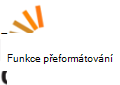

<properties
    pageTitle="Mediální služby Azure komunity přehled | Microsoft Azure"
    description="Tato stránka komunity Azure Media Services (AMS) popisuje různé způsoby můžete získat aktualizace týkající se AMS, přečtěte si téma videa o novém a podcasty, klást otázky a podělit o svůj názor. "
    services="media-services"
    documentationCenter=""
    authors="juliako"
    manager="erikre"
    editor=""/>

<tags
    ms.service="media-services"
    ms.workload="media"
    ms.tgt_pltfrm="na"
    ms.devlang="dotnet"
    ms.topic="article"
    ms.date="09/26/2016"  
    ms.author="juliako"/>

# Mediální služby Azure komunity  

Tato stránka komunity Azure Media Services (AMS) popisuje různé způsoby můžete získat aktualizace týkající se AMS, zobrazení videa o novém a podcasty, klást otázky a podělit o svůj názor.   

##Videa a podcasty

Dílu|Reproduktor|Datum
---|---|---
[Ochrana obsahu médium s DRM](https://azure.microsoft.com/documentation/videos/azurefridayprotectingyourmediacontentdrm/)|Mingfei Yang|02/19/2016
[Ochrana obsahu médium s šifrování AES](https://azure.microsoft.com/documentation/videos/azure-media-services-protecting-your-media-content-with-aes-encryption/)|Mingfei Yang|2/19/2016
[Mediální služby Azure hloubkové postupy vývojář](https://azure.microsoft.com/documentation/videos/build-2015-azure-media-services-developer-deep-dive/)|Mingfei Yang|04/27/2015
[Azure Media indexování automaticky vytvoří přepisy médií](https://azure.microsoft.com/documentation/videos/azure-media-indexer-autoatically-creates-transcripts-for-your-media-with-adarsh-solanki/)|Adarsh Solanki|07/09/2015
[Microsoft Hyperlapse v Azure Media Services s Adarsh Solanki](https://azure.microsoft.com/documentation/videos/microsoft-hyperlapse-in-azure-media-services-with-adarsh-solanki/)|Adarsh Solanki|10/07/2015

##Poskytnutí zpětné vazby a pište

[AZURE.INCLUDE [media-services-user-voice-include](../../includes/media-services-user-voice-include.md)]

##Diskuse

###Twitter

Použití [@MSFTAzureMedia](https://twitter.com/MSFTAzureMedia) twitter úchyt ke sledování příspěvků AMS a aktualizace na Twitter. Můžete použít [@AzureSupport](https://twitter.com/azuresupport) twitter úchyt požádejte o podporu na Twitter.  
 
### Fóra online

Následující fóra se dá použít pro otázky v souvislosti aktuální produkty a funkce.

V současné době MSDN je primární fórum AMS.

 

 

## Obraťte se na tým

Je Azure Media Services primární e-mail: **mediaservices@microsoft.com**.

V následující tabulce jsou uvedeny e-mailu funkce sub týmů:

Funkce|E-mailu
---|---
Azure Media analýzy|amsanalytics@microsoft.com
Azure Media Player|ampinfo@microsoft.com 
Průzkumník Azure Media|amse@microsoft.com
Návrhář pracovního postupu|mepd@microsoft.com
