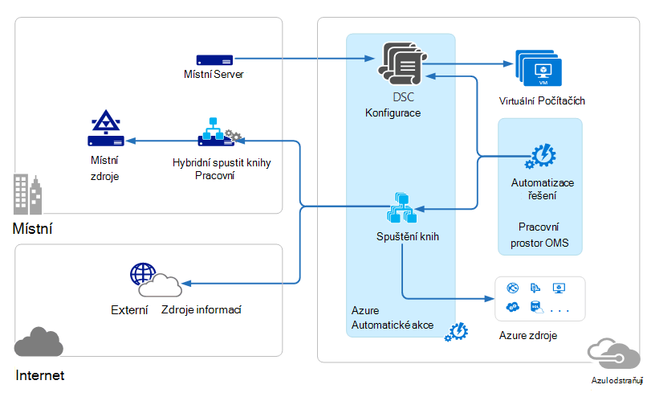

<properties 
   pageTitle="Operace správy sady (OMS) architektura | Microsoft Azure"
   description="Microsoft operace správy sady (OMS) je společnosti Microsoft cloudové IT řešení pro správu, která vám pomáhá spravovat a chránit vaše místních a cloudových infrastruktury.  Tento článek uvádí různé služby součástí OMS a obsahuje odkazy na podrobný obsah."
   services="operations-management-suite"
   documentationCenter=""
   authors="bwren"
   manager="jwhit"
   editor="tysonn" />
<tags 
   ms.service="operations-management-suite"
   ms.devlang="na"
   ms.topic="get-started-article"
   ms.tgt_pltfrm="na"
   ms.workload="infrastructure-services"
   ms.date="10/27/2016"
   ms.author="bwren" />

# OMS architektura

[Operace správy sady (OMS)](https://azure.microsoft.com/documentation/services/operations-management-suite/) je sada cloudové služby pro správu vaší místní i cloudových prostředí.  Tento článek popisuje různé místních a cloudu komponent OMS a jejich výpočetního Architektura vysoké úrovně cloudu.  Můžete vytvořit odkaz si přečtěte následující dokumentaci pro každou službu Další podrobnosti.

## Protokol analýzy

Všechna data shromážděná [Protokolu analýzy](https://azure.microsoft.com/documentation/services/log-analytics/) uložené v úložišti OMS, který je hostovaný v Azure.  Připojení zdroje generovat dat shromážděných do úložiště OMS.  Tři typy připojených zdrojů podporované aktuálně existuje.

- Agent nainstalovaný na počítači s [Windows](../log-analytics/log-analytics-windows-agents.md) nebo [Linux](../log-analytics/log-analytics-linux-agents.md) připojené přímo k OMS.
- System Center operace správce (SCOM) Správa skupiny [připojených k protokolu analýzy](../log-analytics/log-analytics-om-agents.md) .  SCOM agentů dál komunikace se servery správy, které předat analýzy protokolu událostí a data o výkonu.
- [Účet Azure úložiště](../log-analytics/log-analytics-azure-storage.md) , který shromažďuje [Azure diagnostiky](../cloud-services/cloud-services-dotnet-diagnostics.md) data z kolegy role, web nebo virtuálního počítače v Azure.

Zdroje dat definovat data, která protokolu analýzy shromažďuje z propojených zdrojů, včetně protokoly událostí a výkonnosti.  Řešení přidat funkce OMS a lze snadno přidat do pracovního prostoru z [Galerie řešení OMS](../log-analytics/log-analytics-add-solutions.md).  Řešení některých může vyžadovat přímé připojení k protokolu analýzy SCOM zástupci zatímco ostatní můžou vyžadovat další agent je třeba nainstalovat.

Technologie pro analýzu protokolu má portál založené na webu, který slouží k přidávání a používání zdrojů OMS, přidání a konfigurace OMS řešení a zobrazení a analýza dat v úložišti OMS.

## Automatizace Azure

[Automatizace Azure runbooks](http://azure.microsoft.com/documentation/services/automation) zpracují v Azure cloudu a přístup prostředky, které jsou v Azure v jiné cloudové služby nebo přístupné z veřejného Internetu.  Můžete taky určit místního počítače ve vašem Centru místních dat pomocí [Pracovního postupu Runbook hybridní](../automation/automation-hybrid-runbook-worker.md) , aby runbooks přístup místních zdrojů.

[Konfigurace DSC](../automation/automation-dsc-overview.md) uložené v Azure automatizaci můžete přímo použije Azure virtuálních počítačích.  Další fyzické a virtuálních počítačích můžete požádat konfigurace server Azure automatizaci DSC vložit.

Azure automatizaci má OMS řešení, který zobrazuje odkazy na spuštění Azure portálu pro všechny operace a statistiky.

## Azure zálohování

Chráněná data v [Azure zálohování](http://azure.microsoft.com/documentation/services/backup) uložený ve záložní trezoru umístěn v konkrétní zeměpisná oblast.  Data replikovat ve stejné oblasti a v závislosti na typu trezoru mohou také replikovat do jiné oblasti pro další redundance.

Azure zálohování má tři základní scénáře.

- Počítače se systémem Windows Azure zálohování agenta.  Díky záložní souborů a složek mezi libovolnými systému Windows server nebo klienta přímo do vaší Azure záložní trezoru.  
- Správce ochranu dat System Center (DPM) nebo Microsoft Azure záložní Server. Umožňuje provádět využít DPM nebo Microsoft Azure záložní Server zálohování souborů a složek kromě úloh aplikace třeba SQL a ve službě SharePoint do místního úložiště a replikovat do trezoru Azure zálohování.
- Rozšíření Azure virtuálního počítače.  Umožňuje provádět zálohovat Azure virtuálních počítačích k trezoru Azure zálohování.

Azure zálohování má OMS řešení, který zobrazuje odkazy na spuštění Azure portálu pro všechny operace a statistiky.

## Obnovení Azure webu

[Obnovení webu Azure](http://azure.microsoft.com/documentation/services/site-recovery) orchestrates replikace převzetí a navrácení virtuálních počítačích a fyzické servery. Replikace je zasílané mezi tabulkami hosts Hyper-V, VMware hypervisory a fyzické servery v primárních a sekundárních datacentrech nebo mezi datacentra a Azure úložiště.  Obnovení webu ukládá metadata trezorů umístěné v konkrétní zeměpisná oblast Azure. Žádné replikovanou data se ukládají službou obnovení webu.

Obnovení Azure webu má tři scénáře základních replikace.

**Replikace Hyper-V virtuálních počítačích**
- Pokud jsou v VMM mračnech spravovány Hyper-V virtuálních počítačích, můžete replikovat sekundární datacentrem nebo k základnímu úložišti Azure.  Replikace Azure překročení zabezpečené připojení k Internetu.  Replikace sekundárním datacentra překročení místní síti.
- Pokud pro Hyper-V virtuálních počítačích nejsou spravuje VMM, můžete replikovat do Azure úložiště.  Replikace Azure překročení zabezpečené připojení k Internetu.
 
**Replikace VMWare virtuálních počítačích**
- VMware virtuálních počítačích můžete replikovat sekundárním datacentra systém VMware nebo k Azure úložiště.  Replikace Azure může dojít přes VPN webu na webu nebo Azure ExpressRoute nebo přes zabezpečené připojení k Internetu. K sekundárním datacentru replikace přes InMage Scout datového kanálu.
 
**Replikace fyzické Windows a Linux serverů** 
- Pole fyzicky serverů můžete replikovat sekundární datacentra nebo k Azure úložiště. Replikace Azure může dojít přes VPN webu na webu nebo Azure ExpressRoute nebo přes zabezpečené připojení k Internetu. K sekundární datacentru replikace přes InMage Scout datového kanálu.  Obnovení Azure webu má OMS řešení, které zobrazuje některá statistiky, ale musí používat portál Azure pro všechny operace.

## Další kroky

- Informace o [protokolu analýzy](http://azure.microsoft.com/documentation/services/log-analytics).
- Informace o [Azure automatizaci](https://azure.microsoft.com/documentation/services/automation).
- Informace o [Azure zálohování](http://azure.microsoft.com/documentation/services/backup).
- Informace o [obnovení Azure webu](http://azure.microsoft.com/documentation/services/site-recovery).
