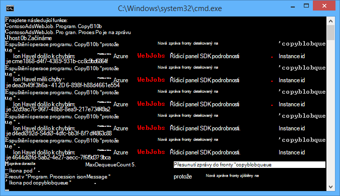
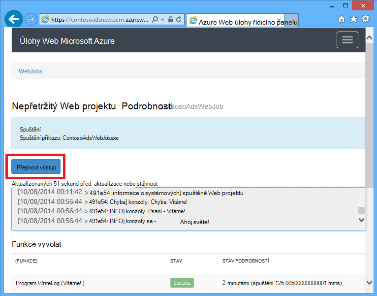
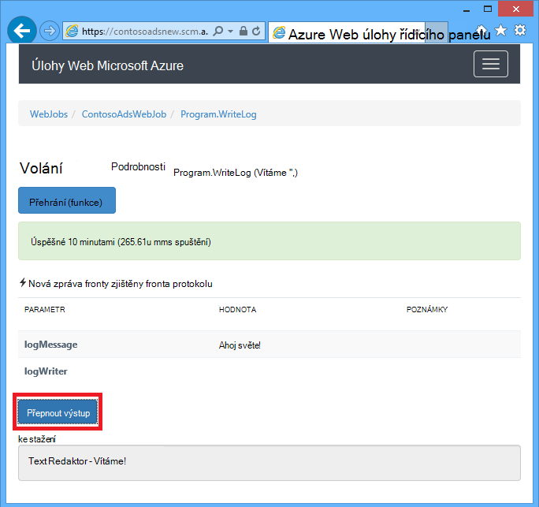
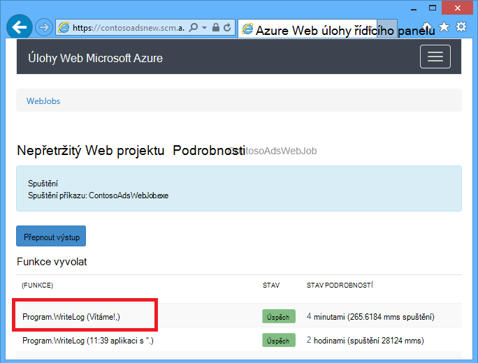
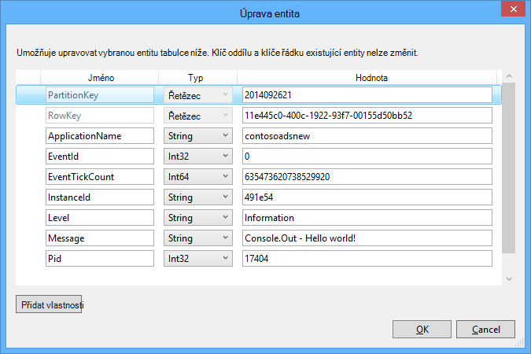
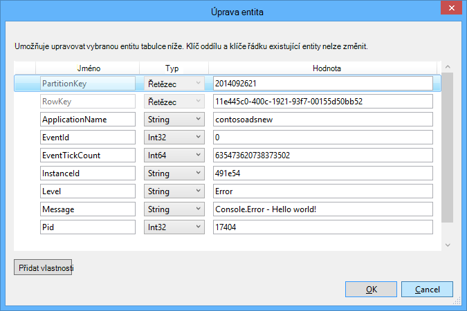

<properties
    pageTitle="Začínáme s úložiště fronty a Visual Studia připojené služby (WebJob projektů) | Microsoft Azure"
    description="Jak začít používat Azure fronty úložiště v aplikaci project WebJob po připojení k úložišti účtu pomocí aplikace Visual Studio připojení služby."
    services="storage"
    documentationCenter=""
    authors="TomArcher"
    manager="douge"
    editor=""/>

<tags
    ms.service="storage"
    ms.workload="web"
    ms.tgt_pltfrm="vs-getting-started"
    ms.devlang="na"
    ms.topic="article"
    ms.date="07/18/2016"
    ms.author="tarcher"/>

# Začínáme s Azure fronty úložiště a Visual Studia připojené služby (WebJob projektů)

[AZURE.INCLUDE [storage-try-azure-tools-queues](../../includes/storage-try-azure-tools-queues.md)]

## Základní informace

Tento článek popisuje, jak začít používat Azure fronty úložiště v aplikaci project Visual Studio Azure WebJob poté, co jste vytvořili či odkazováno pomocí dialogového okna aplikace Visual Studio **Přidat připojené služby** účet Azure úložiště. Po přidání účtu úložiště WebJob projektu pomocí dialogového okna aplikace Visual Studio **Přidat připojené služby** odpovídajících balíčků Azure úložiště NuGet nainstalovaných, odkazy na příslušné .NET se přidají do projektu a připojení k účtu úložiště jsou aktualizované v konfiguračního souboru.  

Tento článek obsahuje C# ukázek kódu, které ukazují, jak používat verzi Azure WebJobs SDK 1.x se službou Azure fronty úložiště.

Azure fronty úložiště je služba pro ukládání většího počtu zpráv, které jsou přístupné z kdekoli na světě prostřednictvím ověřené volání pomocí protokolu HTTP nebo HTTPS. Jedna fronta zprávy můžou obsahovat až 64 KB a fronty může obsahovat miliony zprávy až limit celkovou kapacitu úložiště účtu. Další informace najdete v článku [Začínáme s úložištěm fronty Azure pomocí .NET](storage-dotnet-how-to-use-queues.md) . Další informace o ASP.NET najdete v tématu [ASP.NET](http://www.asp.net).

## Jak aktivovat funkci po přijetí frontě zprávy

K zápisu funkci, která volá WebJobs SDK po přijetí frontě zprávu, použijte atribut **QueueTrigger** . Konstruktoru atributu má parametr řetězec určující název fronty tak, aby hlasování. Přečtěte si, jak nastavit název fronty dynamicky, najdete v tématech [Nastavení možností konfigurace](#how-to-set-configuration-options).

### Řetězec zpráv

V následujícím příkladu fronty obsahuje řetězce zprávy, takže **QueueTrigger** se použije pro parametr řetězec s názvem **logMessage** , která obsahuje obsah zprávy fronty. Funkce [zapíše do protokolu zprávu do řídicího panelu](#how-to-write-logs).

        public static void ProcessQueueMessage([QueueTrigger("logqueue")] string logMessage, TextWriter logger)
        {
            logger.WriteLine(logMessage);
        }

Kromě **řetězec**může být parametr pole bajtů, **CloudQueueMessage** objektu nebo POCO, který určíte.

### POCO [(obyčejný původní objekt CLR](http://en.wikipedia.org/wiki/Plain_Old_CLR_Object)) fronty zprávy

V následujícím příkladu obsahuje zprávy fronty JSON **BlobInformation** objekt, který zahrnuje **BlobName** vlastnost. V SDK automaticky deserializuje objekt.

        public static void WriteLogPOCO([QueueTrigger("logqueue")] BlobInformation blobInfo, TextWriter logger)
        {
            logger.WriteLine("Queue message refers to blob: " + blobInfo.BlobName);
        }

V SDK používá [Newtonsoft.Json NuGet balíčku](http://www.nuget.org/packages/Newtonsoft.Json) serializovat a deserializovat zprávy. Pokud vytvoříte zpráv v aplikaci, která nepoužívá WebJobs SDK, můžete napsat kód jako v následujícím příkladu vytvořte POCO fronty zprávu, která lze analyzovat SDK.

        BlobInformation blobInfo = new BlobInformation() { BlobName = "log.txt" };
        var queueMessage = new CloudQueueMessage(JsonConvert.SerializeObject(blobInfo));
        logQueue.AddMessage(queueMessage);

### Funkce asynchronní

Následující asynchronní funkce [zapíše protokolu na řídicí panel](#how-to-write-logs).

        public async static Task ProcessQueueMessageAsync([QueueTrigger("logqueue")] string logMessage, TextWriter logger)
        {
            await logger.WriteLineAsync(logMessage);
        }

Funkce asynchronní může trvat [token zrušení](http://www.asp.net/mvc/overview/performance/using-asynchronous-methods-in-aspnet-mvc-4#CancelToken), jak je vidět v následujícím příkladu, který slouží ke kopírování objektů blob. (Vysvětlení **queueTrigger** zástupného symbolu, naleznete v části [objektů BLOB](#how-to-read-and-write-blobs-and-tables-while-processing-a-queue-message) .)

        public async static Task ProcessQueueMessageAsyncCancellationToken(
            [QueueTrigger("blobcopyqueue")] string blobName,
            [Blob("textblobs/{queueTrigger}",FileAccess.Read)] Stream blobInput,
            [Blob("textblobs/{queueTrigger}-new",FileAccess.Write)] Stream blobOutput,
            CancellationToken token)
        {
            await blobInput.CopyToAsync(blobOutput, 4096, token);
        }

## Typy atribut QueueTrigger označené jako pracuje s

**QueueTrigger** můžete pomocí následujících typů:

* **řetězec**
* Typ POCO serializován jako JSON
* **Byte]**
* **CloudQueueMessage**

## Algoritmus hlasování

V SDK používá exponenciální zpět vypnout algoritmu náhodných snížit efekt nečinnosti fronty dotazování na náklady transakce úložiště.  Po nalezení zprávy v SDK čeká dvě sekundy a potom hledá další zprávu; Při nalezení žádná zpráva čeká asi čtyř sekund před pokusem znovu. Po dalších neúspěšných pokusech o mi zpráva o fronty čas čekání nadále zvětšit, dokud nedosáhnete čas maximální čekání jednu minutu ve výchozím nastavení. [Maximální prodleva je možné nakonfigurovat](#how-to-set-configuration-options).

## Více instancí

Pokud váš web appu získáte v několika instancích spuštěných nepřetržitý WebJobs běží na každém počítači a každý počítač bude počkejte aktivačních událostí a spouštět funkce. V některých případech to může vést k některé funkce dvakrát zpracování stejná data takže funkce třeba idempotent (písemné tak, aby volání opakovaně se stejnými daty vstupní nemá výsledky duplicitní).  

## Paralelní spuštění

Pokud máte víc funkcí listening na různých fronty SDK se jim zavolá paralelně přijetí zpráv současně.

Platí pro jediné fronty přijetí více zpráv. Ve výchozím nastavení v SDK získá dávky 16 zpráv současně a provede funkci, která zpracuje souběžně. [Velikost dávku](#how-to-set-configuration-options). Pokud číslo zpracovávání bude polovina velikosti dávku, SDK získá jiný list a spustí zpracování zprávy. Maximální počet souběžné zpráv zpracovávání za funkce proto je jeden a půl krát dávku velikost. Toto omezení platí pro každou funkci, která obsahuje atribut **QueueTrigger** samostatně. Pokud nechcete, aby paralelního spuštění zprávy přijaté v jedné fronty, nastavte velikost dávky 1.

## Získat fronty nebo fronty zprávy metadat

Následující vlastnosti zpráv můžete získat tak, že přidáte parametry, Access podpis metody:

* **DateTimeOffset** expirationTime
* **DateTimeOffset** insertionTime
* **DateTimeOffset** nextVisibleTime
* **řetězec** queueTrigger (obsahuje text zprávy)
* id **řetězce**
* **řetězec** popReceipt
* **Funkce INT** dequeueCount

Pokud chcete Přímá práce s Azure úložiště API, můžete také přidat **CloudStorageAccount** parametru.

Následující příklad všechny tato metadata zapíše do protokolu aplikace informace. V příkladu logMessage a queueTrigger obsahují obsah zprávy fronty.

        public static void WriteLog([QueueTrigger("logqueue")] string logMessage,
            DateTimeOffset expirationTime,
            DateTimeOffset insertionTime,
            DateTimeOffset nextVisibleTime,
            string id,
            string popReceipt,
            int dequeueCount,
            string queueTrigger,
            CloudStorageAccount cloudStorageAccount,
            TextWriter logger)
        {
            logger.WriteLine(
                "logMessage={0}\n" +
            "expirationTime={1}\ninsertionTime={2}\n" +
                "nextVisibleTime={3}\n" +
                "id={4}\npopReceipt={5}\ndequeueCount={6}\n" +
                "queue endpoint={7} queueTrigger={8}",
                logMessage, expirationTime,
                insertionTime,
                nextVisibleTime, id,
                popReceipt, dequeueCount,
                cloudStorageAccount.QueueEndpoint,
                queueTrigger);
        }

Tady je ukázka protokol napsal ukázkový kód:

        logMessage=Hello world!
        expirationTime=10/14/2014 10:31:04 PM +00:00
        insertionTime=10/7/2014 10:31:04 PM +00:00
        nextVisibleTime=10/7/2014 10:41:23 PM +00:00
        id=262e49cd-26d3-4303-ae88-33baf8796d91
        popReceipt=AgAAAAMAAAAAAAAAfc9H0n/izwE=
        dequeueCount=1
        queue endpoint=https://contosoads.queue.core.windows.net/
        queueTrigger=Hello world!

## Vypnutí

Funkce, které se spouští v souvislé WebJob jsou přijatelné **CancellationToken** parametr, což umožňuje operační systém upozorní WebJob se brzo skončit funkci. Abyste měli jistotu, že funkce se neočekávaně ukončit tak, aby data ponechá ve stavu nekonzistentní můžete použít toto oznámení.

Následující příklad ukazuje, jak se mají zjišťovat blížícím ukončení WebJob ve funkci.

    public static void GracefulShutdownDemo(
                [QueueTrigger("inputqueue")] string inputText,
                TextWriter logger,
                CancellationToken token)
    {
        for (int i = 0; i < 100; i++)
        {
            if (token.IsCancellationRequested)
            {
                logger.WriteLine("Function was cancelled at iteration {0}", i);
                break;
            }
            Thread.Sleep(1000);
            logger.WriteLine("Normal processing for queue message={0}", inputText);
        }
    }

**Poznámka:** Řídicí panel nemusí správně ukazují stav a výstup funkcí, které byl vypnout.

Další informace najdete v tématu [WebJobs vypnutí](http://blog.amitapple.com/post/2014/05/webjobs-graceful-shutdown/#.VCt1GXl0wpR).   

## Jak vytvořit zprávu fronty při zpracování zprávy fronty

Psát funkci, která vytvoří novou zprávu fronty, použijte atribut **fronty** . Podobně jako **QueueTrigger**předáváte ve frontě jako řetězec nebo můžete [nastavit název fronty dynamicky](#how-to-set-configuration-options).

### Řetězec zpráv

Následující příklad kódu není asynchronní vytvoří novou zprávu fronty ve frontě s názvem "outputqueue" s stejný obsah ve frontě zprávy doručeny do fronty s názvem "inputqueue". (Asynchronních funkcí dosáhnete **IAsyncCollector<T> ** uvedeno dále v této části.)

        public static void CreateQueueMessage(
            [QueueTrigger("inputqueue")] string queueMessage,
            [Queue("outputqueue")] out string outputQueueMessage )
        {
            outputQueueMessage = queueMessage;
        }

### POCO [(obyčejný původní objekt CLR](http://en.wikipedia.org/wiki/Plain_Old_CLR_Object)) fronty zprávy

Pokud chcete vytvořit fronty zprávu, která obsahuje POCO spíše než řetězec, předáte typ POCO jako výstupní parametr konstruktoru atributu **fronty** .

        public static void CreateQueueMessage(
            [QueueTrigger("inputqueue")] BlobInformation blobInfoInput,
            [Queue("outputqueue")] out BlobInformation blobInfoOutput )
        {
            blobInfoOutput = blobInfoInput;
        }

V SDK jsou automaticky objekt JSON. Fronta zprávu vždy vytvoření i v případě, že objekt je null.

### Vytvoření více zpráv nebo v asynchronních funkcí

Vytvoření více zpráv, aby typ parametru fronty výstup **ICollector<T> ** nebo **IAsyncCollector<T>**, jak je ukázáno v následujícím příkladu.

        public static void CreateQueueMessages(
            [QueueTrigger("inputqueue")] string queueMessage,
            [Queue("outputqueue")] ICollector<string> outputQueueMessage,
            TextWriter logger)
        {
            logger.WriteLine("Creating 2 messages in outputqueue");
            outputQueueMessage.Add(queueMessage + "1");
            outputQueueMessage.Add(queueMessage + "2");
        }

Každá zpráva fronty se vytvoří hned po s názvem metody **Přidat** .

### Typy spolupracuje atribut fronty

Na následující typy parametrů můžete použít atribut **fronty** :

* **se řetězec** (Pokud je hodnota parametru jinou hodnotu než null po ukončení funkce vytvoří zprávu fronty)
* **mimo byte]** (funguje **řetězec**)
* **mimo CloudQueueMessage** (funguje **řetězec**)
* **mimo POCO** (typu serializovatelný vytvoří zprávu s objektem null Pokud parametr null, když skončí platnost funkce)
* **ICollector**
* **IAsyncCollector**
* **CloudQueue** (při vytváření zprávy ručně pomocí rozhraní API úložiště Azure přímo)

### Použít atributy WebJobs SDK v těle funkce

Pokud potřebujete udělat některé práce ve vaší funkci před použitím atribut WebJobs SDK například **fronty**, **objektů Blob**nebo **tabulce**, můžete použít rozhraní **IBinder** .

Následující příklad přenese zprávu vstupní fronty a vytvoří novou zprávu s stejný obsah ve frontě výstupu. Název fronty výstup nastavenou tak, že kód v těle funkce.

        public static void CreateQueueMessage(
            [QueueTrigger("inputqueue")] string queueMessage,
            IBinder binder)
        {
            string outputQueueName = "outputqueue" + DateTime.Now.Month.ToString();
            QueueAttribute queueAttribute = new QueueAttribute(outputQueueName);
            CloudQueue outputQueue = binder.Bind<CloudQueue>(queueAttribute);
            outputQueue.AddMessage(new CloudQueueMessage(queueMessage));
        }

Rozhraní **IBinder** lze také s **tabulkou** a **objektů Blob** atributy.

## Jak číst a psát objektů BLOB a tabulek a zpracování zprávy fronty

Atributy **objektů Blob** a **tabulky** umožňují čtení a zápis objektů BLOB a tabulky. Příklady v této části platí pro objekty BLOB. Ukázky, které ukazují, jak aktivovat procesy vytvořila nebo aktualizovala objektů BLOB vás [naučí používat úložišti objektů blob Azure s WebJobs SDK](../app-service-web/websites-dotnet-webjobs-sdk-storage-blobs-how-to.md)a ukázek kódu, které čtení a zápis tabulek, najdete v článku [Použití úložiště tabulek Azure s WebJobs SDK](../app-service-web/websites-dotnet-webjobs-sdk-storage-tables-how-to.md).

### Spuštění operace objektů blob zprávy fronty řetězec

Fronta zprávu, která obsahuje řetězec **queueTrigger** zástupným symbolem, který můžete použít v parametru **blobPath** **objektů Blob** atribut, který obsahuje obsah zprávy.

Objekty **toku** pro čtení a zápis objektů BLOB v následujícím příkladu. Zpráva fronty stejný název objektů blob obsažených v kontejneru textblobs. Kopii objektů blob s "-nové" přidaným k názvu se vytvoří ve stejném kontejneru.

        public static void ProcessQueueMessage(
            [QueueTrigger("blobcopyqueue")] string blobName,
            [Blob("textblobs/{queueTrigger}",FileAccess.Read)] Stream blobInput,
            [Blob("textblobs/{queueTrigger}-new",FileAccess.Write)] Stream blobOutput)
        {
            blobInput.CopyTo(blobOutput, 4096);
        }

Atribut konstruktor **objektů Blob** přijímá **blobPath** parametr, který určuje kontejner a objektů blob název. Další informace o tento zástupný symbol najdete v článku [používání úložišti objektů blob Azure s WebJobs SDK](../app-service-web/websites-dotnet-webjobs-sdk-storage-blobs-how-to.md).

Pokud atribut upraví objekt **toku** , jiné konstruktor parametr určuje režim **FileAccess** jako přečtené, zápis nebo pro čtení i zápis.

Objekt **CloudBlockBlob** odstranit objektů blob v následujícím příkladu. Zpráva fronty stejný název objektů blob.

        public static void DeleteBlob(
            [QueueTrigger("deleteblobqueue")] string blobName,
            [Blob("textblobs/{queueTrigger}")] CloudBlockBlob blobToDelete)
        {
            blobToDelete.Delete();
        }

### POCO [(obyčejný původní objekt CLR](http://en.wikipedia.org/wiki/Plain_Old_CLR_Object)) fronty zprávy

Pro POCO uložených jako JSON ve frontě zprávu můžete použít zástupné symboly tento název vlastnosti objektu ve **frontě** atribut **blobPath** parametr. Můžete taky názvy vlastností metadat fronty jako zástupné symboly. V tématu [získání fronty nebo fronty zprávy metadata](#get-queue-or-queue-message-metadata).

V následujícím příkladu zkopíruje objektů blob do nových objektů blob s jinou příponou. Zpráva fronty je **BlobInformation** objekt, který obsahuje **BlobName** a **BlobNameWithoutExtension** vlastnosti. Názvy vlastností jsou používána jako zástupné symboly do pole Cesta objektů blob atributů **objektů Blob** .

        public static void CopyBlobPOCO(
            [QueueTrigger("copyblobqueue")] BlobInformation blobInfo,
            [Blob("textblobs/{BlobName}", FileAccess.Read)] Stream blobInput,
            [Blob("textblobs/{BlobNameWithoutExtension}.txt", FileAccess.Write)] Stream blobOutput)
        {
            blobInput.CopyTo(blobOutput, 4096);
        }

V SDK používá [Newtonsoft.Json NuGet balíčku](http://www.nuget.org/packages/Newtonsoft.Json) serializovat a deserializovat zprávy. Pokud vytvoříte zpráv v aplikaci, která nepoužívá WebJobs SDK, můžete napsat kód jako v následujícím příkladu vytvořte POCO fronty zprávu, která lze analyzovat SDK.

        BlobInformation blobInfo = new BlobInformation() { BlobName = "boot.log", BlobNameWithoutExtension = "boot" };
        var queueMessage = new CloudQueueMessage(JsonConvert.SerializeObject(blobInfo));
        logQueue.AddMessage(queueMessage);

Pokud potřebujete udělat některé práce ve vaší funkci před vazby objektů blob k objektu, můžete použít atribut v těle funkci uvedeno v [SDK WebJobs použít atributy v těle funkce](#use-webjobs-sdk-attributes-in-the-body-of-a-function).

###Typy použitelných atribut objektů Blob s

Atribut **objektů Blob** lze s následujícími typy:

* **Toku** (načtení nebo zápisu dat, rozlišit pomocí parametru konstruktoru FileAccess)
* **TextReader**
* **TextWriter**
* **řetězec** (pro čtení)
* **se řetězec** (napište; vytvoří objektů blob pouze v případě parametr řetězec jinou hodnotu než null až vrátí hodnotu funkce)
* POCO (pro čtení)
* mimo POCO (psaní; vždy vytvoří objektů blob, vytvoří jako objekt null, pokud POCO parametr není zadán, až vrátí hodnotu funkce)
* **CloudBlobStream** (napište)
* **ICloudBlob** (pro čtení a zápis)
* **CloudBlockBlob** (pro čtení a zápis)
* **CloudPageBlob** (pro čtení a zápis)

##Postup v případě poškozená zprávy

Zprávy, jejíž obsah způsobí, že funkce selhání nazývají *poškozená zprávy*. Při funkci nepovede, zpráva fronty není odstraněna a nakonec je převzít znovu příčinou obrázku opakovat. V SDK můžete automaticky vás nemají rušit, cyklu po omezenou počtu iterací nebo potřebujete k tomu ručně.

### Automatické poškozená zpráva zpracování

V SDK budou volání funkce až 5 číslem fronty zprávu zpracovat. Když na pátý vyzkoušet nepovede, zpráva se přesune do poškozená fronty. V tématu Jak nakonfigurovat maximální počet opakování v [tom, jak nastavit možnosti konfigurace](#how-to-set-configuration-options).

Poškozená fronty jmenuje *{originalqueuename}*-poškozená. Můžete psát, že není potřeba funkci, kterou chcete zpracování zpráv z poškozená fronty protokolování je nebo odesláním oznámení, které ruční pozornost.

V následujícím příkladu **CopyBlob** funkce se nezdaří, pokud fronty zpráva obsahuje název objektů blob, který neexistuje. Když k tomu dojde, zpráva je už není ve frontě copyblobqueue fronty copyblobqueue poison. **ProcessPoisonMessage** potom zaznamená poškozená zpráva.

        public static void CopyBlob(
            [QueueTrigger("copyblobqueue")] string blobName,
            [Blob("textblobs/{queueTrigger}", FileAccess.Read)] Stream blobInput,
            [Blob("textblobs/{queueTrigger}-new", FileAccess.Write)] Stream blobOutput)
        {
            blobInput.CopyTo(blobOutput, 4096);
        }

        public static void ProcessPoisonMessage(
            [QueueTrigger("copyblobqueue-poison")] string blobName, TextWriter logger)
        {
            logger.WriteLine("Failed to copy blob, name=" + blobName);
        }

Následující obrázek znázorňuje výstup konzoly z těchto funkcí při zpracování poškozená zpráva.

### Ruční poškozená zpráva zpracování

Přidáním **int** parametr s názvem **dequeueCount** vaší funkce můžete získat počet, které zprávy vybral pro zpracování. Pak můžete zkontrolovat počet dequeue za kód (funkce) a provést vlastní poškozená zpracování zpráv při číslo větší než mezní hodnota, jak je vidět v následujícím příkladu.

        public static void CopyBlob(
            [QueueTrigger("copyblobqueue")] string blobName, int dequeueCount,
            [Blob("textblobs/{queueTrigger}", FileAccess.Read)] Stream blobInput,
            [Blob("textblobs/{queueTrigger}-new", FileAccess.Write)] Stream blobOutput,
            TextWriter logger)
        {
            if (dequeueCount > 3)
            {
                logger.WriteLine("Failed to copy blob, name=" + blobName);
            }
            else
            {
            blobInput.CopyTo(blobOutput, 4096);
            }
        }

## Nastavení možností konfigurace

Typ **JobHostConfiguration** můžete nastavit následující možnosti konfigurace:

* Nastavení připojení řetězce SDK v kódu.
* Konfigurace **QueueTrigger** dequeue nastavení, například maximální počet.
* Získáte fronty názvy z konfigurace.

###Nastavení SDK připojovací řetězec v kódu

Nastavení připojení řetězce SDK v kódu vám umožní použít vlastní řetězec názvy připojení ve konfigurace soubory nebo proměnné, jak je vidět v následujícím příkladu.

        static void Main(string[] args)
        {
            var _storageConn = ConfigurationManager
                .ConnectionStrings["MyStorageConnection"].ConnectionString;

            var _dashboardConn = ConfigurationManager
                .ConnectionStrings["MyDashboardConnection"].ConnectionString;

            var _serviceBusConn = ConfigurationManager
                .ConnectionStrings["MyServiceBusConnection"].ConnectionString;

            JobHostConfiguration config = new JobHostConfiguration();
            config.StorageConnectionString = _storageConn;
            config.DashboardConnectionString = _dashboardConn;
            config.ServiceBusConnectionString = _serviceBusConn;
            JobHost host = new JobHost(config);
            host.RunAndBlock();
        }

### Konfigurace nastavení QueueTrigger

Můžete konfigurovat tato nastavení, které platí pro zpracování zprávy fronty:

- Maximální počet zpráv, které jsou převzít současně má provádět paralelně (výchozí hodnota je 16).
- Maximální počet opakování odesílá nějaká zpráva fronty poškozená fronty (výchozí hodnota je 5).
- Maximální doba před znovu dotazování, kdy je do fronty prázdný (výchozí hodnota je 1 minutu).

Následující příklad ukazuje, jak tato nastavení konfigurujete takhle:

        static void Main(string[] args)
        {
            JobHostConfiguration config = new JobHostConfiguration();
            config.Queues.BatchSize = 8;
            config.Queues.MaxDequeueCount = 4;
            config.Queues.MaxPollingInterval = TimeSpan.FromSeconds(15);
            JobHost host = new JobHost(config);
            host.RunAndBlock();
        }

### Nastavení hodnot pro WebJobs SDK konstruktor parametrů v kódu

Někdy budete chtít zadat název fronty, název objektů blob nebo container nebo tabulky název v kódu spíše než pevného kódu. Můžete třeba zadat název fronty pro **QueueTrigger** konfigurační soubor nebo prostředí proměnné.

Můžete to udělat předáním objekt **NameResolver** na typ **JobHostConfiguration** . Se zástupnými symboly zvláštní uzavřen znaménka procent (%) v WebJobs SDK atribut konstruktor parametry a kód **NameResolver** určuje skutečné hodnoty, které lze použít místo tyto zástupné symboly.

Předpokládejme například, že chcete použít fronty s názvem logqueuetest v testovacím prostředí a jeden pojmenované logqueueprod v výroby. Místo názvu pevně fronty chcete zadat název položky v kolekci **appSettings** , který má název skutečné fronty. Pokud klávesu **appSettings** logqueue, funkce by měl vypadat jako v následujícím příkladu.

        public static void WriteLog([QueueTrigger("%logqueue%")] string logMessage)
        {
            Console.WriteLine(logMessage);
        }

Svojí třídě **NameResolver** potom mohl název fronty z **appSettings** jak je vidět v následujícím příkladu:

        public class QueueNameResolver : INameResolver
        {
            public string Resolve(string name)
            {
                return ConfigurationManager.AppSettings[name].ToString();
            }
        }

Předat třídu **NameResolver** v **JobHost** objektu, jak je vidět v následujícím příkladu.

        static void Main(string[] args)
        {
            JobHostConfiguration config = new JobHostConfiguration();
            config.NameResolver = new QueueNameResolver();
            JobHost host = new JobHost(config);
            host.RunAndBlock();
        }

**Poznámka:** Vyřešit fronty, tabulky a názvy objektů blob pokaždé, když je místo toho funkci, ale objektů blob kontejneru jmen pouze při spuštění aplikace. Můžete název změnit nedá objektů blob kontejneru je spuštěná úloha.

## Jak aktivovat funkci ručně

Ručně spustit funkci, použijte metodu **volání** nebo **CallAsync** na **JobHost** objektů a atributů **NoAutomaticTrigger** na funkci, jak je vidět v následujícím příkladu.

        public class Program
        {
            static void Main(string[] args)
            {
                JobHost host = new JobHost();
                host.Call(typeof(Program).GetMethod("CreateQueueMessage"), new { value = "Hello world!" });
            }

            [NoAutomaticTrigger]
            public static void CreateQueueMessage(
                TextWriter logger,
                string value,
                [Queue("outputqueue")] out string message)
            {
                message = value;
                logger.WriteLine("Creating queue message: ", message);
            }
        }

## Jak psát protokoly

Řídicí panel zobrazuje protokoly na dvou místech: na stránce pro WebJob a na stránce pro konkrétní vyvolání WebJob.

Výstup z konzoly metody volajících ve funkci nebo metodu **Main()** se zobrazí stránky řídicího panelu WebJob, nikoliv na stránce pro vyvolání konkrétní metody. Výstup z TextWriter objekt, který získáte z parametru do podpisu metoda se zobrazí na stránce řídicí panel pro vyvolání metody.

Výstup konzoly nemohou být propojeny s vyvolání konkrétní metody, protože konzole jedním podprocesem, spuštěná mnoho funkcí projektu může být ve stejnou dobu. Proto SDK poskytuje každý vyvolání funkce s vlastní jedinečný protokolu Redaktor objekt.

K zápisu [protokolů trasování aplikace](web-sites-dotnet-troubleshoot-visual-studio.md#logsoverview)použijte **Console.Out** (vytvoří protokoly, která je označená jako informace) a **Console.Error** (vytvoří protokoly označena jako chyba). Další možností je používat [Sledování nebo TraceSource](http://blogs.msdn.com/b/mcsuksoldev/archive/2014/09/04/adding-trace-to-azure-web-sites-and-web-jobs.aspx), která poskytuje podrobné, upozornění a kritický úrovně kromě informace a chyby. Protokoly sledování aplikace se zobrazují v web app protokoly, Azure tabulek nebo objekty BLOB Azure podle toho, jak nakonfigurovat Azure webovou aplikaci. Platí pro všechny výstup konzoly, protokolech posledních 100 aplikace taky se zobrazí v stránky řídicího panelu pro WebJob, nikoli na stránku pro vyvolání funkce.

Výstup konzoly se zobrazí na řídicím panelu jenom v případě, že aplikaci v Azure WebJob, není-li program běží místně nebo v jiném prostředí.

Vypnutí protokolování nastavením řídicího panelu připojovací řetězec na hodnotu null. Další informace najdete v tématu [Nastavení možností konfigurace](#how-to-set-configuration-options).

Následující příklad ukazuje několika různými způsoby zápisu protokolů:

        public static void WriteLog(
            [QueueTrigger("logqueue")] string logMessage,
            TextWriter logger)
        {
            Console.WriteLine("Console.Write - " + logMessage);
            Console.Out.WriteLine("Console.Out - " + logMessage);
            Console.Error.WriteLine("Console.Error - " + logMessage);
            logger.WriteLine("TextWriter - " + logMessage);
        }

Na řídicím panelu SDK WebJobs výstup z objektu **TextWriter** zobrazuje při přejděte na stránku pro vyvolání konkrétní funkcí a vyberte **Přepínač výstup**:

Na řídicím panelu SDK WebJobs posledních 100 řádků konzoly výstupní zobrazit nahoru po přejděte na stránku pro WebJob (ne pro vyvolání funkce) a vyberte **Přepínač výstup**.

V souvislé WebJob protokoly aplikace objeví v/data/úlohy/nepřetržitý /*{webjobname}*/job_log.txt v systému souborů web app.

        [09/26/2014 21:01:13 > 491e54: INFO] Console.Write - Hello world!
        [09/26/2014 21:01:13 > 491e54: ERR ] Console.Error - Hello world!
        [09/26/2014 21:01:13 > 491e54: INFO] Console.Out - Hello world!

V Azure objektů blob aplikaci protokoly vypadají takto: 2014-09-26T21:01:13,Information,contosoadsnew,491e54,635473620738373502,0,17404,17,Console.Write - Vítáme!, 2014-09-26T21:01:13,Error,contosoadsnew,491e54,635473620738373502,0,17404,19,Console.Error - Vítáme!, 2014-09-26T21:01:13,Information,contosoadsnew,491e54,635473620738529920,0,17404,17,Console.Out - Vítáme!,

A v tabulce Azure protokoly **Console.Out** a **Console.Error** vypadat takto:

##Další kroky

Tento článek dodala ukázek kódu, které ukazují, jak řešit obvyklé scénáře pro práci s Azure fronty. Další informace o používání Azure WebJobs a WebJobs SDK tématech [Azure WebJobs si přečtěte následující dokumentaci](http://go.microsoft.com/fwlink/?linkid=390226).
