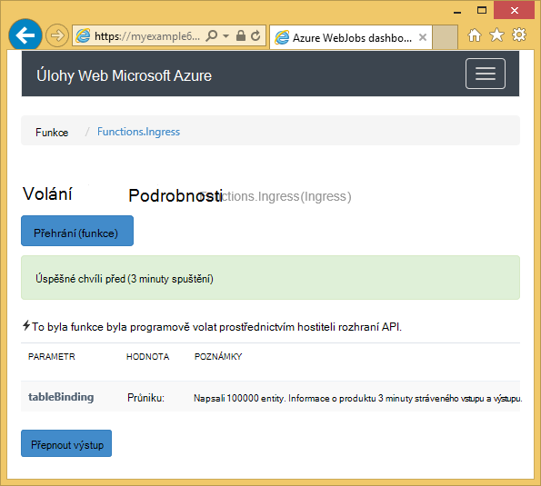

<properties
    pageTitle="Začínáme s Azure úložiště a Visual Studia připojené služby (WebJob projektů)"
    description="Jak začít používat úložiště tabulek Azure v Azure WebJobs projektu ve Visual Studiu po připojení k úložišti účtu pomocí aplikace Visual Studio připojené služby"
    services="storage"
    documentationCenter=""
    authors="TomArcher"
    manager="douge"
    editor=""/>

<tags
    ms.service="storage"
    ms.workload="web"
    ms.tgt_pltfrm="vs-getting-started"
    ms.devlang="na"
    ms.topic="article"
    ms.date="07/18/2016"
    ms.author="tarcher"/>

# Začínáme s Azure úložiště (Azure WebJob projektů)

[AZURE.INCLUDE [storage-try-azure-tools-tables](../../includes/storage-try-azure-tools-tables.md)]

## Základní informace

Tento článek obsahuje C# ukázek kódu, které ukazují ukazují, jak používat verzi Azure WebJobs SDK 1.x se službou úložiště tabulek Azure. Ukázky kódu používat verzi [WebJobs SDK](../app-service-web/websites-dotnet-webjobs-sdk.md) 1.x.

Služba úložiště tabulek Azure umožňuje ukládat velké množství strukturovaná data. Služba je NoSQL úložiště, která přijímá ověřené hovory z uvnitř a mimo Azure cloudu. Azure tabulky jsou ideální pro ukládání strukturovaných, není relačních dat.  Další informace najdete v článku [Začínáme s úložiště tabulek Azure pomocí .NET](storage-dotnet-how-to-use-tables.md#create-a-table) .

Některé fragmenty kódu zobrazit atribut **tabulky** použít ve funkcích, které se označují jako ručně, tedy ne pomocí jedné atributy aktivační událost.

## Přidání osob do tabulky

Přidat entity do tabulky, použijte atribut **tabulku** s **ICollector<T> ** nebo **IAsyncCollector<T> ** parametr určuje, kde **T** schématu osob, které chcete přidat. Atribut konstruktor má parametr řetězec určující název tabulky.

Následující příklad kódu přidá entity **osoby** v tabulce s názvem *průniku*.

        [NoAutomaticTrigger]
        public static void IngressDemo(
            [Table("Ingress")] ICollector<Person> tableBinding)
        {
            for (int i = 0; i < 100000; i++)
            {
                tableBinding.Add(
                    new Person() {
                        PartitionKey = "Test",
                        RowKey = i.ToString(),
                        Name = "Name" }
                    );
            }
        }

Obvykle typ, který používáte s **ICollector** pochází z **TableEntity** nebo implementuje **ITableEntity**, ale není potřeba. Jednu z následujících tříd **osoba** pracovat s kód zobrazený v předchozí postup **průniku** .

        public class Person : TableEntity
        {
            public string Name { get; set; }
        }

        public class Person
        {
            public string PartitionKey { get; set; }
            public string RowKey { get; set; }
            public string Name { get; set; }
        }

Pokud chcete Přímá práce s Azure úložiště rozhraní API, můžete přidat parametru **CloudStorageAccount** k podpisu metody.

## Sledování v reálném čase

Protože funkce průniku dat často zpracovat velké objemy dat, na řídicím panelu WebJobs SDK obsahuje data v reálném čase sledování. Pokud funkce spuštěné popsaný v části **Vyvolání protokolu** .

Stránka **Podrobnosti vyvolání** sestavy průběhu funkce (počet entit napsané) je spuštěn a nabízí možnost zrušit ho.

Po dokončení funkci stránku **Podrobnosti vyvolání** hlásí počet řádků napsali.

## Jak číst více entit z tabulky

Čtení tabulky, použijte atribut **tabulku** s **IQueryable<T> ** parametr tam, kde je odvozena z **TableEntity** nebo implementuje **ITableEntity**typ **T** .

Následující příklad kódu bude číst a protokoly všech řádků z tabulky **průniku** :

        public static void ReadTable(
            [Table("Ingress")] IQueryable<Person> tableBinding,
            TextWriter logger)
        {
            var query = from p in tableBinding select p;
            foreach (Person person in query)
            {
                logger.WriteLine("PK:{0}, RK:{1}, Name:{2}",
                    person.PartitionKey, person.RowKey, person.Name);
            }
        }

### Jak číst jedna entita z tabulky

Existuje konstruktor atributu **tabulky** se dvěma parametry další, které umožňují určit klíč oddílu a klíče řádku, když budete chtít vytvořit vazbu s jednou tabulkou entity.

Následující příklad kódu přečte řádek tabulky entity **uživatele** na základě oddíl klíče a řádek klíčových hodnot přijetí frontě zprávy:  

        public static void ReadTableEntity(
            [QueueTrigger("inputqueue")] Person personInQueue,
            [Table("persontable","{PartitionKey}", "{RowKey}")] Person personInTable,
            TextWriter logger)
        {
            if (personInTable == null)
            {
                logger.WriteLine("Person not found: PK:{0}, RK:{1}",
                        personInQueue.PartitionKey, personInQueue.RowKey);
            }
            else
            {
                logger.WriteLine("Person found: PK:{0}, RK:{1}, Name:{2}",
                        personInTable.PartitionKey, personInTable.RowKey, personInTable.Name);
            }
        }

Třídy **osoby** v tomto příkladu nemá implementovat **ITableEntity**.

## Jak lze pomocí rozhraní API úložiště .NET přímo pracovat s tabulkou

Můžete také atribut **Tabulka** s objektem **CloudTable** pro větší flexibilitu při práci s tabulkou.

Následující příklad kódu používá objekt **CloudTable** přidáte jediný entitu k tabulce *průniku* .

        public static void UseStorageAPI(
            [Table("Ingress")] CloudTable tableBinding,
            TextWriter logger)
        {
            var person = new Person()
                {
                    PartitionKey = "Test",
                    RowKey = "100",
                    Name = "Name"
                };
            TableOperation insertOperation = TableOperation.Insert(person);
            tableBinding.Execute(insertOperation);
        }

Další informace o tom, jak pomocí objektu **CloudTable** najdete v článku [Začínáme s úložiště tabulek Azure pomocí .NET](storage-dotnet-how-to-use-tables.md).

## Související témata článek s postupy fronty

Další informace o tom, jak řešit zpracování tabulky spouštěný zobrazí zpráva o fronty nebo WebJobs SDK scénáře nejsou specifické pro tabulky zpracování najdete v článku [že Začínáme s Azure fronty úložiště a Visual Studia připojené služby (WebJob projektů)](vs-storage-webjobs-getting-started-queues.md).

## Další kroky

Tento článek dodala ukázek kódu, které ukazují, jak řešit obvyklé scénáře práce s tabulkami Azure. Další informace o používání Azure WebJobs a WebJobs SDK tématech [Azure WebJobs si přečtěte následující dokumentaci](http://go.microsoft.com/fwlink/?linkid=390226).
