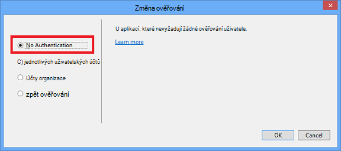

<properties
    pageTitle="Vytvoření obrázky v markdown"
    description="Vysvětluje, jak vytvářet markdown podle pokynů pro Azure úložištích."
    services=""
    solutions=""
    documentationCenter=""
    authors="kenhoff"
    manager="ilanas"
    editor="tysonn"/>

<tags
    ms.service="contributor-guide"
    ms.devlang=""
    ms.topic="article"
    ms.tgt_pltfrm=""
    ms.workload=""
    ms.date="06/25/2015"
    ms.author="kenhoff" />

# <a name="create-images-in-markdown"></a>Vytvoření obrázky v markdown

## <a name="image-folder-creation-and-link-syntax"></a>Obrázek syntaxe vytváření a odkaz složky

Nový článek musíte vytvořit složku v následujícím umístění:

    /articles/<service-directory>/media/<article-name>/

Příklad:

    /articles/app-service/media/app-service-enterprise-multichannel-apps/

Po vytvoření složky a přidanými obrázky do ní pomocí následující syntaxe vytvořit obrázky v článku:

```

```
Příklad:

V tématu [šabloně markdown](../markdown%20templates/markdown-template-for-new-articles.md) příklad.  Referenční odkazy obrázek v této šabloně markdown mají být v dolní části šablony.

## <a name="guidelines-specific-to-azuremicrosoftcom"></a>Pokyny pro konkrétní azure.microsoft.com

Snímky obrazovek aktuálně vyzváni, pokud ještě není možné zahrnout zkopírujte kroky. Zapsat obsah tak, aby obsah můžete zvýraznit bez snímky obrazovek v případě potřeby.

Použijte následující pravidla platí při vytváření a včetně soubory s obrázky:
- Nesdílet soubory s obrázky v dokumentech. Zkopírujte soubor nutné a přiřadit ji někomu složku media určitého tématu. Sdílení souborů se nedoporučuje, protože je snáze se odebrat nedá použít obsahu a obrázků, které sleduje repo vyčistit.

- Formáty souborů: používání souborů .png - jsou vyšší kvality a zachovat jeho kvalitu během procesu lokalizace. Další formáty souborů nepracují taky jeho kvalitu. Formátu JPEG je povoleno, ale ne upřednostňované.  Žádné animované soubory ve formátu GIF.

- Použití červené čtverce výchozí šířky uvedenou v malování (5 pixelů) pro upoutání pozornosti na určitých prvků do snímků obrazovek.  

    Příklad:

    

- Kdy má smysl, neváhejte oříznout obrázky, zobrazí se prvky uživatelského rozhraní v plné velikosti. Ujistěte se, že kontextu vymazat uživatelům, i když.

- Nepoužívejte mezery na okraji obrazovky. Je-li oříznout obrázek tak, aby ponechá bílé pozadí na okrajích přidáte jeden bod šedé ohraničení kolem obrázku.  Pokud pomocí programu Malování, použijte světlejší šedé v pallete výchozí barvy (0xC3C3C3). Pokud používáte některé obrázku aplikace, RGB barev je R195, G195 195. Můžete snadno přidat šedé ohraničení okolo obrázku v aplikaci Visio – můžete to udělat, vyberte obrázek, vyberte řádek a zajistit, aby opravit barvu je nastavená a potom změňte šířku čáry na pt 1 1/2.  Snímky obrazovek měli 1 pixel celé šedé ohraničení, takže bílé oblasti snímek není rozostření do webové stránky.

    Příklad:

    
    
    Nástroj pro automatizaci proces přidávání požadované ohraničení obrázků najdete v článku [AddACOMBorder nástroj – jak automatizaci obrazovky pro přidání požadovaných 1 pixel šedé ohraničení ACOM obrázky](https://github.com/Azure/Azure-CSI-Content-Tools/tree/master/Tools/AddACOMImageBorder).

- Konceptuální obrázky s mezery nemusí šedé ohraničení.  

    Příklad:

    

- Zkuste není příliš široký obrázek.  Obrázky se automaticky velikost, pokud jsou moc široké. Však změny velikosti někdy způsobí, že Neurčitost, proto doporučujeme omezit šířku obrázků do 780 pixelů a ručně obrázky změny velikosti před odesláním v případě potřeby.

- Příkaz výstupy se zobrazí v snímky obrazovek.  Pokud váš článek obsahuje kroky, kde je uživatel pracovat v rámci prostředí, je užitečné v snímky obrazovek zobrazit výstup příkazu. V tomto případě omezení šířky prostředí obecně k asi 72 znaky zaručuje, že obrázek zůstane v rámci směrnice šířka 780 pixelů. Před provedením snímek obrazovky s výstup, změňte velikost okna tak, aby se zobrazilo jenom relevantní příkaz a výstup (volitelně s prázdným řádkem na obou stranách).

- Trvat celé snímky obrazovek systému windows, pokud je to možné. Při nastavování snímek obrazovky okna prohlížeče, změňte velikost okna prohlížeče na 780 pixelů široký nebo méně a zachovat Výška okna prohlížeče jako krátké možnou takový, aby odpovídal velikosti okna aplikace.

    Příklad:

    

- Použití opatrně jaké informace se odkryje v snímky obrazovek.  Zjistí interní firemní data nebo osobní údaje.

- V conceptual obrázek nebo diagramy použijte oficiální ikony v cloudu a Enterprise symbol a sad ikon. Veřejné sady je k dispozici http://aka.ms/CnESymbols.

- Soukromé nebo osobní informace v snímky obrazovek nahraďte zástupný text v závorkách úhlu. Platí to i jména uživatelů, ID předplatné a další související informace. Osobní jména můžete nahrazen příkazem [schválené fictious název](https://aka.ms/ficticiousnames)(odkaz jenom pro zaměstnance). Nepoužívejte tip pastel nebo značku v programu Malování překrývat nebo rozostření soukromé nebo osobní informace.

  Na následujícím obrázku je správně aktualizovaný nahraďte zástupný symbol informace skutečné **ID předplatného** :

  

### <a name="contributors-guide-links"></a>Přispěvatelům Průvodce odkazy

- [Článek Základní informace](./../README.md)
- [Index pokyny články](./contributor-guide-index.md)
