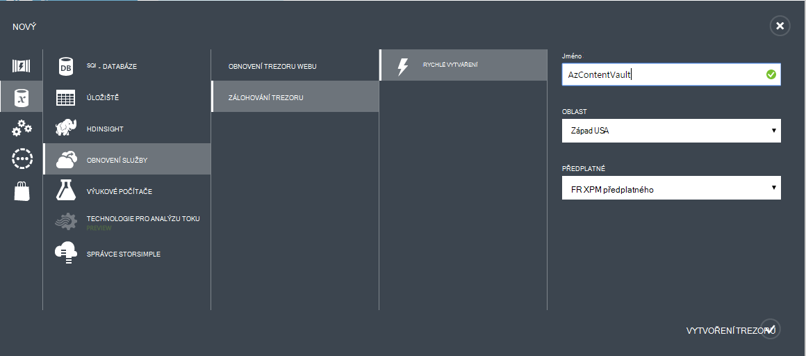

## Vytvoření záložní trezoru
K obecnějším údajům soubory a data z Windows Server nebo Data Protection Manager (DPM) Azure nebo při zálohování IaaS VMs Azure, musíte vytvořit záložní trezoru zeměpisnou oblast, ve které chcete data uložit.

Podle těchto kroků vás provede jednotlivými vystavením trezoru využít k ukládání záložní kopie.

1. Přihlaste se k [portálu Správa](https://manage.windowsazure.com/)
2. Klikněte na **Nový** > **Datové služby** > **Služby Recovery** > **Trezoru zálohování** a klikněte na **Vytvořit**.

    

3. Pro parametr **název** zadejte popisný název k identifikaci záložní trezoru. To musí být jedinečné pro každého předplatného.

4. Pro parametr **oblast** vyberte zeměpisná oblast pro záložní trezoru. Volba určuje zeměpisnou oblast, ke kterému se odesílá záložní data. Výběrem zeměpisná oblast zavřít umístění můžete zmenšit latence sítě zálohování Azure.

5. Klikněte na **Vytvořit trezoru** dokončení pracovního postupu. Může to trvat dlouho pro záložní trezoru vytvořit. Pokud chcete zkontrolovat stav, můžete sledovat oznámení v dolní části na portálu.

    

6. Po vytvoření záložní trezoru zpráva informuje že úspěšné vytvoření trezoru. Trezoru taky koncovém prostředků pro obnovení služby jako **aktivní**.

    

### Azure zálohování - možnosti redundance úložiště

>[AZURE.IMPORTANT] Nejvhodnější doba k identifikaci možnost redundance úložiště je ihned po vytvoření trezoru a před všech počítačích jsou registrované do trezoru. Po registrované položky do trezoru, možnost redundance úložiště je uzamčený a nelze změnit.

Obchodních potřeb měli zjistit redundance úložiště Azure zálohy back-end úložiště. Pokud používáte Azure jako koncový bod primární úložišti (například zálohujete do Azure ze serveru Windows), měli byste zvážit výběru (výchozí) Geo nadbytečné možnost úložiště. To je vidět v části Možnosti **Konfigurovat** trezoru zálohování.

#### GEO nadbytečné úložiště (GRS)
GRS udržuje šest kopií vaše data. GRS datům replikovat třikrát v rámci oblasti primární a také replikovat třikrát v sekundární oblasti stovky mil od primární oblast poskytující nejvyšší úroveň životnost. V případě selhání v oblasti hlavní uložením dat v GRS zálohování Azure zajišťuje, že vaše data trvalé ve dvou samostatných oblastech.

#### Místně nadbytečné úložiště (LRS)
Místně nadbytečné úložiště (LRS) udržuje tři kopie vaše data. LRS je replikovat třikrát v rámci jednoho zařízení v jedné oblasti. LRS chrání data z normální hardwarové chyby, ale ne z neúspěšného celý Azure zařízení.

Pokud používáte Azure jako koncový bod třetího úložišti (například použijete SCDPM mít místní zálohy Kopírovat místní & pomocí Azure pro uchovávání informací dlouhodobou potřebuje), byste měli zvážit výběru místně nadbytečné úložiště z možnost **Konfigurovat** trezoru zálohování. Po výběru této možnosti dolů náklady na uchovávání dat v Azure, zároveň nižší úrovně životnosti pro vaše data, která může být přijatelná třetího kopií.

