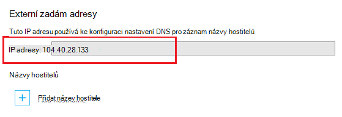

Systému DNS (Domain Name) slouží k vyhledání zdroje na Internetu. Třeba když zadáte webovou adresu aplikace v prohlížeči nebo kliknout na odkaz na webovou stránku, používá DNS překladu domény na IP adresu. IP adresa vypadá jako typ poštovní adresy, ale není velmi lidské popisný. Je třeba mnohem jednodušší si uvědomit DNS název, například **contoso.com** , je zapamatovatelné adresy IP 192.168.1.88 ATP 2001:0:4137:1f67:24a2:3888:9cce:fea3.

V systému DNS vychází z *záznamy*. Záznamy určitý *název*, například **contoso.com**, přidružit k IP adrese nebo jiný název serveru DNS. Pokud aplikaci, třeba ve webovém prohlížeči, vyhledává název v systému DNS, najde záznam a používá něco jiného, co odkazuje na adresu. Pokud je argument hodnota, která ukazuje na IP adresu, prohlížeč použije daná hodnota. Odkazuje na jiný název serveru DNS, aplikace má dělat rozlišení znovu. Nakonec překlad všechny skončí za k IP adrese.

Při vytváření aplikace pro web v aplikaci služby, název DNS se automaticky přiřadí ke web appu. Tento název formu ** &lt;yourwebappname&gt;. azurewebsites.net**. Je taky virtuální IP adresu k dispozici pro použití při vytváření DNS záznamů, můžete vytvořit záznamy, které odkazují **. azurewebsites.net**, případně můžete odkázat na IP adresu.

> [AZURE.NOTE] Pokud odstraníte a znovu vytvořit webovou aplikaci nebo změnit režim plánu aplikace služby **Uvolnit** po byl nastaven do **základní** **Shared**a **Standardní**se změní IP adresu vaší webové aplikace.

Existují také několik typů záznamů, oba objekty mají vlastní funkce a omezení, ale pro webové aplikace pouze věnuje dva, *A* a *CNAME* záznamy.

###Adresa record (záznam)

Záznam a mapy doménu, například **contoso.com** nebo **www.contoso.com**, *nebo pomocí zástupných znaků domény* , jako ** \*. contoso.com**, k IP adrese. V případě do webových aplikací v aplikaci služby nastavení virtuální IP adresy služby nebo konkrétní IP adresy, které jste koupili pro webovou aplikaci

Hlavní výhody přes záznam CNAME záznam patří následující:

* Mapování kořenovou doménu, například **contoso.com** na IP adresu. mnoha registrátorů povolit pouze záznamy o pomocí

* Máte jednu položku používající zástupné znaky, například ** \*. contoso.com**, které by zpracovávat požadavky pro více dílčích domén s například **mail.contoso.com**, **blogs.contoso.com**nebo **www.contso.com**.

> [AZURE.NOTE] Protože záznam namapovala statickou IP adresu, ho nerozpoznává automaticky změny k IP adrese svojí webové aplikace. IP adresu pro použití s záznam není uvedený při konfiguraci nastavení názvu vlastní domény pro váš web app; Tato hodnota však může změnit Pokud odstraníte a znovu vytvořit webovou aplikaci nebo změna režimu plánování aplikaci služby záložní **Uvolnit**.

###Alias (CNAME záznam)

Záznam CNAME mapuje *konkrétní* DNS názvu, například **mail.contoso.com** nebo **www.contoso.com**, na jiný název domény (kanonických). V případě aplikace služby webových aplikací Web Apps, je název kanonický domény ** &lt;yourwebappname >. azurewebsites.net** název domény pro váš web appu. Po vytvoření záznamy CNAME pro vytváří alias ** &lt;yourwebappname >. azurewebsites.net** název domény. Položka CNAME vyřeší na IP adresu vašeho ** &lt;yourwebappname >. azurewebsites.net** název domény automaticky, takže pokud změnou IP adresu ve web appu, není třeba provádět žádné akce.

> [AZURE.NOTE] Některé doménových registrátorů umožňují mapování subdomény při použití záznam CNAME, například **www.contoso.com**a ne kořenové názvů, například **contoso.com**. Další informace o CNAME záznamy najdete v dokumentaci podle svého registrátora, <a href="http://en.wikipedia.org/wiki/CNAME_record">položce Wikipedie na záznam CNAME</a>nebo <a href="http://tools.ietf.org/html/rfc1035">Názvy domén IETF - implementaci a specifikace</a> dokument.

###Zvláštnosti DNS web app

Záznam pomocí webové aplikace, musíte nejdřív vytvořit jednu z těchto záznamů TXT:

* **Pro kořenovou doménu** – záznamu A DNS TXT od **@** k ** &lt;yourwebappname&gt;. azurewebsites.net**.

* **Pro konkrétní dílčí doménu** – název A DNS ** &lt;subdomény >** k ** &lt;yourwebappname&gt;. azurewebsites.net**. Například **blogy** Pokud záznam **blogs.contoso.com**.

* **Pro zástupných sub-dodmains** - záznamu A DNS TXT od *** k ** &lt;yourwebappname&gt;. azurewebsites.net**.

Tento záznam TXT slouží k ověření, že vlastníte doménu, kterou chcete použít. Toto je kromě vytváření záznam přejdete virtuální IP adresu vaší webové aplikace.

Najděte IP adresa a **. azurewebsites.net** názvy pro webovou aplikaci pomocí následujících kroků:

1. V prohlížeči otevřete [Portál Azure](https://portal.azure.com).

2. V zásuvné **Web Apps** klikněte na název svojí webové aplikace a pak vyberte **vlastní domény** v dolní části stránky.

    

3. V zásuvné **vlastní domény** zobrazí se virtuální adresy IP. Uložení tyto informace, jak se bude používat při vytváření záznamů DNS

    

    > [AZURE.NOTE] Nelze použít vlastní názvy domén přes **Free** web app a třeba upgradovat plán služeb aplikací na **sdílený**, **základní**, **Standardní**nebo **Premium** úroveň. Další informace o aplikaci služby plán ceny úrovní, včetně změnit ceny osy webovou aplikaci, přečtěte si, [jak zobrazit webové aplikace](../articles/web-sites-scale.md).
