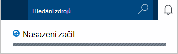
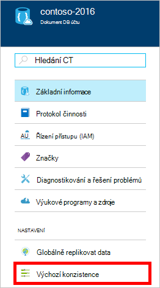
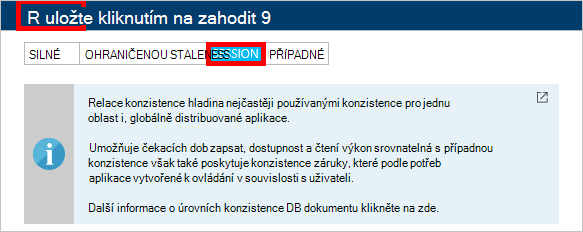

1.  Přihlaste se k [portálu Azure](https://portal.azure.com/).
2.  V Jumpbar klikněte na **Nový**, klikněte na **Data + úložiště**a potom klikněte na **DocumentDB (NoSQL)**.

      

3. Do **nového účtu** zásuvné zadejte požadovaná konfigurace účtu DocumentDB.

    

    - Do pole **ID** zadejte název DocumentDB účet identifikovat.  Po ověření **ID** se zobrazí v poli **ID** zelená značka zaškrtnutí. **ID** změní se název hostitele v rámci identifikátor URI. **ID** může obsahovat pouze malá písmena, číslice a "-" znaků a musí mít 3 až 50 znaků. Poznámka: Tento *documents.azure.com* připojen k koncového bodu název, který jste si vybrali, výsledek bude koncový bod DocumentDB účtu.

    - V dialogovém okně **Rozhraní API NoSQL** vyberte **DocumentDB**.  

    - U **předplatného**vyberte Azure předplatné, které chcete použít pro účet DocumentDB. Pokud váš účet obsahuje jenom jedno předplatné, tento účet vybrané ve výchozím nastavení.

    - **Pole Skupina zdroje**vyberte nebo vytvořte skupina zdroje pro váš účet DocumentDB.  Ve výchozím nastavení se vytvoří nové skupiny prostředků. Další informace najdete v tématu [použití Azure portálu pro správu Azure prostředků](../articles/azure-portal/resource-group-portal.md).

    - Umožňuje určit zeměpisné polohy v jakém hostovat svůj účet DocumentDB **umístění** . 

4.  Po konfiguraci účtu DocumentDB možností klikněte na **vytvořit**. Stav nasazení, zaškrtněte centru oznámení.  

      

    

5.  Po vytvoření účtu DocumentDB je připraven k použití s výchozím nastavením. Výchozí konzistence účtu DocumentDB je nastavena na **relace**.  Po kliknutí na **Výchozí konzistence** v nabídce zdrojů můžete upravit výchozí konzistence. Další informace o úrovních konzistence nabízená DocumentDB najdete v tématu [konzistence úrovní v DocumentDB](../articles/documentdb/documentdb-consistency-levels.md).

      

      

[How to: Create a DocumentDB account]: #Howto
[Next steps]: #NextSteps
[documentdb-manage]:../articles/documentdb/documentdb-manage.md
