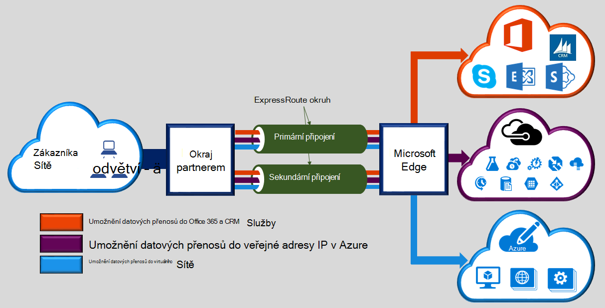

Microsoft Azure ExpressRoute umožňuje rozšíření místních sítí do cloudu společnosti Microsoft přes vyhrazené soukromé připojení usnadnit poskytovatel připojení. S ExpressRoute můžete vytvořit připojení ke cloudovým službám společnosti Microsoft, jako je Microsoft Azure Office 365 a CRM Online. Připojení může být z libovolného libovolného sítě (IP VPN), v síti Ethernet bod k nebo virtuální křížově připojení prostřednictvím poskytovatele připojení v zařízení společné umístění. ExpressRoute připojení nepřekročí veřejné Internetu. Díky ExpressRoute připojení nabízet další spolehlivost rychlejší rychlosti, malá čekacích dob a vyšší zabezpečení než typický připojení přes Internet.  

